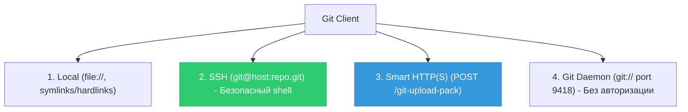
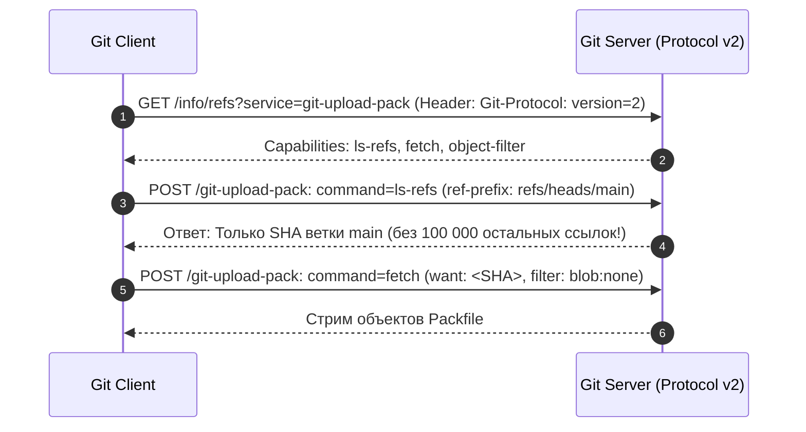

# 🌐 29. Git Wire Protocols: HTTP Smart/Dumb, SSH, Git Protocol v2 и Bare-репозитории

Передача объектов и ссылок между клиентом и сервером в Git осуществляется по стандартизированным сетевым протоколам (**Wire Protocols**). Понимание их работы критично для построения масштабируемой Git-инфраструктуры, отладки сетевых сбоев и настройки приватных серверов.

---

## 📡 1. Сетевые протоколы Git



### Формат Pkt-Line (Packet Line)
Все современные протоколы Git используют формат фрейминга **pkt-line**: 4 шестнадцатеричных символа длины пакета (включая саму 4-байтную длину), за которыми следуют полезные данные:
```text
000aтест\n       # Длина 10 байт (0x000a)
0000             # Flush packet (конец блока передачи)
```

---

## 🚀 2. Эволюция: Git Wire Protocol v1 против Protocol v2

В **Protocol v1** сервер при любом подключении передавал клиенту **абсолютно все ссылки** репозитория (все 200 000 веток и тегов), создавая мегабайтный трафик еще до начала передачи объектов.

**Protocol v2** (включен по умолчанию в Git 2.26+) решает эту проблему:



---

## 🏛️ 3. Архитектура Bare-репозиториев

Серверы Git (GitHub, GitLab, приватные серверы) хранят репозитории исключительно в виде **Bare-репозиториев** (`git init --bare`):
- В них **нет рабочего каталога (Working Tree)**.
- Корнем репозитория является само содержимое `.git/` (`objects`, `refs`, `HEAD`, `hooks`).
- Это исключает конфликты при `push`, так как на сервере нет зачекаученных файлов.

---

## 🔒 4. Развертывание приватного защищенного Git-сервера по SSH

Создание изолированного сервера с ограниченной оболочкой `git-shell` (запрещает обычный доступ к bash):

```bash
#!/usr/bin/env bash
set -euo pipefail

# 1. Создание системного пользователя git
sudo adduser --system --shell $(which git-shell) --group --disabled-password git

# 2. Настройка SSH авторизации
sudo -u git mkdir -p /home/git/.ssh
sudo chmod 700 /home/git/.ssh
sudo -u git touch /home/git/.ssh/authorized_keys
sudo chmod 600 /home/git/.ssh/authorized_keys

# 3. Инициализация Bare-репозитория
REPO_DIR="/home/git/repositories/backend.git"
sudo -u git mkdir -p "$REPO_DIR"
sudo -u git git init --bare "$REPO_DIR"

# 4. Создание server-side хука post-receive для вызова CI/CD webhook
cat << 'EOF' | sudo -u git tee "$REPO_DIR/hooks/post-receive"
#!/usr/bin/env bash
curl -X POST -H "Content-Type: application/json" \
  -d '{"event":"push","repo":"backend"}' \
  https://ci.company.com/webhook/git-push
EOF
sudo chmod +x "$REPO_DIR/hooks/post-receive"

echo "✅ Приватный Git-сервер готов: git@server.ip:repositories/backend.git"
```

---

## 🛠️ 5. Инженерный CLI Cheat Sheet

| Команда | Описание |
| :--- | :--- |
| `git clone --config protocol.version=2 <url>` | Явное включение Wire Protocol v2 |
| `GIT_TRACE_PACKET=1 git ls-remote origin` | Отладка сырых pkt-line сетевых пакетов |
| `GIT_CURL_VERBOSE=1 git push origin main` | Подробный вывод HTTP(S) заголовков и SSL рукопожатий |
| `git daemon --reuseaddr --base-path=/srv/git/ --export-all --verbose` | Запуск легковесного Git Daemon для локальной сети |
| `git config --global http.postBuffer 524288000` | Увеличение буфера отправки до 500 МБ для тяжелых пушей |

---

## 🚨 6. Production Troubleshooting & Break-Fix

### Сценарий 1: Ошибка `fatal: protocol error: bad line length character`
- **Симптом:** При попытке клонирования через SSH Git падает с сообщением: `fatal: protocol error: bad line length character: Welc`.
- **Причина:** В файле `~/.bashrc` или `/etc/motd` на сервере настроен вывод приветственного текста (`Welcome to Ubuntu...`), который ломает бинарный поток `pkt-line`.
- **Исправление на сервере:** Удалить вывод интерактивного текста из скриптов инициализации неинтерактивных оболочек (`~/.bashrc`).

### Сценарий 2: Ошибка `fatal: unable to access ...: SSL certificate problem: self signed certificate`
- **Симптом:** Git в закрытом корпоративном контуре отклоняет подключение к корпоративному GitLab.
- **Исправление:**
  ```bash
  # Указать путь к доверенному корпоративному CA-сертификату
  git config --global http.sslCAInfo /etc/ssl/certs/company_internal_ca.crt
  ```
