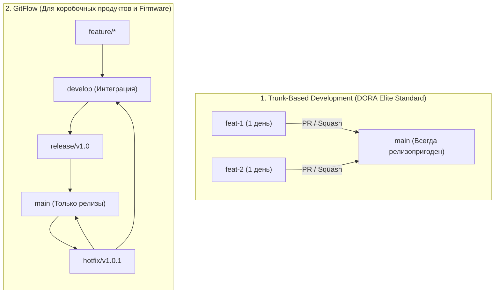
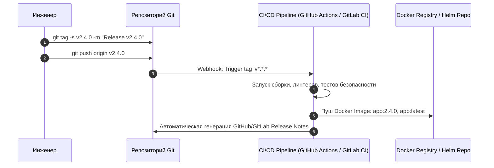
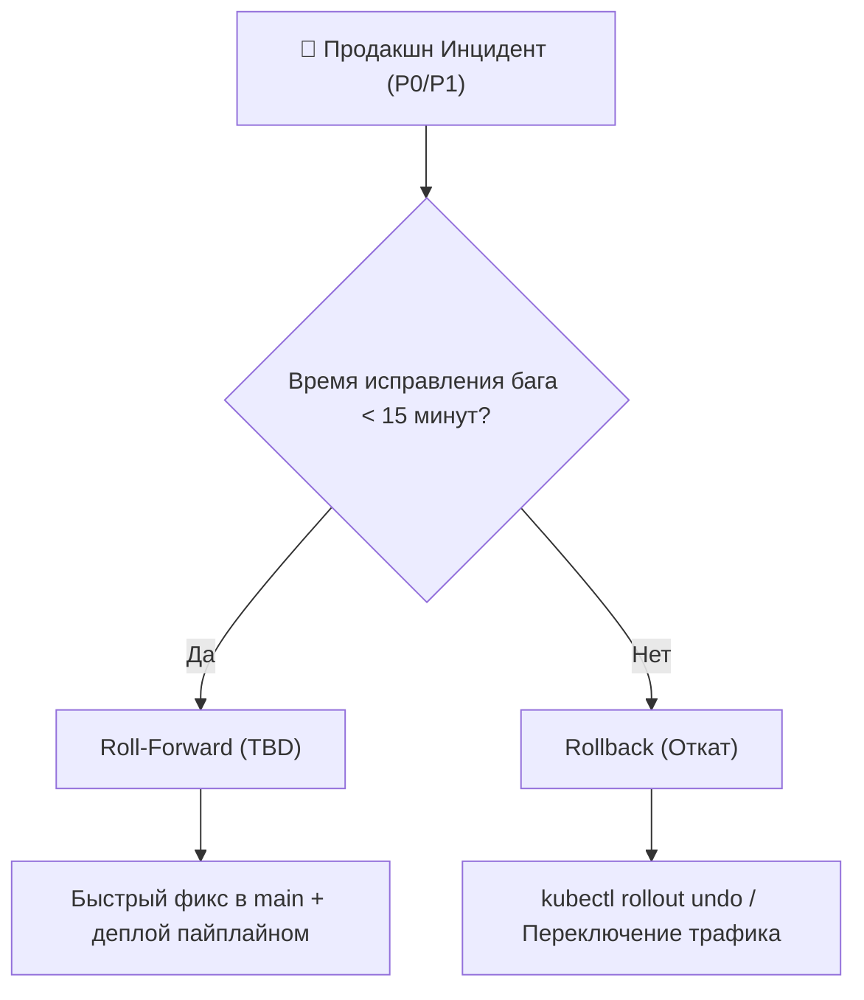

# 🌐 30. Продвинутые Git Workflows: Trunk-Based Development, GitFlow, Релизы и Hotfix

Выбор модели ветвления напрямую определяет метрики DORA (Deployment Frequency, Lead Time for Changes, Change Failure Rate, Time to Restore Service).

---

## 🏛️ 1. Сравнительный анализ стратегий ветвления



### Сравнительная матрица:

| Параметр | Trunk-Based Development (TBD) | GitFlow | GitHub Flow | GitLab Flow (Environment) |
| :--- | :--- | :--- | :--- | :--- |
| **Частота релизов** | Десятки в день (CI/CD) | Раз в 1–3 месяца | Несколько в день | По мере готовности окружений |
| **Длина жизни веток** | < 24–48 часов | Недели / Месяцы | 1–3 дня | До деплоя в production |
| **Управление фичами** | **Feature Flags / Toggles** | Изоляция в ветках | Feature-ветки | Feature-ветки |
| **Сложность слияний** | Минимальная ($O(1)$) | Высокая («Merge Hell») | Низкая | Средняя |
| **Идеально для** | SaaS, Cloud-Native, Микросервисы | Монолиты, Embedded, On-Premise | Web-приложения | Мульти-окружения (Dev -> Stage -> Prod) |

---

## 🚀 2. Trunk-Based Development и механизм Feature Flags

В TBD незавершенный функционал коммитится прямо в `main`, но закрывается динамическим флагом в рантайме:

```go
// Пример безопасного Feature Flag в коде Go
if featureflags.IsEnabled("NEW_PAYMENT_GATEWAY", user.ID) {
    return processWithStripeV3(ctx, order)
}
return processWithLegacyGateway(ctx, order)
```

Это позволяет деплоить код в продакшн непрерывно, не дожидаясь завершения многомесячной разработки крупной фичи.

---

## 🏷️ 3. Релизный пайплайн и SemVer в CI/CD

Процесс автоматического релиза на базе тегов Git:



---

## ⚙️ 4. Production CI/CD Workflow (GitHub Actions)

Файл `.github/workflows/release.yaml`:

```yaml
name: Production Release Pipeline

on:
  push:
    tags:
      - 'v[0-9]+.[0-9]+.[0-9]+'

jobs:
  build-and-release:
    runs-on: ubuntu-latest
    steps:
      - name: Checkout Code
        uses: actions/checkout@v4
        with:
          fetch-depth: 0 # Полная история для генерации changelog

      - name: Setup Go
        uses: actions/setup-go@v5
        with:
          go-version: '1.22'

      - name: Run Unit & Security Tests
        run: |
          go test -race -v ./...
          go run github.com/securego/gosec/v2/cmd/gosec@latest ./...

      - name: Build and Push Docker Image
        run: |
          VERSION=${GITHUB_REF_NAME#v}
          docker build -t registry.company.com/app:${VERSION} .
          echo "✅ Docker образ собран: registry.company.com/app:${VERSION}"

      - name: Create GitHub Release
        uses: softprops/action-gh-release@v2
        with:
          generate_release_notes: true
          draft: false
          prerelease: false
```

---

## 🚑 5. Стратегии Hotfix: Rollback vs Roll-Forward

При инциденте на проде принимается архитектурное решение:



---

## 🛠️ 6. Инженерный CLI Cheat Sheet

| Команда | Описание |
| :--- | :--- |
| `git tag -a v1.2.0 -m "Release version 1.2.0"` | Создать аннотированный тег релиза |
| `git push origin v1.2.0` | Отправить тег на удаленный сервер |
| `git push origin --tags` | Отправить все локальные теги |
| `git tag -d v1.2.0` | Удалить локальный тег |
| `git push origin --delete v1.2.0` | Удалить тег на сервере |
| `git describe --tags --always` | Сгенерировать точную строку версии на основе ближайшего тега |

---

## 🚨 7. Production Troubleshooting & Break-Fix

### Сценарий: Забытый hotfix в GitFlow (рассинхронизация `develop` и `main`)
- **Симптом:** Хотфикс применили в `main` и задеплоили, но забыли влить в `develop`. При следующем релизе баг вернулся в прод.
- **Предотвращение:** Настройка обязательного CI/CD шага или переход на Trunk-Based Development, исключающий разделение на долгоживущие параллельные ветки.
- **Исправление:**
  ```bash
  # Срочный перенос коммита хотфикса в develop
  git checkout develop
  git cherry-pick -x <HOTFIX_COMMIT_SHA>
  git push origin develop
  ```
