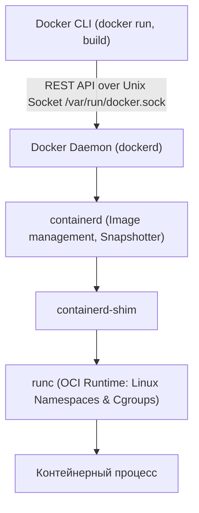
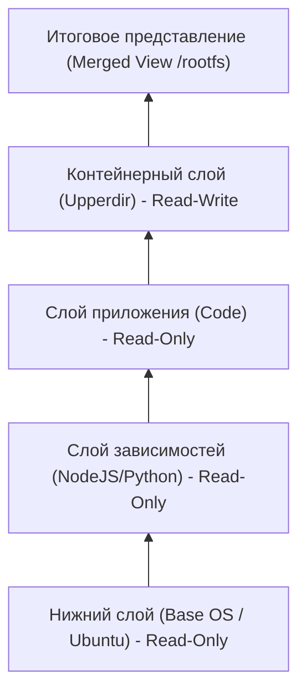
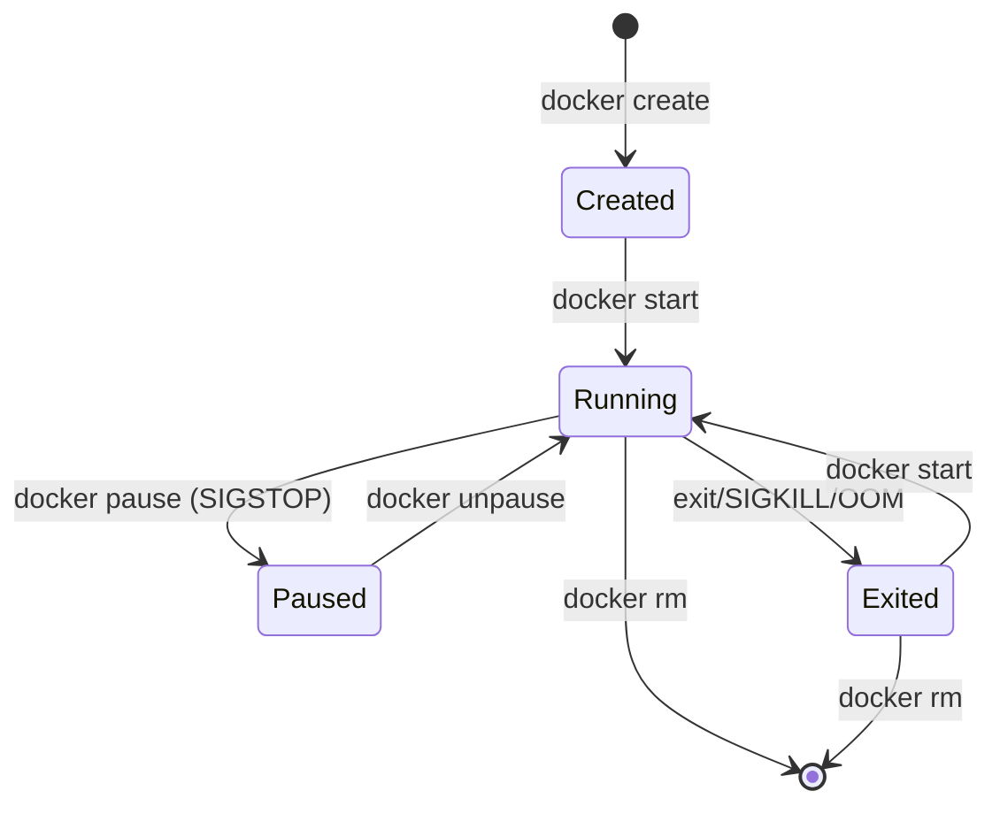

# 🐳 01. Архитектура Docker, Runtime и CLI

## 🏗️ Архитектура Docker Engine

Docker использует клиент-серверную архитектуру и модульный OCI-совместимый рантайм.



### Компоненты стека:
1. **`dockerd`**: Высокоуровневый демон, управляющий образами, сетью, томами и аутентификацией.
2. **`containerd`**: Управляет полным жизненным циклом контейнеров (pulling/pushing images, supervision).
3. **`containerd-shim`**: Позволяет демону `containerd` перезапускаться без падения работающих контейнеров, держит открытыми `stdin/stdout/stderr`.
4. **`runc`**: Низкоуровневый легковесный CLI-рантайм (создает namespaces и cgroups, запускает процесс и завершает свою работу).

---

## 🗂️ Как устроен OverlayFS (Слои образов и контейнеров)

Каждый образ Docker состоит из неизменяемых слоев (Read-Only). При запуске контейнера поверх них создается тонкий изменяемый слой записи (Read-Write).



- **Copy-on-Write (CoW):** Если процесс в контейнере пытается изменить файл из нижнего Read-Only слоя, OverlayFS копирует этот файл в верхний Read-Write слой (`upperdir`) и модифицирует его там.

---

## ⚡ Docker CLI Cheat Sheet (Шпаргалка)

### 1. Управление контейнерами
```bash
# Запуск контейнера в фоне с пробросом портов и лимитами памяти/CPU
docker run -d \
  --name web-app \
  -p 8080:80 \
  --memory="512m" \
  --cpus="1.5" \
  --restart=unless-stopped \
  nginx:alpine

# Просмотр процессов внутри контейнера
docker top web-app

# Мониторинг потребления CPU, памяти, диска и сети в реальном времени
docker stats --no-stream

# Подключение к запущенному контейнеру в интерактивном режиме
docker exec -it web-app /bin/sh

# Просмотр логов контейнера с временными метками
docker logs -f --tail 100 -t web-app
```

### 2. Управление ресурсами и Очистка (Housekeeping)
```bash
# Посмотреть, сколько места на диске занимает Docker
docker system df

# Безопасная очистка остановленных контейнеров, неиспользуемых сетей и висячих слоев
docker system prune -f

# Полная глубокая очистка (включая неиспользуемые тома и все неиспользуемые образы)
docker system prune -a --volumes -f
```

---

## 🔬 Deep Dive: docker CLI команды, которые знают не все

```bash
# Живая статистика без стрима (один срез)
docker stats --no-stream --format "table {{.Name}}\t{{.CPUPerc}}\t{{.MemUsage}}"

# Фильтры вместо grep
docker ps -f status=exited -f ancestor=nginx:1.25 --format '{{.Names}}'

# Очистка с сохранением используемого (безопасная уборка)
docker system prune -f --volumes --filter "until=168h"

# Экспорт образа в tar для air-gapped окружения
docker save nginx:1.25 | gzip > nginx.tgz && docker load < nginx.tgz

# Запуск одноразовой команды в НОВОМ контейнере с общими томами
docker run --rm -v appdata:/data alpine ls -la /data
```

### Жизненный цикл контейнера



`pause` замораживает процессы через cgroups freezer (память остается), `stop` шлет SIGTERM → ждет → SIGKILL.

---

<!-- enriched:v1 -->

## 🧨 Типовые грабли Production

| Симптом | Причина | Быстрое решение |
| :--- | :--- | :--- |
| «Работало вчера» после обновления | Дрейф конфигурации вне Git | `git diff` по инфра-репозиторию + `drift detection` |
| Падение под нагрузкой без ошибок в логах | Исчерпание лимитов (`ulimit`, conntrack, fds) | `dmesg -T \| grep -i denied`, `conntrack -S` |
| Медленный деплой | Отсутствие кэша слоев/артефактов | Включить layer cache, артефакт-репозиторий |
| «Плавающие» 502 раз в сутки | Health-check гонки при rolling update | `preStop sleep` + корректный `readinessProbe` |

!!! warning "Правило пяти почему"
    Каждый инцидент заканчивается не фиксом, а **post-mortem** с 5×Why и action items в бэклоге. Иначе грабли возвращаются через квартал — но уже в пятницу вечером.

## 🧪 Hands-on Lab (15 минут)

```bash
# 1. Воспроизведите проблему из таблицы выше на стенде (kind/k3d/VirtualBox)
# 2. Соберите диагностику одной командой:
docker info | grep -E 'Storage|Cgroup|Runtime|Server Version' && \
docker ps -a --format 'table {{.Names}}\t{{.Status}}\t{{.Image}}' | head && \
docker system df -v | head -20
# 3. Зафиксируйте вывод в post-mortem шаблон:
#    Что случилось / Когда заметили / Root cause / Fix / Prevention
```

## ✅ Чек-лист зрелости темы

- [ ] Конфигурации версионируются в Git, ручные правки на проде запрещены

    ??? tip "Как закрыть пункт"
        Все конфиги подсистемы живут в etc-repo/Ansible-роли и деплоятся пайплайном. Проверка зрелости: после пересоздания машины система настраивается из репозитория без ручных шагов; git log отвечает «кто и когда поменял».

- [ ] Есть мониторинг именно этой подсистемы (не только CPU/RAM)

    ??? tip "Как закрыть пункт"
        Специфичные метрики подсистемы экспортируются и имеют алерты (для systemd — failed units; для БД — connections/locks; для сети — retransmits/drops). CPU/RAM видят симптом, не причину — нужны метрики самой подсистемы.

- [ ] Задокументирован runbook на типовые отказы (кто/что/как)

    ??? tip "Как закрыть пункт"
        Шаблон из [13.2]: симптомы → команды диагностики → фикс → критерий успеха → предотвращение. Топ-3 отказа подсистемы покрыты. Прогонен хотя бы раз — дата в шапке.

- [ ] Проведено хотя бы одно учение Chaos/GameDay по теме

    ??? tip "Как закрыть пункт"
        Дрель из tools/chaos-lab.sh или Break-Fix по этой теме запущена на стенде, runbook прогнан по шагам, измерено время до восстановления. Итоги — в постмортем-журнал команды.

- [ ] Лимиты ресурсов и квоты осознаны, а не «дефолт из туториала»

    ??? tip "Как закрыть пункт"
        Каждый лимит имеет обоснование из данных (ulimit/fd по числу соединений, MemoryMax по месяцу наблюдений). Проверка: systemctl show / cgroup значения сопоставлены с фактическим потреблением за месяц, комментарий «почему» рядом со значением в коде.

---

## 🧭 Что дальше

| Шаг | Материал |
| :--- | :--- |
| 🔬 Закрепить | [Lab 02: фабрика образов](../16-guided-labs/02-lab-docker-image-factory.md) |
| 💪 Практика | [Задачи по Docker](../15-hands-on-practice/01-100-devops-practical-tasks-part1.md) |
| 🎤 Проверить себя | [Вопросы собесов: Docker](../14-interview-prep/03-100-devops-interview-questions-bank-part1.md) |

---

## ✅ Проверь себя

**В1. Цепочка процессов Docker: кто реально запускает контейнер?**
<details><summary>Ответ</summary>
docker CLI → dockerd (API) → containerd → containerd-shim на каждый контейнер → runc, который создаёт namespaces/cgroups и exec'ает процесс. runc выходит после старта; shim держит stdio — поэтому рестарт dockerd не убивает контейнеры при live-restore=true.
</details>

**В2. CMD vs ENTRYPOINT — когда что?**
<details><summary>Ответ</summary>
ENTRYPOINT — фиксированный бинарник; CMD — аргументы по умолчанию (перезаписываются аргументами docker run). ENTRYPOINT ["app"] + CMD ["--port","8080"] = переопределяемые дефолты. Shell-форма добавляет /bin/sh -c и теряет сигналы — использовать exec-форму.
</details>

**В3. Почему `docker stop` может занять ровно 10 секунд?**
<details><summary>Ответ</summary>
Docker шлёт SIGTERM и ждёт graceful shutdown (дефолтный таймаут 10s), потом SIGKILL. Если приложение не обрабатывает SIGTERM (PID 1 не пересылает сигнал детям) — всегда упираемся в таймаут. Фиксы: правильный PID 1/tini, stop_grace_period.
</details>

**В4. Где смотреть результат healthcheck контейнера?**
<details><summary>Ответ</summary>
docker inspect → State.Health.Status и Health.Log (последние проверки и вывод). В Kubernetes эти healthcheck'и не переносятся автоматически — там свои liveness/readiness probes.
</details>
