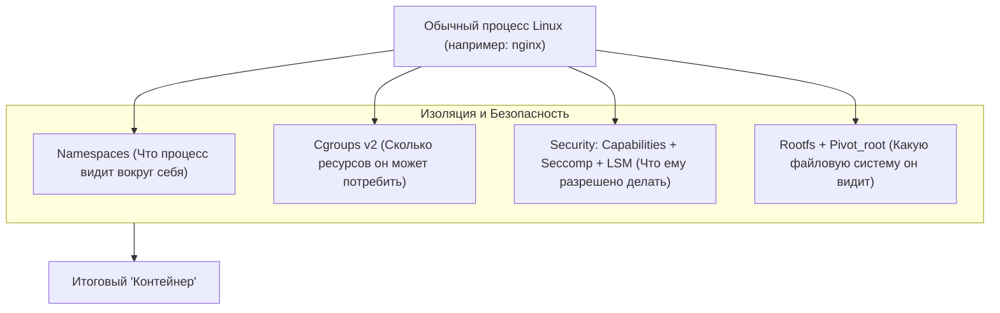
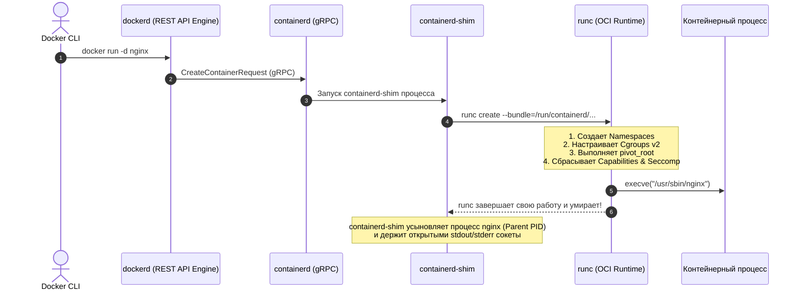
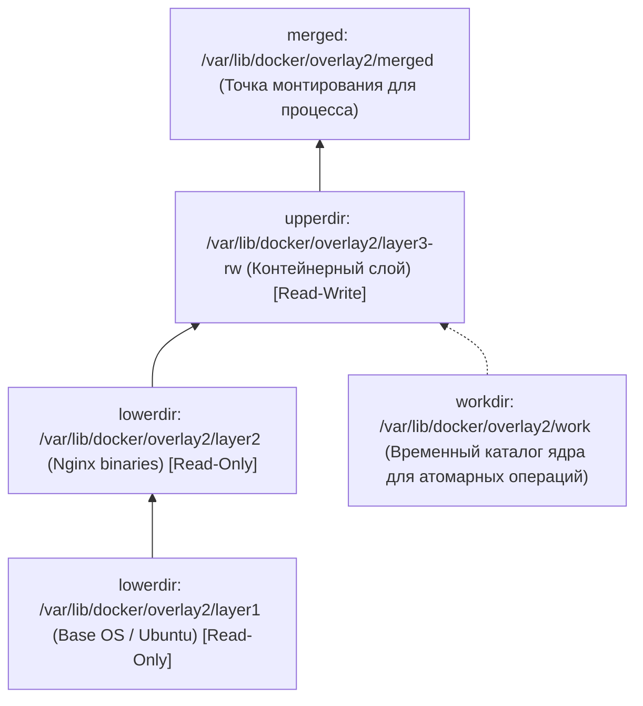

# 🐳 04. Как устроен Docker под капотом: Linux Primitives, OCI, Overlay2 и Сеть

## 🧠 Что такое контейнер на самом деле?

Контейнеров в ядре Linux **не существует как отдельных сущностей**. Контейнер — это обычный системный процесс (или группа процессов), к которому применены три базовые технологии ядра Linux:



---

## 🔬 1. Примитивы ядра Linux (Kernel Primitives)

### 1.1. Namespaces (Пространства имен)
Изолируют глобальные системные ресурсы:
- **`pid` (Process ID):** Внутри контейнера процесс считает себя `PID 1` (init-процессом), хотя на хосте имеет реальный `PID 48291`.
- **`net` (Network):** Собственные сетевые интерфейсы (`eth0`, `lo`), порты, IP-адреса, таблицы маршрутизации и правила iptables.
- **`mnt` (Mount):** Изолированное дерево точек монтирования.
- **`ipc` (Inter-Process Communication):** Изоляция разделяемой памяти (Shared Memory, POSIX queues, Semaphores).
- **`uts` (UNIX Timesharing System):** Собственное имя хоста (`hostname`) и NIS домен.
- **`user` (User IDs):** Маппинг UID/GID (процесс работает от `root` UID 0 внутри контейнера, но на хосте привязан к обычному непривилегированному UID 10001).
- **`cgroup`:** Изоляция просмотра собственного пути к контрольной группе в `/proc/self/cgroup`.

---

### 1.2. Cgroups v2 (Control Groups)
Ограничивают и изолируют потребление аппаратных ресурсов:
- **CPU Quota (`cpu.max`):** Реализован через CFS (Completely Fair Scheduler). Запись `50000 100000` означает, что процессу разрешено использовать максимум $50\text{мс}$ процессорного времени за период в $100\text{мс}$ (0.5 CPU). При превышении процесс замедляется (CPU Throttling).
- **Memory Hard Limit (`memory.max`):** Жесткий лимит оперативной памяти. При попытке выделить память сверх лимита ядро немедленно вызывает OOM-Killer.
- **PIDs Limit (`pids.max`):** Защита от fork-бомб (ограничивает максимальное число процессов/тредов).

---

### 1.3. Смена корня: `chroot` против `pivot_root`
Docker **не использует устаревший `chroot`**, так как из-под `chroot` можно легко сбежать на хост через открытие файловых дескрипторов. 

Вместо этого OCI рантайм использует системный вызов **`pivot_root()`**:
1. Монтирует новую файловую систему контейнера (`rootfs`).
2. Меняет текущий корневой каталог на новый.
3. Полностью отмонтирует старый корень хоста (`umount2(old_root, MNT_DETACH)`), делая невозможным доступ к файлам родительского сервера.

---

### 1.4. Ограничение прав: Capabilities и Seccomp
- **Linux Capabilities:** Ядро разбивает всемогущие права `root` (UID 0) на ~40 независимых привилегий. Docker по умолчанию **отбирает опасные capabilities**:
  - `CAP_SYS_ADMIN` (запрет монтирования ФС, манипуляций с ядром).
  - `CAP_NET_ADMIN` (запрет изменения сетевых настроек хоста).
  - `CAP_SYS_RAWIO` (запрет прямого доступа к физическим дискам).
- **Seccomp (Secure Computing Mode):** BPF-фильтр системных вызовов. Из ~450 системных вызовов Linux Docker по умолчанию блокирует около 50 потенциально опасных (`reboot`, `kexec_load`, `ptrace`, `bpf`).

---

## ⚙️ 2. Стек OCI и архитектура демонов



### Зачем нужен `containerd-shim`?
1. **Бесшовный перезапуск демонов:** Если `dockerd` или `containerd` упадут или будут обновлены через `apt-get upgrade`, работающие контейнеры **не упадут**!
2. **Усыновление процессов (PID 1):** Держит файловые дескрипторы `stdin`, `stdout`, `stderr` и забирает код выхода (Exit Code) контейнера.

---

## 🗄️ 3. Хранилище: Как устроен Overlay2 под капотом

Драйвер `overlay2` объединяет несколько каталогов в единую файловую систему (Union Mount):



### Как работает удаление файла из Read-Only слоя?
Если вы удаляете файл `/etc/hosts`, принадлежащий нижнему Read-Only слою:
1. Docker не может физически удалить его из базового слоя.
2. В каталоге `upperdir` создается специальный **символьный файл-заглушка (Whiteout File)** с мажорным/минорным номером устройства `0/0` (типа `c 0 0`).
3. Драйвер Overlay2, видя whiteout-файл, скрывает оригинальный файл из итогового представления `merged`.

---

## 🔌 4. Сетевая сантехника (Network Plumbing)

При запуске контейнера в дефолтной сети `bridge`:
1. Ядро создает виртуальную пару интерфейсов **veth pair** (`vethA` и `vethB`).
2. Один конец (`vethA`) подключается к хостовому мосту **`docker0`** (Linux Bridge).
3. Второй конец (`vethB`) переносится внутрь сетевого namespace контейнера и переименовывается в **`eth0`**.
4. Процессу контейнера выдается IP-адрес из подсети `172.17.0.0/16`.
5. **Выход в интернет (SNAT / MASQUERADE):**
   ```text
   iptables -t nat -A POSTROUTING -s 172.17.0.0/16 ! -o docker0 -j MASQUERADE
   ```
6. **Проброс порта `docker run -p 8080:80` (DNAT):**
   ```text
   iptables -t nat -A DOCKER -p tcp --dport 8080 -j DNAT --to-destination 172.17.0.2:80
   ```

---

## 🔬 Deep Dive: rootless и podman — куда движется индустрия

- **Rootless mode:** демон и контейнеры работают от обычного юзера; `user namespace` маппит внутренний root → непривилегированного юзера хоста. Compromise контейнера ≠ root на хосте.
- **Podman:** daemonless (нет центрального демона = меньше blast radius), systemd-нативная интеграция (`podman generate systemd`), совместим с OCI.

```bash
# Проверить namespaces живого контейнера с хоста
docker inspect -f '{{.State.Pid}}' web | xargs -I{} sudo ls -la /proc/{}/ns/

# Разница между образом и контейнером — только upperdir
docker diff web            # что изменено в upperdir (C = changed, A = added, D = deleted)

# Ручной эксперимент с overlayfs (понять whiteout)
mkdir -p /tmp/ovl/{lower,upper,work,merged}
mount -t overlay overlay -o lowerdir=/tmp/ovl/lower,upperdir=/tmp/ovl/upper,workdir=/tmp/ovl/work /tmp/ovl/merged
touch /tmp/ovl/merged/file && rm /tmp/ovl/merged/file && ls /tmp/ovl/upper
# увидите whiteout: character device 0/0
```

!!! question «Вопрос с собеседования»
    «Почему `docker stop` иногда висит 10 секунд?» — Приложение игнорирует SIGTERM (например, PID 1 не имеет handler'а). Через `StopTimeout` ядро присылает SIGKILL. Решение: правильный init (tini), обработка сигналов, `stophignal`.

---

<!-- enriched:v1 -->

## 🧨 Типовые грабли Production (Docker internals — только эта тема)

| Симптом | Причина | Быстрое решение |
| :--- | :--- | :--- |
| Первый `write` в контейнер медленный | CoW копирование файла из `lower` в `upper` (`overlay2`) | `docker diff` покажет `C`, для БД — `volume`, не `overlay2` |
| `docker diff` показывает `C /etc/hosts` каждый раз | Пишут в `lower` файл, который потом whiteout удалят | Писать только в `volume`/`upper`, не трогать системные файлы |
| `CAP_SYS_ADMIN` нужен для `mount` внутри | Неверный `cap_add` | `cap_add: [SYS_ADMIN]` только где нужно или `--privileged` узко |
| `veth`/`iptables` правила не видны после `docker network create` | `iptables -C` vs `iptables -t nat -L` | `iptables -t nat -L DOCKER -n -v`, `ip link show type veth` |

!!! warning "Правило пяти почему"
    Каждый инцидент заканчивается не фиксом, а **post-mortem** с 5×Why и action items в бэклоге. Иначе грабли возвращаются через квартал — но уже в пятницу вечером.

## 🧪 Hands-on Lab (15 минут)

```bash
# 1. Воспроизведите проблему из таблицы выше на стенде (kind/k3d/VirtualBox)
# 2. Соберите диагностику одной командой:
docker info --format '{{.Driver}} {{.CgroupVersion}} {{.SecurityOptions}}' && \
docker inspect web --format '{{.HostConfig.Privileged}} {{.Config.User}}' && \
lsns -t pid,net,mnt | head -12
# 3. Зафиксируйте вывод в post-mortem шаблон:
#    Что случилось / Когда заметили / Root cause / Fix / Prevention
```

## ✅ Чек-лист зрелости темы

- [ ] Конфигурации версионируются в Git, ручные правки на проде запрещены

    ??? tip "Как закрыть пункт"
        Все конфиги подсистемы живут в etc-repo/Ansible-роли и деплоятся пайплайном. Проверка зрелости: после пересоздания машины система настраивается из репозитория без ручных шагов; git log отвечает «кто и когда поменял».

- [ ] Есть мониторинг именно этой подсистемы (не только CPU/RAM)

    ??? tip "Как закрыть пункт"
        Специфичные метрики подсистемы экспортируются и имеют алерты (для systemd — failed units; для БД — connections/locks; для сети — retransmits/drops). CPU/RAM видят симптом, не причину — нужны метрики самой подсистемы.

- [ ] Задокументирован runbook на типовые отказы (кто/что/как)

    ??? tip "Как закрыть пункт"
        Шаблон из [13.2]: симптомы → команды диагностики → фикс → критерий успеха → предотвращение. Топ-3 отказа подсистемы покрыты. Прогонен хотя бы раз — дата в шапке.

- [ ] Проведено хотя бы одно учение Chaos/GameDay по теме

    ??? tip "Как закрыть пункт"
        Дрель из tools/chaos-lab.sh или Break-Fix по этой теме запущена на стенде, runbook прогнан по шагам, измерено время до восстановления. Итоги — в постмортем-журнал команды.

- [ ] Лимиты ресурсов и квоты осознаны, а не «дефолт из туториала»

    ??? tip "Как закрыть пункт"
        Каждый лимит имеет обоснование из данных (ulimit/fd по числу соединений, MemoryMax по месяцу наблюдений). Проверка: systemctl show / cgroup значения сопоставлены с фактическим потреблением за месяц, комментарий «почему» рядом со значением в коде.

---

## 🧭 Что дальше

| Шаг | Материал |
| :--- | :--- |
| 🎤 Проверить себя | [Вопросы про internals](../14-interview-prep/03-100-devops-interview-questions-bank-part1.md) |
| ➡️ Дальше | [Lab 01: namespaces изнутри](../16-guided-labs/01-lab-linux-systemd-namespaces.md) |

---

## ✅ Проверь себя

**В1. Назовите namespaces, которыми изолируется контейнер.**
<details><summary>Ответ</summary>
PID (дерево процессов), NET (стек/интерфейсы), MNT (монтирования), UTS (hostname), IPC (shm), плюс USER (маппинг uid) и cgroup namespace. «Контейнер» = обычный процесс с набором namespaces + лимиты cgroups.
</details>

**В2. Устройство overlay2: lowerdir/upperdir/workdir?**
<details><summary>Ответ</summary>
Слои образа read-only (lowerdir), записываемый слой контейнера (upperdir), workdir для атомарных операций unionfs. Чтение сверху вниз; запись копирует файл вверх (copy-up); удаление из нижнего слоя = whiteout-файл.
</details>

**В3. Почему удалённый в образе файл всё ещё занимает место?**
<details><summary>Ответ</summary>
Слои неизменяемы: rm создаёт whiteout в новом слое, данные остаются внизу. Чистить мусор нужно в ТОМ ЖЕ RUN-слое, где он создан (apt clean в той же команде), иначе образ тяжелее на размер мусора.
</details>

**В4. Роль runc и почему он существует отдельно?**
<details><summary>Ответ</summary>
runc — референсная OCI-runtime реализация: принимает bundle (config.json+rootfs), создаёт namespaces/cgroups, запускает процесс, выходит. Стандартность позволяет подменять рантаймы (crun, kata, gVisor) без изменения Docker/containerd.
</details>

**В5. Как посмотреть фактические cgroup-лимиты работающего контейнера?**
<details><summary>Ответ</summary>
docker inspect (HostConfig.Memory/CpuShares) и напрямую cgroup v2: /sys/fs/cgroup/system.slice/docker-&lt;id&gt;.scope/memory.max, cpu.max. Приложения (JVM, Go) должны читать cgroup-лимиты, а не память хоста.
</details>
