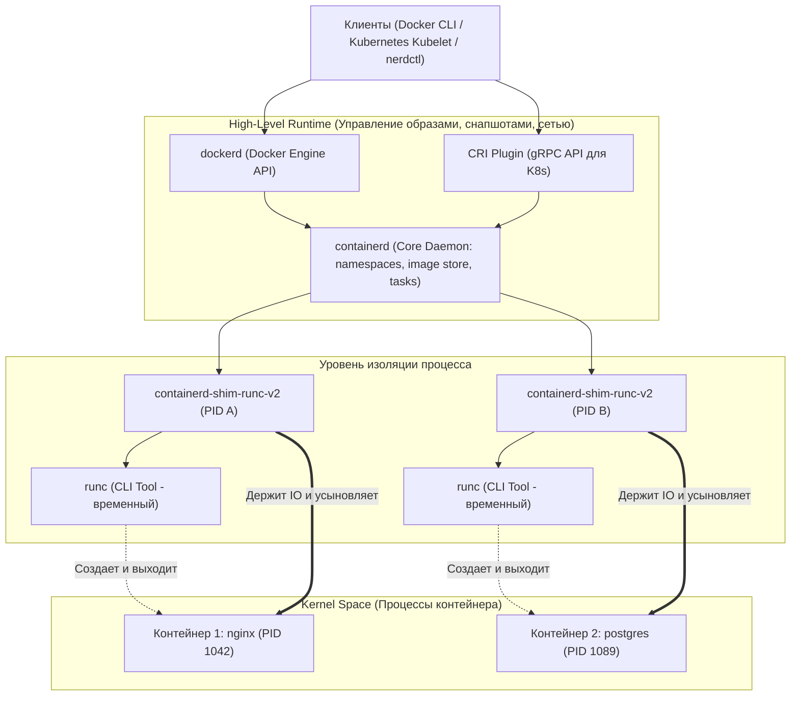
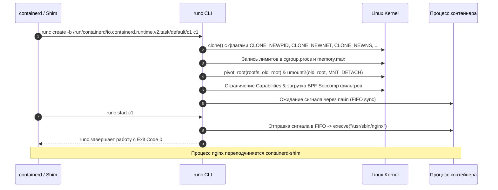
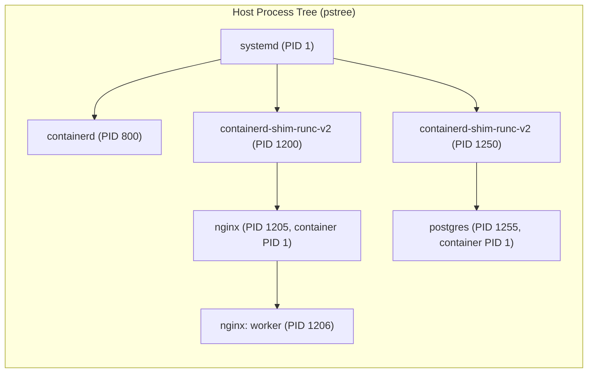
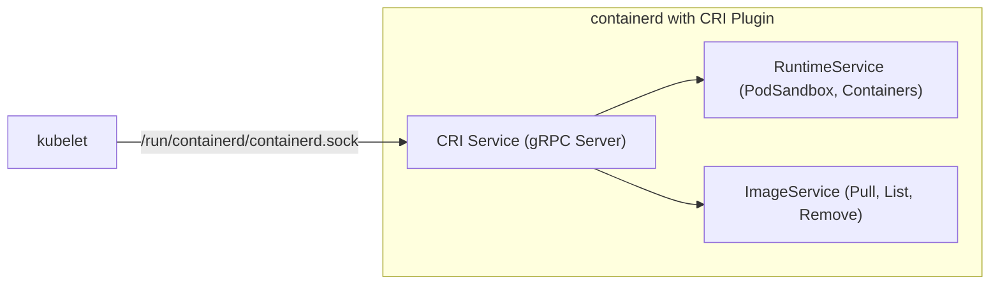

# 📦 05. Архитектура низкоуровневых рантаймов: containerd, runc, shim и CRI

## 🧠 Анатомия современного Container Runtime

До появления стандартов OCI (Open Container Initiative) Docker был монолитным демоном, отвечавшим одновременно за сборку, сетевой стек, загрузку образов, управление томами и запуск процессов. Сегодня архитектура контейнеризации декомпозирована на четко разделенные уровни абстракции: High-Level Runtime (оркестрация и жизненный цикл) и Low-Level Runtime (непосредственное взаимодействие с ядром Linux).



---

## ⚙️ 1. OCI Runtime Specification и `runc`

**OCI Runtime Spec** определяет формат распакованного контейнерного бандла (Bundle) на диске и жизненный цикл процесса контейнера. Бандл состоит из двух компонентов:
1. `rootfs/` — каталог, содержащий полное дерево файлов контейнера.
2. `config.json` — декларативное описание настроек ядра (namespaces, cgroups, capabilities, seccomp, переменные окружения, точки монтирования).

### Как работает `runc` под капотом:
`runc` — это эталонная реализация OCI Runtime от Docker/CNCF на Go. Это CLI-утилита, которая не является фоновым демоном.



### Генерация и разбор `config.json`:
```bash
# Создание базового скелета OCI Bundle
mkdir -p /tmp/mycontainer/rootfs
cd /tmp/mycontainer

# Экспорт файловой системы из Docker-образа
docker export $(docker create alpine:latest) | tar -C rootfs -xvf -

# Генерация базовой OCI спецификации
runc spec
```

Фрагмент `config.json`:
```json
{
  "ociVersion": "1.0.2-dev",
  "process": {
    "terminal": false,
    "user": { "uid": 0, "gid": 0 },
    "args": ["/bin/sh", "-c", "echo Container is running; sleep 3600"],
    "env": ["PATH=/usr/local/sbin:/usr/local/bin:/usr/sbin:/usr/bin:/sbin:/bin"],
    "cwd": "/",
    "capabilities": {
      "bounding": ["CAP_AUDIT_WRITE", "CAP_KILL", "CAP_NET_BIND_SERVICE"],
      "effective": ["CAP_AUDIT_WRITE", "CAP_KILL", "CAP_NET_BIND_SERVICE"],
      "permitted": ["CAP_AUDIT_WRITE", "CAP_KILL", "CAP_NET_BIND_SERVICE"]
    },
    "rlimits": [
      { "type": "RLIMIT_NOFILE", "hard": 1024, "soft": 1024 }
    ],
    "noNewPrivileges": true
  },
  "root": {
    "path": "rootfs",
    "readonly": true
  },
  "linux": {
    "namespaces": [
      { "type": "pid" },
      { "type": "network" },
      { "type": "ipc" },
      { "type": "uts" },
      { "type": "mount" }
    ],
    "cgroupsPath": "system.slice/mycontainer"
  }
}
```

Запуск напрямую без Docker/containerd:
```bash
# Запуск контейнера напрямую через runc
sudo runc run mycontainer-alpine
```

---

## 🛡️ 2. `containerd-shim` (v2): Зачем нужен посредник?

Если `runc` завершает работу сразу после вызова `execve()`, кто управляет контейнером? Эту роль выполняет `containerd-shim` (в частности, runtime v2 API `io.containerd.runc.v2`).

### Ключевые функции `shim`:
1. **Демонизация и Subreaper (Усыновление процессов):** `shim` вызывает `prctl(PR_SET_CHILD_SUBREAPER, 1)`. Когда `runc` умирает, процесс контейнера становится прямым потомком `shim`. Если контейнер завершится, `shim` перехватит `SIGCHLD`, прочитает код возврата (Exit Code) и запишет его в FIFO для containerd.
2. **Бесшовный перезапуск (`dockerd` / `containerd` crash resiliency):** Падение или обновление пакета `containerd` не приводит к завершению контейнеров. `containerd` после старта переподключается к сокетам `shim` через gRPC / UNIX socket.
3. **Обслуживание STDIO:** `shim` держит открытыми дескрипторы стандартных потоков ввода/вывода (stdin/stdout/stderr) и передает логи в лог-коллекторы.
4. **Реализация Runtime V2 API:** Унифицированный gRPC интерфейс между containerd и низкоуровневыми плагинами (Kata Containers, gVisor `runsc`, Wasm `crun`).



---

## 🔌 3. CRI (Container Runtime Interface)

**CRI** — это gRPC API, разработанный сообществом Kubernetes для отвязки `kubelet` от конкретного рантайма контейнеров (ранее в коде kubelet был жестко зашит Docker).



### Основные сервисы CRI:
- **`RuntimeService`:**
  - `RunPodSandbox` / `StopPodSandbox` (создание сетевого пространства имен и паузы для Pod).
  - `CreateContainer` / `StartContainer` / `StopContainer` / `RemoveContainer`.
  - `ExecSync` / `Exec` / `Attach`.
- **`ImageService`:**
  - `ListImages` / `ImageStatus` / `PullImage` / `RemoveImage`.

---

## 🛠️ 4. Инструменты командной строки: `ctr`, `crictl`, `nerdctl`

Частая ошибка инженеров — использовать не тот CLI-инструмент для отладки.

| Утилита | Целевой уровень | Область применения | Namespaces containerd |
| :--- | :--- | :--- | :--- |
| **`ctr`** | containerd internal debug | Низкоуровневая отладка containerd, просмотр плагинов и снапшотов | Ручной выбор (`-n default`, `-n moby`, `-n k8s.io`) |
| **`crictl`** | CRI (Kubernetes) | Отладка K8s нод (Pods, PodSandbox, CRI логи). Не знает про compose/build. | `k8s.io` |
| **`nerdctl`** | containerd (Docker-compatible) | CLI-замена Docker с поддержкой Compose, rootless, IPFS, lazy-pulling (stargz) | Любой (`-n default` по умолчанию) |
| **`docker`** | Docker Engine daemon | Стандартный стек разработки | Скрыт внутри демона (`moby`) |

---

## 📋 5. Практический Cheat Sheet

### 5.1. Управление через `ctr` (Debug CLI containerd)
```bash
# Список пространств имен containerd
ctr namespaces list

# Загрузка образа в namespace "default"
ctr images pull docker.io/library/alpine:latest

# Список образов в k8s namespace (образы, скачанные kubelet)
ctr -n k8s.io images list

# Запуск изолированного контейнера через ctr
ctr run --rm -t docker.io/library/alpine:latest my-test-container sh

# Просмотр активных задач (Task — это запущенный экземпляр Container)
ctr tasks list
```

### 5.2. Управление через `crictl` (Kubernetes Nodes Debugging)
Файл конфигурации `/etc/crictl.yaml`:
```yaml
runtime-endpoint: "unix:///run/containerd/containerd.sock"
image-endpoint: "unix:///run/containerd/containerd.sock"
timeout: 10
debug: false
```

Команды `crictl`:
```bash
# Список работающих Pod Sandboxes
crictl pods

# Список контейнеров с фильтрацией по статусу
crictl ps --state Running

# Получение логов контейнера напрямую из CRI
crictl logs --tail=100 <CONTAINER_ID>

# Выполнение команды внутри пода без участия kubelet
crictl exec -it <CONTAINER_ID> /bin/sh

# Инспекция настроек PodSandbox
crictl inspectp <POD_ID>
```

### 5.3. Продвинутое использование `nerdctl`
```bash
# Полный аналог docker run с поддержкой Cgroups v2 и seccomp
nerdctl run -d \
  --name web-app \
  -p 8080:80 \
  --memory 256m \
  --cpus 1.0 \
  nginx:alpine

# Просмотр логов
nerdctl logs -f web-app

# Запуск Docker Compose через containerd напрямую (без dockerd)
nerdctl compose -f docker-compose.yml up -d
```

---

## 🔧 6. Production-конфигурация `/etc/containerd/config.toml`

Ниже приведен эталонный конфигурационный файл `containerd` для высоконагруженных продакшн-сред (Kubernetes + Docker-совместимость):

```toml
version = 2

[grpc]
  address = "/run/containerd/containerd.sock"
  uid = 0
  gid = 0
  max_recv_message_size = 16777216
  max_send_message_size = 16777216

[plugins]
  [plugins."io.containerd.grpc.v1.cri"]
    sandbox_image = "registry.k8s.io/pause:3.9"
    max_concurrent_downloads = 10
    enable_unprivileged_ports = true
    enable_unprivileged_icmp = true
    
    [plugins."io.containerd.grpc.v1.cri".containerd]
      snapshotter = "overlayfs"
      default_runtime_name = "runc"
      
      [plugins."io.containerd.grpc.v1.cri".containerd.runtimes.runc]
        runtime_type = "io.containerd.runc.v2"
        runtime_engine = ""
        runtime_root = ""
        
        [plugins."io.containerd.grpc.v1.cri".containerd.runtimes.runc.options]
          # Включение systemd cgroup драйвера критично для стабильности в Cgroups v2
          SystemdCgroup = true
          BinaryName = "/usr/bin/runc"

    [plugins."io.containerd.grpc.v1.cri".registry]
      config_path = "/etc/containerd/certs.d"

  [plugins."io.containerd.internal.v1.opt"]
    path = "/opt/containerd"
```

---

## 💥 7. Реальный Troubleshooting: Разбор сбоев

### Сценарий 1: Утечка зомби-процессов и зависшие `containerd-shim`
**Симптомы:** Память на ноде исчерпывается, `ps aux | grep shim` показывает сотни процессов `containerd-shim`, но `docker ps` / `crictl ps` показывают мало контейнеров. Контейнеры висят в статусе `<defunct>`.

**Причина:** Процесс контейнера (PID 1) завершился некорректно или родительский процесс не забирает статус дочерних процессов, а `shim` потерял связь с демоном либо заблокирован на синхронном IO в дескрипторе FIFO.

**Диагностика:**
```bash
# 1. Поиск зомби-процессов и их родителей
ps -eo pid,ppid,stat,cmd | awk '$3 ~ /Z/'

# 2. Проверка заблокированных FIFO труб в /run/containerd
lsof -p <SHIM_PID> | grep fifo

# 3. Трассировка системных вызовов зависшего shim
strace -p <SHIM_PID> -f -e trace=read,write,futex,epoll_wait
```

**Решение:**
1. Принудительно отправить сигнал `SIGKILL` зависшему `shim`:
   ```bash
   kill -9 <SHIM_PID>
   ```
2. Очистить оставшиеся OCI state бандлы:
   ```bash
   runc list
   runc delete -f <CONTAINER_ID>
   ```
3. Включить `SystemdCgroup = true` в `config.toml`, чтобы `systemd` автоматически очищал сгруппированные процессы (Cgroup cleanup) при завершении Scope юнита.

---

### Сценарий 2: Несовместимость Cgroup Driver (cgroupfs vs systemd)
**Симптомы:** Kubelet не запускается с ошибкой: `misconfiguration: kubelet cgroup driver: "systemd" is different from docker cgroup driver: "cgroupfs"`.

**Причина:** В системе с Cgroups v2 наличие двух независимых менеджеров контрольных групп (systemd и внутреннего cgroupfs менеджера containerd) приводит к конфликтам распределения ресурсов и ошибкам лимитов.

**Решение:**
1. Сгенерировать дефолтный конфиг containerd:
   ```bash
   containerd config default | sudo tee /etc/containerd/config.toml
   ```
2. Установить параметр `SystemdCgroup = true` в секции `runc.options`:
   ```bash
   sudo sed -i 's/SystemdCgroup = false/SystemdCgroup = true/g' /etc/containerd/config.toml
   ```
3. Перезапустить containerd:
   ```bash
   sudo systemctl restart containerd
   ```
