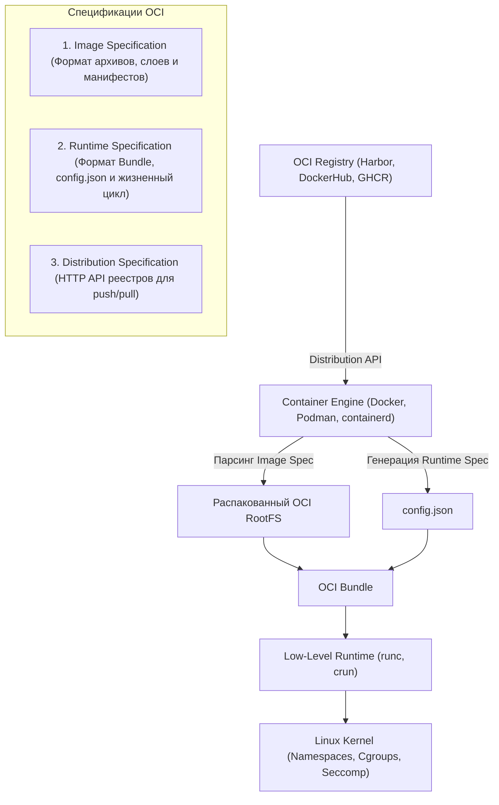
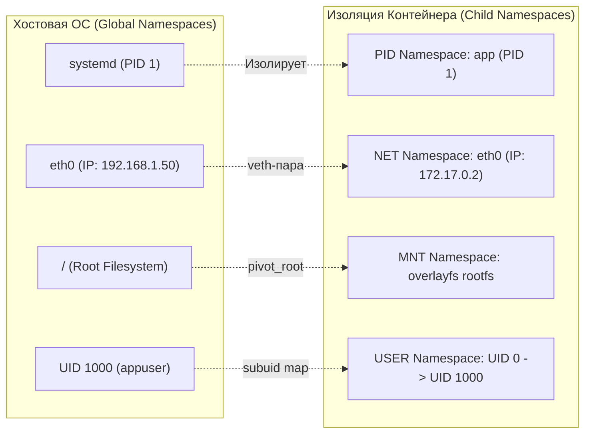
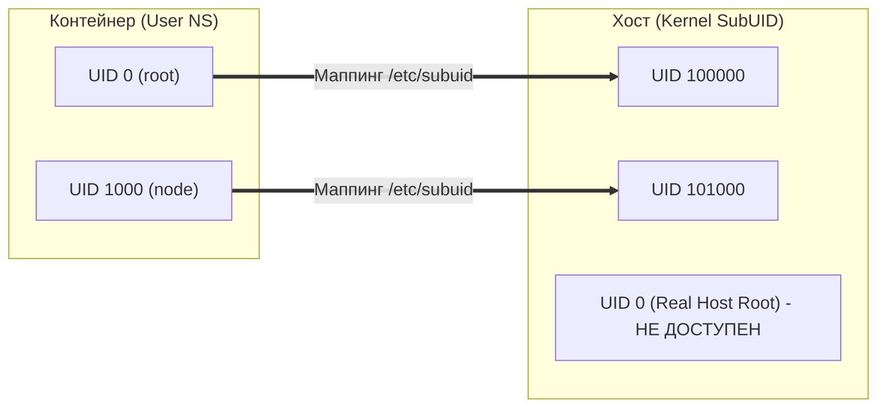

# 🧬 06. OCI спецификации и Linux Namespaces: Механика изоляции

## 🏛️ 1. Стандарты Open Container Initiative (OCI)

Open Container Initiative (OCI) — это независимый проект под эгидой Linux Foundation, созданный для предотвращения фрагментации экосистемы контейнеров. OCI формулирует три ключевые спецификации:



---

## 🔬 2. Анатомия Linux Namespaces

**Namespace (пространство имен)** — это фундаментальная абстракция ядра Linux, изолирующая системные ресурсы для группы процессов. Процессы внутри namespace «видят» только те ресурсы, которые привязаны к их пространству имен.

В ядре Linux существует 8 типов Namespaces:

| Namespace | Системный флаг `clone()` | Изолируемый ресурс | Назначение в контейнерах |
| :--- | :--- | :--- | :--- |
| **PID** | `CLONE_NEWPID` | Дерево идентификаторов процессов | Внутри контейнера процесс видит себя как `PID 1` |
| **NET** | `CLONE_NEWNET` | Сетевые интерфейсы, IP-адреса, таблицы routing, iptables, порты | Изолированный сетевой стек (veth, eth0, loopback) |
| **MNT** | `CLONE_NEWNS` | Точки монтирования файловой системы | Своя файловая система (rootfs, bind mounts) |
| **IPC** | `CLONE_NEWIPC` | POSIX message queues, SysV IPC, разделяемая память | Предотвращение межпроцессного обмена через shm |
| **UTS** | `CLONE_NEWUTS` | Hostname и NIS domain name | Собственное имя хоста (ID контейнера или custom name) |
| **USER** | `CLONE_NEWUSER` | UID и GID маппинги | Root в контейнере (UID 0) отображается на обычного юзера на хосте |
| **CGROUP** | `CLONE_NEWCGROUP` | Виртуализация корня `/proc/self/cgroup` | Скрытие путей cgroup хоста от процессов контейнера |
| **TIME** | `CLONE_NEWTIME` | Системные часы (`CLOCK_MONOTONIC`, `CLOCK_BOOTTIME`) | Смещение времени без влияния на системные часы хоста |



---

## 🔍 3. Системные вызовы ядра: `clone`, `unshare`, `setns`, `pivot_root`

Создание и управление namespaces происходит через 4 ключевых системных вызова:

1. **`clone(flags)`** — создает новый дочерний процесс, помещая его в новые пространства имен, указанные в битовой маске `flags` (например, `CLONE_NEWPID | CLONE_NEWNET`).
2. **`unshare(flags)`** — отсоединяет вызывающий процесс от текущих пространств имен и создает для него новые без создания дочернего процесса.
3. **`setns(fd, nstype)`** — подключает текущий процесс к уже существующему пространству имен по дескриптору файла в `/proc/<PID>/ns/`.
4. **`pivot_root(new_root, put_old)`** — перемещает корень текущей файловой системы процесса в `put_old`, делая `new_root` новым корневым каталогом. В отличие от `chroot`, `pivot_root` меняет корень на уровне таблицы монтирования MNT namespace, после чего `old_root` можно полностью отмонтировать через `umount2(put_old, MNT_DETACH)`.

---

## 🛠️ 4. Практика: Создание контейнера вручную с нуля через CLI

Для глубокого понимания механизма контейнеризации соберем контейнер вручную, используя только стандартные утилиты Linux (`unshare`, `nsenter`, `chroot`/`pivot_root`).

### Шаг 1: Подготовка изолированной RootFS
```bash
# Создание рабочего каталога
mkdir -p /tmp/mini-container/rootfs
cd /tmp/mini-container

# Экспорт чистой Alpine rootfs
docker export $(docker create alpine:3.19) | tar -C rootfs -xf -

# Создание каталогов для монтирования виртуальных ФС
mkdir -p rootfs/proc rootfs/sys rootfs/dev rootfs/tmp
```

### Шаг 2: Запуск изолированного процесса с новыми Namespaces
```bash
sudo unshare \
  --pid \
  --net \
  --mount \
  --ipc \
  --uts \
  --fork \
  --mount-proc=/tmp/mini-container/rootfs/proc \
  /bin/sh -c "
    hostname container-demo
    chroot /tmp/mini-container/rootfs /bin/sh
  "
```

Внутри открывшегося шелла:
```bash
# Проверяем PID (мы стали PID 1)
ps aux
# OUTPUT:
# PID   USER     TIME  COMMAND
#     1 root      0:00 /bin/sh

# Проверяем Hostname
hostname
# OUTPUT: container-demo

# Проверяем сетевые интерфейсы (есть только loopback, сеть изолирована)
ip a
```

---

## 🧰 5. Диагностика и инспекция Namespaces

Каждый процесс в Linux экспортирует ссылки на свои пространства имен в `/proc/<PID>/ns/`:

```bash
# Просмотр inode всех пространств имен конкретного процесса
ls -la /proc/$$/ns/
```
Пример вывода:
```text
cgroup -> 'cgroup:[4026531835]'
ipc    -> 'ipc:[4026531839]'
mnt    -> 'mnt:[4026531841]'
net    -> 'net:[4026531840]'
pid    -> 'pid:[4026531836]'
user   -> 'user:[4026531837]'
uts    -> 'uts:[4026531838]'
```
> [!NOTE]
> Если у двух процессов совпадает номер inode для `net:[4026531840]`, значит они находятся в **одном и том же сетевом пространстве имен** (например, контейнеры внутри одного Kubernetes Pod).

### Команды отладки с помощью `lsns` и `nsenter`

```bash
# 1. Список всех активных пространств имен на сервере
sudo lsns -t net,pid,mnt

# 2. Найти PID контейнера на хосте
CONTAINER_PID=$(docker inspect -f '{{.State.Pid}}' my-nginx)

# 3. Вход в сетевой namespace контейнера с хоста (без изменения rootfs)
sudo nsenter -t $CONTAINER_PID -n ip a
sudo nsenter -t $CONTAINER_PID -n ss -tulpn
sudo nsenter -t $CONTAINER_PID -n tcpdump -nn -i eth0 -c 10

# 4. Полное погружение во все namespace контейнера (спасательный круг при сломанном /bin/sh)
sudo nsenter -t $CONTAINER_PID -m -u -i -n -p /bin/sh
```

---

## 👥 6. User Namespaces и сопоставление UID/GID (`subuid`/`subgid`)

User Namespace позволяет процессу иметь полный `root` (UID 0) внутри контейнера, оставаясь непривилегированным пользователем (например, UID 100000) на хостовой машине. Это исключает атаки с побегом на хост (Container Breakout), так как даже при выходе за пределы rootfs процесс не имеет прав `root` на хосте.



### Конфигурация `/etc/subuid` и `/etc/subgid`:
```text
dockremap:100000:65536
```
Это означает: для пользователя `dockremap` выделен диапазон из 65536 UID, начиная со 100000. Внутри контейнера:
- UID 0 $\rightarrow$ 100000 на хосте
- UID 1 $\rightarrow$ 100001 на хосте
- UID 65535 $\rightarrow$ 165535 на хосте

### Включение User Namespaces в Docker Engine:
Редактируем `/etc/docker/daemon.json`:
```json
{
  "userns-remap": "default"
}
```
После перезапуска (`systemctl restart docker`) Docker автоматически создаст пользователя `dockremap` и изолирует процессы всех запускаемых контейнеров.

---

## 💥 7. Реальный Troubleshooting: Разбор типовых проблем

### Сценарий 1: Конфликт разделяемой памяти (IPC Namespace & PostgreSQL/PyTorch)
**Симптомы:** Приложение PyTorch или PostgreSQL падает с ошибкой `Bus error (core dumped)` или `could not attach to shared memory: No space left on device`.

**Причина:** По умолчанию Docker выделяет для `/dev/shm` (POSIX Shared Memory внутри IPC namespace) всего 64 МБ. Сложные модели машинного обучения и параллельные воркеры баз данных мгновенно переполняют этот лимит.

**Диагностика:**
```bash
# Проверка размера /dev/shm внутри контейнера
docker exec -it <CONTAINER_ID> df -h /dev/shm
```

**Решение:**
Увеличить размер разделяемой памяти флагом `--shm-size`:
```bash
# Docker CLI
docker run -d --shm-size=2g pytorch/pytorch:latest

# Docker Compose
# services:
#   ai-worker:
#     image: pytorch/pytorch:latest
#     shm_size: '2gb'
```

---

### Сценарий 2: "Device or resource busy" при попытке удалить MNT Namespace
**Симптомы:** Контейнер останавливается, но `docker rm -f` зависает, в dmesg появляются ошибки `unregister_netdevice: waiting for dev to become free` или `Device or resource busy` при очистке точек монтирования.

**Причина:** Внешний процесс на хосте (например, антивирус, агент резервного копирования или зомби-процесс `nsenter`) держит открытым дескриптор файла в точке монтирования внутри MNT namespace контейнера.

**Диагностика и устранение:**
```bash
# 1. Поиск пути Overlay2 слоя контейнера
OVERLAY_DIR=$(docker inspect -f '{{.GraphDriver.Data.MergedDir}}' <CONTAINER_ID>)

# 2. Поиск процессов, удерживающих файлы в этом каталоге
sudo fuser -vm $OVERLAY_DIR
sudo lsof +D $OVERLAY_DIR

# 3. Принудительное завершение блокирующих процессов
sudo fuser -kvm $OVERLAY_DIR
```
