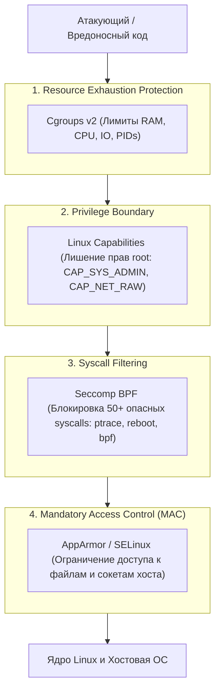
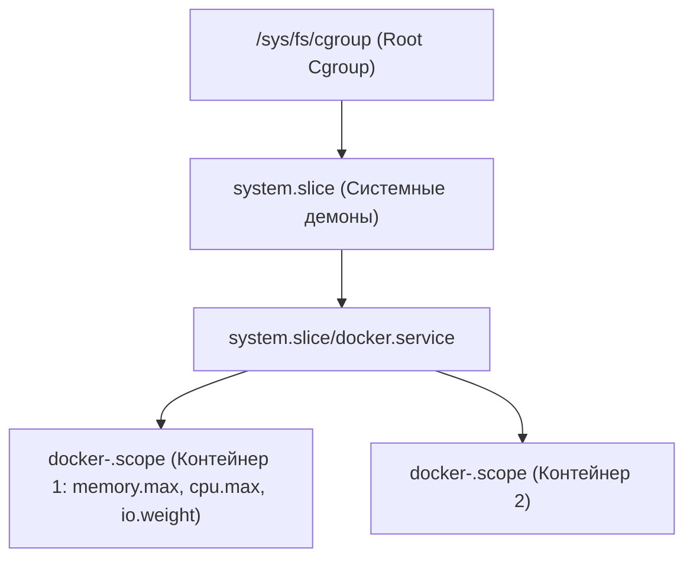
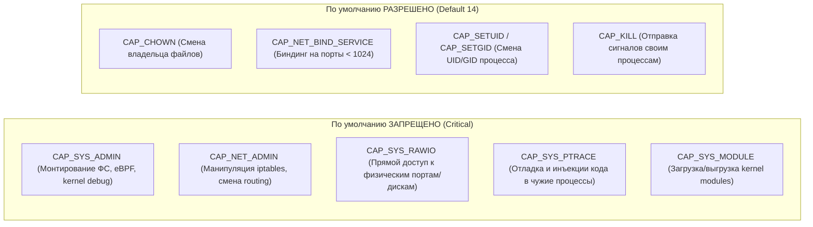

# 🛡️ 07. Безопасность и изоляция: Cgroups v2, Capabilities, Seccomp и AppArmor

## 🔒 Модель эшелонированной обороны контейнера

Контейнерная безопасность базируется на принципе наименьших привилегий (Principle of Least Privilege). Если злоумышленник скомпрометирует приложение внутри контейнера, многоуровневая система защиты ядра Linux должна предотвратить эскалацию привилегий и побег на хост.



---

## 📊 1. Cgroups v2 (Control Groups): Управление ресурсами

В отличие от Cgroups v1 с разрозненными иерархиями по контроллерам (`/sys/fs/cgroup/memory`, `/sys/fs/cgroup/cpu`), **Cgroups v2** использует единую унифицированную иерархию (Unified Hierarchy) с гарантированным учетом всех ресурсов (включая swap, буферизованный IO и память структур ядра `kmem`).



### Ключевые файлы контроллеров Cgroups v2:

| Файл Cgroups v2 | Docker параметр | Описание и физический смысл |
| :--- | :--- | :--- |
| `memory.max` | `--memory="1g"` | Hard limit RAM. Превышение вызывает `OOM-Killer`. |
| `memory.high` | `--memory-reservation="768m"` | Soft limit / Throttle limit. Запуск асинхронного сброса страниц (page reclamation). |
| `memory.swap.max` | `--memory-swap="2g"` | Максимальный размер swap для контейнера. |
| `memory.current` | Метрика | Текущее реальное потребление памяти (включая PageCache и kmem). |
| `cpu.max` | `--cpus="1.5"` | Квота CFS: `150000 100000` (150 мс работы за 100 мс квант времени). |
| `cpu.weight` | `--cpu-shares=1024` | Пропорциональный приоритет CPU (от 1 до 10000, 100 по умолчанию). |
| `pids.max` | `--pids-limit=100` | Максимум процессов/тредов. Защита от fork-бомб (`:(){ :\|:& };:`). |
| `io.weight` | `--blkio-weight=500` | Вес дискового ввода-вывода (IO throttling). |

### Проверка версии Cgroups на хосте:
```bash
# Если вывод cgroup2fs — используется Cgroups v2
stat -fc %T /sys/fs/cgroup/
```

---

## 🎛️ 2. Linux Capabilities: Разделение прав Superuser

Традиционно в UNIX пользователь либо обычный (`UID != 0`), либо всемогущий `root` (`UID == 0`). В ядре Linux права суперпользователя разделены на ~40 независимых флагов (**Capabilities**).

По умолчанию Docker запускает контейнеры от пользователя с урезанным набором из 14 capabilities, блокируя опасные:



### Production Best Practice: Сброс всех прав с точечным добавлением
```bash
# Запуск контейнера с полным сбросом всех capabilities и выдачей только биндинга портов
docker run -d \
  --name secure-web \
  --cap-drop=ALL \
  --cap-add=NET_BIND_SERVICE \
  --cap-add=SETUID \
  --cap-add=SETGID \
  -p 80:80 \
  nginx:alpine
```

---

## 🛡️ 3. Seccomp (Secure Computing Mode): Фильтрация Системных Вызовов

**Seccomp-BPF** позволяет ограничить список системных вызовов (syscalls), которые процесс может выполнять к ядру Linux. Если процесс вызывает запрещенный syscall, ядро немедленно завершает его сигналом `SIGSYS` или возвращает ошибку `EPERM`.

По умолчанию Docker использует профиль Seccomp, который блокирует ~50 опасных вызовов (`ptrace`, `kexec_load`, `reboot`, `sysfs`, `acct`, `add_key`, `bpf`).

### Кастомный production-профиль Seccomp (`custom-seccomp.json`):
```json
{
  "defaultAction": "SCMP_ACT_ERRNO",
  "architectures": [
    "SCMP_ARCH_X86_64",
    "SCMP_ARCH_X86",
    "SCMP_ARCH_AARCH64"
  ],
  "syscalls": [
    {
      "names": [
        "accept4",
        "bind",
        "clone",
        "close",
        "epoll_create1",
        "epoll_ctl",
        "epoll_pwait",
        "exit_group",
        "futex",
        "listen",
        "mmap",
        "mprotect",
        "nanosleep",
        "read",
        "recvfrom",
        "rt_sigaction",
        "rt_sigprocmask",
        "rt_sigreturn",
        "sendto",
        "socket",
        "write"
      ],
      "action": "SCMP_ACT_ALLOW"
    }
  ]
}
```

Применение кастомного профиля:
```bash
docker run -d \
  --security-opt seccomp=/etc/docker/custom-seccomp.json \
  -p 8080:8080 \
  my-microservice:1.0
```

---

## 🔒 4. AppArmor и SELinux в Docker

### AppArmor (Ubuntu/Debian)
AppArmor — это модуль безопасности ядра Linux (LSM), контролирующий доступ программ к файлам, сети и capabilities на основе текстовых профилей.

Docker по умолчанию применяет профиль `docker-default`, блокирующий:
- Запись в `/proc/sys/`, `/sys/`, `/proc/sysrq-trigger`.
- Монтирование файловых систем.
- Прямой доступ к устройствам в `/dev/`.

#### Создание строгого профиля AppArmor (`/etc/apparmor.d/docker-strict-app`):
```text
#include <tunables/global>

profile docker-strict-app flags=(attach_disconnected,mediate_deleted) {
  #include <abstractions/base>
  #include <abstractions/ssl_certs>

  # Запретить запуск бинарников компиляторов и шеллов
  deny /bin/sh mrwklx,
  deny /bin/bash mrwklx,
  deny /usr/bin/curl mrwklx,
  deny /usr/bin/wget mrwklx,

  # Разрешить чтение только своего приложения
  /app/** r,
  /app/bin/app ix,
  /tmp/** rw,

  # Сетевые операции
  network inet tcp,
  network inet6 tcp,
}
```

Загрузка и применение профиля:
```bash
# Загрузка профиля в ядро
sudo apparmor_parser -r -W /etc/apparmor.d/docker-strict-app

# Запуск контейнера с созданным профилем
docker run -d --security-opt apparmor=docker-strict-app my-app:prod
```

### SELinux (RHEL/CentOS/Rocky Linux)
SELinux использует метки безопасности контекста (MCS/Type Enforcement). Для монтирования host-директорий в контейнер требуются суффиксы флагов `:z` (shared) или `:Z` (private):
```bash
# :z перемаркирует каталог для совместного доступа контейнеров (svirt_sandbox_file_t)
docker run -v /var/data:/data:z my-app:latest
```

---

## 📋 5. Hardening Configuration: `/etc/docker/daemon.json`

Production-конфигурация демона со строгими настройками безопасности по умолчанию:

```json
{
  "icc": false,
  "no-new-privileges": true,
  "live-restore": true,
  "userland-proxy": false,
  "log-driver": "json-file",
  "log-opts": {
    "max-size": "50m",
    "max-file": "5"
  },
  "default-cgroup-parent": "system.slice",
  "cgroup-parent": "system.slice",
  "seccomp-profile": "/etc/docker/custom-default-seccomp.json",
  "default-ulimits": {
    "nofile": {
      "Name": "nofile",
      "Hard": 65535,
      "Soft": 32768
    },
    "nproc": {
      "Name": "nproc",
      "Hard": 4096,
      "Soft": 2048
    }
  }
}
```

> [!IMPORTANT]
> Параметр `"no-new-privileges": true` предотвращает эскалацию прав через SUID-бинарники (например, `sudo` или `suid-shell`) внутри контейнера с помощью `prctl(PR_SET_NO_NEW_PRIVS)`.

---

## 💥 6. Реальный Troubleshooting: Разбор инцидентов

### Сценарий 1: Загадочный `Exit Code 137 (OOMKilled)` без записей в stdout
**Симптомы:** Микросервис на Java (JVM) или NodeJS внезапно падает без записи StackTrace в логи. `docker inspect` показывает `"OOMKilled": true, "ExitCode": 137`.

**Причина:** Лимит `memory.max` в Cgroups v2 установлен в `512MB`. JVM старых версий (до JDK 11) или NodeJS с дефолтным heap выделяет память исходя из RAM хоста (например, 64 ГБ), а не cgroup лимита, превышая память и вызывая `oom-kill`.

**Диагностика:**
```bash
# 1. Проверка счетчика OOM событий в Cgroups v2
cat /sys/fs/cgroup/system.slice/docker-<ID>.scope/memory.events
# OUTPUT:
# oom 3
# oom_kill 1

# 2. Проверка системного лога ядра
dmesg -T | grep -E -i 'oom|killed process'
```

**Решение:**
1. Ограничить Heap внутри контейнера через переменные:
   ```bash
   # Для Java
   JAVA_OPTS="-XX:MaxRAMPercentage=75.0 -XX:+UseContainerSupport"
   # Для NodeJS
   NODE_OPTIONS="--max-old-space-size=384"
   ```
2. Настроить плавное оповещение и мягкие лимиты:
   ```yaml
   deploy:
     resources:
       limits:
         memory: 512M
       reservations:
         memory: 384M
   ```

---

### Сценарий 2: Ошибка `Operation not permitted` при запуске утилиты в контейнере
**Симптомы:** Утилита `ping`, `traceroute` или `strace` завершается с ошибкой `ping: socket: Operation not permitted` или `strace: ptrace(PTRACE_TRACEME, ...): Operation not permitted`.

**Причина:** `ping` требует capability `CAP_NET_RAW`, а `strace` требует `CAP_SYS_PTRACE` и заблокирован Seccomp-фильтром.

**Диагностика:**
```bash
# Трассировка отказавших системных вызовов через auditd / dmesg
journalctl -k -g "audit"
```

**Решение:**
Не запускать контейнер в небезопасном режиме `--privileged`! Вместо этого выдать только необходимые привилегии:
```bash
# Для отладки приложения через strace:
docker run --rm -it \
  --cap-add=SYS_PTRACE \
  --security-opt seccomp=unconfined \
  my-debug-image:latest
```
