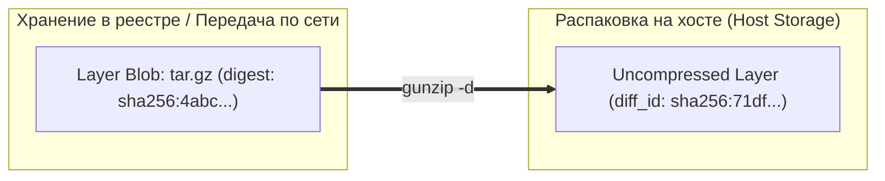
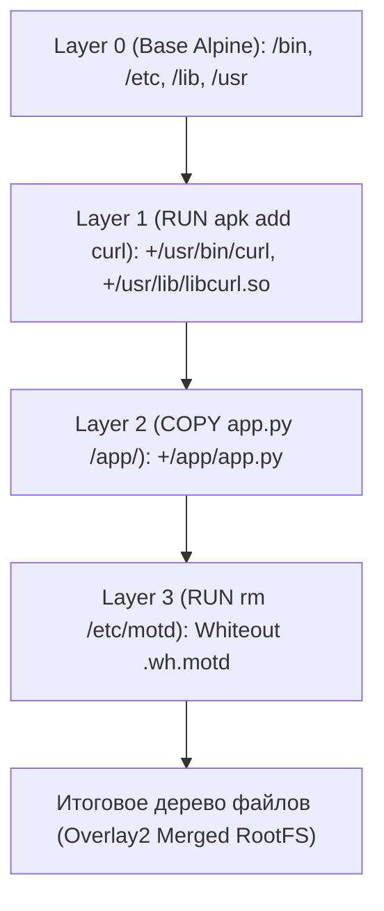

# 📦 08. Внутреннее устройство OCI образов и слоев: Manifests, Blobs и Хэширование

## 🧩 Анатомия OCI Image: Content-Addressable Storage

Docker-образ — это не монолитный виртуальный диск, а набор независимых тар-архивов (слоев) и метаданных в формате JSON, связанных между собой криптографическими хэшами **SHA256**. Вся модель хранения OCI Image Specification построена на принципе **Content-Addressable Storage (CAS)**: имя любого файла или блоба строго равно хэшу его содержимого (`sha256:<hash>`).

```mermaid
graph TD
    subgraph OCIImage["Структура OCI Image"]
        Index["OCI Index / Manifest List (multi-arch)"]
        Manifest["Image Manifest (application/vnd.oci.image.manifest.v1+json)"]
        Config["Image Config JSON (envs, entrypoint, rootfs diff_ids)"]
        Layer1["Layer 1 Blob (rootfs base tar.gz)"]
        Layer2["Layer 2 Blob (packages tar.gz)"]
        Layer3["Layer 3 Blob (app source tar.gz)"]
    end

    Index -->|Выбор архитектуры: linux/amd64| Manifest
    Manifest -->|config descriptor| Config
    Manifest -->|layers[0] sha256:aaa...| Layer1
    Manifest -->|layers[1] sha256:bbb...| Layer2
    Manifest -->|layers[2] sha256:ccc...| Layer3
```

---

## 📜 1. Манифест образа (`manifest.json`)

Манифест — это JSON-документ, который описывает состав контейнерного образа: ссылку на конфигурационный файл и упорядоченный список слоев.

```json
{
  "schemaVersion": 2,
  "mediaType": "application/vnd.oci.image.manifest.v1+json",
  "config": {
    "mediaType": "application/vnd.oci.image.config.v1+json",
    "digest": "sha256:8b45625066a3d9202517865f32a76f0a3ccb8ec3fcf7d6e4df2f2e519c5b2a0a",
    "size": 7023
  },
  "layers": [
    {
      "mediaType": "application/vnd.oci.image.layer.v1.tar+gzip",
      "digest": "sha256:4abcf20661432fb2d719aaf90618400b2837ea30d0eab377d854ab7ae336d01b",
      "size": 3401234
    },
    {
      "mediaType": "application/vnd.oci.image.layer.v1.tar+gzip",
      "digest": "sha256:923485098234abcf901283012849018230918239018239018239018230918230",
      "size": 120455
    },
    {
      "mediaType": "application/vnd.oci.image.layer.v1.tar+gzip",
      "digest": "sha256:5129384712093841209384120938412093841209384120938412093841209384",
      "size": 45012
    }
  ],
  "annotations": {
    "org.opencontainers.image.created": "2026-09-02T10:00:00Z",
    "org.opencontainers.image.authors": "devops@example.com"
  }
}
```

---

## ⚙️ 2. Конфигурация образа (`config.json`)

Файл конфигурации образа содержит информацию о том, как запускать контейнер, а также массив **`diff_ids`** — хэши распакованных слоев:



> [!IMPORTANT]
> **Digest vs DiffID:**
> - **Digest (в Manifest):** Хэш `SHA256` от *сжатого* архива `tar.gz` (используется при передаче по сети и проверке целостности в Registry).
> - **DiffID (в Config JSON):** Хэш `SHA256` от *распакованного* tar-потока (используется локальным движком для сборки графа слоев файловой системы).

---

## 🔬 3. Механика наложения слоев (Layering Mechanics)

Каждая инструкция Dockerfile (`RUN`, `COPY`, `ADD`), изменяющая файловую систему, создает новый слой:
1. Выполняется команда во временном контейнере/песочнице.
2. BuildKit вычисляет разницу (diff) между состоянием ФС «до» и «после».
3. Все созданные, измененные и удаленные файлы упаковываются в `tar.gz`.



### Обработка удаления файлов: Whiteout Files
Файловые системы слоев неизменяемы (Immutable). Если в верхнем слое выполняется `rm /etc/issue`, файл физически не удаляется из нижнего слоя базового образа!
Вместо этого OCI рантайм создает специальный маркер удаления — **Whiteout-файл**:
- Для файла `/etc/issue` создается маркер `.wh.issue`.
- При монтировании OverlayFS драйвер скрывает оригинальный файл `/etc/issue` от пользователя.

> [!WARNING]
> Если вы записали секретный ключ в слое 1 (`RUN echo "SECRET" > /secret.key`), а удалили его в слое 2 (`RUN rm /secret.key`), ключ **навсегда останется в истории и теле слоя 1**. Любой пользователь, скачавший образ, сможет извлечь его через `tar -xf layer1.tar.gz`.

---

## 🛠️ 4. Практика: Ручной разбор и инспекция образа

Давайте разберем образ на составляющие без использования Docker CLI:

```bash
# 1. Сохранение Docker-образа в чистый tar архив
docker save nginx:alpine -o nginx.tar

# 2. Распаковка архива во временную папку
mkdir -p /tmp/image-inspect && cd /tmp/image-inspect
tar -xf /tmp/nginx.tar

# 3. Просмотр внутренней структуры
ls -la
```

Структура распакованного образа:
```text
├── index.json               # OCI индекс
├── manifest.json            # Манифест Docker V2
├── oci-layout               # Версия OCI
├── blobs/sha256/            # Content-Addressable хранилище
│   ├── 8b456250...          # Config JSON
│   ├── 4abcf206...          # Base Layer (tar.gz)
│   └── 92348509...          # Diff Layer (tar.gz)
└── repositories             # Теги образов
```

### Просмотр содержимого слоя напрямую:
```bash
# Просмотр файлов внутри конкретного слоя
tar -tvf blobs/sha256/4abcf20661432fb2d719aaf90618400b2837ea30d0eab377d854ab7ae336d01b | head -n 20
```

---

## 🧰 5. Команды инспекции слоев и размеров

```bash
# 1. Анализ слоев и их размера через CLI
docker history --no-trunc --human nginx:alpine

# 2. Получение полного RootFS DiffIDs дерева
docker inspect --format='{{json .RootFS.Layers}}' nginx:alpine | jq .

# 3. Глубокий интерактивный анализ слоев утилитой dive
# (показывает потраченное впустую место и удаленные файлы)
dive nginx:alpine
```

---

## 💥 6. Реальный Troubleshooting

### Сценарий 1: Образ весит 1.5 ГБ вместо 50 МБ из-за "скрытых" слоев
**Симптомы:** В Dockerfile используется удаление временных файлов сборщика:
```dockerfile
FROM alpine:3.19
RUN apk add --no-cache build-base go
RUN git clone https://github.com/example/app /src && cd /src && go build -o /bin/app
RUN apk del build-base go && rm -rf /src
```
Размер итогового образа составляет 800+ МБ, хотя бинарник `/bin/app` весит 15 МБ.

**Причина:** Каждая директива `RUN` создает отдельный слой. Установка Go и клонирование исходников зафиксировались во 2-м и 3-м слоях. Удаление пакетов в 4-м слое создало лишь `.wh.` маркеры, не освободив физический размер в блобах.

**Решение:**
1. Либо объединять команды в один `RUN`:
   ```dockerfile
   RUN apk add --no-cache --virtual .build-deps build-base go && \
       git clone https://github.com/example/app /src && \
       cd /src && go build -o /bin/app && \
       apk del .build-deps && rm -rf /src
   ```
2. Либо (лучший подход) использовать **Multi-stage build**:
   ```dockerfile
   FROM golang:1.22-alpine AS builder
   WORKDIR /src
   COPY . .
   RUN go build -ldflags="-w -s" -o /bin/app .

   FROM alpine:3.19
   COPY --from=builder /bin/app /bin/app
   ENTRYPOINT ["/bin/app"]
   ```

---

### Сценарий 2: Ошибка `manifest unknown` или `layer hash mismatch` при pull
**Симптомы:** Команда `docker pull myregistry.com/app:v1` падает с ошибкой:
`error pulling image configuration: download failed after 5 attempts: sha256:... layer does not exist`.

**Причина:** Повреждение blob-хранилища на стороне Registry (например, сбой сборщика мусора garbage collection, удалившего слой, на который ссылается манифест) или проксирующий HTTP-кэш обрезал payload.

**Диагностика:**
```bash
# Прямой запрос манифеста через curl с аутентификацией
curl -s -H "Accept: application/vnd.oci.image.manifest.v1+json" \
  https://myregistry.com/v2/app/manifests/v1 | jq .

# Проверка доступности проблемного блоба
curl -I https://myregistry.com/v2/app/blobs/sha256:<BLOB_DIGEST>
```
**Решение:** Выполнить пересборку и повторный push с флагом `--no-cache` в BuildKit.
