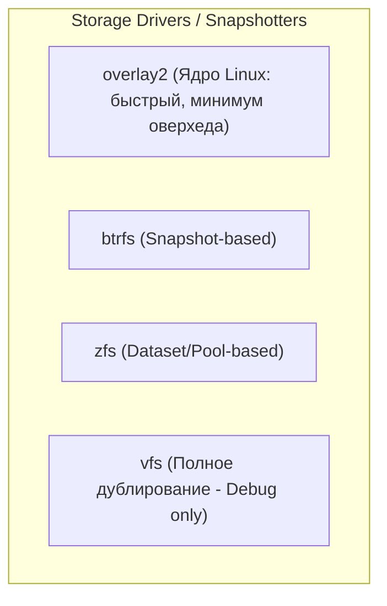
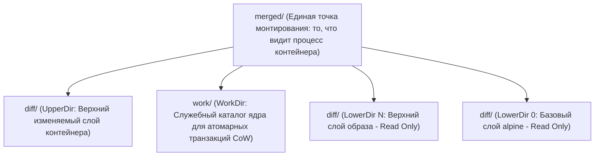
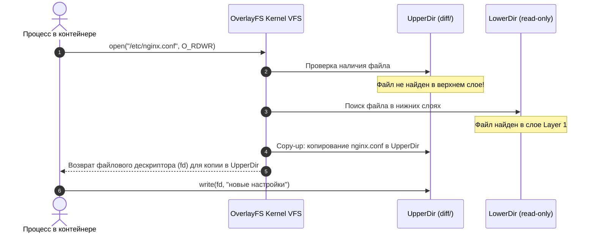

# 🗄️ 09. Драйверы хранилища: Внутреннее устройство Overlay2, Copy-on-Write и Whiteouts

## 🏗️ 1. Сравнение Storage Drivers в Linux

Драйвер хранилища (Graph Driver / Snapshotter) отвечает за хранение слоев образов и создание перезаписываемого слоя (Writable Layer / Container Layer) для каждого запущенного контейнера.

| Storage Driver | Поддерживаемая базовая ФС | Copy-on-Write механика | Производительность | Рекомендация |
| :--- | :--- | :--- | :--- | :--- |
| **`overlay2`** | `ext4` (с `d_type=true`), `xfs` (`ftype=1`) | Page Cache Sharing, File-level CoW | ⚡ Максимальная (Native Linux Kernel) | **Production Default** |
| **`btrfs`** | `btrfs` | Block-level CoW, Subvolumes | ⚡ Высокая | Специализированные Btrfs пулы |
| **`zfs`** | `zfs` | Block-level CoW, ZFS Datasets | 🚀 Высокая (требует много RAM для ARC) | Корпоративные среды с ZFS пулами |
| **`vfs`** | Любая ФС | Полное копирование каталогов (без CoW) | 🐌 Катастрофически медленно | Только тестирование / DinD без root |
| **`fuse-overlayfs`** | Любая ФС | User-space OverlayFS | ⏱️ Средняя | Rootless containers |



---

## 🔬 2. Внутреннее устройство Overlay2: Структура каталогов

Драйвер `overlay2` использует встроенную в ядро Linux файловую систему **OverlayFS**. Она объединяет несколько директорий в единую виртуальную точку монтирования.

Каталоги хранятся в `/var/lib/docker/overlay2/`:



### Назначение директорий в `/var/lib/docker/overlay2/<layer-id>/`:
1. **`diff/`** — физические файлы, добавленные или измененные именно в этом слое.
2. **`link`** — короткий символический идентификатор слоя (например, `XYZ`), используемый для предотвращения превышения длины аргументов системного вызова `mount()` (лимит страницы ядра 4096 байт).
3. **`lower`** — текстовый файл, содержащий относительные пути ко всем нижележащим слоям (LowerDirs), разделенные двоеточием `:`.
4. **`work/`** — служебная директория ядра Linux для подготовки файлов перед их фиксацией в `upperdir`.
5. **`merged/`** — финальное смонтированное дерево файлов. Существует **только во время работы контейнера**.

---

## ⚙️ 3. Механика Copy-on-Write (CoW) и Whiteouts

### 3.1. Чтение файла (Read Path)
- Если файл существует в `upperdir` (контейнерный слой), он читается оттуда.
- Если файла нет в `upperdir`, OverlayFS опрашивает слои `lowerdir` сверху вниз до первого совпадения.
- Благодаря **Page Cache Sharing**, если 100 контейнеров на одном хосте читают один и тот же бинарник `/usr/bin/python3` из базового слоя, он загружается в оперативную память ядра **ровно один раз**!

### 3.2. Модификация файла (Copy-on-Write)
Когда процесс пытается открыть существующий файл из `lowerdir` на запись (`O_WRONLY` или `O_RDWR`):
1. OverlayFS перехватывает системный вызов.
2. Файл целиком копируется из `lowerdir` в `upperdir` (директорию `diff/` контейнера).
3. Модификация применяется к копии в `upperdir`.
4. Оригинальный файл в `lowerdir` остается нетронутым.



> [!WARNING]
> Если файл имеет размер 10 ГБ (например, локальная БД), даже изменение одного байта приведет к полному копированию 10 ГБ на диск через CoW! Для интенсивных дисковых операций **всегда используйте Docker Volumes**.

### 3.3. Удаление файлов и каталогов (Whiteouts & Opaque Dirs)
- **Whiteout File:** При удалении файла `/var/log/app.log` из нижнего слоя, в `upperdir` создается специальный символьный файл-заглушка с major/minor номером `0,0`: `.wh.app.log`. При попытке чтения OverlayFS скрывает файл.
- **Opaque Directory:** При удалении целого каталога и создании нового с тем же именем, OverlayFS устанавливает расширенный атрибут xattr `trusted.overlay.opaque=y`, скрывая всё содержимое нижнего каталога.

---

## 🛠️ 4. Практика: Ручное монтирование OverlayFS

Для глубокого понимания механизма смонтируем OverlayFS вручную средствами ядра Linux:

```bash
# 1. Создание структуры каталогов
mkdir -p /tmp/overlay-demo/{lower1,lower2,upper,work,merged}

# 2. Наполнение слоев файлами
echo "File from Lower 1" > /tmp/overlay-demo/lower1/base.txt
echo "Config v1" > /tmp/overlay-demo/lower2/config.cfg
echo "File from Lower 2" > /tmp/overlay-demo/lower2/app.txt

# 3. Вызов системного монтирования OverlayFS
sudo mount -t overlay overlay \
  -o lowerdir=/tmp/overlay-demo/lower2:/tmp/overlay-demo/lower1,\
upperdir=/tmp/overlay-demo/upper,\
workdir=/tmp/overlay-demo/work \
  /tmp/overlay-demo/merged

# 4. Проверка результата
ls -la /tmp/overlay-demo/merged/
cat /tmp/overlay-demo/merged/base.txt

# 5. Тестирование Copy-on-Write
echo "Config v2 (Modified)" > /tmp/overlay-demo/merged/config.cfg

# Файл появился в upper:
ls -la /tmp/overlay-demo/upper/
# Оригинал в lower2 не изменился:
cat /tmp/overlay-demo/lower2/config.cfg

# 6. Размонтирование
sudo umount /tmp/overlay-demo/merged
```

---

## 📋 5. Диагностика и инспекция Overlay2 в Docker

```bash
# 1. Просмотр физических путей слоев конкретного контейнера
docker inspect --format='{{json .GraphDriver.Data}}' <CONTAINER_ID> | jq .

# 2. Анализ реального дискового пространства, занятого слоями
docker system df -v

# 3. Поиск "тяжелых" изменяемых слоев контейнеров
du -sh /var/lib/docker/overlay2/*/diff | sort -hr | head -n 10
```

Пример вывода `.GraphDriver.Data`:
```json
{
  "LowerDir": "/var/lib/docker/overlay2/l/L25DFG:/var/lib/docker/overlay2/l/K99ZTA",
  "MergedDir": "/var/lib/docker/overlay2/ab12cd34.../merged",
  "UpperDir": "/var/lib/docker/overlay2/ab12cd34.../diff",
  "WorkDir": "/var/lib/docker/overlay2/ab12cd34.../work"
}
```

---

## 💥 6. Реальный Troubleshooting: Разбор сбоев Overlay2

### Сценарий 1: "No space left on device" при наличии свободного места на диске
**Симптомы:** Команды `docker run` или `docker build` падают с ошибкой `mkdir ...: no space left on device`, но `df -h` показывает, что на диске свободно 150 ГБ.

**Причина:** **Исчерпание Inodes (индексных дескрипторов)**. Множество мелких файлов в слоях `diff` (например, `node_modules`, кэши pip/apt) исчерпали доступные inodes файловой системы ext4/xfs.

**Диагностика:**
```bash
# Проверка свободных inodes
df -i /var/lib/docker
# OUTPUT:
# Filesystem      Inodes   IUsed IFree IUse% Mounted on
# /dev/sda1      6553600 6553600     0  100% /
```

**Решение:**
1. Выполнить агрессивную очистку неиспользуемых слоев и билдов:
   ```bash
   docker system prune -a --volumes -f
   docker builder prune -a -f
   ```
2. Для XFS/Ext4 при форматировании выделить больше inodes:
   ```bash
   mkfs.ext4 -N 20000000 /dev/sdb1
   ```

---

### Сценарий 2: Ошибка `d_type` на старых инсталляциях RHEL/CentOS
**Симптомы:** Демон Docker не стартуется с ошибкой в логах: `overlay2: the backing xfs filesystem is formatted without ftype=1 to support d_type`.

**Причина:** OverlayFS требует обязательной поддержки `d_type` (информация о типе файла в структуре каталога) от нижележащей файловой системы XFS. Если ФС была создана без опции `-n ftype=1`, драйвер `overlay2` работать не может.

**Диагностика:**
```bash
xfs_info /var/lib/docker | grep ftype
# Если ftype=0 — драйвер не поддерживается
```

**Решение:**
Переформатировать раздел под Docker с поддержкой `ftype=1`:
```bash
mkfs.xfs -n ftype=1 /dev/sdb1
```
