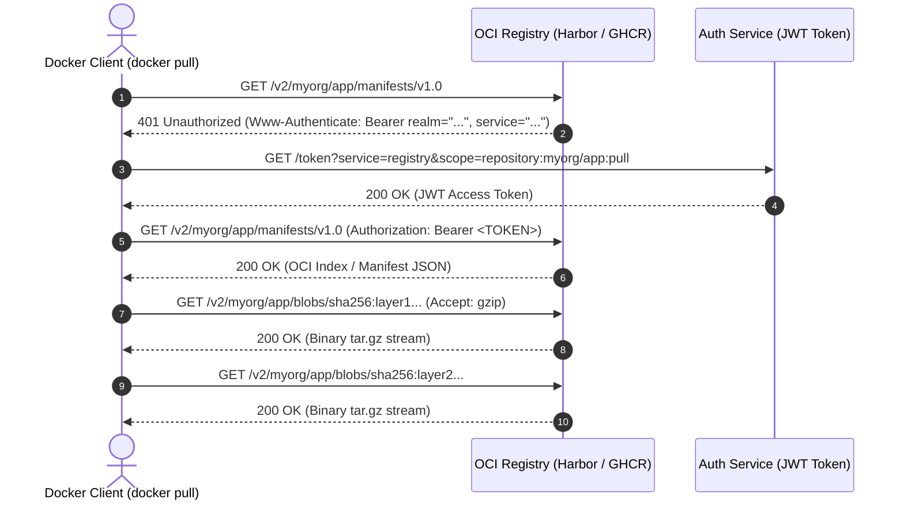
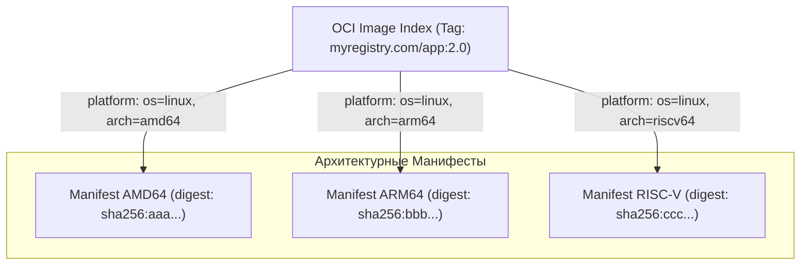
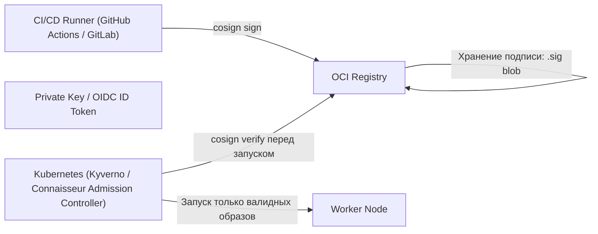
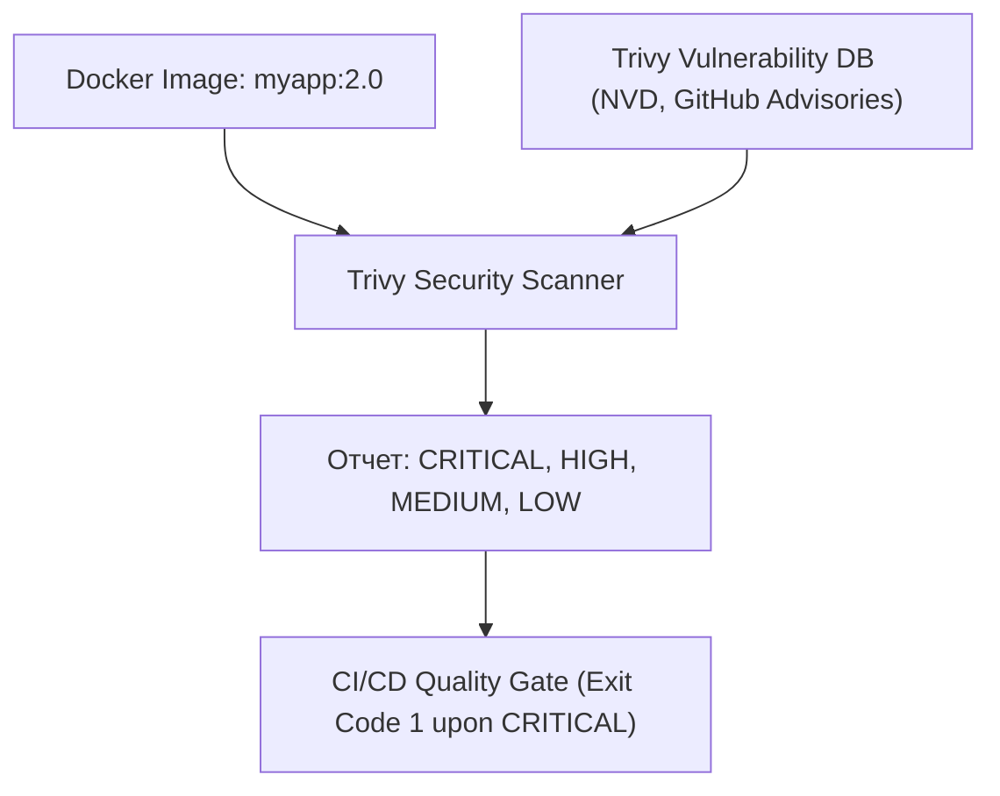

# 🌐 10. Реестры образов, Multi-Arch Манифесты, Подпись Cosign и Сканирование Trivy

## 🏛️ 1. Архитектура Docker Registry HTTP API V2

Взаимодействие между Docker/containerd клиентом и реестром образов (Docker Hub, Harbor, AWS ECR, GitHub Container Registry) стандартизировано в спецификации **OCI Distribution Spec** (эволюция Docker Registry HTTP API V2).



---

## 🔀 2. Multi-Architecture Manifests (OCI Image Index)

С появлением серверов на архитектуре ARM64 (AWS Graviton, Apple Silicon M-series, Ampere) возникла необходимость хранить под одним тегом (например, `myapp:2.0`) сборки под разные процессорные архитектуры (`linux/amd64`, `linux/arm64/v8`, `windows/amd64`).

Для этого используется **OCI Image Index** (или Fat Manifest / Manifest List):



### Пример структуры `index.json`:
```json
{
  "schemaVersion": 2,
  "mediaType": "application/vnd.oci.image.index.v1+json",
  "manifests": [
    {
      "mediaType": "application/vnd.oci.image.manifest.v1+json",
      "digest": "sha256:912384a8c9e01284712093847109238471029384710293847102938471029384",
      "size": 1582,
      "platform": {
        "architecture": "amd64",
        "os": "linux"
      }
    },
    {
      "mediaType": "application/vnd.oci.image.manifest.v1+json",
      "digest": "sha256:5823719482103948120394812039481203948120394812039481203948120394",
      "size": 1582,
      "platform": {
        "architecture": "arm64",
        "os": "linux",
        "variant": "v8"
      }
    }
  ]
}
```

### Сборка и публикация Multi-Arch образов через Buildx:
```bash
# 1. Создание экземпляра buildx builder с драйвером docker-container
docker buildx create --name multi-builder --driver docker-container --use
docker buildx inspect --bootstrap

# 2. Сборка и одновременный push под две платформы
docker buildx build \
  --platform linux/amd64,linux/arm64 \
  -t myregistry.com/org/app:2.0 \
  --push .

# 3. Инспекция созданного манифеста
docker buildx imagetools inspect myregistry.com/org/app:2.0
```

---

## ✍️ 3. Цифровая подпись и цепочка доверия: Sigstore Cosign

**Cosign** (проект консорциума Sigstore/Linux Foundation) стал де-факто стандартом для подписи образов контейнеров без необходимости разворачивать сложную PKI-инфраструктуру (благодаря Keyless подписи через OIDC и Fulcio).



### Практика: Генерация ключей, подпись и верификация

```bash
# 1. Генерация пары криптографических ключей (Ed25519)
cosign generate-key-pair
# Создаются файлы: cosign.key (секретный) и cosign.pub (публичный)

# 2. Подпись опубликованного образа
cosign sign --key cosign.key myregistry.com/org/app:2.0

# 3. Проверка подписи перед развертыванием
cosign verify --key cosign.pub myregistry.com/org/app:2.0

# 4. Прикрепление SBOM (Software Bill of Materials) как OCI Attestation
syft myregistry.com/org/app:2.0 -o spdx-json=sbom.spdx.json
cosign attest --key cosign.key --type spdx --predicate sbom.spdx.json myregistry.com/org/app:2.0

# 5. Верификация аттестации
cosign verify-attestation --key cosign.pub --type spdx myregistry.com/org/app:2.0
```

---

## 🔍 4. Анализ уязвимостей (Vulnerability Scanning) с помощью Trivy

**Trivy** (от Aqua Security) — инструмент комплексного анализа безопасности контейнерных образов, проверяющий:
1. Уязвимости в OS-пакетах (CVE в Alpine apk, Debian deb, RHEL rpm).
2. Уязвимости в зависимостях языков программирования (npm, pip, maven, gomod, cargo).
3. Ошибки конфигурации (Misconfigurations в Dockerfile и k8s манифестах).
4. Утечки секретов и приватных ключей.



### Production команды Trivy в CI/CD пайплайне:
```bash
# Базовое сканирование образа с выводом таблицы
trivy image myregistry.com/org/app:2.0

# Строгий скан для CI/CD: блокировать пайплайн при наличии CRITICAL уязвимостей с доступными патчами
trivy image \
  --severity HIGH,CRITICAL \
  --ignore-unfixed \
  --exit-code 1 \
  --format table \
  myregistry.com/org/app:2.0

# Генерация SBOM в формате CycloneDX JSON
trivy image \
  --format cyclonedx \
  --output sbom.cdx.json \
  myregistry.com/org/app:2.0
```

---

## 🔒 5. Автоматизированный пайплайн в GitLab CI / GitHub Actions

Пример защищенного GitHub Actions Workflow (`.github/workflows/build-and-sign.yml`):

```yaml
name: Secure Build, Scan & Sign

on:
  push:
    tags: ['v*']

jobs:
  build-and-publish:
    runs-on: ubuntu-latest
    permissions:
      contents: read
      packages: write
      id-token: write # Требуется для Keyless Cosign через OIDC

    steps:
      - name: Checkout code
        uses: actions/checkout@v4

      - name: Install Cosign & Trivy
        uses: sigstore/cosign-installer@v3
        
      - name: Set up QEMU & Docker Buildx
        uses: docker/setup-qemu-action@v3
      - uses: docker/setup-buildx-action@v3

      - name: Login to GitHub Container Registry
        uses: docker/login-action@v3
        with:
          registry: ghcr.io
          username: ${{ github.actor }}
          password: ${{ secrets.GITHUB_TOKEN }}

      - name: Build and Push Multi-Arch Image
        id: build-push
        uses: docker/build-push-action@v5
        with:
          context: .
          platforms: linux/amd64,linux/arm64
          push: true
          tags: ghcr.io/${{ github.repository }}:${{ github.ref_name }}

      - name: Run Trivy Scanner
        uses: aquasecurity/trivy-action@master
        with:
          image-ref: ghcr.io/${{ github.repository }}:${{ github.ref_name }}
          format: 'table'
          exit-code: '1'
          ignore-unfixed: true
          severity: 'CRITICAL,HIGH'

      - name: Sign Image with Cosign (Keyless via GitHub OIDC)
        run: |
          cosign sign --yes ghcr.io/${{ github.repository }}@${{ steps.build-push.outputs.digest }}
```

---

## 💥 6. Реальный Troubleshooting

### Сценарий 1: Контейнер падает с ошибкой `exec /entrypoint.sh: exec format error`
**Симптомы:** После сборки и деплоя на продакшн-сервер (например, x86_64 нода) контейнер падает в `CrashLoopBackOff`, в логах единственная строчка: `standard_init_linux.go: exec format error`.

**Причина:** Образ был собран на машине разработчика с архитектурой ARM64 (Apple M1/M2/M3) без явного указания платформы. На сервер с AMD64 попал бинарник, скомпилированный под инструкции AArch64.

**Диагностика:**
```bash
# Проверка архитектуры образа в реестре
docker buildx imagetools inspect myregistry.com/app:latest
# Проверка бинарника внутри распакованного слоя
file rootfs/bin/mybinary
```

**Решение:**
1. Всегда собирать с флагом `--platform linux/amd64` или использовать Multi-Arch билды.
2. В Dockerfile явно указывать аргумент базового образа: `FROM --platform=$TARGETPLATFORM alpine:3.19`.

---

### Сценарий 2: Ошибка `cosign verify` возвращает `no matching signatures were found`
**Симптомы:** При верификации в Kubernetes кластере admission webhook отклоняет запуск пода: `verification failed: no matching signatures found for image ghcr.io/org/app@sha256:...`.

**Причина:** Образ был перетегирован (tag mutation), либо подпись была привязана к старому Digest манифеста до пересборки.

**Диагностика:**
```bash
# Получить точный дайджест образа из реестра
crane digest myregistry.com/app:latest

# Просмотр тегов подписей в реестре
crane ls myregistry.com/app | grep sig
```
**Решение:** В production системах подписывать и верифицировать образы **строго по неизменяемому SHA256 дайджесту** (`image@sha256:...`), а не по мутабельным тегам (`image:latest`).
