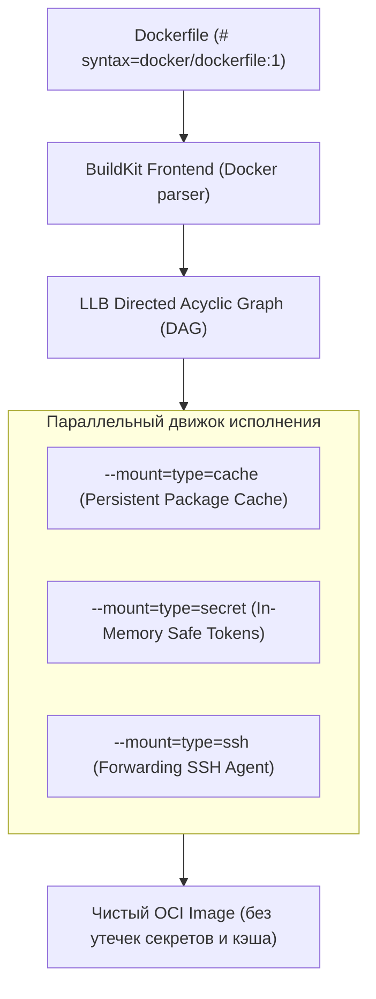
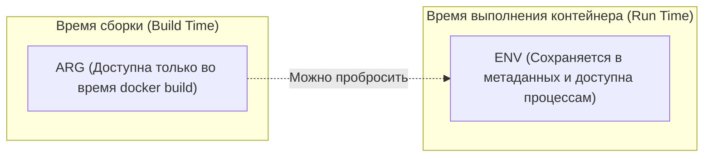

# 📜 11. Продвинутые директивы Dockerfile: BuildKit Mounts, Secrets, SSH и Сигналы

## 🧠 Эволюция парсера Dockerfile (BuildKit Frontend)

Современный Dockerfile — это высокоуровневый DSL, транслируемый движком BuildKit в ориентированный граф операций **LLB (Low-Level Builder)**. Использование директивы `# syntax=docker/dockerfile:1` в первой строке файла подключает актуальный фронтенд парсера, открывающий доступ к монтированию кэша, секретов, SSH-агентов и тонкому управлению правами файлов.



---

## ⚡ 1. Монтирование кэша: `RUN --mount=type=cache`

Традиционный подход с сохранением кэша менеджеров пакетов раздувает образ, а очистка кэша (`rm -rf /var/cache/*`) приводит к повторной долгой загрузке при инвалидации слоя. 

`--mount=type=cache` подключает персистентную директорию кэша хоста **только на время выполнения команды `RUN`**. Содержимое кэша **не попадает в итоговый образ**, но переиспользуется между сборками!

```dockerfile
# syntax=docker/dockerfile:1.7
FROM golang:1.22-alpine AS builder
WORKDIR /app

COPY go.mod go.sum ./
# Кэширование модулей Go между билдами
RUN --mount=type=cache,target=/go/pkg/mod \
    go mod download

COPY . .
# Кэширование скомпилированных объектов сборщика Go (.cache/go-build)
RUN --mount=type=cache,target=/root/.cache/go-build \
    --mount=type=cache,target=/go/pkg/mod \
    CGO_ENABLED=0 go build -ldflags="-s -w" -o /bin/server .
```

### Кэширование для популярных пакетных менеджеров:

```dockerfile
# 1. Alpine APK
RUN --mount=type=cache,target=/var/cache/apk \
    apk add --cache-dir=/var/cache/apk build-base libffi-dev

# 2. Debian/Ubuntu APT (требуется отключить дефолтные docker clean хуки)
RUN rm -f /etc/apt/apt.conf.d/docker-clean; \
    echo 'Binary::apt::APT::Keep-Downloaded-Packages "true";' > /etc/apt/apt.conf.d/keep-cache
RUN --mount=type=cache,target=/var/cache/apt,sharing=locked \
    --mount=type=cache,target=/var/lib/apt,sharing=locked \
    apt-get update && apt-get install -y --no-install-recommends gcc python3-dev

# 3. Python PIP
RUN --mount=type=cache,target=/root/.cache/pip \
    pip install -r requirements.txt

# 4. NodeJS NPM / PNPM
RUN --mount=type=cache,target=/root/.npm \
    npm ci --prefer-offline
```

> [!TIP]
> Параметр `sharing=locked` гарантирует, что параллельные сборки не повредят базу данных пакетов APT, блокируя одновременный доступ.

---

## 🔐 2. Безопасная работа с секретами: `RUN --mount=type=secret`

Никогда не передавайте API-токены и приватные ключи через `ARG` или `ENV`! Значения `ARG` сохраняются в конфигурации метаданных образа, доступной через `docker inspect`.

Директива `--mount=type=secret` монтирует секрет как временный файл в `tmpfs` (память). Он доступен исключительно внутри конкретной строки `RUN` и гарантированно отсутствует в слоях образа.

```dockerfile
# syntax=docker/dockerfile:1.7
FROM python:3.11-slim

WORKDIR /app
COPY requirements.txt .

# Монтирование токена приватного PyPI репозитория
RUN --mount=type=secret,id=pip_token \
    PIP_EXTRA_INDEX_URL="https://user:$(cat /run/secrets/pip_token)@pypi.company.internal/simple" \
    pip install --no-cache-dir -r requirements.txt
```

### Передача секрета при сборке:
```bash
# Из файла
docker build --secret id=pip_token,src=/home/user/.tokens/pypi.txt -t myapp .

# Из переменной окружения хоста
export PIP_TOKEN="secret-token-xyz"
docker build --secret id=pip_token,env=PIP_TOKEN -t myapp .
```

---

## 🔑 3. Проброс SSH-агента: `RUN --mount=type=ssh`

Для сборки приватных Git-зависимостей (Go modules, Cargo crates, Composer) без копирования закрытых SSH-ключей (`id_ed25519`) в контекст сборки используется монтирование SSH сокета.

```dockerfile
# syntax=docker/dockerfile:1.7
FROM alpine:3.19

RUN apk add --no-cache git openssh-client
# Добавление ключа хоста GitHub в known_hosts
RUN mkdir -p -m 0700 ~/.ssh && ssh-keyscan github.com >> ~/.ssh/known_hosts

# Клонирование приватного репозитория через SSH агент сборщика
RUN --mount=type=ssh git clone git@github.com:myorg/private-core-lib.git /lib
```

Запуск сборки с передачей активного агента:
```bash
# Запуск ssh-agent и добавление ключа
eval $(ssh-agent)
ssh-add ~/.ssh/id_ed25519

# Запуск билда с пробросом агента
docker build --ssh default -t myapp .
```

---

## ⚖️ 4. `ARG` против `ENV`: Разница в жизненном цикле



| Характеристика | `ARG` | `ENV` |
| :--- | :--- | :--- |
| **Доступность** | Только в момент выполнения `docker build` | Во время `build` и внутри запущенного контейнера (`docker run`) |
| **Переопределение** | Флагом `--build-arg KEY=value` | Флагами `-e KEY=value` или `--env-file` |
| **Сохранение в слоях** | Значение видно в истории сборки (`docker history`) | Записывается в Env массив `config.json` |
| **Область видимости** | От места объявления до конца текущего Stage | Наследуется всеми последующими командами и контейнером |

### Правильное пробрасывание версии из ARG в ENV:
```dockerfile
ARG APP_VERSION=1.0.0
FROM python:3.11-slim
# ARG перед FROM доступен только в FROM. Чтобы использовать внутри stage, объявляем повторно:
ARG APP_VERSION
ENV APP_VERSION=${APP_VERSION}
ENV ENVIRONMENT=production
```

---

## 🚦 5. `STOPSIGNAL` и `ONBUILD`

### Корректная остановка: `STOPSIGNAL`
По умолчанию при выполнении `docker stop` демон отправляет процессу сигнал `SIGTERM`, ожидает 10 секунд и отправляет `SIGKILL`. Некоторые приложения (например, Nginx) для плавной остановки (Graceful Shutdown) требуют сигнал `SIGQUIT`, а не `SIGTERM`.

```dockerfile
FROM nginx:1.25-alpine
# Указываем Docker использовать SIGQUIT вместо SIGTERM для завершения воркеров
STOPSIGNAL SIGQUIT
CMD ["nginx", "-g", "daemon off;"]
```

### Шаблонизация базовых образов: `ONBUILD`
Инструкция `ONBUILD` регистрирует отложенный триггер. Команда **не выполняется** при сборке текущего образа, но **автоматически исполняется в самом начале сборки любого дочернего образа**, использующего данный образ в `FROM`.

```dockerfile
# Базовый образ для микросервисов компании (company-python-base:latest)
FROM python:3.11-slim
WORKDIR /app
RUN pip install --no-cache-dir gunicorn
# Триггеры для дочерних репозиториев
ONBUILD COPY requirements.txt .
ONBUILD RUN pip install --no-cache-dir -r requirements.txt
ONBUILD COPY . .
CMD ["gunicorn", "-b", "0.0.0.0:8000", "main:app"]
```

---

## 📋 6. Эталонный Production Dockerfile (All-in-One Best Practice)

```dockerfile
# syntax=docker/dockerfile:1.7
# Stage 1: Загрузка зависимостей
FROM golang:1.22-bookworm AS deps
WORKDIR /build
COPY go.mod go.sum ./
RUN --mount=type=cache,target=/go/pkg/mod \
    go mod download -x

# Stage 2: Сборка статического бинарника
FROM deps AS builder
COPY . .
ARG VERSION=dev
ARG COMMIT=none
RUN --mount=type=cache,target=/go/pkg/mod \
    --mount=type=cache,target=/root/.cache/go-build \
    CGO_ENABLED=0 GOOS=linux GOARCH=amd64 \
    go build -trimpath \
    -ldflags="-s -w -X main.version=${VERSION} -X main.commit=${COMMIT}" \
    -o /bin/server ./cmd/server

# Stage 3: Минимальный защищенный runtime
FROM gcr.io/distroless/static-debian12:nonroot
WORKDIR /app
# Копирование бинарника с явным назначением прав nonroot пользователя (UID 65532)
COPY --from=builder --chown=nonroot:nonroot /bin/server /app/server

USER nonroot:nonroot
EXPOSE 8080
STOPSIGNAL SIGTERM

ENTRYPOINT ["/app/server"]
```

---

## 💥 7. Реальный Troubleshooting

### Сценарий 1: Инвалидация кэша на каждом коммите из-за `COPY . .`
**Симптомы:** Сборка в CI/CD занимает 8 минут на каждый коммит, даже если изменилась одна строка в README или HTML-шаблоне.

**Причина:** Команда `COPY . .` размещена до установки зависимостей (`npm install` / `pip install`). Любое изменение в файле контекста меняет хэш слоя и инвалидирует кэш для всех последующих `RUN`.

**Решение:**
1. Использовать `.dockerignore`:
   ```text
   .git
   .github
   node_modules
   *.md
   tmp
   dist
   ```
2. Копировать только дескрипторы зависимостей перед сборкой:
   ```dockerfile
   COPY package.json package-lock.json ./
   RUN npm ci
   COPY . .
   ```

---

### Сценарий 2: Приложение не успевает сбросить транзакции и убивается через 10 секунд
**Симптомы:** При перезапуске контейнера в логах базы данных видны следы аварийного завершения (Crash Recovery, Corrupted state), клиенты получают HTTP 502 Bad Gateway.

**Причина:** Приложение слушает `SIGTERM`, но контейнер запущен через shell-форму `CMD "npm start"`. Shell (`/bin/sh`) становится PID 1 и **не транслирует сигналы** процессу `npm` / `node`. По истечении таймаута Docker принудительно убивает процесс через `SIGKILL` (Exit 137).

**Решение:**
1. Использовать исключительно **Exec-форму (JSON array syntax)** для `ENTRYPOINT` и `CMD`:
   ```dockerfile
   # ПЛОХО: запускается как /bin/sh -c "node server.js"
   CMD node server.js

   # ПРАВИЛЬНО: запускается напрямую как PID 1
   CMD ["node", "server.js"]
   ```
2. Для контейнеров с несколькими процессами внедрять инициализатор сигналов `tini`:
   ```dockerfile
   RUN apk add --no-cache tini
   ENTRYPOINT ["/sbin/tini", "--"]
   CMD ["node", "server.js"]
   ```
