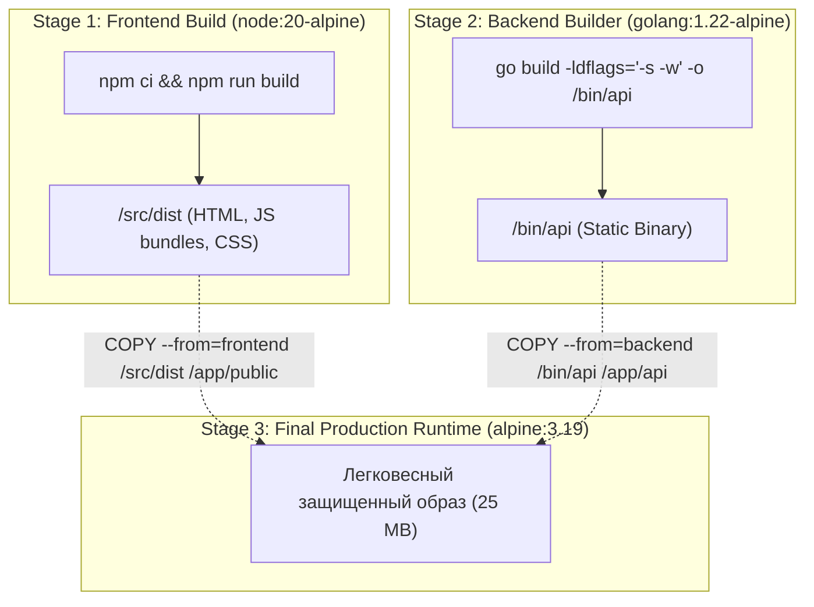
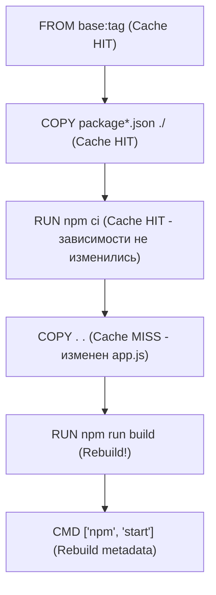

# 🏗️ 12. Multi-Stage Сборка и Оптимизация Кэша Слоев

## 🎯 Паттерн Multi-Stage: Разделение Build-Time и Run-Time

В традиционной одноэтапной сборке для компиляции приложений (на Go, Rust, Java, C++, TypeScript) в образ приходится устанавливать компиляторы, заголовочные файлы, пакетные менеджеры и исходный код. Это приводит к:
1. **Огромному размеру образов** (1–3 ГБ вместо 30 МБ).
2. **Критическим уязвимостям** (наличие компиляторов и утилит отладки в продакшне облегчает атакующему исполнение эксплойтов).
3. **Медленному развертыванию** и лишнему расходу сетевого трафика в кластере.

Паттерн **Multi-Stage Build** решает эту проблему за счет использования нескольких инструкций `FROM` в одном Dockerfile. Каждый этап (Stage) работает в изолированном контексте, а в финальный образ копируются **только скомпилированные артефакты**.



---

## ⚡ 1. Механика кэширования слоев и порядок инструкций

Движок сборки Docker/BuildKit проверяет наличие кэша для каждой инструкции. Если слой признан инвалидированным (изменились файлы или аргументы), **все последующие слои будут принудительно пересобраны с нуля**.



### Правило «Золотой пирамиды кэша»:
Располагайте инструкции в порядке **от наименее часто изменяемых к наиболее часто изменяемым**:
1. Установка базовых системных утилит ядра и сертификатов (`ca-certificates`, `tzdata`).
2. Загрузка конфигураций манифестов зависимостей (`package.json`, `go.mod`, `pom.xml`, `requirements.txt`).
3. Загрузка внешних пакетов и библиотек (`go mod download`, `pip install`, `npm ci`).
4. Копирование исходного кода проекта (`COPY src/ ./src`).
5. Компиляция и сборка (`npm run build`, `go build`).

---

## 🎯 2. Таргетирование этапов: `--target` флаг

Один Dockerfile может содержать целевые этапы для разработки (dev), тестирования (linter/test), сборки документации и продакшна.

```dockerfile
# syntax=docker/dockerfile:1.7

# --- Base Common Stage ---
FROM node:20-alpine AS base
WORKDIR /app
COPY package.json package-lock.json ./

# --- Dependencies Stage ---
FROM base AS dependencies
RUN --mount=type=cache,target=/root/.npm \
    npm ci

# --- Development Stage (Live Reload) ---
FROM dependencies AS development
ENV NODE_ENV=development
COPY . .
EXPOSE 3000
CMD ["npm", "run", "dev"]

# --- Testing & Linting Stage ---
FROM dependencies AS test
COPY . .
RUN npm run lint && npm run test:unit

# --- Production Builder ---
FROM dependencies AS builder
COPY . .
RUN npm run build && npm prune --production

# --- Production Final Runtime ---
FROM node:20-alpine AS production
ENV NODE_ENV=production
WORKDIR /app
USER node

COPY --from=builder --chown=node:node /app/node_modules ./node_modules
COPY --from=builder --chown=node:node /app/dist ./dist
COPY --from=builder --chown=node:node /app/package.json ./package.json

EXPOSE 8080
CMD ["node", "dist/main.js"]
```

### Сборка нужного таргета через CLI:
```bash
# 1. Запуск тестов в CI пайплайне
docker build --target test -t myapp:test .

# 2. Сборка образа для локальной разработки
docker build --target development -t myapp:dev .

# 3. Финальная сборка для продакшна (по умолчанию берется последний stage)
docker build --target production -t myapp:prod .
```

---

## 🔀 3. Копирование файлов из внешних образов

Инструкция `COPY --from` умеет копировать файлы не только из предыдущих этапов текущего Dockerfile, но и из **любых внешних Docker-образов** напрямую из реестра!

```dockerfile
FROM alpine:3.19

# Копирование официального CLI утилиты без компиляции и установки пакетных менеджеров
COPY --from=docker.io/curlimages/curl:8.6.0 /usr/bin/curl /usr/bin/curl
COPY --from=docker.io/mikefarah/yq:4.40.5 /usr/bin/yq /usr/bin/yq
COPY --from=ghcr.io/grpc-ecosystem/grpc-health-probe:v0.4.24 /ko-app/grpc-health-probe /bin/grpc_health_probe
```

---

## 📦 4. Полный Production пример: Java Spring Boot / Maven

Пример трехэтапной сборки высоконагруженного Java микросервиса с распаковкой Spring Boot слоев для сверхбыстрого кэширования:

```dockerfile
# syntax=docker/dockerfile:1.7

# Stage 1: Сборка артефакта через Maven
FROM maven:3.9-eclipse-temurin-21-alpine AS builder
WORKDIR /workspace
COPY pom.xml .
# Кэширование локального репозитория .m2
RUN --mount=type=cache,target=/root/.m2 \
    mvn dependency:go-offline -B

COPY src ./src
RUN --mount=type=cache,target=/root/.m2 \
    mvn clean package -DskipTests -B

# Stage 2: Распаковка слоев Spring Boot Fat JAR (Layer Tools)
FROM eclipse-temurin:21-jre-alpine AS extractor
WORKDIR /workspace
COPY --from=builder /workspace/target/*.jar app.jar
RUN java -Djarmode=layertools -jar app.jar extract

# Stage 3: Минимальный production рантайм
FROM eclipse-temurin:21-jre-alpine AS production
WORKDIR /application

# Создание непривилегированного пользователя
RUN addgroup -S appgroup && adduser -S appuser -G appgroup
USER appuser:appgroup

# Копирование слоев от наименее изменяемых к коду приложения
COPY --from=extractor --chown=appuser:appgroup /workspace/dependencies/ ./
COPY --from=extractor --chown=appuser:appgroup /workspace/spring-boot-loader/ ./
COPY --from=extractor --chown=appuser:appgroup /workspace/snapshot-dependencies/ ./
COPY --from=extractor --chown=appuser:appgroup /workspace/application/ ./

EXPOSE 8080
ENTRYPOINT ["java", "-XX:+UseContainerSupport", "-XX:MaxRAMPercentage=75.0", "org.springframework.boot.loader.launch.JarLauncher"]
```

---

## 💥 5. Реальный Troubleshooting

### Сценарий 1: BuildKit выполняет неиспользуемые этапы (Unused stages execution)
**Симптомы:** В старых версиях Docker при сборке с `--target builder` движок выполнял все строки файла вплоть до конца, тратя время на тесты и документацию.

**Причина:** Использование устаревшего классического сборщика `legacy builder` вместо BuildKit.

**Решение:**
Включить BuildKit глобально в `/etc/docker/daemon.json` (`"features": { "buildkit": true }`) или передать переменную окружения:
```bash
DOCKER_BUILDKIT=1 docker build --target builder -t myapp .
```
BuildKit строит ориентированный ациклический граф (DAG) и физически **пропускает и не запускает этапы**, которые не требуются для генерации указанного `--target`.

---

### Сценарий 2: Потеря прав доступа (Permissions & Ownership) при `COPY --from`
**Симптомы:** Контейнер запускается под пользователем `appuser` (UID 10001), но падает с ошибкой `EACCES: permission denied, open '/app/config.json'`.

**Причина:** По умолчанию инструкция `COPY --from=builder /src/app /app` сохраняет файлы с владельцем `root:root` (UID 0), независимо от того, какой пользователь объявлен в этапе builder.

**Решение:**
Всегда явно указывать флаг `--chown` при копировании:
```dockerfile
COPY --from=builder --chown=appuser:appgroup /src/dist /app/dist
```
