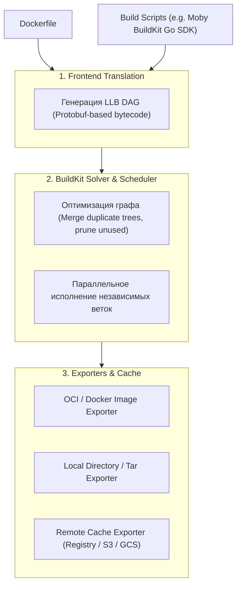
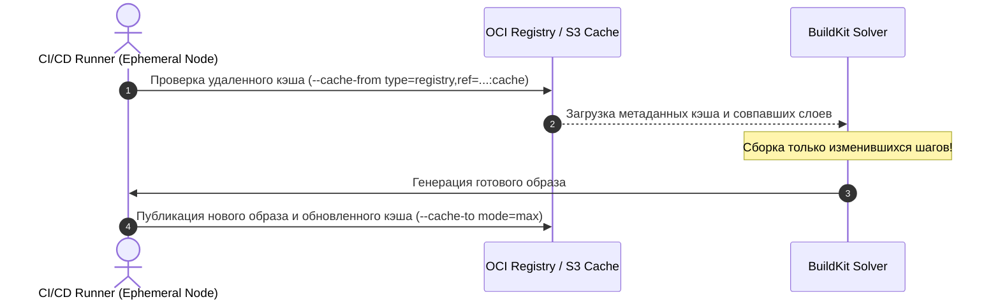

# 🚀 13. BuildKit и Docker Buildx: Архитектура LLB, Remote Cache и Bake

## 🧠 Архитектура BuildKit: LLB (Low-Level Builder)

**BuildKit** — это современный высокопроизводительный движок сборки контейнеров, пришедший на смену монолитному Legacy Builder.

В основе BuildKit лежит концепция **LLB (Low-Level Builder)** — машинно-ориентированного формата описания графа сборки в виде направленного ациклического графа (DAG - Directed Acyclic Graph).



### Ключевые преимущества BuildKit над Legacy Builder:
1. **Автоматический параллелизм:** Независимые этапы `FROM` собираются одновременно на всех доступных ядрах CPU.
2. **Пропуск неиспользуемых этапов (Pruning):** Если стадия не влияет на финальный артефакт, она не исполняется вовсе.
3. **Удаленный распределенный кэш (Remote Caching):** Возможность экспортировать кэш слоев в OCI-реестр или S3-бакет и переиспользовать его между разными CI-раннерами без прогрева локального диска.
4. **Безопасные секреты и SSH:** Монтирование без сохранения следов в истории слоев.

---

## 🛠️ 1. Управление сборщиками: `docker buildx`

`buildx` — это CLI-плагин Docker, расширяющий возможности сборки с поддержкой драйверов, кросс-платформенности и распределенных нод.

### Драйверы сборщиков Buildx:
- **`docker` (default):** Использует встроенный в локальный демон BuildKit. Не поддерживает Multi-Arch экспорт в локальный хранилище образов без push.
- **`docker-container`:** Запускает выделенный контейнер с демоном `buildkitd`. Поддерживает полный параллелизм, multi-arch и удаленный кэш.
- **`kubernetes`:** Разворачивает поды с `buildkitd` в Kubernetes кластере для динамического масштабирования сборок.
- **`remote`:** Подключение к уже запущенному внешнему инстансу BuildKit через mTLS.

```bash
# 1. Создание нового изолированного инстанса сборщика
docker buildx create \
  --name enterprise-builder \
  --driver docker-container \
  --driver-opt network=host \
  --bootstrap \
  --use

# 2. Проверка статуса сборщика и поддерживаемых платформ
docker buildx inspect enterprise-builder
```

---

## ☁️ 2. Удаленное кэширование в CI/CD (Remote Cache Exporters)

В современных эфемерных CI/CD раннерах (GitHub Actions, GitLab Runner в k8s) каждый запуск происходит на чистой виртуальной машине. Без удаленного кэша каждый билд собирается с нуля.

BuildKit поддерживает экспорт кэша слоев в удаленные хранилища через `--cache-to` и `--cache-from`.



### Типы кэш-экспортеров:

#### А. Реестр OCI (`type=registry`) — Рекомендуемый вариант
```bash
docker buildx build \
  --platform linux/amd64,linux/arm64 \
  --cache-from type=registry,ref=registry.example.com/app:buildcache \
  --cache-to type=registry,ref=registry.example.com/app:buildcache,mode=max,image-manifest=true \
  --tag registry.example.com/app:v1.2.3 \
  --push .
```
> [!IMPORTANT]
> **Параметр `mode=max`:**
> - `mode=min` (дефолт): Сохраняет в кэш слои **только финального этапа**.
> - `mode=max`: Экспортирует в кэш промежуточные слои **всех этапов (включая builder, test, lint)**. Обязателен для эффективных Multi-stage сборок!

#### Б. Локальный кэш директории (`type=local`) — Для GitHub Actions Cache
```bash
docker buildx build \
  --cache-from type=local,src=/tmp/.buildx-cache \
  --cache-to type=local,dest=/tmp/.buildx-cache-new,mode=max \
  --tag myapp:latest \
  --load .
```

#### В. S3 / GCS бакеты (`type=s3`, `type=gha`)
```bash
# Использование встроенного кэша GitHub Actions
docker buildx build \
  --cache-from type=gha \
  --cache-to type=gha,mode=max \
  --push -t ghcr.io/org/app:latest .
```

---

## 🍳 3. Декларативная оркестрация сборок: `docker buildx bake`

`docker buildx bake` — это аналог Docker Compose, но предназначенный исключительно для сборки сложных матриц образов, микросервисных репозиториев и мультитенантных сред.

Конфигурация объявляется в файле `docker-bake.hcl` (или `docker-compose.yml`, `bake.json`).

### Production пример `docker-bake.hcl`:
```hcl
variable "TAG" {
  default = "latest"
}

variable "REGISTRY" {
  default = "registry.company.internal"
}

group "default" {
  targets = ["api", "worker", "frontend"]
}

# Базовый абстрактный таргет для переиспользования настроек
target "_common" {
  platforms = ["linux/amd64", "linux/arm64"]
  cache-from = ["type=registry,ref=${REGISTRY}/cache/common:buildcache"]
  cache-to = ["type=registry,ref=${REGISTRY}/cache/common:buildcache,mode=max"]
  args = {
    BUILD_DATE = "${timestamp()}"
  }
}

target "api" {
  inherits = ["_common"]
  context = "."
  dockerfile = "deploy/Dockerfile.api"
  tags = [
    "${REGISTRY}/services/api:${TAG}",
    "${REGISTRY}/services/api:latest"
  ]
}

target "worker" {
  inherits = ["_common"]
  context = "."
  dockerfile = "deploy/Dockerfile.worker"
  tags = [
    "${REGISTRY}/services/worker:${TAG}"
  ]
}

target "frontend" {
  inherits = ["_common"]
  context = "./frontend"
  dockerfile = "Dockerfile"
  tags = [
    "${REGISTRY}/services/frontend:${TAG}"
  ]
}
```

### Запуск параллельной сборки через Bake:
```bash
# Параллельная сборка всех таргетов группы default с одновременным push
TAG=v2.4.0 docker buildx bake --push
```

---

## 💥 4. Реальный Troubleshooting

### Сценарий 1: Ошибка `ERROR: failed to solve: failed to push cache` при использовании AWS ECR
**Симптомы:** Сборка падает на этапе экспорта кэша в ECR: `failed to push cache: unexpected status 400 Bad Request`.

**Причина:** Реестр AWS ECR требует предварительного создания репозитория для кэша (`registry/cache/app`), а также поддержки OCI Image Index.

**Решение:**
1. Создать репозиторий в ECR:
   ```bash
   aws ecr create-repository --repository-name app-cache --image-tag-mutability MUTABLE
   ```
2. Добавить флаг `image-manifest=true` и `oci-mediatypes=true`:
   ```bash
   --cache-to type=registry,ref=$ECR_URL/app-cache:cache,mode=max,image-manifest=true,oci-mediatypes=true
   ```

---

### Сценарий 2: Разрастание кэша BuildKit и переполнение диска ноды сборщика
**Симптомы:** Диск на сервере сборки забивается на 100%, `buildkitd` падает с ошибкой `disk space exhausted`.

**Причина:** По умолчанию BuildKit сохраняет локальные снапшоты и историю слоев без жестких лимитов.

**Диагностика и решение:**
1. Просмотр занятого дискового пространства BuildKit:
   ```bash
   docker buildx du
   ```
2. Очистка кэша сборщика:
   ```bash
   docker buildx prune -a -f --keep-storage 10GB
   ```
3. Ограничение размера кэша в конфигурации BuildKit `/etc/buildkit/buildkitd.toml`:
   ```toml
   [worker.oci]
     enabled = true
     gckeepstorage = "20GB"

     [worker.oci.gcpolicy]
       keepBytes = "20GB"
       keepDuration = "168h" # 7 дней
       filters = ["type==source.local", "type==exec.cachemount"]
   ```
