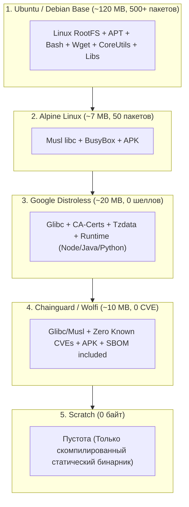

# 🪶 14. Минималистичные образы: Scratch, Distroless, Chainguard и Alpine

## 🛡️ Концепция минимизации поверхности атаки (Attack Surface Reduction)

Большинство традиционных базовых образов (Ubuntu, Debian, CentOS) содержат в себе сотни системных утилит: `curl`, `wget`, `bash`, `sed`, `tar`, `apt`, `systemd-libs`. Для работы скомпилированного Go/Rust или Java приложения эти утилиты в продакшне **не нужны**.

Наличие шеллов и утилит загрузки файлов в рантайме:
1. Облегчает злоумышленнику удаленное исполнение кода (RCE) и загрузку вредоносных бинарников (майнеры, бэкдоры через `curl | sh`).
2. Приводит к появлению сотен CVE (уязвимостей) в отчетах безопасности сканеров (Trivy, Grype), подавляющее большинство которых относится к неиспользуемым системным библиотекам.



---

## 📊 1. Сравнительный анализ базовых образов

| Характеристика | `scratch` | `alpine` | `gcr.io/distroless` | `chainguard/static` | `debian:slim` |
| :--- | :--- | :--- | :--- | :--- | :--- |
| **Размер базы** | **0 Б** | ~7 МБ | ~2–30 МБ | ~5–20 МБ | ~80 МБ |
| **C-библиотека** | Отсутствует | `musl libc` | `glibc` | `glibc` или `musl` | `glibc` |
| **Шелл (`/bin/sh`)** | ❌ Нет | ✅ Есть (BusyBox) | ❌ Нет (есть `-debug`) | ❌ Нет (есть `:latest-dev`)| ✅ Есть (Bash/Dash) |
| **Пакетный менеджер**| ❌ Нет | ✅ `apk` | ❌ Нет | ❌ Нет (в проде) | ✅ `apt` |
| **Совместимость CGO**| Только Static | ⚠️ Возможны сбои `musl`| ⚡ 100% (Glibc) | ⚡ 100% | ⚡ 100% |
| **Среднее число CVE**| **0** | Низкое (1-5) | Минимальное (0-2) | **0 гарантировано** | Среднее (20-60) |

---

## 🔬 2. Специфика каждого решения

### 2.1. Базовый образ `FROM scratch`
`scratch` — это специальное зарезервированное ключевое слово Docker, обозначающее абсолютно пустую файловую систему. Идеально подходит для статических бинарников на **Go, Rust, C++**.

> [!WARNING]
> Если ваше приложение совершает HTTPS-запросы к внешним API или работает с локализованным временем, в `scratch` обязательно нужно скопировать **корневые SSL-сертификаты** (`/etc/ssl/certs/ca-certificates.crt`) и **таблицы временных зон** (`/usr/share/zoneinfo`).

#### Пример: Go на `scratch` с сертификатами
```dockerfile
# syntax=docker/dockerfile:1.7
FROM golang:1.22-alpine AS builder
RUN apk add --no-cache ca-certificates tzdata
WORKDIR /src
COPY go.mod go.sum ./
RUN go mod download
COPY . .
RUN CGO_ENABLED=0 GOOS=linux go build -ldflags="-s -w" -o /bin/app .

FROM scratch
# Копирование сертификатов и временных зон
COPY --from=builder /etc/ssl/certs/ca-certificates.crt /etc/ssl/certs/
COPY --from=builder /usr/share/zoneinfo /usr/share/zoneinfo
COPY --from=builder /bin/app /app

# Использование непривилегированного пользователя (nobody: 65534)
USER 65534:65534
ENTRYPOINT ["/app"]
```

---

### 2.2. Проблема Alpine Linux: `musl` vs `glibc`
Alpine использует реализацию стандартной библиотеки Си — **musl libc** вместо стандартной GNU C Library (**glibc**).

#### Подводные камни Alpine:
1. **Проблемы с производительностью аллокатора памяти:** Дефолтный аллокатор musl libc медленнее работает в многопоточных высоконагруженных сценариях по сравнению с `ptmalloc` в glibc (критично для Python C-extensions, C++ воркеров).
2. **DNS Resolving:** Исторически musl не поддерживал EDNS0 и параллельные запросы к IPv4/IPv6, что вызывало таймауты в Kubernetes CoreDNS.
3. **Бинарные Python Wheels:** Пакеты PyPI (`numpy`, `pandas`, `grpcio`), скомпилированные под `manylinux_glibc`, при установке в Alpine вынуждены компилироваться из исходников часами.

---

### 2.3. Google Distroless
Distroless-образы от Google содержат только ваше приложение и его рантайм-зависимости (`glibc`, `libssl`, `ca-certificates`, `tzdata`). В них **нет пакетных менеджеров и шеллов**.

Доступные образы:
- `gcr.io/distroless/static-debian12` (для Go, Rust)
- `gcr.io/distroless/base-debian12` (для C/C++, glibc)
- `gcr.io/distroless/nodejs20-debian12` (для NodeJS)
- `gcr.io/distroless/java21-debian12` (для Java)
- `gcr.io/distroless/python3-debian12` (для Python)

#### Пример: NodeJS на Distroless
```dockerfile
# syntax=docker/dockerfile:1.7
FROM node:20-bookworm AS builder
WORKDIR /app
COPY package*.json ./
RUN npm ci
COPY . .
RUN npm run build && npm prune --production

FROM gcr.io/distroless/nodejs20-debian12:nonroot
WORKDIR /app
COPY --from=builder --chown=nonroot:nonroot /app/node_modules ./node_modules
COPY --from=builder --chown=nonroot:nonroot /app/dist ./dist

EXPOSE 3000
CMD ["dist/index.js"]
```

---

### 2.4. Chainguard Images (Wolfi OS)
Chainguard — это современный дистрибутив **Wolfi Linux**, разработанный специально для контейнерной безопасности:
- Обновляется ежедневно.
- Декларирует **0 известных уязвимостей (Zero Known CVEs)**.
- Каждый образ поставляется с криптографически подписанным **SBOM** в формате SPDX.

```dockerfile
FROM cgr.dev/chainguard/python:latest
WORKDIR /app
COPY requirements.txt .
RUN pip install -r requirements.txt --user
COPY app.py .
ENTRYPOINT ["python", "app.py"]
```

---

## 🛠️ 3. Как отлаживать контейнеры без шелла (Distroless Debugging)

В Distroless и Scratch образах нет `/bin/sh` и `cat`. Попытка выполнить `docker exec -it <id> sh` завершится ошибкой:
`OCI runtime exec failed: exec: "sh": executable file not found in $PATH`.

### Способ 1: Использование отладочного тега `:debug` (Distroless Debug)
У каждого distroless-образа есть тег `:debug`, содержащий BusyBox шелл в `/busybox/sh`:
```dockerfile
FROM gcr.io/distroless/base-debian12:debug
```
Вход в контейнер:
```bash
docker exec -it <CONTAINER_ID> /busybox/sh
```

### Способ 2: Подключение через пространство имен процессов (`docker run --pid=container`)
Запуск утилитарного контейнера с полным набором инструментов (curl, strace, gdb, tcpdump), подключенного к пространству имен целевого контейнера:

```bash
# Подключение к сетевому и процессному namespace целевого distroless-контейнера
docker run --rm -it \
  --pid=container:target-distroless-app \
  --net=container:target-distroless-app \
  --cap-add=SYS_PTRACE \
  nicolaka/netshoot /bin/bash
```
Внутри netshoot:
```bash
# Мы видим процессы целевого контейнера!
ps aux
# Можем трассировать сетевой трафик целевого контейнера
tcpdump -nn -i any
# Можем снимать системные вызовы процесса
strace -p 1
```

### Способ 3: Ephemeral Debug Containers в Kubernetes
```bash
kubectl debug -it pod/distroless-pod-123 \
  --image=nicolaka/netshoot \
  --target=app-container
```

---

## 💥 4. Реальный Troubleshooting

### Сценарий 1: Go-бинарник падает в scratch с `no such file or directory`
**Симптомы:** Бинарник скопирован в `scratch`, путь верный, права 0755, но при старте выдает:
`standard_init_linux.go: exec: "/app": no such file or directory`.

**Причина:** Бинарник был скомпилирован с включенным **CGO** (`CGO_ENABLED=1`) и требует динамический линковщик `ld-linux-x86-64.so.2` и `libc.so.6`, которых нет в пустом `scratch`.

**Диагностика:**
```bash
file mybinary
# OUTPUT: ELF 64-bit LSB executable, dynamically linked, interpreter /lib64/ld-linux-x86-64.so.2
```

**Решение:**
Отключить CGO и принудительно собрать статический бинарник:
```bash
CGO_ENABLED=0 go build -ldflags="-s -w -extldflags '-static'" -o /bin/app .
```
Проверка:
```bash
file /bin/app
# OUTPUT: ELF 64-bit LSB executable, statically linked, stripped
```
