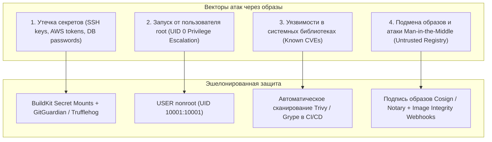
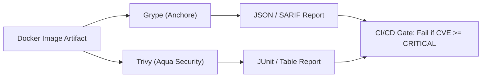

# 🔒 15. Безопасность образов и Управление Секретами

## 🛡️ Угрозы безопасности контейнерных образов

Контейнерный образ — это неизменяемый артефакт, который развертывается на сотнях серверов. Ошибки при проектировании Dockerfile и пайплайнов сборки могут привести к компрометации всей корпоративной инфраструктуры.



---

## 🚫 1. Антипаттерны работы с секретами

### ❌ Антипаттерн 1: Передача секрета через `ARG` или `ENV`
```dockerfile
# КАТАСТРОФА: Секрет навсегда останется в метаданных образа!
ARG AWS_SECRET_ACCESS_KEY
ENV AWS_SECRET_ACCESS_KEY=${AWS_SECRET_ACCESS_KEY}
RUN download-private-data.sh
```
Любой пользователь с доступом к образу выполнит `docker history --no-trunc` или `docker inspect` и увидит ваш ключ в открытом виде!

### ❌ Антипаттерн 2: Запись и последующее удаление файла
```dockerfile
# КАТАСТРОФА: Секрет остается в промежуточном слое Layer 1!
COPY id_rsa /root/.ssh/id_rsa
RUN git clone git@github.com:company/secret.git && rm -rf /root/.ssh
```

### ✅ Безопасный подход: `RUN --mount=type=secret`
Секрет существует только в оперативной памяти во время работы конкретной команды:
```dockerfile
# syntax=docker/dockerfile:1.7
FROM alpine:3.19
RUN --mount=type=secret,id=aws_token \
    AWS_SECRET_KEY=$(cat /run/secrets/aws_token) ./fetch-assets.sh
```

---

## 👤 2. Non-Root Containers: Принцип работы

По умолчанию процессы внутри Docker запускаются с `UID 0 (root)`. Если процесс скомпрометирован через RCE-уязвимость, а ядро Linux имеет неисправленный баг (например, Dirty COW, OverlayFS privilege escalation), атакующий мгновенно получает **полный root-доступ к хостовой ноде**.

### Создание выделенного системного пользователя:
```dockerfile
FROM alpine:3.19

# Создание группы и пользователя с фиксированными явными UID/GID
RUN addgroup -g 10001 -S appgroup && \
    adduser -u 10001 -S appuser -G appgroup -s /sbin/nologin

WORKDIR /app
COPY --chown=appuser:appgroup . .

# Переключение контекста на non-root
USER 10001:10001

EXPOSE 8080
ENTRYPOINT ["./my-app"]
```

> [!IMPORTANT]
> **Почему указывать `USER 10001:10001` (числовые UID), а не `USER appuser`?**
> Kubernetes admission контроллеры (Pod Security Standards / Kyverno) проверяют безопасность полей `runAsNonRoot: true` и `runAsUser` **до** запуска контейнера. Если в Dockerfile указано текстовое имя `appuser`, K8s не может прочитать `/etc/passwd` до старта и может отклонить запуск пода.

---

## 🔍 3. Сканеры уязвимостей: Grype и Trivy

Для проверки образов в CI/CD пайплайнах используются статические анализаторы:



### Сравнение и запуск Grype и Trivy:

```bash
# 1. Сканирование через Grype
# Блокировать пайплайн при наличии критических уязвимостей
grype myregistry.com/app:1.0 --fail-on critical --only-fixed

# 2. Сканирование секретов в слоях через Trivy
trivy image --security-checks secret,vuln myregistry.com/app:1.0

# 3. Генерация отчета SARIF для интеграции с GitHub Security Tab
trivy image --format sarif --output results.sarif myregistry.com/app:1.0
```

---

## 🔎 4. Детекция утечек секретов: TruffleHog

Перед сборкой образов исходный код и история коммитов проверяются сканерами энтропии и сигнатур секретов:

```bash
# Поиск приватных ключей, токенов AWS, Slack, GCP в репозитории
trufflehog git file://. --since-commit HEAD~5 --fail
```

---

## 📋 5. Чек-лист безопасности Dockerfile (Production Checklist)

1. [ ] Включен парсер `# syntax=docker/dockerfile:1`.
2. [ ] Используются проверенные базовые образы с фиксацией по Digest (`FROM alpine@sha256:...`).
3. [ ] В образе нет утилит сборки, компиляторов и тестовых фреймворков (используется Multi-stage).
4. [ ] Контейнер работает от непривилегированного пользователя (`USER 10001:10001`).
5. [ ] Все секреты передаются исключительно через `--mount=type=secret` или Secret Manager рантайма (Vault, K8s Secrets).
6. [ ] Директория приложения защищена правами доступа (только чтение `0555` или `0444`, запись только в `/tmp`).
7. [ ] Присутствует `.dockerignore`, исключающий `.git`, `.env`, ключи и токены.
8. [ ] Образ проверен Trivy/Grype на отсутствие незакрытых CVE со статусом High/Critical.
9. [ ] Образ подписан через Cosign.

---

## 💥 6. Реальный Troubleshooting

### Сценарий 1: Секрет попал в Git и закэшировался в слое образа
**Симптомы:** Разработчик случайно добавил `.env` с боевыми паролями в коммит, затем удалил его следующим коммитом и запушил образ в публичный реестр.

**Причина:** Образы Docker хранят неизменяемую историю всех слоев.

**Решение (Emergency Response Plan):**
1. **Немедленно отозвать и перегенерировать все скомпрометированные ключи и пароли** (удаление коммита не спасает, так как ключи уже могли быть выкачаны ботами сканирования).
2. Очистить Git-историю утилитой `git-filter-repo` или `BFG Repo-Cleaner`.
3. Принудительно удалить теги образов из реестра и запустить Docker Registry Garbage Collection.
4. Добавить pre-commit хуки с `trufflehog` для всех разработчиков.
