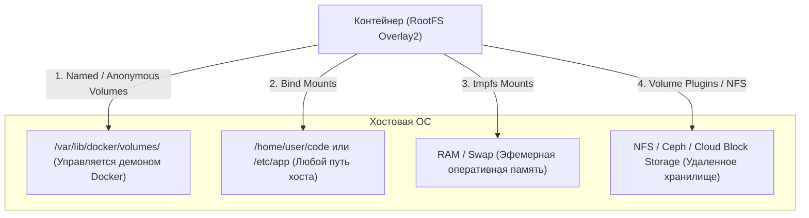
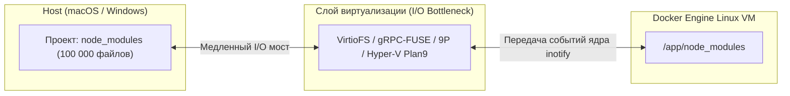
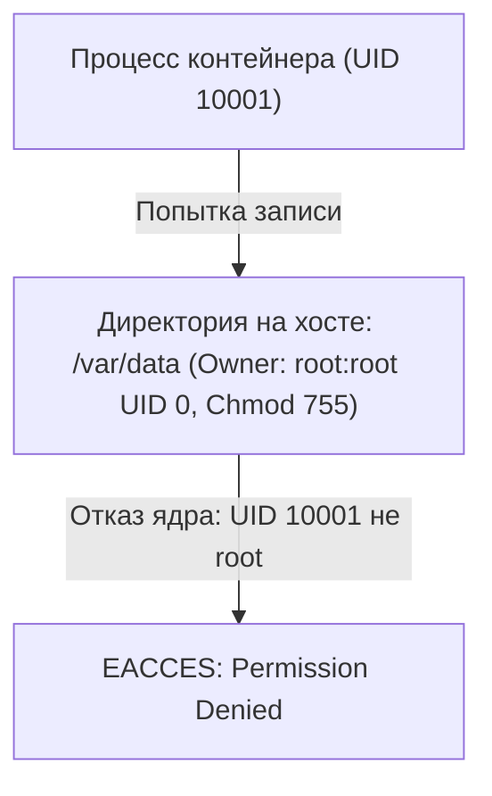

# 💾 16. Тома, Bind Mounts и Tmpfs: Архитектура хранения и Производительность

## 🏗️ 1. Типы монтирования в Docker

Docker предоставляет 4 способа передачи файловых данных внутрь контейнера:



### Сравнительная таблица механизмов монтирования:

| Тип монтирования | Где физически хранятся данные | Управляется Docker? | Производительность I/O (Linux) | Основное применение |
| :--- | :--- | :--- | :--- | :--- |
| **Named Volume** | `/var/lib/docker/volumes/<name>/_data` | ✅ Да (`docker volume`) | ⚡ Нативная (100%) | Базы данных, персистентное состояние, продакшн |
| **Anonymous Volume** | `/var/lib/docker/volumes/<random_uuid>/_data`| ✅ Да (но сложно отслеживать)| ⚡ Нативная (100%) | Временные кэши, директива `VOLUME` в Dockerfile |
| **Bind Mount** | Любой существующий путь хоста (`/mnt/...`) | ❌ Нет (хостовые права) | ⚡ Нативная (100%) | Разработка (Live reload), проброс сокетов (`docker.sock`) |
| **`tmpfs` Mount** | Оперативная память ядра (RAM) | ✅ Да (не пишется на диск)| 🚀 Сверхбыстрая (RAM) | Секретные токены, временные сессии, предотвращение износа SSD |

---

## ⚙️ 2. Механика Named Volumes и Volume Drivers

Named Volumes полностью изолированы от структуры хостовой ОС и управляются через API Docker. 

### Использование сторонних драйверов: NFS Mount
Docker умеет монтировать сетевые хранилища (NFS, AWS EFS, GlusterFS) напрямую без предварительного монтирования на хосте:

```bash
# Создание тома с подключением к удаленному NFS-серверу
docker volume create \
  --driver local \
  --opt type=nfs \
  --opt o=addr=192.168.1.100,rw,nfsvers=4,noatime \
  --opt device=:/srv/nfs/shared_data \
  nfs-app-volume
```

Подключение в `docker-compose.yml`:
```yaml
version: '3.8'

services:
  app:
    image: my-app:prod
    volumes:
      - nfs-data:/data

volumes:
  nfs-data:
    driver: local
    driver_opts:
      type: "nfs"
      o: "addr=192.168.1.100,rw,nfsvers=4,noatime"
      device: ":/srv/nfs/shared_data"
```

---

## ⚡ 3. Проблема производительности Bind Mounts на macOS и Windows

На чистом Linux bind mounts работают с нативной скоростью файловой системы (нет накладных расходов).

Однако на **macOS и Windows** Docker работает внутри виртуальной машины LinuxKit (Hyper-V / Virtualization Framework / WSL2). Передача файловых событий и операций I/O между хостом и VM создает огромные задержки (в 10–50 раз медленнее, чем на native Linux).



### Как ускорить I/O на macOS/Windows:
1. **VirtioFS:** Включить VirtioFS в настройках Docker Desktop (Preferences $\rightarrow$ General $\rightarrow$ Virtual file sharing system $\rightarrow$ VirtioFS).
2. **Изоляция `node_modules` через анонимный том:**
   Не монтировать тяжелые папки зависимостей с хоста, а перекрывать их быстрым внутренним томом Linux VM:
   ```yaml
   services:
     web:
       image: node:20
       volumes:
         - .:/app # Исходники с хоста
         - /app/node_modules # Анонимный том внутри Linux VM (быстрый доступ)
   ```
3. **Использование WSL2 (на Windows):** Хранить проект внутри Linux-дистрибутива (`\\wsl$\Ubuntu\home\...`), а не на Windows-дисках (`/mnt/c/...`).

---

## 🔒 4. Права доступа и UID/GID (Permissions Issue)

Одна из самых частых проблем: контейнер запускается от `USER 10001:10001`, монтирует bind mount из `/var/data` хоста и падает с ошибкой:
`Permission denied: open /var/data/app.log`.



### Решения проблемы прав доступа:

#### Вариант А: Запуск с динамическим UID хоста (для локальной разработки)
```bash
docker run -it --rm \
  -u $(id -u):$(id -g) \
  -v $(pwd):/workspace \
  node:20 npm install
```

#### Вариант Б: Init-контейнер для исправления прав (в Kubernetes / Compose)
```yaml
services:
  init-fix-perms:
    image: alpine:3.19
    command: ["chown", "-R", "10001:10001", "/data"]
    volumes:
      - app-storage:/data

  app:
    image: my-service:prod
    user: "10001:10001"
    volumes:
      - app-storage:/data
    depends_on:
      init-fix-perms:
        condition: service_completed_successfully

volumes:
  app-storage:
```

---

## 📦 5. Резервное копирование и Восстановление Named Volumes

Так как тома хранятся в `/var/lib/docker/volumes`, их нельзя просто скопировать обычной командой `cp` во время активной записи.

### Создание бэкапа в tar.gz архив:
```bash
docker run --rm \
  -v db_data:/source:ro \
  -v $(pwd):/backup \
  alpine:3.19 \
  tar -czvf /backup/db_data_backup_$(date +%Y%m%d).tar.gz -C /source .
```

### Восстановление тома из бэкапа:
```bash
# 1. Создание нового тома
docker volume create db_data_restored

# 2. Распаковка архива в новый том
docker run --rm \
  -v db_data_restored:/target \
  -v $(pwd):/backup \
  alpine:3.19 \
  tar -xzvf /backup/db_data_backup_20260902.tar.gz -C /target
```

---

## 💥 6. Реальный Troubleshooting

### Сценарий 1: PostgreSQL падает с ошибкой `data directory has invalid permissions (0777)`
**Симптомы:** При монтировании bind mount в `/var/lib/postgresql/data` сервер БД завершает работу с ошибкой:
`FATAL: data directory "/var/lib/postgresql/data" has wrong ownership or permissions. Permissions must be u=rwx (0700) or u=rwx,g=rx (0750)`.

**Причина:** При монтировании директории с файловой системы Windows/NTFS через Docker Desktop все файлы получают права `0777`, что нарушает требования безопасности PostgreSQL.

**Решение:**
Использовать Named Volumes вместо Bind Mount для каталогов баз данных:
```yaml
services:
  postgres:
    image: postgres:16-alpine
    volumes:
      - pgdata:/var/lib/postgresql/data

volumes:
  pgdata: # Named volume управляется Linux файловой системой
```
