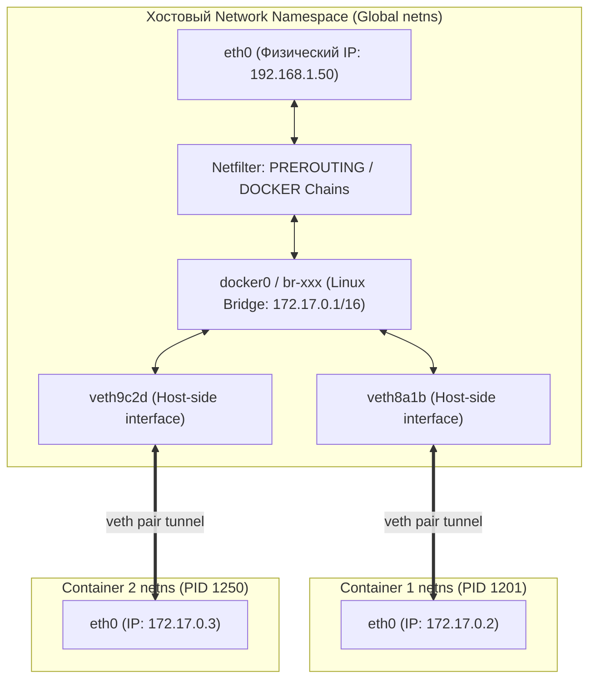
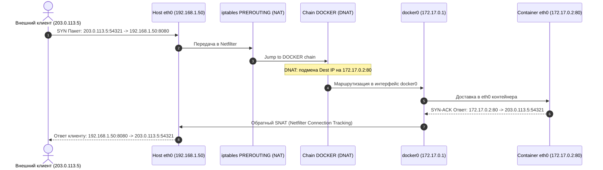

# 🌐 17. Сетевой стек Docker под капотом: Veth-пары, Netfilter/Iptables и Docker-Proxy

## 🧠 Анатомия контейнерной сети

Сетевая подсистема Docker построена на стандартных примитивах ядра Linux: **Network Namespaces (`netns`)**, виртуальных Ethernet-интерфейсах (**veth-pairs**), программных коммутаторах (**Linux Bridge**) и подсистеме фильтрации трафика **Netfilter (iptables / nftables)**.



---

## 🔬 1. Виртуальные интерфейсы: `veth` (Virtual Ethernet)

Интерфейс `veth` всегда создается парой (как двусторонний сетевой кабель):
1. Один конец пары (`veth...`) помещается в корневое пространство имен хоста и подключается к мосту `docker0`.
2. Второй конец пары перемещается в сетевой namespace контейнера и переименовывается в `eth0`.
3. Любой пакет, отправленный в `eth0` внутри контейнера, мгновенно появляется на интерфейсе `veth` хоста и передается в bridge.

### Ручное создание veth-пары и подключение к контейнеру:
```bash
# 1. Создание пары интерфейсов
sudo ip link add veth-host type veth peer name veth-guest

# 2. Назначение одного конца в bridge хоста
sudo ip link set veth-host master docker0
sudo ip link set veth-host up

# 3. Перемещение второго конца в namespace процесса контейнера
CONTAINER_PID=$(docker inspect -f '{{.State.Pid}}' my-nginx)
sudo ip link set veth-guest netns $CONTAINER_PID

# 4. Настройка IP внутри контейнера
sudo nsenter -t $CONTAINER_PID -n ip link set veth-guest name eth0
sudo nsenter -t $CONTAINER_PID -n ip addr add 172.17.0.99/16 dev eth0
sudo nsenter -t $CONTAINER_PID -n ip link set eth0 up
sudo nsenter -t $CONTAINER_PID -n ip route add default via 172.17.0.1
```

---

## 🚦 2. Проброс портов и таблицы Iptables (DNAT / SNAT)

Когда вы запускаете контейнер с флагом `-p 8080:80`, Docker конфигурирует таблицы `nat` и `filter` в подсистеме Netfilter.



### Основные цепочки iptables, создаваемые Docker:

1. **`PREROUTING` (таблица `nat`):**
   Перенаправляет входящие внешние пакеты в цепочку `DOCKER`:
   ```text
   -A PREROUTING -m addrtype --dst-type LOCAL -j DOCKER
   ```
2. **`DOCKER` (таблица `nat`):**
   Выполняет **DNAT (Destination NAT)**:
   ```text
   -A DOCKER ! -i docker0 -p tcp -m tcp --dport 8080 -j DNAT --to-destination 172.17.0.2:80
   ```
3. **`POSTROUTING` (таблица `nat`):**
   Выполняет **MASQUERADE (SNAT)** для пакетов, выходящих из контейнера в интернет:
   ```text
   -A POSTROUTING -s 172.17.0.0/16 ! -o docker0 -j MASQUERADE
   ```
4. **`FORWARD` (таблица `filter`):**
   Разрешает прохождение транзитного трафика между `docker0` и физическим интерфейсом `eth0`.

---

## 🔄 3. Hairpin NAT (NAT Loopback)

Что происходит, если контейнер `A` (или сам хост) пытается обратиться к другому контейнеру `B` **не по его внутреннему IP (172.17.0.3), а по внешнему IP хоста и проброшенному порту** (`192.168.1.50:8080`)?

1. Пакет отправляется через bridge на хост.
2. Netfilter выполняет DNAT, направляя пакет обратно в тот же bridge.
3. Чтобы ответный пакет вернулся обратно отправителю через ядро (для корректной трансляции сессии conntrack), ядро должно выполнить **Hairpin NAT** (одновременный SNAT и DNAT).
4. Режим Hairpin активируется на veth-интерфейсе: `brctl hairpin docker0 veth8a1b on`.

---

## ⚡ 4. Kernel Iptables против `docker-proxy` (Userland Proxy)

При запуске контейнера с опубликованным портом Docker по умолчанию запускает системный процесс `docker-proxy`:
```text
root 15420 0.0 0.1 docker-proxy -proto tcp -host-ip 0.0.0.0 -host-port 8080 -container-ip 172.17.0.2 -container-port 80
```

### Зачем нужен `docker-proxy`?
Исторически `docker-proxy` использовался для обработки локального трафика (`localhost:8080`), когда в ядре Linux был отключен флаг маршрутизации `net.ipv4.conf.all.route_localnet=1`.

### Проблемы `docker-proxy` в Production:
- **Утечка оперативной памяти:** На каждый открытый порт запускается отдельный процесс на Go, потребляющий ~5–10 МБ RAM. Если вы открываете диапазон портов (например, `-p 20000-20500:20000-20500`), Docker создаст 500 процессов и потратит 5 ГБ RAM впустую!
- **Падение производительности:** Переключение контекста между ядром и userspace замедляет сетевой I/O.

### Отключение Userland Proxy в `/etc/docker/daemon.json`:
```json
{
  "userland-proxy": false
}
```
При `"userland-proxy": false` вся трансляция трафика (включая обращения с `localhost`) осуществляется **на 100% внутри ядра Linux через iptables/Netfilter**, что дает колоссальный прирост производительности.

---

## 🛠️ 5. Практический сетевой Cheat Sheet

```bash
# 1. Просмотр полной таблицы правил NAT, созданных Docker
sudo iptables -t nat -L -n -v --line-numbers

# 2. Просмотр цепочки фильтрации трафика DOCKER-USER
sudo iptables -t filter -L DOCKER-USER -n -v

# 3. Трассировка сетевых соединений (Conntrack) в реальном времени
sudo conntrack -L -p tcp --orig-port-dst 8080

# 4. Просмотр привязки veth интерфейсов к bridge
ip link show master docker0
brctl show docker0

# 5. Захват пакетов на виртуальном интерфейсе конкретного контейнера
sudo tcpdump -nn -i veth8a1b -X -s 0 port 80
```

---

## 💥 6. Реальный Troubleshooting

### Сценарий 1: UFW / FirewallD ломает сетевую изоляцию Docker
**Симптомы:** Администратор настроил фаервол `ufw default deny incoming`, закрыл порт 8080 на хосте, но внешний трафик на `http://SERVER_IP:8080` продолжает свободно проходить в контейнер!

**Причина:** Docker вставляет свои цепочки iptables (`PREROUTING` / `DOCKER`) **ДО** цепочек UFW. Правила UFW в цепочке `INPUT` вообще не обрабатываются для пакетов, проходящих через DNAT в цепочку `FORWARD`!

**Решение:**
Использовать специально зарезервированную цепочку **`DOCKER-USER`**. Правила в ней выполняются перед правилами Docker:
```bash
# Запретить внешний доступ к порту 8080 для всех, кроме доверенной подсети
sudo iptables -I DOCKER-USER -p tcp --dport 80 -s 192.168.1.0/24 -j ACCEPT
sudo iptables -A DOCKER-USER -p tcp --dport 80 -j DROP
```

---

### Сценарий 2: "No route to host" между контейнерами на разных хостах
**Симптомы:** Пакеты не ходят наружу из контейнеров, `ping 8.8.8.8` не работает.

**Причина:** Отключен системный форвардинг пакетов в ядре Linux (`ip_forward=0`).

**Диагностика и устранение:**
```bash
# Проверка
sysctl net.ipv4.ip_forward
# OUTPUT: net.ipv4.ip_forward = 0

# Включение
sudo sysctl -w net.ipv4.ip_forward=1
echo "net.ipv4.ip_forward=1" | sudo tee -a /etc/sysctl.d/99-docker.conf
sudo sysctl --system
```
