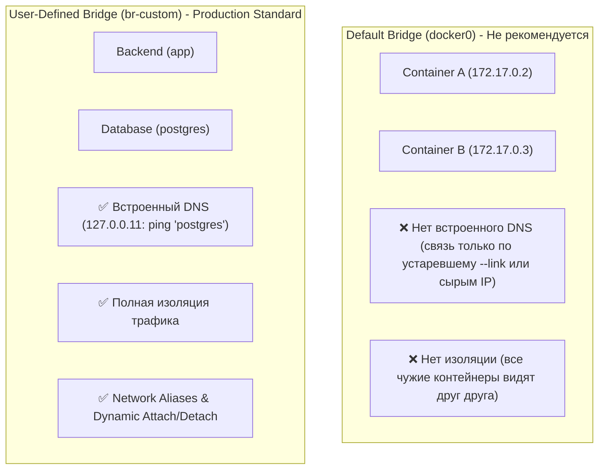
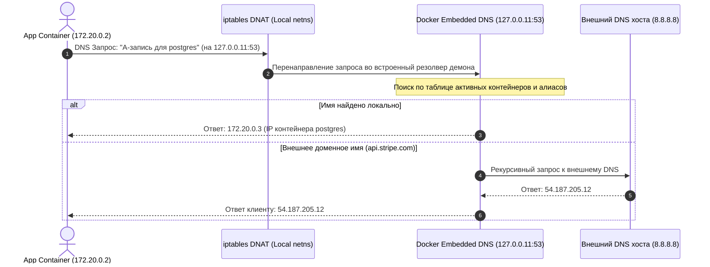
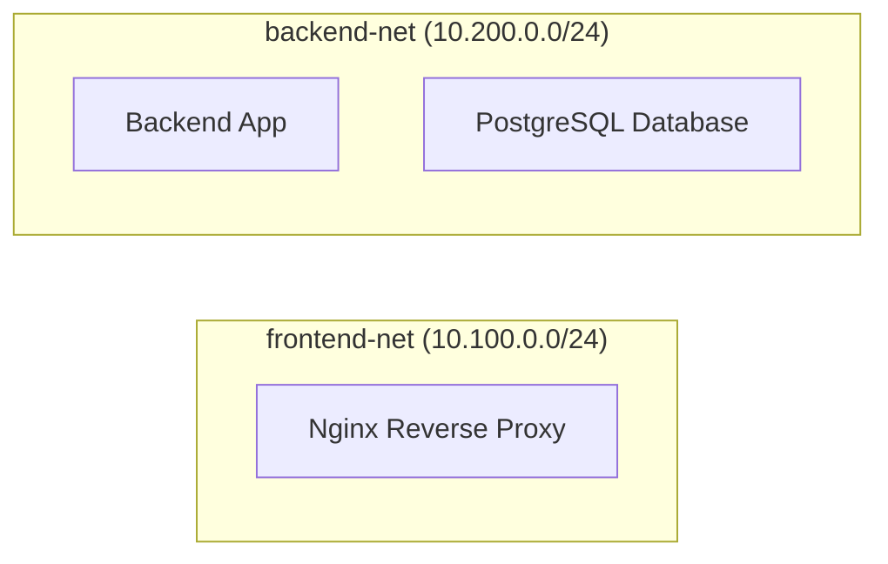

# 🌉 18. Bridge-сети и Встроенный DNS Резолвер: Default Bridge vs User-Defined Networks

## ⚖️ Default Bridge (`docker0`) против User-Defined Bridge

При установке Docker автоматически создает стандартную сеть `bridge` (мост `docker0` с дефолтной подсетью `172.17.0.0/16`). Однако в продакшне запуск контейнеров в дефолтной сети является строгим **антипаттерном**.



### Сравнительная таблица сетей:

| Возможность | Дефолтная сеть `bridge` (`docker0`) | Пользовательская сеть (`user-defined bridge`) |
| :--- | :--- | :--- |
| **Автоматический DNS-резолвинг** | ❌ **Отсутствует** (нужно знать IP) | ✅ **Встроенный DNS (`127.0.0.11`)** по именам контейнеров |
| **Изоляция окружений** | ❌ Все контейнеры в одной подсети | ✅ Полная изоляция на уровне iptables / bridge |
| **Горячее подключение/отключение** | ❌ Требуется пересоздание контейнера | ✅ `docker network connect / disconnect` на лету |
| **Сетевые псевдонимы (Aliases)** | ❌ Не поддерживаются | ✅ Поддержка нескольких алиасов (`--alias db`) |
| **Настройка параметров bridge** | ⚠️ Только глобально через `daemon.json` | ✅ Тонкая настройка MTU, подсети, шлюза на каждую сеть |

---

## 🧭 1. Внутреннее устройство Embedded DNS Resolver (`127.0.0.11`)

В любой пользовательской сети Docker внедряет специальный виртуальный DNS-сервер по адресу **`127.0.0.11`**.



### Файл `/etc/resolv.conf` внутри контейнера пользовательской сети:
```text
nameserver 127.0.0.11
options ndots:0
```
> [!NOTE]
> Запросы на `127.0.0.11:53` перехватываются правилами `PREROUTING` в `nat` таблице сетевого namespace контейнера и перенаправляются на случайный слушающий UDP/TCP сокет демона Docker.

---

## 🛠️ 2. Практика: Создание и управление сетями

### 2.1. Создание изолированной сети с кастомной адресацией и MTU
```bash
docker network create \
  --driver bridge \
  --subnet 10.150.0.0/24 \
  --gateway 10.150.0.1 \
  --opt "com.docker.network.bridge.name"="br-backend" \
  --opt "com.docker.network.bridge.enable_icc"="true" \
  --opt "com.docker.network.driver.mtu"="1450" \
  backend-net
```

### 2.2. Горячее подключение нескольких сетей (Multi-homed Containers)
Архитектурный паттерн: фронтенд-прокси подключен к `frontend-net` и `backend-net`, а база данных подключена **только к `backend-net`**, что делает базу физически недоступной из внешней сети.



Команды развертывания:
```bash
# 1. Создание сетей
docker network create frontend-net
docker network create backend-net

# 2. Запуск базы данных в backend-net
docker run -d --name db --network backend-net postgres:16-alpine

# 3. Запуск бэкенда в backend-net
docker run -d --name api --network backend-net my-api:latest

# 4. Запуск прокси в frontend-net и горячее подключение к backend-net
docker run -d --name proxy --network frontend-net -p 80:80 -p 443:443 nginx:alpine
docker network connect backend-net proxy
```

### 2.3. Сетевые псевдонимы (Network Aliasing) для балансировки
Если несколько контейнеров запущены с одинаковым сетевым псевдонимом (`--network-alias`), встроенный DNS Docker реализует простой **Round-Robin DNS**:

```bash
# Запуск двух инстансов воркера с одним алиасом
docker run -d --name worker-1 --network backend-net --network-alias search-service worker:latest
docker run -d --name worker-2 --network backend-net --network-alias search-service worker:latest

# Проверка DNS балансировки
docker run --rm --network backend-net alpine nslookup search-service
# Вернет 2 IP-адреса: 10.200.0.4 и 10.200.0.5 в случайном порядке
```

---

## 🏎️ 3. Продвинутые драйверы: MACVLAN и IPVLAN

Когда требуется подключить контейнеры напрямую к физической локальной сети предприятия (минуя NAT и iptables моста):

| Драйвер | Принцип работы | Требование к коммутатору |
| :--- | :--- | :--- |
| **MACVLAN** | Каждому контейнеру выделяется собственный уникальный MAC-адрес и IP из физической сети | Коммутатор должен поддерживать режим **Promiscuous Mode** (много MAC на одном порту) |
| **IPVLAN L2** | Все контейнеры делят один MAC-адрес физической сетевой карты, но имеют уникальные IP | Не требует Promiscuous Mode (работает в облаках и на Wi-Fi) |
| **IPVLAN L3** | Маршрутизация на 3 уровне без broadcast трафика | Требуется настройка маршрутов на роутере сети |

### Пример создания MACVLAN сети:
```bash
docker network create -d macvlan \
  --subnet=192.168.1.0/24 \
  --gateway=192.168.1.1 \
  -o parent=eth0 \
  phys-net

docker run -d --name direct-app --network phys-net --ip 192.168.1.200 nginx:alpine
```

---

## 💥 4. Реальный Troubleshooting

### Сценарий 1: Контейнер не может разрезолвить внешние домены (DNS 5-second delay)
**Симптомы:** Запросы из контейнера к внешним хостам (например, `curl https://api.github.com`) зависают ровно на 5 секунд.

**Причина:** Встроенный DNS Docker отправляет параллельные A и AAAA запросы. Если upstream DNS сервер хоста (или роутер) криво обрабатывает IPv6 AAAA запросы или сбрасывает UDP пакеты без ответа, срабатывает таймаут glibc резолвера (5 секунд).

**Диагностика:**
```bash
# Тест резолвинга с замером времени
docker run --rm --network backend-net alpine time nslookup api.github.com
```

**Решение:**
1. Явно задать надежные DNS-серверы в `/etc/docker/daemon.json`:
   ```json
   {
     "dns": ["1.1.1.1", "8.8.8.8"],
     "dns-opts": ["timeout:2", "attempts:3"]
   }
   ```
2. Перезапустить демон Docker: `sudo systemctl restart docker`.

---

### Сценарий 2: Контейнеры в разных сетях пытаются общаться и падают с Connection Refused
**Симптомы:** Микросервис `auth-service` не может достучаться до `redis` по имени хоста `redis`.

**Причина:** Контейнеры находятся в разных Docker-сетях, созданных в разных compose-файлах, без явного объединения в общую сеть.

**Диагностика:**
```bash
# Проверить список сетей, к которым подключен контейнер
docker inspect -f '{{range $k, $v := .NetworkSettings.Networks}}{{$k}} {{end}}' auth-service
docker inspect -f '{{range $k, $v := .NetworkSettings.Networks}}{{$k}} {{end}}' redis
```

**Решение:**
Подключить оба сервиса к общей внешней сети:
```bash
docker network connect shared-backend-net auth-service
```
