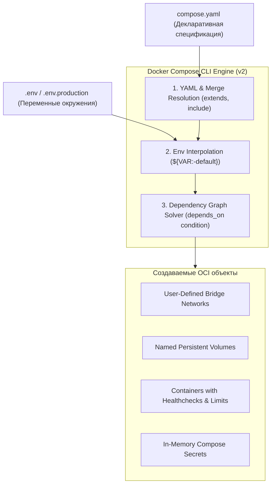
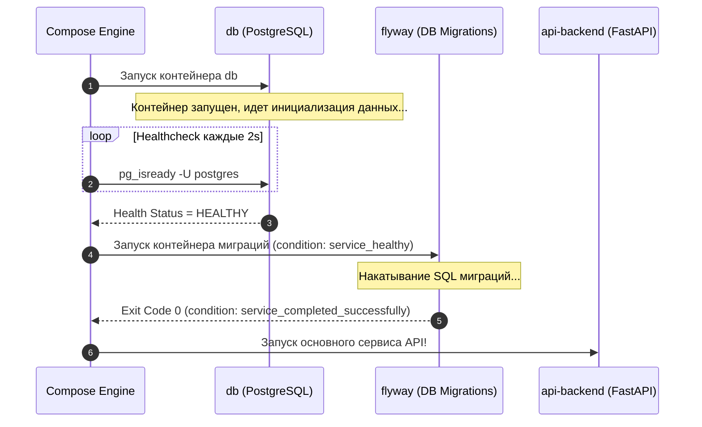

# 🐙 19. Docker Compose Specification: Глубокое погружение, Зависимости и Интерполяция

## 📜 Compose Specification (Compose V2)

**Compose Specification** — это открытый стандарт для декларативного описания мультиконтейнерных приложений. Начиная с Compose V2 (написан на Go и интегрирован в Docker CLI как `docker compose`, в отличие от устаревшего Python-скрипта `docker-compose`), спецификация отказалась от обязательного версионирования схемы (строка `version: '3.8'` больше не требуется).



---

## ⏳ 1. Управление порядком старта и проверка готовности: `depends_on`

Традиционный `depends_on: ["db"]` гарантирует только факт вызова `docker start db`, но **не гарантирует готовность** базы данных принимать TCP-соединения. Это приводило к сбоям приложения (`Connection refused`).

В Compose V2 используется расширенная форма `depends_on` с условиями готовности (**`condition: service_healthy`** и **`condition: service_completed_successfully`**).



### Конфигурация правильного пайплайна запуска:
```yaml
services:
  db:
    image: postgres:16-alpine
    environment:
      POSTGRES_DB: appdb
      POSTGRES_USER: appuser
      POSTGRES_PASSWORD_FILE: /run/secrets/db_password
    secrets:
      - db_password
    volumes:
      - pgdata:/var/lib/postgresql/data
    healthcheck:
      test: ["CMD-SHELL", "pg_isready -U appuser -d appdb"]
      interval: 5s
      timeout: 3s
      retries: 5
      start_period: 10s

  db-migrate:
    image: migrate/migrate:v4.17.0
    volumes:
      - ./migrations:/migrations
    command: ["-path=/migrations", "-database", "postgres://appuser:secret@db:5432/appdb?sslmode=disable", "up"]
    depends_on:
      db:
        condition: service_healthy
        restart: true

  backend:
    image: my-backend-api:1.0
    environment:
      DATABASE_URL: postgres://appuser:secret@db:5432/appdb
    ports:
      - "8080:8080"
    depends_on:
      db:
        condition: service_healthy
      db-migrate:
        condition: service_completed_successfully

volumes:
  pgdata:

secrets:
  db_password:
    file: ./secrets/db_password.txt
```

---

## 🔤 2. Механика интерполяции переменных окружения

Compose поддерживает сложные шаблоны подстановки переменных окружения:

| Синтаксис | Поведение |
| :--- | :--- |
| `${VARIABLE}` | Подставляет значение. Если переменная не задана — пустая строка. |
| `${VARIABLE:-default}` | Если переменная не задана или пуста, использовать `default`. |
| `${VARIABLE-default}` | Использовать `default`, только если переменная вообще не объявлена в окружении. |
| `${VARIABLE:?error_message}` | Если переменная не задана, завершить работу с фатальной ошибкой `error_message`. |
| `${VARIABLE:+replacement}` | Если переменная задана, подставить `replacement`, иначе пустоту. |
| `$${ESCAPED}` | Экранирование символа доллара (подставится строка `${ESCAPED}`). |

### Приоритет загрузки переменных (от наивысшего к низшему):
1. **Переменные, переданные в командной строке:** `TAG=v2 docker compose up`
2. **Переменные хостового шелла (Host Environment):** `export TAG=v1`
3. **Файл окружения, указанный через флаг CLI:** `docker compose --env-file .env.custom up`
4. **Файл `.env` в корне проекта.**
5. **Секция `environment:` внутри сервиса.**
6. **Секция `env_file:` внутри сервиса.**
7. **Значение `ENV` / `ARG` из Dockerfile.**

---

## 🔐 3. Управление секретами и конфигами в Compose

В отличие от передачи паролей в `environment:` (которые видны через `docker inspect`), секция `secrets:` монтирует данные в память контейнера по пути `/run/secrets/<secret_name>`.

```yaml
services:
  web:
    image: nginx:alpine
    configs:
      - source: nginx_conf
        target: /etc/nginx/nginx.conf
        mode: 0444
    secrets:
      - source: ssl_certificate
        target: /etc/ssl/certs/server.crt
      - source: ssl_private_key
        target: /etc/ssl/private/server.key
        mode: 0400

configs:
  nginx_conf:
    file: ./config/nginx.conf

secrets:
  ssl_certificate:
    file: ./certs/tls.crt
  ssl_private_key:
    file: ./certs/tls.key
```

---

## 🛠️ 4. Практический Cheat Sheet Compose V2

```bash
# 1. Запуск всех сервисов в фоне с пересборкой образов
docker compose up -d --build

# 2. Проверка статуса сервисов и результатов Healthchecks
docker compose ps

# 3. Интерактивный просмотр цветных логов с таймстемпами
docker compose logs -f -t --tail=50 backend

# 4. Выполнение одноразовой команды с переопределением портов и зависимостей
docker compose run --rm --no-deps backend python manage.py createsuperuser

# 5. Валидация и просмотр итогового скомпилированного YAML (после резолва env)
docker compose config

# 6. Остановка с удалением анонимных томов и сетей
docker compose down -v --remove-orphans
```

---

## 💥 5. Реальный Troubleshooting

### Сценарий 1: Docker Compose не подхватывает изменения в `.env` файле
**Симптомы:** Разработчик изменил `API_KEY` в файле `.env`, выполнил `docker compose up -d`, но контейнер продолжает работать со старым ключом.

**Причина:** 
1. В хостовом шелле была выполнена команда `export API_KEY=old`, которая имеет более высокий приоритет, чем файл `.env`.
2. Демон Compose не пересоздает контейнер, если конфигурация самого сервиса (в представлении Docker Engine) не изменилась.

**Решение:**
1. Проверить переменные шелла: `env | grep API_KEY` и очистить: `unset API_KEY`.
2. Принудительно пересоздать контейнеры:
   ```bash
   docker compose up -d --force-recreate
   ```

---

### Сценарий 2: Ошибка `container db-migrate exited with code 1` блокирует весь запуск
**Симптомы:** Сервис `backend` не запускается и находится в вечном ожидании, так как `depends_on: { db-migrate: { condition: service_completed_successfully } }` получил ненулевой код возврата.

**Диагностика:**
```bash
docker compose logs db-migrate
```
**Решение:** Исправить SQL синтаксис в файлах миграций и перезапустить пайплайн.
