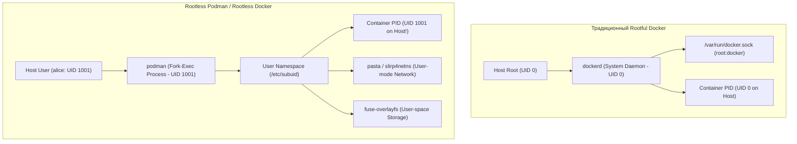
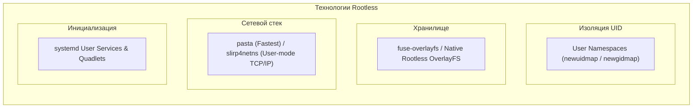
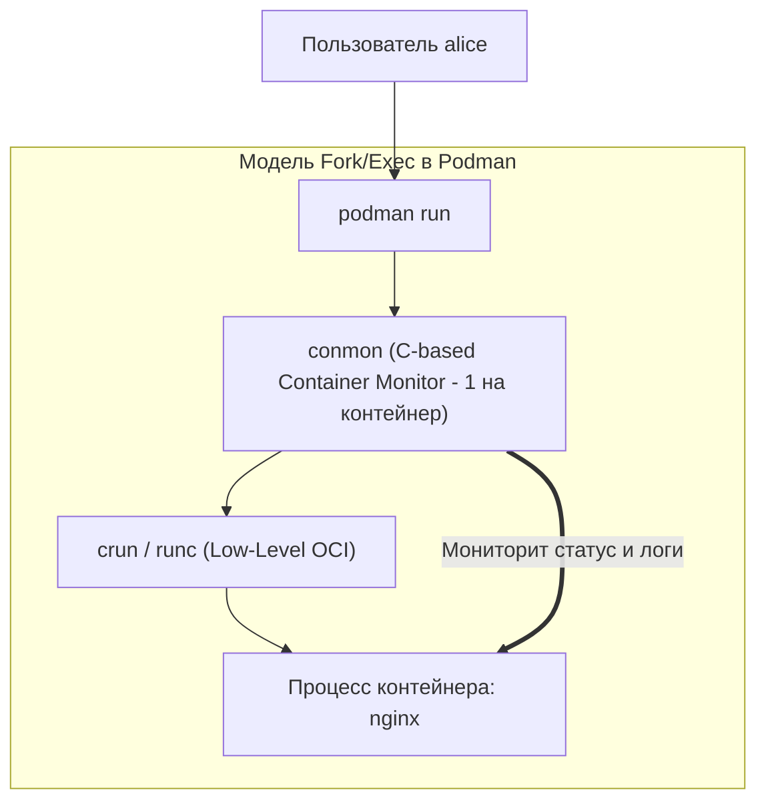

# 🛡️ 20. Rootless контейнеры и Архитектура Podman: User Namespaces, slirp4netns, pasta и Quadlets

## 🧠 Зачем нужен Rootless режим?

Традиционный Docker daemon (`dockerd`) работает с полными правами суперпользователя (`root` UID 0). Доступ к Docker сокету (`/var/run/docker.sock`) эквивалентен предоставлению **беспарольного `sudo` доступа** ко всей файловой системе и ресурсам сервера.

**Rootless контейнеры** позволяют запускать демон или рантайм целиком от непривилегированного пользователя (например, UID 1001). Даже если злоумышленник сбежит из контейнера через уязвимость ядра, он останется **непривилегированным пользователем хоста**, не способным повредить систему.



---

## 🔬 1. Технологический стек Rootless контейнеров

Поскольку непривилегированный пользователь не имеет права выполнять системные вызовы монтирования (`mount`), создания виртуальных сетевых интерфейсов (`veth`) и настройки iptables, в rootless-режиме используются специальные технологии:



### 1.1. Сопоставление UID: `newuidmap` и `newgidmap`
При создании User Namespace утилиты SUID-помощники `newuidmap` читают диапазоны из `/etc/subuid`:
```text
alice:100000:65536
```
- UID 0 внутри контейнера $\rightarrow$ UID 1001 (alice) на хосте.
- UID 1 внутри контейнера $\rightarrow$ UID 100000 на хосте.
- UID 1000 внутри контейнера $\rightarrow$ UID 100999 на хосте.

### 1.2. Сеть: `slirp4netns` против `pasta`
Обычный пользователь не может создать `veth` пару в ядре.
- **`slirp4netns`:** Эмулирует полный TCP/IP стек в пространстве пользователя (User Space). Пересылает сетевые пакеты через обычные сокеты `AF_INET` хоста. Накладные расходы на переключение контекста снижают пропускную способность.
- **`pasta` (Pack A Subtle Tap Abstraction):** Современный стек по умолчанию в Podman 4+. Работает в 2–4 раза быстрее `slirp4netns` за счет прямой трансляции сокетов без эмуляции полного стека TCP.

---

## 🦭 2. Архитектура Podman: Daemonless и Pod-Native

**Podman (Pod Manager)** — это инструмент от Red Hat, полностью совместимый с CLI Docker (`alias docker=podman`), но принципиально отличающийся по архитектуре:

| Критерий | Docker Engine | Podman |
| :--- | :--- | :--- |
| **Архитектура** | Клиент-Сервер (Daemon `dockerd`) | **Daemonless** (модель Fork-Exec, процесс-потомок) |
| **Single Point of Failure** | Да (падение демона влияет на управление) | **Нет** (процессы полностью независимы) |
| **Управление Pods** | ❌ Нет (только отдельные контейнеры) | ✅ **Нативная поддержка Pods** (как в Kubernetes) |
| **Systemd интеграция** | ⚠️ Сложная через докер-демон | ✅ **Глубокая нативная интеграция** (Quadlets / Unit files) |
| **Kubernetes YAML** | ❌ Требуются сторонние утилиты | ✅ `podman play kube app.yaml` |



> [!NOTE]
> **`conmon` (Container Monitor):** Легковесная утилита на Си, которая держит сокеты tty, обслуживает логи и ожидает код завершения процесса контейнера вместо тяжелого демона.

---

## ⚙️ 3. Декларативное управление через Systemd: Quadlets

**Quadlets** (появились в Podman 4.4+) — это современный механизм генерации systemd-сервисов из простых декларативных файлов `.container`, `.kube`, `.volume` и `.network`.

Файлы размещаются в `~/.config/containers/systemd/` (для rootless) или `/etc/containers/systemd/` (для root).

### Пример Quadlet файла `~/.config/containers/systemd/web-app.container`:
```ini
[Unit]
Description=Production Web Application Container
After=network-online.target

[Container]
Image=docker.io/library/nginx:alpine
PublishPort=8080:80
Volume=%h/app/html:/usr/share/nginx/html:ro,Z
Environment=NODE_ENV=production
Memory=256M
Pull=newer

[Service]
Restart=always
TimeoutStartSec=900

[Install]
WantedBy=default.target
```

### Активация и управление сервисом:
```bash
# 1. Перезагрузка генератора systemd пользователя
systemctl --user daemon-reload

# 2. Запуск сгенерированного сервиса
systemctl --user start web-app.service

# 3. Проверка статуса
systemctl --user status web-app.service

# 4. Включение автозапуска при загрузке сервера
systemctl --user enable web-app.service

# 5. Разрешить запуск сервисов пользователя без активной SSH-сессии (Linger)
sudo loginctl enable-linger alice
```

---

## ☸️ 4. Запуск Kubernetes YAML в Podman (`podman play kube`)

Podman умеет запускать стандартные манифесты Kubernetes Pods локально без развертывания k8s кластера:

### Файл `pod-app.yaml`:
```yaml
apiVersion: v1
kind: Pod
metadata:
  name: microservice-pod
spec:
  containers:
    - name: api
      image: docker.io/library/python:3.11-alpine
      command: ["python", "-m", "http.server", "8000"]
      ports:
        - containerPort: 8000
          hostPort: 8000
    - name: sidecar-proxy
      image: docker.io/library/nginx:alpine
```

Запуск и управление:
```bash
# Запуск Pod из манифеста
podman play kube pod-app.yaml

# Список запущенных подов
podman pod ls

# Остановка и очистка
podman play kube --down pod-app.yaml
```

---

## 💥 5. Реальный Troubleshooting

### Сценарий 1: Ошибка `cannot open port < 1024` в Rootless режиме
**Симптомы:** Попытка запустить `podman run -p 80:80 nginx` падает с ошибкой:
`Error: rootlessport: cannot expose privileged port 80, you can use 'sudo sysctl net.ipv4.ip_unprivileged_port_start=80'`.

**Причина:** По умолчанию в ядре Linux непривилегированным процессам запрещено слушать порты ниже 1024.

**Решение:**
Уменьшить минимальный непривилегированный порт в sysctl:
```bash
sudo sysctl -w net.ipv4.ip_unprivileged_port_start=80
echo "net.ipv4.ip_unprivileged_port_start=80" | sudo tee -a /etc/sysctl.d/99-rootless.conf
```

---

### Сценарий 2: "User namespaces are not enabled in the kernel"
**Симптомы:** При выполнении `podman run` выдается ошибка `unshare(CLONE_NEWUSER): Operation not permitted`.

**Причина:** В некоторых дистрибутивах (Debian/RHEL с жестким hardening) отключена возможность создания User Namespaces для непривилегированных пользователей.

**Решение:**
Включить поддержку в ядре:
```bash
sudo sysctl -w kernel.unprivileged_userns_clone=1
echo "kernel.unprivileged_userns_clone=1" | sudo tee -a /etc/sysctl.d/99-userns.conf
```
