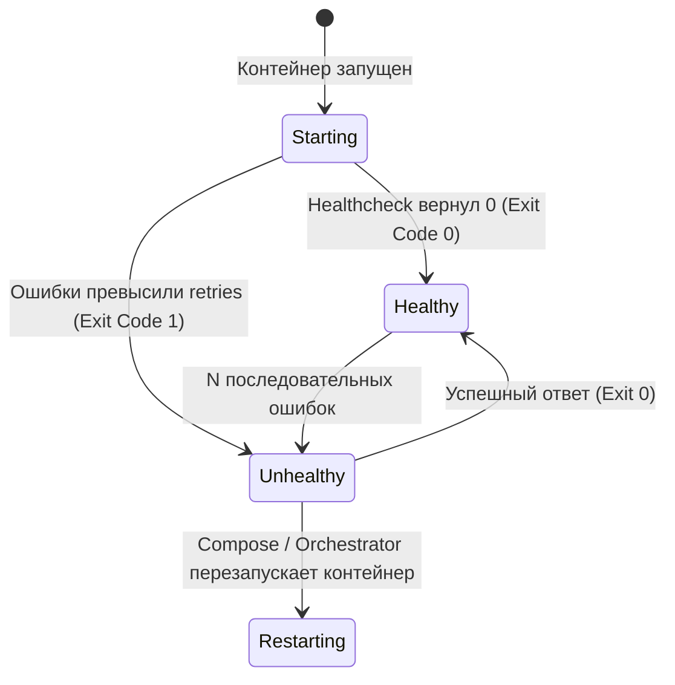
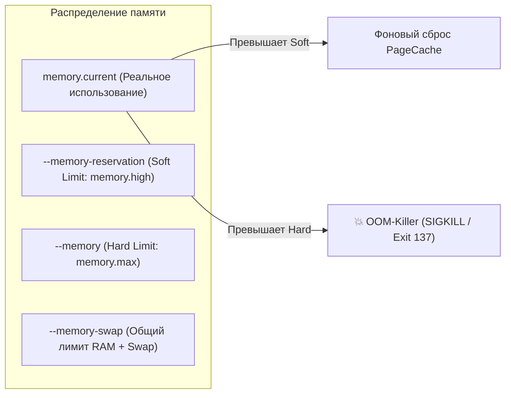

# 💓 21. Healthchecks и Ограничения Ресурсов: CPU, Память и Защита от OOM

## 🚦 1. Механика `HEALTHCHECK` в Docker

Директива `HEALTHCHECK` сообщает Docker Engine, как проверять реальную работоспособность приложения внутри контейнера, а не только факт наличия работающего процесса (который может зависнуть в Deadlock).



### Параметры `HEALTHCHECK`:
- **`--interval`** (дефолт `30s`): Частота выполнения проверки.
- **`--timeout`** (дефолт `30s`): Время ожидания завершения команды проверки. Если проверка не уложилась в таймаут — считается сбоем.
- **`--start-period`** (дефолт `0s`): Период прогрева приложения (время на запуск JVM, прогрев кэшей, миграции). Сбои проверок в этот период **не учитываются** в счетчике `retries`.
- **`--start-interval`** (Compose v2.20+): Интервал между проверками во время `start-period` (например, опрос каждую 1 секунду до первого успеха).
- **`--retries`** (дефолт `3`): Количество последовательных неудачных проверок для перевода контейнера в статус `unhealthy`.

### Форматы объявления Healthcheck:

#### А. В Dockerfile:
```dockerfile
FROM node:20-alpine
WORKDIR /app
COPY . .

HEALTHCHECK --interval=10s --timeout=3s --start-period=15s --retries=3 \
  CMD wget --no-verbose --tries=1 --spider http://127.0.0.1:8080/healthz || exit 1

EXPOSE 8080
CMD ["node", "server.js"]
```

#### Б. В `docker-compose.yml`:
```yaml
services:
  api:
    image: my-api:latest
    healthcheck:
      test: ["CMD-SHELL", "curl -f http://localhost:8080/healthz || exit 1"]
      interval: 10s
      timeout: 2s
      retries: 3
      start_period: 20s
      start_interval: 2s
```

#### В. Healthcheck для баз данных без curl/wget:
```yaml
services:
  postgres:
    image: postgres:16-alpine
    healthcheck:
      test: ["CMD-SHELL", "pg_isready -U postgres -d mydb"]
      interval: 5s
      timeout: 2s
      retries: 5

  redis:
    image: redis:7-alpine
    healthcheck:
      test: ["CMD", "redis-cli", "ping"]
      interval: 5s
      timeout: 2s
      retries: 3
```

---

## 🛑 2. Ограничение ресурсов: Память (RAM & Swap)

Управление памятью в Docker напрямую проецируется в контроллер `memory` подсистемы Cgroups v2.



### Параметры ограничения памяти:

| Флаг CLI | Значение в Cgroups v2 | Поведение при превышении |
| :--- | :--- | :--- |
| `-m`, `--memory="512m"` | `memory.max` | Жесткий лимит (Hard Limit). Ядро немедленно отправляет процессу `SIGKILL` (Exit 137). |
| `--memory-reservation="256m"` | `memory.high` | Мягкий лимит (Soft Limit). Запуск агрессивной очистки дискового кэша ядра без убийства процесса. |
| `--memory-swap="1g"` | `memory.swap.max` | Общий лимит **RAM + Swap**. Значение `1g` при `--memory="512m"` означает $512\text{МБ RAM} + 512\text{МБ Swap}$. |
| `--memory-swap="512m"` | `memory.swap.max=0` | **Swap полностью отключен** (размер swap = 0). |
| `--oom-kill-disable` | N/A | ⚠️ Запрет OOM-killer для контейнера (опасно: при нехватке памяти зависает вся система). |

---

## ⚡ 3. Ограничение процессора (CPU Quota & CFS)

Docker использует CFS (Completely Fair Scheduler) ядра Linux для квантования процессорного времени.

- **`--cpus="1.5"`** — гарантирует, что контейнер может использовать максимум 1.5 ядра процессора в любой момент времени (квота CFS: `150000` мкс на каждые `100000` мкс периода).
- **`--cpu-shares=512`** — относительный вес CPU при конкуренции (мягкое распределение: если процессор простаивает, контейнер может забрать 100%, если перегружен — получит ресурсы пропорционально весу).
- **`--cpuset-cpus="0,2,3"`** — жесткая привязка контейнера к конкретным физическим ядрам CPU (CPU Pinning / Core Isolation).

---

## 🛡️ 4. Защита от Fork-Бомб: `--pids-limit`

Каждый процесс и каждый тред (например, пул горутин или Java threads) требует структуру `task_struct` в оперативной памяти ядра. Без ограничений вредоносный или сбойный контейнер может заспавнить 100 000 процессов и полностью заморозить весь Linux-хост.

```bash
# Ограничить контейнер максимум 100 процессами/тредами
docker run -d --pids-limit=100 my-app:latest
```

---

## 📋 5. Production Конфигурация Ресурсов в Docker Compose

```yaml
version: '3.8'

services:
  web-service:
    image: my-company/web:v3.2
    deploy:
      resources:
        limits:
          cpus: '2.0'
          memory: 1024M
          pids: 200
        reservations:
          cpus: '0.5'
          memory: 512M
    restart: unless-stopped
    healthcheck:
      test: ["CMD", "curl", "-f", "http://localhost:3000/ready"]
      interval: 10s
      timeout: 3s
      retries: 3
      start_period: 30s
```

---

## 💥 6. Реальный Troubleshooting

### Сценарий 1: Контейнер падает с Exit Code 137 (OOMKilled)
**Симптомы:** Сервис внезапно перезапускается, в `docker inspect` поле `"OOMKilled": true`.

**Диагностика:**
```bash
# 1. Проверка последних инцидентов OOM
docker inspect <CONTAINER_ID> --format='{{json .State}}' | jq '{ExitCode: .ExitCode, OOMKilled: .OOMKilled, Error: .Error}'

# 2. Мониторинг в реальном времени потребления RAM и лимитов
docker stats --no-stream

# 3. Чтение системных логов dmesg хоста
sudo dmesg -T | grep -E -i 'oom-killer|Out of memory'
```

**Решение:**
1. Увеличить `--memory` лимит.
2. Для Java приложений настроить `-XX:MaxRAMPercentage=75.0`.
3. Для NodeJS приложений настроить `--max-old-space-size`.

---

### Сценарий 2: Постоянный статус `unhealthy` при работающем приложении
**Симптомы:** Сервис работает корректно, клиенты получают ответы, но `docker ps` показывает статус `(unhealthy)`.

**Причина:** В образе (например, Alpine или Distroless) отсутствует утилита, вызванная в healthcheck (например, `curl`), и команда возвращает Exit Code 127 (Command Not Found).

**Диагностика:**
```bash
# Посмотреть вывод последних 5 проверок healthcheck
docker inspect <CONTAINER_ID> --format='{{json .State.Health}}' | jq .
```
В выводе будет видно: `/bin/sh: curl: not found`.

**Решение:** Заменить `curl` на встроенный `wget` в Alpine или использовать бинарный health-probe.
