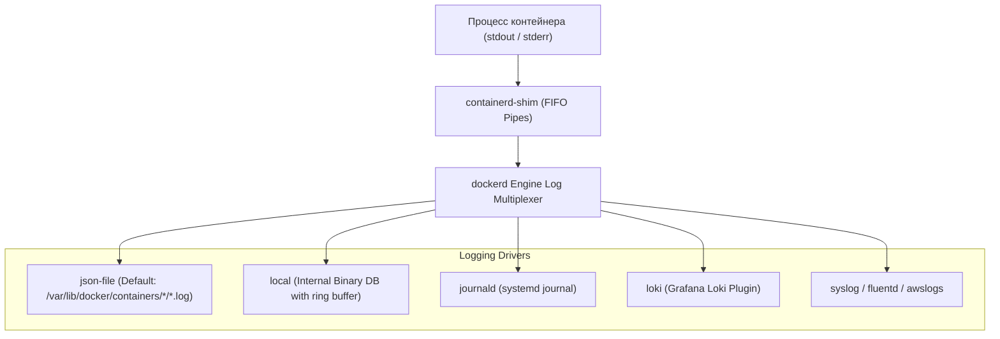
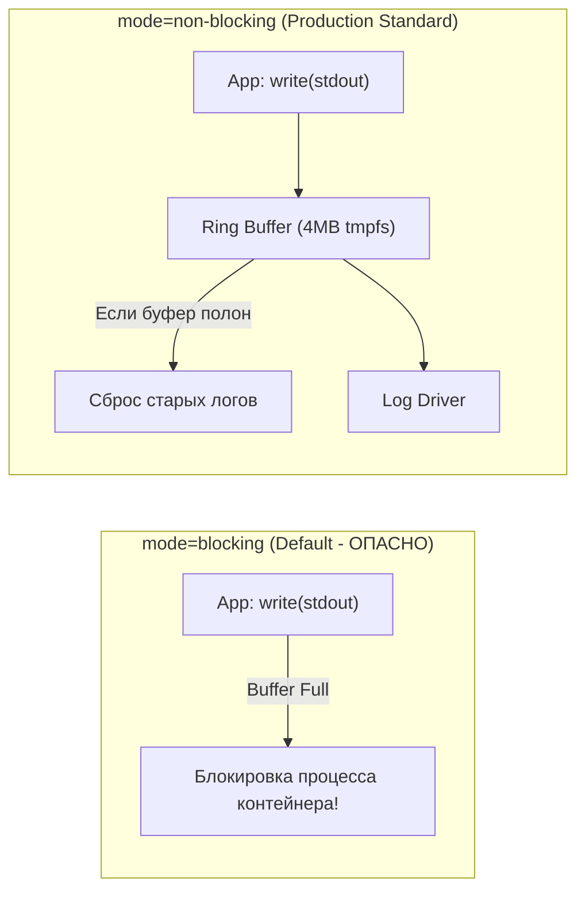

# 📊 22. Логирование и Мониторинг: Драйверы Логов, Ротация, Non-Blocking Mode и Метрики Prometheus

## 📜 1. Архитектура логирования в Docker Engine

Docker перехватывает стандартные потоки вывода (`stdout` и `stderr`) основного процесса контейнера (PID 1) через файловые дескрипторы FIFO, обслуживаемые `containerd-shim`, и передает их в настроенный **Logging Driver**.



---

## 🎛️ 2. Сравнение драйверов логирования

| Драйвер | Место хранения | Поддержка `docker logs` | Риск переполнения диска | Применение |
| :--- | :--- | :--- | :--- | :--- |
| **`json-file`** | JSON-файлы на хосте | ✅ Да | ⚠️ Высокий (если нет ротации) | Стандарт по умолчанию |
| **`local`** | Компактный бинарный лог | ✅ Да | 🛡️ Нулевой (авторотация по дефолту) | Рекомендуется для локальных хостов |
| **`journald`** | Systemd Journal | ✅ Да | 🛡️ Управляется journald | Интеграция с хостовым systemd |
| **`loki`** | Grafana Loki (через плагин) | ❌ Нет (только в Grafana) | 🛡️ Логи отправляются по сети | Централизованный стек мониторинга |
| **`syslog` / `fluentd`** | Внешний Syslog / Fluentd демон | ❌ Нет | 🛡️ По сети | Корпоративные SIEM системы |

---

## ⚠️ 3. Катастрофа блокирующего ввода-вывода: `mode=blocking` vs `mode=non-blocking`

По умолчанию Docker работает в режиме **`mode=blocking`**. 

Если приложение генерирует тысячи строк логов в секунду, а диск медленный или внешний лог-коллектор (Fluentd, Loki) завис/перегружен, **буфер FIFO переполняется, системный вызов `write(stdout)` внутри приложения блокируется, и весь контейнер намертво зависает!**



### Решение: Включение `mode=non-blocking` глобально
В файле `/etc/docker/daemon.json`:
```json
{
  "log-driver": "json-file",
  "log-opts": {
    "mode": "non-blocking",
    "max-buffer-size": "4m",
    "max-size": "50m",
    "max-file": "5"
  }
}
```
> [!IMPORTANT]
> Параметр `max-size: "50m"` и `max-file: "5"` гарантирует, что один контейнер **никогда не займет на диске более 250 МБ** логов, автоматически удаляя старые ротированные файлы.

---

## 📈 4. Экспорт метрик Docker Engine в Prometheus

Docker имеет встроенный эндпоинт метрик в формате Prometheus, отдающий статистику по количеству контейнеров, использованию памяти демона, ошибкам сборки и I/O.

### Включение метрик в `/etc/docker/daemon.json`:
```json
{
  "metrics-addr": "0.0.0.0:9323",
  "experimental": true
}
```

Перезапуск демона:
```bash
sudo systemctl restart docker
# Проверка сбора метрик
curl -s http://localhost:9323/metrics | head -n 30
```

### Пример конфигурации `prometheus.yml`:
```yaml
scrape_configs:
  - job_name: 'docker-engine'
    static_configs:
      - targets: ['192.168.1.50:9323']

  - job_name: 'cadvisor'
    static_configs:
      - targets: ['192.168.1.50:8080']
```

---

## 🔬 5. Мониторинг метрик контейнеров через cAdvisor

Для детального мониторинга потребления ресурсов каждым отдельным контейнером (CPU throttling, Cgroups v2 memory breakdown, Network drops) используется **Google cAdvisor**.

### Запуск cAdvisor в Docker:
```yaml
services:
  cadvisor:
    image: gcr.io/cadvisor/cadvisor:v0.49.1
    container_name: cadvisor
    privileged: true
    devices:
      - /dev/kmsg:/dev/kmsg
    volumes:
      - /:/rootfs:ro
      - /var/run:/var/run:ro
      - /sys:/sys:ro
      - /var/lib/docker/:/var/lib/docker:ro
      - /dev/disk/:/dev/disk:ro
    ports:
      - "8080:8080"
    restart: always
```

---

## 🧰 6. Практический Cheat Sheet команд логирования

```bash
# 1. Потоковый просмотр логов с таймстемпами и последними 100 строками
docker logs -f --tail=100 -t my-container

# 2. Фильтрация логов по времени (например, за последние 30 минут)
docker logs --since 30m my-container

# 3. Поиск физического файла логов контейнера на хосте
docker inspect --format='{{.LogPath}}' my-container

# 4. Проверка размера лог-файла конкретного контейнера
sudo ls -lh $(docker inspect --format='{{.LogPath}}' my-container)

# 5. Экстренная очистка (усечение) лог-файла без перезапуска контейнера
sudo truncate -s 0 $(docker inspect --format='{{.LogPath}}' my-container)
```

---

## 💥 7. Реальный Troubleshooting

### Сценарий 1: Диск хоста забит на 100% гигантским файлом `.log`
**Симптомы:** Сервер перестал отвечать, `df -h` показывает 100% Use на корневом разделе, контейнеры не могут писать на диск.

**Причина:** Docker был установлен с дефолтным драйвером `json-file` без параметров `max-size` и `max-file`. Один из контейнеров вывел 80 ГБ логов в `/var/lib/docker/containers/<id>/<id>-json.log`.

**Диагностика:**
```bash
# Найти самые большие файлы логов в системе
sudo du -ah /var/lib/docker/containers/ | grep -E '\.log$' | sort -hr | head -n 5
```

**Решение:**
1. Не удалять файл через `rm` (дескриптор останется открытым, и место не освободится!). Выполнить усечение:
   ```bash
   sudo truncate -s 0 /var/lib/docker/containers/<CONTAINER_ID>/<CONTAINER_ID>-json.log
   ```
2. Настроить глобальную ротацию в `/etc/docker/daemon.json` (как описано в разделе 3) и перезапустить демон.
