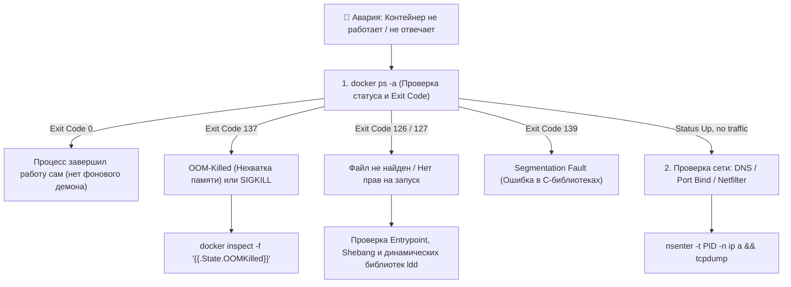
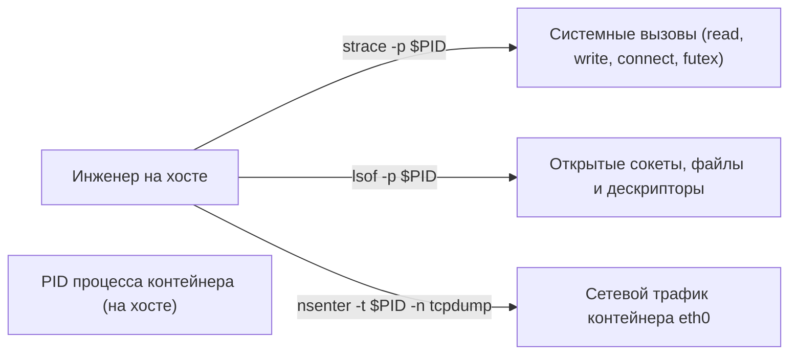

# 🩺 23. Production Troubleshooting: Диагностика сбоев, Exit-коды и Трассировка

## 🧭 Дерево решений при аварии контейнера (Triage Flowchart)

Когда контейнер неожиданно падает, уходит в бесконечный перезапуск (`Restarting`) или перестает отвечать на запросы, следуйте системному алгоритму диагностики:



---

## 🔢 1. Таблица кодов завершения (Exit Codes Reference)

Стандартные коды завершения процессов в Linux и Docker:

| Exit Code | Название / Причина | Реальный смысл в Docker | Как исправить |
| :--- | :--- | :--- | :--- |
| **0** | Success / Clean exit | Основной процесс завершился без ошибок. Часто бывает, когда в Dockerfile запустили команду без фонового режима (например, `nginx` вместо `nginx -g 'daemon off;'`). | Добавить foreground флаг или бесконечный цикл ожидания. |
| **1** | Application Error | Ошибка в коде приложения (uncaught exception, ошибка синтаксиса, сбой конфигурации). | Читать `docker logs <container>`. |
| **125** | Docker Engine Error | Ошибка самого демона Docker (не удалось примонтировать том, сбой cgroups). | Проверить `/var/log/messages` или `journalctl -u docker`. |
| **126** | Permission Denied | Бинарник найден, но у него нет прав на исполнение (`chmod +x`). | Выполнить `chmod +x entrypoint.sh` при сборке. |
| **127** | Command Not Found | Указанный бинарник или шелл (`/bin/bash`) отсутствует в образе. | Проверить путь в `ENTRYPOINT`/`CMD` (в Alpine использовать `/bin/sh`). |
| **137** | Fatal Signal 9 (`SIGKILL`) | $128 + 9 = 137$. Процесс был принудительно убит ядром (OOM-Killer) или командой `docker kill` / таймаутом `docker stop`. | Проверить `OOMKilled` через `docker inspect` и увеличить `--memory`. |
| **139** | Fatal Signal 11 (`SIGSEGV`)| $128 + 11 = 139$. Segmentation Fault (ошибка доступа к памяти в C/C++/Go runtime). | Анализировать Core Dump через GDB. |
| **143** | Fatal Signal 15 (`SIGTERM`)| $128 + 15 = 143$. Контейнер был штатно остановлен оркестратором или `docker stop`. | Нормальное завершение при перезапуске. |

---

## 🧰 2. Арсенал инспекции: Топ-7 команд инженера

### 1. `docker inspect` с Go-шаблонами
Извлечение точной информации без чтения гигантского JSON:
```bash
# Получить статус, причину завершения и флаг OOM
docker inspect -f 'Status: {{.State.Status}} | ExitCode: {{.State.ExitCode}} | OOMKilled: {{.State.OOMKilled}} | Error: {{.State.Error}}' <ID>

# Получить IP-адреса контейнера во всех сетях
docker inspect -f '{{range $k, $v := .NetworkSettings.Networks}}{{$k}}: {{$v.IPAddress}}{{end}}' <ID>

# Получить PID основного процесса на хосте
CONTAINER_PID=$(docker inspect -f '{{.State.Pid}}' <ID>)
```

### 2. `docker stats` (Мониторинг ресурсов)
```bash
# Форматированный вывод текущего потребления CPU, RAM и сети
docker stats --no-stream --format "table {{.Name}}\t{{.CPUPerc}}\t{{.MemUsage}}\t{{.NetIO}}\t{{.BlockIO}}"
```

### 3. `docker top` (Просмотр процессов внутри контейнера с хоста)
```bash
# Вывод всех тредов и процессов с их хостовыми PID
docker top <CONTAINER_ID> aux
```

---

## 🔬 3. Продвинутая трассировка: `strace`, `lsof`, `tcpdump`

Когда логи приложения пусты, а контейнер зависает, используем низкоуровневые инструменты ядра Linux.



### Примеры команд трассировки:
```bash
CONTAINER_PID=$(docker inspect -f '{{.State.Pid}}' my-app)

# 1. Трассировка системных вызовов зависшего процесса (что он делает прямо сейчас?)
sudo strace -p $CONTAINER_PID -f -e trace=network,file,process

# 2. Просмотр всех открытых сокетов и файлов контейнера
sudo lsof -p $CONTAINER_PID

# 3. Анализ сетевого трафика прямо внутри сетевого пространства контейнера
sudo nsenter -t $CONTAINER_PID -n tcpdump -nn -i eth0 -v port 80 or port 5432
```

---

## 💥 4. Разбор реальных аварийных сценариев

### Сценарий 1: Контейнер в `CrashLoopBackOff` с Exit Code 127
**Симптомы:** Свежесобранный образ мгновенно падает. В логах: `exec /entrypoint.sh: no such file or directory`. Файл `/entrypoint.sh` точно скопирован и существует.

**Причины:**
1. **Windows CRLF окончания строк:** Скрипт `entrypoint.sh` был сохранен в Windows с окончаниями `\r\n`. Ядро Linux пытается запустить интерпретатор `/bin/sh\r`, которого не существует!
2. В шебанге `#!/bin/bash` указан Bash, а в базовом образе Alpine установлен только `/bin/sh`.

**Решение:**
1. Конвертировать окончания строк: `dos2unix entrypoint.sh`.
2. В первой строке скрипта указывать переносимый шебанг: `#!/bin/sh`.

---

### Сценарий 2: Приложение не видит изменений в файлах конфигурации (Inotify)
**Симптомы:** Вы отредактировали файл на хосте, смонтированный через bind mount (`-v ./config.yaml:/app/config.yaml`), но приложение внутри контейнера не перезагрузило конфигурацию.

**Причина:** Текстовые редакторы (Vim, VSCode, JetBrains) при сохранении удаляют старый файл и создают новый с новым Inode. Bind mount по отдельному файлу привязан к **конкретному номеру Inode**, поэтому связь разрывается.

**Решение:**
Монтировать **директорию целиком**, а не отдельный файл:
```yaml
volumes:
  - ./config:/app/config:ro
```
