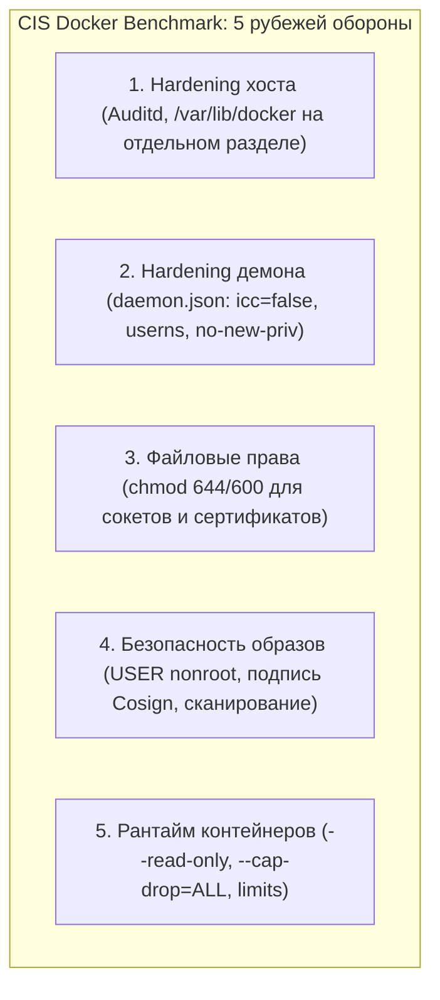

# 🛡️ 24. Production Hardening: CIS Docker Benchmark и Защита Хоста

## 🏛️ Стандарт безопасности CIS Docker Benchmark

**Center for Internet Security (CIS) Docker Benchmark** — это общепризнанный отраслевой стандарт, содержащий десятки обязательных требований по защите хостовой операционной системы, конфигурации демона Docker и параметров запуска контейнеров.



---

## 🔒 1. Защита на уровне Runtime: Read-Only RootFS

Самая эффективная мера против модификации контейнера и загрузки эксплойтов — сделать всю корневую файловую систему контейнера **доступной только для чтения (`--read-only`)**.

Если приложению необходимо записывать временные файлы (`/tmp`, `/var/run`, кэши), эти директории монтируются как изолированные `tmpfs` разделы в оперативной памяти:

```bash
docker run -d \
  --name hardened-app \
  --read-only \
  --tmpfs /tmp:rw,noexec,nosuid,size=64m \
  --tmpfs /var/run:rw,noexec,nosuid,size=16m \
  --cap-drop=ALL \
  --cap-add=NET_BIND_SERVICE \
  --security-opt no-new-privileges:true \
  --pids-limit 100 \
  --memory 512m \
  --user 10001:10001 \
  -p 8080:8080 \
  my-app:1.0
```

### В `docker-compose.yml`:
```yaml
services:
  web:
    image: nginx:alpine
    read_only: true
    tmpfs:
      - /tmp:rw,noexec,nosuid,size=64m
      - /var/run:rw,noexec,nosuid,size=16m
      - /var/cache/nginx:rw,noexec,nosuid,size=128m
    cap_drop:
      - ALL
    cap_add:
      - NET_BIND_SERVICE
    security_opt:
      - no-new-privileges:true
    pids_limit: 100
    user: "101:101" # nginx user in alpine
```

---

## 🛑 2. Отключение межконтейнерного взаимодействия: `icc=false`

По умолчанию в дефолтной сети `docker0` включен параметр **Inter-Container Communication (ICC)** (`icc=true`). Это означает, что любой контейнер на хосте может сканировать порты и отправлять пакеты любому другому контейнеру на этом же сервере.

При `"icc": false` Docker настраивает iptables цепочку `FORWARD` так, что контейнеры в дефолтной сети не могут отправлять трафик друг другу, если они явно не связаны через user-defined сети.

---

## 📋 3. Эталонная Production-конфигурация `/etc/docker/daemon.json`

Ниже приведена полная конфигурация, соответствующая требованиям **CIS Docker Benchmark Level 2**:

```json
{
  "icc": false,
  "no-new-privileges": true,
  "live-restore": true,
  "userland-proxy": false,
  "userns-remap": "default",
  "log-driver": "json-file",
  "log-opts": {
    "mode": "non-blocking",
    "max-buffer-size": "4m",
    "max-size": "50m",
    "max-file": "5"
  },
  "default-ulimits": {
    "nofile": {
      "Name": "nofile",
      "Hard": 65535,
      "Soft": 32768
    },
    "nproc": {
      "Name": "nproc",
      "Hard": 4096,
      "Soft": 2048
    }
  },
  "cgroup-parent": "system.slice",
  "tls": true,
  "tlsverify": true,
  "tlscacert": "/etc/docker/certs/ca.pem",
  "tlscert": "/etc/docker/certs/server-cert.pem",
  "tlskey": "/etc/docker/certs/server-key.pem"
}
```

---

## 🕵️ 4. Аудит хоста через Linux Auditd

CIS Benchmark требует логировать все системные события, связанные с конфигурацией Docker:

### Файл `/etc/audit/rules.d/docker.rules`:
```text
# Логирование доступа к демону и сокету Docker
-w /usr/bin/dockerd -k docker
-w /usr/bin/containerd -k docker
-w /usr/bin/runc -k docker
-w /var/run/docker.sock -k docker
-w /etc/docker -k docker
-w /etc/docker/daemon.json -k docker
-w /lib/systemd/system/docker.service -k docker
-w /etc/default/docker -k docker
-w /var/lib/docker -k docker
```
Применение правил:
```bash
sudo augenrules --load
sudo systemctl restart auditd
```

---

## 🤖 5. Автоматизированный аудит: Docker Bench for Security

**Docker Bench for Security** — это официальный скрипт от Docker, проверяющий сервер на сотни параметров соответствия стандарту CIS.

```bash
# Запуск аудита безопасности в Docker контейнере
docker run --rm --net host --pid host --userns host --cap-add audit_control \
  -e DOCKER_CONTENT_TRUST=$DOCKER_CONTENT_TRUST \
  -v /etc:/etc:ro \
  -v /usr/bin/containerd:/usr/bin/containerd:ro \
  -v /usr/bin/runc:/usr/bin/runc:ro \
  -v /usr/lib/systemd:/usr/lib/systemd:ro \
  -v /var/lib:/var/lib:ro \
  -v /var/run/docker.sock:/var/run/docker.sock:ro \
  --label docker_bench_security \
  docker/docker-bench-security
```

---

## 💥 6. Реальный Troubleshooting

### Сценарий 1: Приложение падает с `Read-only file system` при старте
**Симптомы:** После добавления `--read-only` сервис падает: `FATAL: cannot create /app/cache/data.tmp: Read-only file system`.

**Причина:** Приложению требуется временная директория для сброса кэша или генерации PID-файлов.

**Решение:**
Найти все пути, в которые пишет процесс, и примонтировать для них `tmpfs`:
```bash
docker run --read-only \
  --tmpfs /app/cache:rw,size=128m \
  --tmpfs /tmp:rw,size=32m \
  my-app:latest
```
