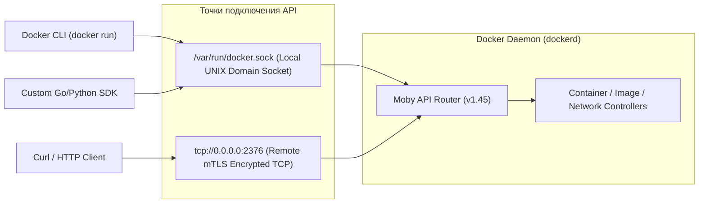
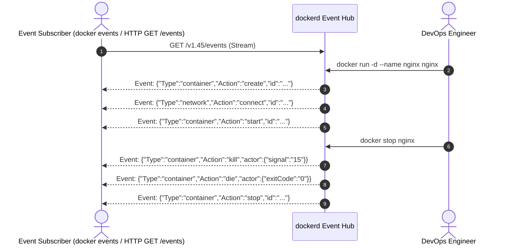
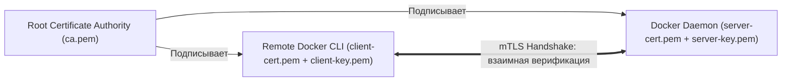

# 🔌 25. Docker Engine API, Потоки Событий и Безопасность Сокета

## 🧠 Архитектура Docker Engine REST API

Docker CLI (`docker`) — это тонкий клиентский бинарник, который общается с демоном `dockerd` через стандартный **HTTP REST API**. По умолчанию обмен происходит через локальный UNIX-сокет `/var/run/docker.sock`.



---

## ⚠️ 1. Критическая уязвимость: Проброс `/var/run/docker.sock` в контейнер

Частый антипаттерн в CI/CD и агентах мониторинга — монтирование сокета хоста внутрь контейнера:
```yaml
volumes:
  - /var/run/docker.sock:/var/run/docker.sock
```

> [!CAUTION]
> **Почему это катастрофа безопасности?**
> Любой процесс внутри такого контейнера имеет возможность:
> 1. Создать привилегированный контейнер с монтированием корня хоста:
>    `docker run -v /:/host-root --privileged alpine chroot /host-root`
> 2. Прочитать любые SSH-ключи, базу паролей `/etc/shadow` и скомпрометировать весь сервер.

### Безопасное решение: Защитный прокси (Docker Socket Proxy)
Для сервисов, которым нужен доступ к Docker API только на чтение (например, Portainer, Traefik, cAdvisor, Promtail), используется специализированный прокси **`tecnativa/docker-socket-proxy`**, блокирующий опасные POST/DELETE методы:

```yaml
services:
  docker-proxy:
    image: tecnativa/docker-socket-proxy:latest
    container_name: docker-proxy
    environment:
      # Разрешить только безопасные GET запросы
      CONTAINERS: 1
      IMAGES: 1
      NETWORKS: 1
      INFO: 1
      EVENTS: 1
      # Запретить любые операции создания и удаления
      POST: 0
      DELETE: 0
      VOLUMES: 0
      EXEC: 0
    volumes:
      - /var/run/docker.sock:/var/run/docker.sock:ro
    networks:
      - monitor-net

  traefik:
    image: traefik:v3.0
    command:
      - "--providers.docker.endpoint=tcp://docker-proxy:2375"
      - "--providers.docker.exposedbydefault=false"
    depends_on:
      - docker-proxy
    networks:
      - monitor-net

networks:
  monitor-net:
```

---

## 📡 2. Потоковая обработка событий: `docker events`

Docker генерирует события реального времени (Events Stream) для всех сущностей (контейнеры, тома, сети, плагины). Это позволяет строить реактивные системы автоматизации (автодискавери сервисов, автоперезапуск, аудит).



### Примеры мониторинга событий через CLI:
```bash
# 1. Потоковое чтение всех событий с форматированием в JSON
docker events --format '{{json .}}'

# 2. Фильтрация только событий падения контейнеров (die / oom)
docker events --filter 'type=container' --filter 'event=die' --filter 'event=oom'

# 3. Просмотр событий за последние 2 часа
docker events --since '2h' --filter 'type=image'
```

---

## 🌐 3. Настройка защищенного удаленного API через mTLS (Port 2376)

Для удаленного управления Docker по сети без использования SSH настраивается взаимная TLS-аутентификация (mTLS).



### Конфигурация в `/etc/docker/daemon.json`:
```json
{
  "hosts": [
    "unix:///var/run/docker.sock",
    "tcp://0.0.0.0:2376"
  ],
  "tls": true,
  "tlsverify": true,
  "tlscacert": "/etc/docker/certs/ca.pem",
  "tlscert": "/etc/docker/certs/server-cert.pem",
  "tlskey": "/etc/docker/certs/server-key.pem"
}
```

Подключение клиента:
```bash
docker --tlsverify \
  --tlscacert=~/.docker/ca.pem \
  --tlscert=~/.docker/cert.pem \
  --tlskey=~/.docker/key.pem \
  -H=tcp://remote-docker.company.com:2376 \
  ps
```

---

## 🛠️ 4. Прямое взаимодействие с API через `curl`

```bash
# 1. Получение системной информации через UNIX сокет
sudo curl -s --unix-socket /var/run/docker.sock http://localhost/v1.45/info | jq .

# 2. Список работающих контейнеров
sudo curl -s --unix-socket /var/run/docker.sock http://localhost/v1.45/containers/json | jq .

# 3. Создание и запуск контейнера через чистый HTTP POST
sudo curl -s --unix-socket /var/run/docker.sock \
  -H "Content-Type: application/json" \
  -d '{"Image": "alpine:latest", "Cmd": ["echo", "Hello from raw API!"]}' \
  http://localhost/v1.45/containers/create?name=raw-api-test | jq .
```
