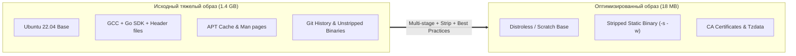

# ⚡ 26. Экстремальная Оптимизация Образов: От 1.5 ГБ до <30 МБ

## 📉 Зачем уменьшать размер контейнерных образов?

1. **Скорость масштабирования в Kubernetes (Cold Starts):** Узел кластера при автоскейлинге тратит 80% времени на выкачивание образов по сети (`ImagePullBackOff` при медленной сети).
2. **Экономия дискового пространства и трафика:** Снижение счетов за облачный трафик в AWS/GCP/Yandex Cloud.
3. **Безопасность:** Чем меньше файлов в образе, тем меньше вероятность наличия уязвимостей (Zero CVEs).



---

## 🛠️ 1. Топ-7 техник сжатия и оптимизации

### 1.1. Исключение мусора через `.dockerignore`
Любые локальные файлы, не нужные для компиляции, замедляют отправку контекста сборщика и засоряют кэш:

Файл `.dockerignore`:
```text
.git
.github
.gitlab-ci.yml
**/.DS_Store
*.md
docs/
tests/
tmp/
node_modules/
dist/
.env*
```

---

### 1.2. Очистка кэшей пакетных менеджеров в одном слое
Если вы используете дистрибутивы на Debian/Ubuntu, кэш списков пакетов `apt` должен удаляться **в той же инструкции `RUN`**:

```dockerfile
# ❌ ПЛОХО (Кэш навсегда застрянет в слое 1):
RUN apt-get update && apt-get install -y python3
RUN rm -rf /var/lib/apt/lists/*

# ✅ ПРАВИЛЬНО:
RUN apt-get update && apt-get install -y --no-install-recommends \
    python3 \
    ca-certificates \
    && rm -rf /var/lib/apt/lists/* /var/cache/apt/* /tmp/*
```

---

### 1.3. Снятие отладочных символов с бинарников (`strip`)
Компиляторы C, C++, Go и Rust по умолчанию внедряют таблицы символов и отладочную информацию (DWARF), которая удваивает размер файла:

```dockerfile
# Для Go: флаги линковщика -s (strip symbol table) и -w (strip DWARF)
RUN CGO_ENABLED=0 go build -ldflags="-s -w" -o /bin/app .

# Для C/C++ / Rust: утилита strip
RUN strip --strip-all /bin/my_c_app
```

---

### 1.4. Использование современного сжатия Zstandard (Zstd)
BuildKit поддерживает сжатие слоев алгоритмом **Zstandard (zstd)** вместо устаревшего `gzip`. Это дает на 30% более высокую степень сжатия и в 5 раз более быструю распаковку на нодах Kubernetes.

```bash
docker buildx build \
  --output type=image,name=myregistry.com/app:latest,compression=zstd,compression-level=9,push=true \
  .
```

---

## 📊 2. Сравнительная таблица оптимизации по стекам

| Стек технологий | Исходный размер | Оптимизированный размер | Примененные техники |
| :--- | :--- | :--- | :--- |
| **Go / Rust** | 1.2 ГБ | **12 МБ** | `FROM scratch`, `CGO_ENABLED=0`, `-ldflags="-s -w"`, `ca-certificates` |
| **Node.js (Next.js)** | 1.8 ГБ | **85 МБ** | Multi-stage, `standalone` output mode, `node:20-alpine`, `npm prune --production` |
| **Python (FastAPI)** | 950 МБ | **65 МБ** | Multi-stage, `python:3.11-slim`, `--no-cache-dir`, копирование `.local` wheel wheels |
| **Java (Spring Boot)** | 850 МБ | **110 МБ** | `eclipse-temurin:21-jre-alpine`, Spring Boot `layertools`, исключение JDK |

---

## 🧪 3. Практический пример: Экстремальная оптимизация Python

### До оптимизации (920 МБ):
```dockerfile
FROM python:3.11
WORKDIR /app
COPY . .
RUN pip install -r requirements.txt
CMD ["python", "main.py"]
```

### После оптимизации (58 МБ):
```dockerfile
# syntax=docker/dockerfile:1.7

# Stage 1: Сборщик зависимостей
FROM python:3.11-slim AS builder
WORKDIR /app

RUN apt-get update && apt-get install -y --no-install-recommends \
    gcc \
    libpq-dev \
    && rm -rf /var/lib/apt/lists/*

COPY requirements.txt .
# Установка пакетов в отдельный изолированный префикс /install
RUN --mount=type=cache,target=/root/.cache/pip \
    pip install --prefix=/install --no-warn-script-location -r requirements.txt

# Stage 2: Минимальный финальный образ
FROM python:3.11-slim AS final
WORKDIR /app

# Установка только рантайм библиотек (без gcc)
RUN apt-get update && apt-get install -y --no-install-recommends \
    libpq5 \
    ca-certificates \
    && rm -rf /var/lib/apt/lists/* /tmp/*

# Создание пользователя
RUN useradd -u 10001 -r -s /bin/false appuser

# Копирование только скомпилированных python-пакетов
COPY --from=builder /install /usr/local
COPY --chown=appuser:appuser . .

USER 10001:10001
EXPOSE 8000
CMD ["uvicorn", "main:app", "--host", "0.0.0.0", "--port", "8000"]
```

---

## 🔍 4. Анализ слоев с помощью `dive`

Утилита **`dive`** позволяет исследовать каждый слой и находить "потраченное впустую" пространство (Wasted Space).

```bash
# Запуск анализа в терминале
dive myregistry.com/app:latest
```
`dive` подсвечивает:
- Файлы, перезаписанные в верхних слоях.
- Файлы, удаленные после создания.
- Оценку эффективности образа (Image Efficiency Score).
