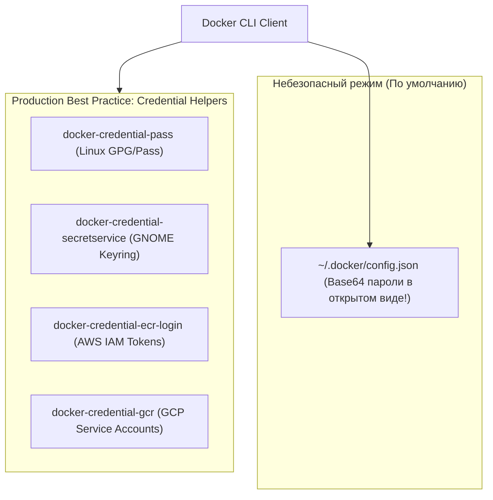
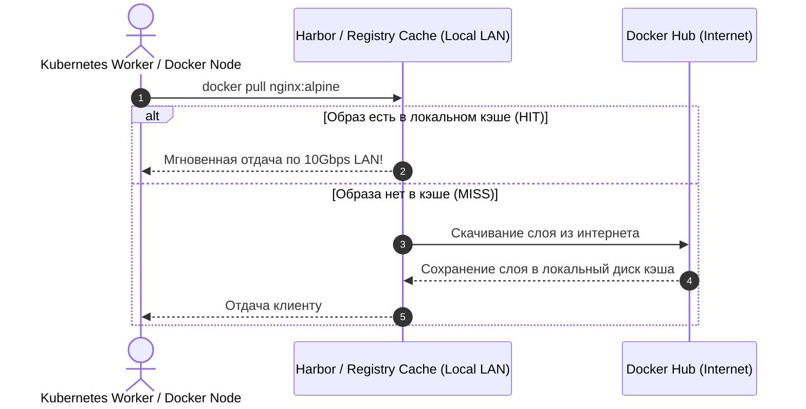

# 🔐 27. Аутентификация в Реестрах, Credential Helpers и Pull-Through Кэши

## 🔑 1. Хранение учетных данных: `~/.docker/config.json`

Когда вы выполняете `docker login registry.example.com`, клиент Docker сохраняет учетные данные в локальном файле `~/.docker/config.json`.



### Проблема открытого Base64:
По умолчанию `config.json` сохраняет пароли в виде:
```json
{
  "auths": {
    "https://index.docker.io/v1/": {
      "auth": "dXNlcm5hbWU6cGFzc3dvcmQxMjM="
    }
  }
}
```
Строка `dXNlcm5hbWU6cGFzc3dvcmQxMjM=` легко декодируется командой `base64 -d`, что раскрывает пароль учетной записи любому процессу на хосте.

### Настройка безопасных Credential Helpers:
В файле `~/.docker/config.json`:
```json
{
  "credsStore": "pass",
  "credHelpers": {
    "public.ecr.aws": "ecr-login",
    "gcr.io": "gcr"
  }
}
```

---

## 🗄️ 2. Развертывание приватного OCI Registry с базовой аутентификацией

Минимальный защищенный локальный реестр на базе официального образа `registry:2`:

### Шаг 1: Генерация пароля htpasswd
```bash
mkdir -p /opt/registry/{data,auth,certs}
# Создание пользователя admin с паролем
docker run --rm --entrypoint htpasswd httpd:2 -Bbn admin 'SuperSecretPassword123' > /opt/registry/auth/htpasswd
```

### Шаг 2: Генерация самоподписанного TLS-сертификата
```bash
openssl req -newkey rsa:4096 -nodes -sha256 -keyout /opt/registry/certs/domain.key \
  -x509 -days 365 -out /opt/registry/certs/domain.crt \
  -subj "/CN=registry.company.internal"
```

### Шаг 3: Запуск через Docker Compose
```yaml
# /opt/registry/docker-compose.yml
services:
  registry:
    image: registry:2.8.3
    container_name: private-registry
    restart: always
    ports:
      - "5000:5000"
    environment:
      REGISTRY_AUTH: htpasswd
      REGISTRY_AUTH_HTPASSWD_REALM: "Registry Realm"
      REGISTRY_AUTH_HTPASSWD_PATH: /auth/htpasswd
      REGISTRY_HTTP_TLS_CERTIFICATE: /certs/domain.crt
      REGISTRY_HTTP_TLS_KEY: /certs/domain.key
      REGISTRY_STORAGE_DELETE_ENABLED: "true"
    volumes:
      - ./data:/var/lib/registry
      - ./auth:/auth:ro
      - ./certs:/certs:ro
```

---

## ⚡ 3. Зеркалирование и Pull-Through Кэши (Registry Mirrors)

Чтобы обойти лимиты Docker Hub (Rate Limits: 100 pull в 6 часов) и ускорить загрузку образов в закрытых корпоративных контурах, настраивают **Registry Cache / Mirror**.



### Настройка Pull-Through Mirror на базе `registry:2`:
```yaml
services:
  docker-hub-mirror:
    image: registry:2.8.3
    environment:
      REGISTRY_PROXY_REMOTEURL: "https://registry-1.docker.io"
      REGISTRY_PROXY_USERNAME: "company_user"
      REGISTRY_PROXY_PASSWORD: "dockerhub_token"
    volumes:
      - /data/cache:/var/lib/registry
    ports:
      - "5001:5000"
```

### Подключение Mirror на всех хостах в `/etc/docker/daemon.json`:
```json
{
  "registry-mirrors": [
    "https://mirror.company.internal:5001"
  ],
  "insecure-registries": [
    "mirror.company.internal:5001"
  ]
}
```

После перезапуска `systemctl restart docker` все команды `docker pull alpine` будут автоматически маршрутизироваться через локальное зеркало.

---

## 💥 4. Реальный Troubleshooting

### Сценарий 1: Ошибка `x509: certificate signed by unknown authority`
**Симптомы:** При выполнении `docker login registry.company.internal:5000` возникает ошибка SSL:
`Error response from daemon: Get "https://registry...": x509: certificate signed by unknown authority`.

**Причина:** Демон Docker не доверяет самоподписанному сертификату корпоративного реестра.

**Решение:**
1. Поместить корневой сертификат реестра в доверенное хранилище Docker:
   ```bash
   sudo mkdir -p /etc/docker/certs.d/registry.company.internal:5000
   sudo cp /opt/registry/certs/domain.crt /etc/docker/certs.d/registry.company.internal:5000/ca.crt
   ```
2. Перезапустить демон Docker:
   ```bash
   sudo systemctl restart docker
   ```
