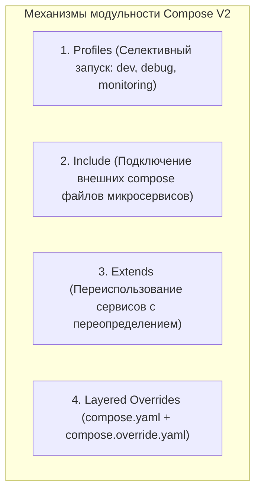

# 🎛️ 28. Продвинутый Docker Compose: Profiles, Extends, Include и Слоевые Конфигурации

## 🧩 Модульность и Масштабирование Compose файлов

В реальных проектах монолитный `docker-compose.yml` на 500 строк быстро становится неуправляемым. Спецификация Compose V2 предоставляет четыре мощных механизма декомпозиции и управления окружениями:



---

## 🎯 1. Профили сервисов: `profiles`

Директива `profiles` позволяет группировать сервисы и запускать их только при явном указании профиля в CLI или переменной окружения. Сервисы без секции `profiles` запускаются всегда.

```yaml
services:
  # Основной сервис приложения (запускается всегда)
  api:
    image: my-company/api:latest
    ports:
      - "8080:8080"
    environment:
      DATABASE_URL: postgres://user:pass@db:5432/app

  db:
    image: postgres:16-alpine
    volumes:
      - pgdata:/var/lib/postgresql/data

  # Сервис только для профиля "debug"
  pgadmin:
    image: dpage/pgadmin4:latest
    ports:
      - "5050:80"
    profiles:
      - debug
      - admin

  # Сервисы только для профиля "monitoring"
  prometheus:
    image: prom/prometheus:v2.50.0
    profiles:
      - monitoring

  grafana:
    image: grafana/grafana:10.3.0
    ports:
      - "3000:3000"
    profiles:
      - monitoring

volumes:
  pgdata:
```

### Запуск с нужными профилями:
```bash
# Запуск только основного стека (api + db)
docker compose up -d

# Запуск стека с включением мониторинга
docker compose --profile monitoring up -d

# Запуск со всеми инструментами отладки
COMPOSE_PROFILES=debug,monitoring docker compose up -d
```

---

## 📦 2. Модульное подключение подпроектов: `include`

Директива `include` (появилась в Compose v2.20) решает проблему управления большими микросервисными репозиториями (Monorepos и Polyrepos). Каждый микросервис хранит свой собственный изолированный `compose.yaml`, а корневой файл просто объединяет их:

```yaml
# Корневой compose.yaml
include:
  - path: ./services/auth/compose.yaml
  - path: ./services/billing/compose.yaml
  - path: ./infra/kafka/compose.yaml
    env_file: ./infra/kafka/.env.kafka

services:
  gateway:
    image: traefik:v3.0
    ports:
      - "80:80"
```

> [!TIP]
> Все пути к файлам и томам внутри включенных compose-файлов автоматически вычисляются **относительно директории этого включенного файла**, что предотвращает ошибки путей.

---

## 🧬 3. Наследование и DRY: `extends` и YAML Anchors

### Механизм `extends`
Позволяет наследовать конфигурацию сервиса из другого файла или внутри текущего файла:

```yaml
# common-services.yaml
services:
  base-worker:
    image: company/python-base:3.11
    restart: unless-stopped
    deploy:
      resources:
        limits:
          memory: 512M
    environment:
      LOG_LEVEL: INFO
```

Использование в основном `compose.yaml`:
```yaml
services:
  email-worker:
    extends:
      file: common-services.yaml
      service: base-worker
    command: ["python", "email_consumer.py"]
    environment:
      QUEUE_NAME: emails

  push-worker:
    extends:
      file: common-services.yaml
      service: base-worker
    command: ["python", "push_consumer.py"]
```

### Использование нативных якорей YAML (`&` и `*`):
```yaml
x-logging: &default-logging
  driver: "json-file"
  options:
    max-size: "20m"
    max-file: "3"

services:
  service-a:
    image: app-a:1.0
    logging: *default-logging

  service-b:
    image: app-b:1.0
    logging: *default-logging
```

---

## 🔀 4. Слоевые переопределения (Dev / Staging / Prod Overrides)

Docker Compose по умолчанию объединяет файлы в порядке:
1. `compose.yaml` (или `docker-compose.yml`) — базовое описание сервисов.
2. `compose.override.yaml` — автоматическое локальное переопределение для разработчика (монтирование исходников, debug порты).

### Паттерн разделения сред:
- `compose.yaml` (База: образы, сети, переменные по умолчанию)
- `compose.prod.yaml` (Production: жесткие лимиты, выключенные порты наружу, реплики)

Запуск на проде:
```bash
docker compose -f compose.yaml -f compose.prod.yaml up -d
```
