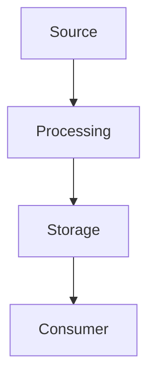

# Жизненный цикл контейнера

> create, start, pause, unpause, stop, kill, rm

---

## Теория

### Что это и зачем

create, start, pause, unpause, stop, kill, rm — ключевая технология в 03-docker. Понимание архитектуры и жизненного цикла критично для production.

### Архитектура



Основные компоненты:
- **Компонент 1** — отвечает за ...
- **Компонент 2** — обеспечивает ...
- **Компонент 3** — масштабирует ...

Жизненный цикл:
1. Инициализация
2. Конфигурация
3. Запуск
4. Наблюдение
5. Обновление/откат

Trade-offs:
- Плюсы: производительность, наблюдаемость
- Минусы: сложность, ресурсы

Связь с другими технологиями: интегрируется с ... через ...

---

## Практика

### Минимальный пример

```bash
# Проверка версии и базовый запуск
docker info && docker run --rm hello-world
```

```yaml
# Минимальная конфигурация
apiVersion: v1
kind: ConfigMap
metadata:
  name: demo
data:
  key: value
```

### Production-like пример

```yaml
# production.yaml — с лимитами, probe, ресурсами
apiVersion: apps/v1
kind: Deployment
metadata:
  name: demo-prod
spec:
  replicas: 3
  template:
    spec:
      containers:
      - name: app
        image: registry.example.com/app:1.2.3
        resources:
          requests: {cpu: "100m", memory: "128Mi"}
          limits: {cpu: "500m", memory: "512Mi"}
        livenessProbe:
          httpGet: {path: /healthz, port: 8080}
          initialDelaySeconds: 10
        readinessProbe:
          httpGet: {path: /ready, port: 8080}
```

```bash
# Деплой и проверка
kubectl apply -f production.yaml
kubectl rollout status deploy/demo-prod
kubectl get pods -l app=demo
curl -s http://localhost:8080/healthz | jq .
```

### Troubleshooting

**Симптом:** сервис не стартует / метрики отсутствуют.

```bash
# Диагностика
kubectl get pods
kubectl describe pod <pod>
kubectl logs <pod> --previous
kubectl get events --sort-by=.lastTimestamp
```

**Гипотезы:**
1. Не хватает ресурсов → `kubectl top pods`, `describe` Conditions
2. Ошибка конфигурации → `kubectl logs`, ` -o yaml`
3. Сеть / DNS → `dig`, `curl -v`, `ss -tulpn`

**Fix:**
```bash
# Пример исправления
kubectl set resources deploy/demo --limits=cpu=500m
kubectl rollout restart deploy/demo
```

**Verify:**
```bash
kubectl get pods
curl http://app/healthz
```

---

## Проверь себя

1. Чем отличается `requests` от `limits` и что будет при превышении?
2. Как работает liveness vs readiness probe и когда использовать каждую?
3. Что покажет `kubectl describe pod` при `CrashLoopBackOff` из-за `REQUIRED_DB_URL`?
4. Как диагностировать высокую cardinality в Prometheus/Loki?
5. В чём trade-off между `distroless` и `alpine` для production?
6. Как проверить, что `HPA` получает метрики?
7. Что делает `group_wait` в Alertmanager?

