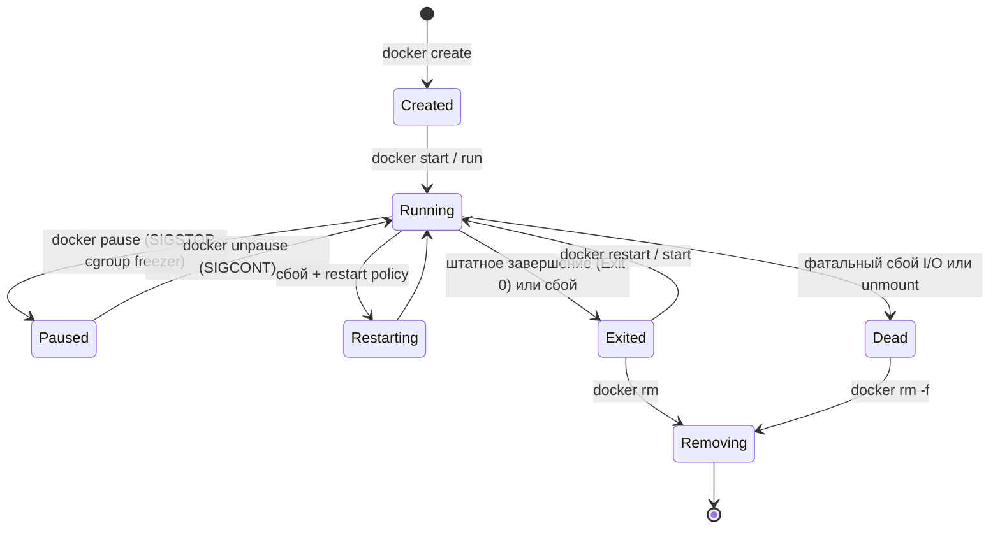
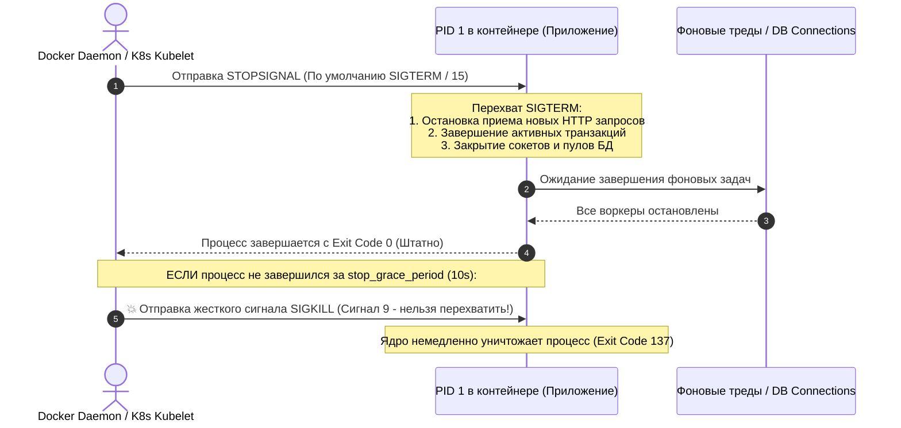

# 🔄 29. Жизненный Цикл Контейнера: Сигналы, Graceful Shutdown и Проблема PID 1

## 🌀 Конечный автомат состояний (Container State Machine)

В течение своей жизни контейнер переходит между семью дискретными состояниями ядра и демона:



### Значения состояний:
- **`created`:** OCI Bundle и config.json сформированы на диске, rootfs подготовлен, но процесс еще не запущен через `execve()`.
- **`running`:** Основной процесс (PID 1) активен в своих namespaces.
- **`paused`:** Процессы заморожены с помощью Cgroups Freezer Controller (процессы не потребляют CPU, но остаются в памяти).
- **`restarting`:** Контейнер упал и ожидает следующей попытки перезапуска согласно `restart_policy`.
- **`exited`:** Процесс завершился с кодом возврата (Exit Code).
- **`dead`:** Полумертвое состояние, когда демон не может освободить ресурсы или отмонтировать слои файловой системы.

---

## 🛑 1. Механика Graceful Shutdown и Сигналы Завершения

При выполнении команды `docker stop <container>` (или при редеплое в Kubernetes):



### Настройка таймаута плавной остановки:
В `docker-compose.yml`:
```yaml
services:
  web:
    image: my-app:latest
    stop_signal: SIGQUIT # Для Nginx или Ruby Unicorn
    stop_grace_period: 45s # Дать приложению до 45 секунд на сброс транзакций
```

В Docker CLI:
```bash
docker stop -t 30 my-container
```

---

## 🧟 2. Проблема PID 1 и Зомби-процессы (Zombie Reaping)

В стандартной системе Linux процесс `PID 1 (init / systemd)` выполняет две уникальные системные роли:
1. **Трансляция сигналов:** Перенаправление сигналов (`SIGTERM`, `SIGHUP`) дочерним процессам.
2. **Reaping (Усыновление и очистка зомби):** Когда любой дочерний процесс завершается, он переходит в состояние `zombie (<defunct>)`, пока его родитель не вызовет `waitpid()`. Если родитель умер, сироту усыновляет `PID 1` и вызывает `waitpid()`.

### Почему в контейнерах это проблема?
Если вы запускаете в контейнере приложение (например, Node.js, Python, Java или шелл-скрипт) напрямую как `PID 1`:
- Ядро Linux применяет к PID 1 особое правило: **сигналы по умолчанию для него игнорируются**, если процесс явно не зарегистрировал обработчик сигналов (Signal Handler).
- Если приложение порождает дочерние подпроцессы (`subprocess.Popen`, `child_process.fork`), но не обрабатывает `SIGCHLD`, таблица процессов заполняется зомби (`<defunct>`), что в итоге исчерпывает `pids.max` и кладет контейнер!

```mermaid
graph TD
    subgraph Problem["Без Init-системы (ПРОБЛЕМА)"]
        PID1_Bad["PID 1: Node.js (Не умеет reap zombie)"]
        Child1["Child process: git clone (Exited)"]
        Zombie["Zombie <defunct> (Утечка Process Table)"]
        PID1_Bad --> Child1
        Child1 -.-> Zombie
    end

    subgraph Solution["С Tini Init (РЕШЕНИЕ)"]
        Tini["PID 1: tini / dumb-init (Init System)"]
        AppNode["PID 2: Node.js (Приложение)"]
        WorkerSub["PID 3: Subprocess"]
        Tini --> AppNode
        AppNode --> WorkerSub
        Tini ===>|Автоматический waitpid()| WorkerSub
    end
```

---

## 🛡️ 3. Решение: Встроенный Tini и `--init` флаг

### Способ 1: Флаг `--init` в Docker CLI / Compose
Docker содержит встроенный сверхлегкий init-процесс `tini`:
```bash
docker run -d --init my-node-app:latest
```
В `docker-compose.yml`:
```yaml
services:
  app:
    image: node:20-alpine
    init: true # Docker автоматически встроит tini как PID 1
```

### Способ 2: Встраивание `tini` в Dockerfile
```dockerfile
FROM alpine:3.19
RUN apk add --no-cache tini

WORKDIR /app
COPY app.js .

# Tini запускается как PID 1 и корректно форвардит сигналы в node
ENTRYPOINT ["/sbin/tini", "--"]
CMD ["node", "app.js"]
```

---

## 💥 4. Реальный Troubleshooting

### Сценарий 1: Контейнер всегда останавливается ровно 10 секунд
**Симптомы:** Команда `docker stop` или передеплой в CI/CD всегда зависает ровно на 10 секунд для каждого контейнера, после чего они завершаются с Exit Code 137.

**Причина:** В Dockerfile использована shell-форма `CMD node index.js` вместо `CMD ["node", "index.js"]`. В результате `/bin/sh` стал PID 1, проигнорировал `SIGTERM`, и Docker убил его по таймауту через `SIGKILL`.

**Решение:**
Переписать `ENTRYPOINT` / `CMD` в JSON Exec-формате:
```dockerfile
ENTRYPOINT ["node", "index.js"]
```
