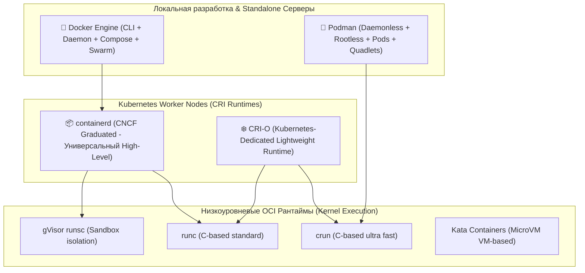
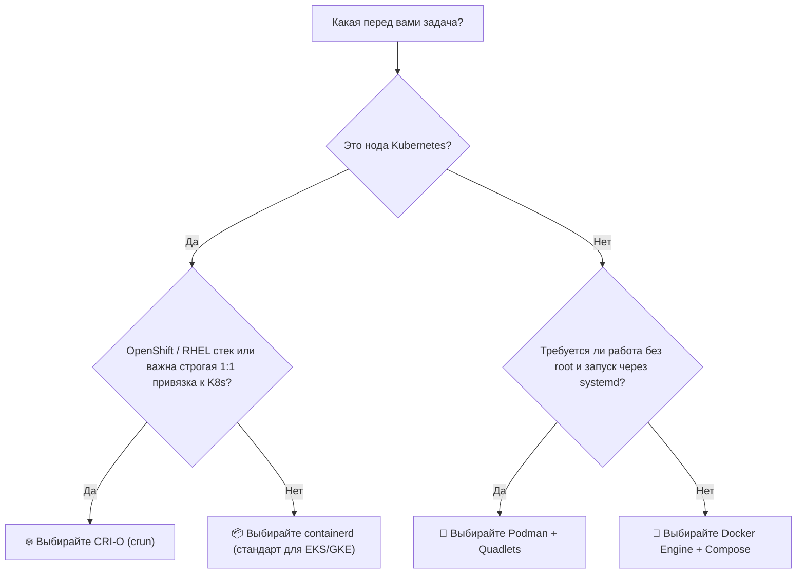

# ⚖️ 30. Битва Рантаймов: Docker vs Podman vs containerd vs CRI-O

## 🏛️ Ландшафт современных Container Runtimes

В современной экосистеме Linux контейнеров выбор рантайма зависит от целевого сценария: локальная разработка, standalone-сервер или нода промышленного кластера Kubernetes.



---

## 📊 1. Комплексная сравнительная матрица

| Критерий | Docker Engine (Moby) | Podman (Red Hat) | containerd (CNCF) | CRI-O (Red Hat/CNCF) |
| :--- | :--- | :--- | :--- | :--- |
| **Основная цель** | Разработка, CI/CD, простые сервера | Безопасная разработка, rootless, systemd | Универсальный рантайм для k8s и Docker | **Исключительно Kubernetes** |
| **Архитектура** | Демон `dockerd` (Client-Server) | **Daemonless** (Fork-Exec) | Демон `containerd` (gRPC API) | Демон `crio` (CRI Only) |
| **Rootless по умолчанию** | ⚠️ Требует сложной настройки | ✅ **Нативно из коробки** | ⚠️ Экспериментально | ⚠️ Через K8s UserNS |
| **Поддержка CRI (K8s)** | ❌ Удален (Dockershim dead) | ❌ Нет (использует CRI-O)| ✅ Встроенный плагин `cri` | ✅ **Создан специально под CRI** |
| **Поддержка Compose** | ✅ Нативно (`docker compose`) | ✅ Совместим (`podman compose`)| ❌ Нет (только через `nerdctl`) | ❌ Нет |
| **Потребление RAM демоном**| ~80–150 МБ | **0 МБ** (нет демона) | ~30–60 МБ | ~20–40 МБ |
| **Single Point of Failure**| Да (падение демона) | **Нет** | Да (падение демона) | Да (падение демона) |
| **Совместимость версий K8s** | N/A | N/A | Независимые релизы | **Строгая привязка 1:1 к K8s** |

---

## 🔍 2. Глубокий анализ каждого решения

### 2.1. Docker Engine (Moby)
- **Плюсы:** Золотой стандарт для разработчиков, гигантская экосистема, встроенный Docker Compose V2, отличный GUI (Docker Desktop), удобный плагин `buildx`.
- **Минусы:** Демон работает от root по умолчанию, единая точка отказа, исключен из состава Kubernetes нод (Dockershim Deprecation).
- **Когда использовать:** Локальные рабочие станции разработчиков, простые виртуальные машины с Docker Compose.

---

### 2.2. Podman
- **Плюсы:**
  - Полная безопасность: контейнеры запускаются от обычного пользователя (Rootless).
  - Нет фонового демона: процессы не умирают при сбоях управляющих утилит.
  - Поддержка концепции **Pods** (объединение контейнеров с общим `netns`, как в K8s).
  - Генерация systemd юнитов через **Quadlets**.
  - Прямой запуск манифестов Kubernetes (`podman play kube`).
- **Минусы:** На macOS и Windows требует отдельной виртуальной машины (Podman Machine), чуть сложнее настройка сетевых мостов.
- **Когда использовать:** Серверы на RHEL/CentOS/Fedora/Rocky, среды с жесткими требованиями безопасности (PCI-DSS, ISO 27001), замена Docker на рабочих станциях.

---

### 2.3. containerd
- **Плюсы:**
  - Промышленный стандарт для большинства Kubernetes кластеров (EKS, GKE, AKS, Talos, k3s).
  - Высокая надежность и модульная архитектура (Snapshotters, Content store).
  - Поддержка кастомных рантаймов (gVisor, Kata Containers, WebAssembly) через Runtime V2 API.
- **Минусы:** CLI-утилита `ctr` предназначена только для внутренней отладки, не заменяет повседневный Docker CLI (требуется `nerdctl`).
- **Когда использовать:** Kubernetes кластеры общего назначения, облачные провайдеры.

---

### 2.4. CRI-O
- **Плюсы:**
  - Разработан **исключительно как реализация CRI для Kubernetes** (ничего лишнего).
  - Минималистичная кодовая база, минимальное потребление оперативной памяти и CPU.
  - Каждая версия CRI-O строго соответствует мажорной версии Kubernetes (CRI-O 1.29 для Kubernetes 1.29) и тестируется вместе с ней.
  - Идеальная интеграция с низкоуровневым рантаймом **`crun`** (написан на Си, в 2 раза быстрее Go `runc`).
- **Когда использовать:** OpenShift кластеры, кастомные bare-metal K8s инсталляции с максимальными требованиями к производительности.

---

## 🚀 3. Гайд по миграции: С Docker на Podman

Миграция в 95% случаев бесшовна благодаря полной совместимости CLI:

```bash
# 1. Установка Podman
sudo apt-get install -y podman podman-compose

# 2. Создание алиасов
echo "alias docker=podman" >> ~/.bashrc
source ~/.bashrc

# 3. Настройка сокета для поддержки Docker Compose
systemctl --user enable --now podman.socket

# 4. Экспорт переменной DOCKER_HOST для инструментов, ищущих /var/run/docker.sock
export DOCKER_HOST="unix:///run/user/$UID/podman/podman.sock"
```

---

## 🎯 4. Итоговая шпаргалка выбора (Decision Matrix)


