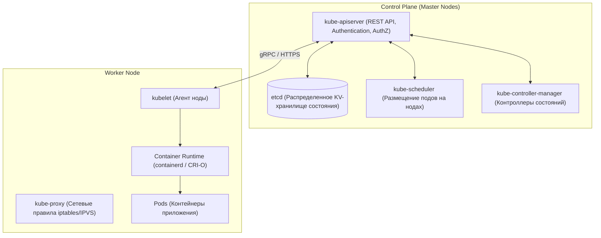

# ☸️ 01. Архитектура Kubernetes и базовые Workloads

## 🏛️ Архитектура кластера Kubernetes

Kubernetes состоит из двух логических уровней: **Control Plane (Мастер-узлы)** и **Worker Nodes (Рабочие узлы)**.



---

## 📦 Основные Workload-контроллеры

### 1. Pod (Атомарная единица развертывания)
Группа из одного или нескольких контейнеров, разделяющих общие сетевые пространства (IP-адрес, порты) и тома хранения.

#### Пробы состояния (Probes):
- **`startupProbe`:** Проверяет, что тяжелое приложение успешно стартовало (на время старта liveness и readiness отключаются).
- **`readinessProbe`:** Готов ли под принимать клиентский трафик? (Если `false`, под исключается из балансировщика Service).
- **`livenessProbe`:** Жив ли под? (Если `false`, kubelet принудительно перезагружает контейнер).

---

### 2. Deployment (Приложения без состояния / Stateless)
Управляет набором реплик (`ReplicaSet`) и обеспечивает плавное обновление версий (Rolling Update):

```yaml
apiVersion: apps/v1
kind: Deployment
metadata:
  name: web-api
  namespace: production
  labels:
    app.kubernetes.io/name: web-api
spec:
  replicas: 3
  strategy:
    type: RollingUpdate
    rollingUpdate:
      maxSurge: 25%        # Сколько подов можно создать сверх нормы во время обновления
      maxUnavailable: 0    # Ноль простоев: не удалять старый под, пока новый не стал Ready
  selector:
    matchLabels:
      app: web-api
  template:
    metadata:
      labels:
        app: web-api
    spec:
      containers:
        - name: app
          image: registry.company.com/web-api:v1.4.0
          imagePullPolicy: IfNotPresent
          ports:
            - containerPort: 8080
          resources:
            requests:
              cpu: "250m"
              memory: "256Mi"
            limits:
              cpu: "1000m"
              memory: "512Mi"
          startupProbe:
            httpGet:
              path: /healthz
              port: 8080
            failureThreshold: 30
            periodSeconds: 2
          readinessProbe:
            httpGet:
              path: /ready
              port: 8080
            periodSeconds: 5
          livenessProbe:
            httpGet:
              path: /healthz
              port: 8080
            periodSeconds: 10
```

---

### 3. StatefulSet (Приложения с состоянием / Stateful)
Предназначен для баз данных (PostgreSQL, MongoDB, Kafka, ElasticSearch):
- **Стабильные сетевые имена:** `db-0`, `db-1`, `db-2`.
- **Индивидуальные диски:** Каждый под получает свой собственный PVC через `volumeClaimTemplates`.
- **Строгий порядок запуска и остановки:** По очереди (0 $\to$ 1 $\to$ 2).

---

### 4. DaemonSet (Системные агенты)
Гарантирует запуск ровно одной копии пода на каждой ноде кластера (сборщики логов Promtail/Fluentbit, мониторинг Node Exporter, сетевые плагины Cilium/Calico).

---

## ⚡ Ресурсы: Requests, Limits и QoS классы

- **`requests` (Запрос):** Гарантированный минимум ресурсов, на основе которого `kube-scheduler` ищет подходящую ноду.
- **`limits` (Лимит):**
  - **CPU:** При превышении лимита процесс **не убивается**, а искусственно замедляется (CPU Throttling через `cgroups CFS quota`).
  - **Memory:** При превышении лимита процесс немедленно **убивается ядром с ошибкой OOMKilled (Exit Code 137)**.

### Классы качества обслуживания (QoS Classes):
1. **`Guaranteed`:** `requests == limits` для CPU и памяти во всех контейнерах. Убиваются OOM-киллером в последнюю очередь.
2. **`Burstable`:** `requests < limits`. Стандартный рабочий класс.
3. **`BestEffort`:** `requests` и `limits` не указаны вообще. Убиваются OOM-киллером первыми при малейшей нехватке памяти на ноде.

---

## 🔬 Deep Dive: QoS классы и порядок эвикций

| QoS | Условие | При pressure нода убивает |
| :--- | :--- | :--- |
| Guaranteed | limits == requests на все ресурсы | последними |
| Burstable | хотя бы один request задан | по превышению requests |
| BestEffort | нет ни requests ни limits | **первыми** |

```bash
kubectl get pods -A -o json | jq -r '.items[] | [.metadata.namespace,.metadata.name,.status.qosClass] | @tsv'
```

### Workload decision matrix

| Задача | Объект | Почему не другой |
| :--- | :--- | :--- |
| Stateless web | Deployment | rolling update из коробки |
| Очередь воркеров | Deployment + HPA | горизонтальный скейл по lag |
| БД (RWO диск) | StatefulSet | стабильные identity + PVC шаблоны |
| Daemon (логи/CNI) | DaemonSet | ровно один на ноду |
| Джобы/кроны | Job / CronJob | retry/backoffLimit/concurrencyPolicy |
| ML/GPU шаринг | не Deployment | `ReplicationController` legacy, `bare pod` = антипаттерн |

!!! tip "Owner References"
    Каскадное удаление работает через `ownerReferences`: удаление Deployment удаляет RS → Pod'ы. `--cascade=orphan` оставляет детей сиротами (используется при миграциях между контроллерами).

---

<!-- enriched:v1 -->

## 🧨 Типовые грабли Production

| Симптом | Причина | Быстрое решение |
| :--- | :--- | :--- |
| Pod OOMKill'ed при старте | Java/Go резервируют память ≠ `requests` | Настроить `-XX:MaxRAMPercentage`, `GOMEMLIMIT` |
| Rolling update «мигает» 502 | Нет PDB + readiness гонки | `PodDisruptionBudget` + `preStop sleep 5` |
| DNS timeout раз в N минут | conntrack race / NodeLocal DNSCache | Включить `NodeLocal DNSCache`, обновить ядро |
| Эвикции при низкой утилизации | `requests` задраны «с запасом» | VPA в режиме recommendation, перерасчет |

!!! note "Requests vs Limits"
    `requests` — это планировщик (гарантия), `limits` — троттлинг/OOM (потолок). CPU без limit = Burstable и обычно **лучше** для latency-чувствительных сервисов (нет throttling).

## 🧪 Hands-on Lab (15 минут)

```bash
# 1. Разверните kind-кластер и воспроизведите сценарий из таблицы
kind create cluster --config - <<EOF
kind: Cluster
apiVersion: kind.x-k8s.io/v1alpha4
nodes:
- role: control-plane
- role: worker
EOF
kubectl top nodes && kubectl get events -A --sort-by=.lastTimestamp | tail -20 && \
kubectl get pods -A -o wide --field-selector status.phase!=Running
```

## 🧪 Hands-on Lab (30 минут): Deployment от нуля до боевого

!!! abstract "Формат"
    **Стенд:** kind ([Lab 03](../16-guided-labs/03-lab-kubernetes-kind-app.md)). **Легенда:** выкатываем сервис так, чтобы он пережил отказ узла и деплой без даунтайма. Каждый шаг заканчивается проверкой.

### Шаг 1. Минимальный деплой и знакомство с его жизнью

```bash
kubectl create deployment web --image=nginx:1.27 --replicas=2
kubectl get deploy,pods -o wide && kubectl rollout history deploy/web
```

**Ожидаемый вывод:** 2 пода на разных узлах (или одном в kind — почему?), ReplicaSet `web-7d...` в истории.

??? question "Кто именно создал поды — Deployment?"
    Нет: ReplicaSet. Deployment — только стратегия обновлений поверх RS. Это видно: при rollback Deployment меняет RS, а не трогает поды напрямую. Проверьте `kubectl get rs`.

### Шаг 2. Добавляем боевую обвязку (probes, resources, PDB)

```bash
kubectl set resources deploy/web --requests=cpu=100m,memory=64Mi --limits=cpu=500m,memory=128Mi
kubectl patch deploy/web --type merge -p '
spec:
  template:
    spec:
      containers:
        - name: nginx
          readinessProbe: { httpGet: { path: /, port: 80 }, initialDelaySeconds: 3 }
          livenessProbe:  { httpGet: { path: /, port: 80 }, periodSeconds: 10 }'
kubectl get pods -l app=web   # READY 1/1 после проб?
```

**Ожидаемый вывод:** поды перечислены, READY 1/1, рестартов нет.

### Шаг 3. Проверяем отказоустойчивость ломанием

```bash
# Убиваем под грубо — что произойдёт и как быстро восстановится сервис?
POD=$(kubectl get pod -l app=web -o name | head -1)
kubectl delete $POD --force --grace-period=0
watch 'kubectl get pods -l app=web'    # новый под за секунды

# Проверяем rolling update без даунтайма
kubectl set image deploy/web nginx=nginx:1.27-alpine
kubectl rollout status deploy/web      # по одному поду, без простоя
kubectl rollout undo deploy/web        # и откат одной командой
```

**Критерий успеха:** во время rolling update сервис ни разу не вернул ошибку (проверьте loop'ом curl через Service).

### Шаг 4. Проверь себя (ответы вслух до раскрытия)

1. Почему без requests HPA и scheduler работают некорректно? Два разных эффекта.
2. Чем liveness отличается от readiness? Что случится при перепутывании?
3. Под в CrashLoopBackOff — какие три места смотреть по порядку?

<details><summary>Ответы</summary>

1. Scheduler размещает по requests (нет их → BestEffort, первым на eviction); HPA считает usage/request (нет знаменателя → unknown).
2. Liveness = «процесс жив» (иначе рестарт контейнера), readiness = «готов трафик» (иначе вывод из Service). Перепутали liveness с зависимостью к БД → рестарт-шторм при лаге БД.
3. `kubectl describe` (events) → `logs --previous` → манифест/env/configmap.
</details>

## ✅ Чек-лист зрелости темы

- [ ] Все Deployment имеют `requests`/`limits`, liveness/readiness/startup пробы

    ??? tip "Как закрыть пункт"
        Requests — по данным недели из metrics/VPA-рекомендаций; limits осознаны для runtime (JVM heap vs cgroup). Пробы разделены по смыслу: startup для медленного старта, liveness НЕ про внешние зависимости. Автопроверка: kyverno-политика или kube-score в CI.

- [ ] Настроен `PodDisruptionBudget` и `topologySpreadConstraints`

    ??? tip "Как закрыть пункт"
        PDB допускает ≥1 нарушение (`minAvailable: N-1`, не N!) — иначе drain вечен (см. Break-Fix №12). Spread по zones+nodes гарантирует переживание отказа AZ. Тест зрелости: `kubectl drain` узла проходит, SLO не нарушен.

- [ ] Есть NetworkPolicy по умолчанию (default-deny) в каждом namespace

    ??? tip "Как закрыть пункт"
        Default-deny ingress+egress, затем явные allow-правила (DNS! иначе всё ляжет). Шаблон — [18.1](../18-templates/01-containers-and-k8s.md). Проверка: из «чужого» пода curl к сервису таймаутится.

---

- [ ] RBAC минимально-привилегированный, ServiceAccount токены не монтируются лишний раз

    ??? tip "Как закрыть пункт"
        `automountServiceAccountToken: false` по умолчанию; роли с verb/resource списком, не `*`. Аудит: kubectl-who-can / audit2rbac. Проверка: pod без явной необходимости не имеет токена в /var/run/secrets.

- [ ] Проверяется совместимость манифестов с новой версией K8s (kubent/pluto)

    ??? tip "Как закрыть пункт"
        kubent/pluto в CI перед каждым минорным апгрейдом кластера (см. [04.9](09-k8s-cluster-operations.md)); deprecated API = блокирующий warning. Список удалённых API на целевую версию — в PR апгрейда.

---

## 🧭 Что дальше

| Шаг | Материал |
| :--- | :--- |
| 🔬 Закрепить | [Lab 03: приложение в kind](../16-guided-labs/03-lab-kubernetes-kind-app.md) |
| 💪 Практика | [Задачи по K8s](../15-hands-on-practice/01-100-devops-practical-tasks-part1.md) |
| 🎤 Проверить себя | [Вопросы собесов: K8s](../14-interview-prep/03-100-devops-interview-questions-bank-part1.md) |
