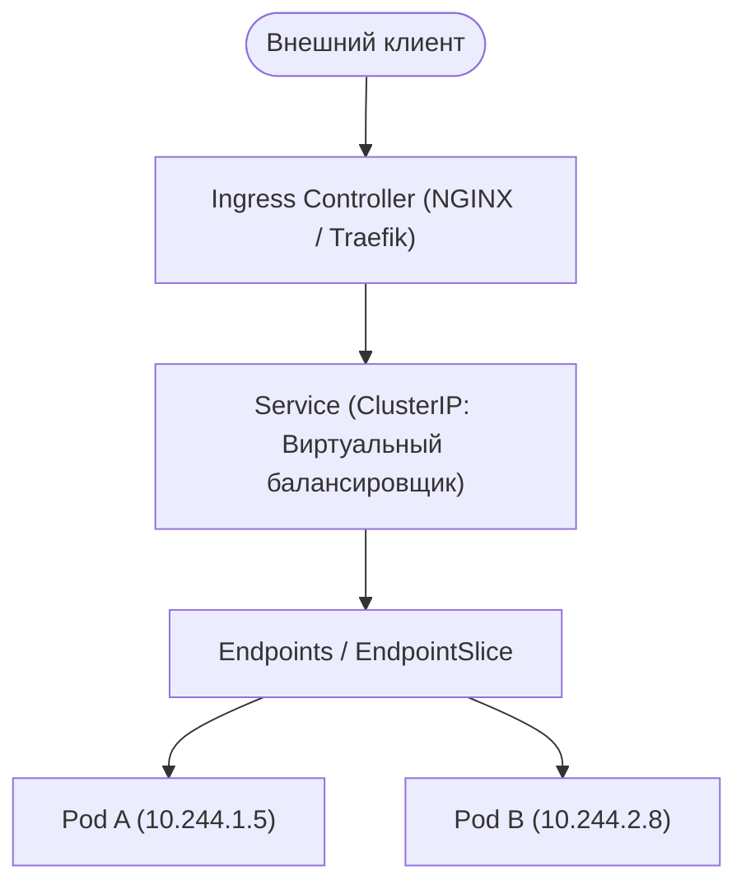
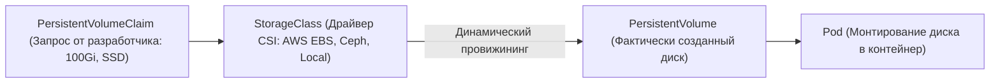
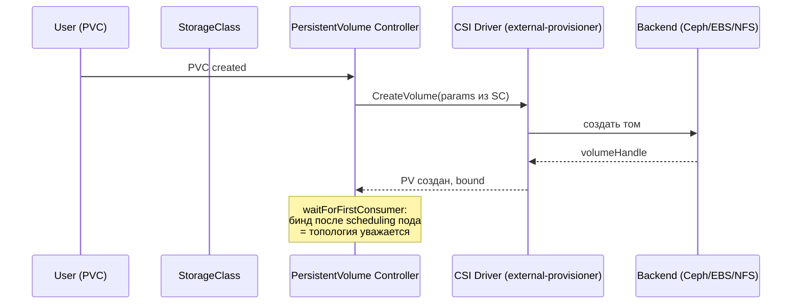

# 🌐 02. Сети (CNI, Services, Ingress) и Хранилище (CSI, PVC)

## 📡 Сетевая модель Kubernetes

Kubernetes предъявляет три фундаментальных правила к сети:
1. Каждый Pod получает свой собственный уникальный IP-адрес.
2. Поды на любых нодах могут общаться друг с другом напрямую без NAT.
3. Агенты ноды (kubelet) могут общаться со всеми подами на этой ноде.



---

## 🔀 Типы Kubernetes Services

| Тип | Где доступен | Назначение |
| :--- | :--- | :--- |
| **`ClusterIP`** (Default) | Только внутри кластера | Стабильный виртуальный IP и DNS-имя для межсервисного взаимодействия. |
| **`NodePort`** | На IP каждой ноды (`30000-32767`) | Прямой доступ к сервису через порт физического сервера. |
| **`LoadBalancer`** | Внешний IP из интернета | Автоматически заказывает облачный балансировщик (AWS NLB/ALB, GCP LB). |
| **`ExternalName`** | Внутри кластера | CNAME алиас на внешний домен (например, `db.rds.amazonaws.com`). |
| **`Headless`** (`clusterIP: None`) | Внутри кластера | Возвращает прямые IP всех подов (используется StatefulSet). |

---

## 🛡️ Сетевые политики (NetworkPolicy: Zero Trust)

По умолчанию в Kubernetes все поды во всех неймспейсах могут свободно общаться друг с другом. В production применяется подход **Default Deny**:

```yaml
# 1. Запретить абсолютно весь входящий и исходящий трафик в namespace
apiVersion: networking.k8s.io/v1
kind: NetworkPolicy
metadata:
  name: default-deny-all
  namespace: production
spec:
  podSelector: {} # Применяется ко всем подам
  policyTypes:
    - Ingress
    - Egress
---
# 2. Точечно разрешить бэкенду обращаться только к PostgreSQL
apiVersion: networking.k8s.io/v1
kind: NetworkPolicy
metadata:
  name: allow-backend-to-db
  namespace: production
spec:
  podSelector:
    matchLabels:
      app: backend-api
  policyTypes:
    - Egress
  egress:
    - to:
        - podSelector:
            matchLabels:
              app: postgres-db
      ports:
        - protocol: TCP
          port: 5432
```

---

## 💾 Архитектура хранения данных (CSI, StorageClass, PVC)



### Режимы доступа (Access Modes):
- **`ReadWriteOnce (RWO)`:** Диск монтируется на чтение и запись **только к одной ноде** (стандарт для блочных хранилищ AWS EBS / GCP PD).
- **`ReadOnlyMany (ROX)`:** Диск монтируется только на чтение множеством нод одновременно.
- **`ReadWriteMany (RWX)`:** Диск доступен на чтение и запись множеству нод одновременно (Сетевые ФС: NFS, CephFS, AWS EFS).

### Пример манифеста PVC:
```yaml
apiVersion: v1
kind: PersistentVolumeClaim
metadata:
  name: data-storage-claim
  namespace: production
spec:
  accessModes:
    - ReadWriteOnce
  storageClassName: fast-nvme-sc
  resources:
    requests:
      storage: 50Gi
```

---

## 🔬 Deep Dive: kube-proxy режимы и Headless Services

| Режим | Механизм | Плюс | Минус |
| :--- | :--- | :--- | :--- |
| iptables (default) | случайный DNAT по правилам | просто | O(n) правил, нет прямых проверок |
| IPVS | хэш-таблица в ядре | тысячи сервисов, lb алгоритмы | модуль ядра на каждой ноде |
| eBPF (Cilium replacement) | замена kube-proxy целиком | fastest, native L4/L7 policy | требования к ядру ≥ 5.x |

**Headless Service** (`clusterIP: None`) — не балансирует, а отдает DNS-записи всех подов: так работают StatefulSet peer discovery (Kafka, Cassandra, etcd).

```bash
dig +short kafka-headless.kafka.svc.cluster.local
# 10.244.1.15, 10.244.2.22, ... — каждый под напрямую
```

### Storage: путь PVC от заявки до диска



⚠️ `volumeBindingMode: WaitForFirstConsumer` обязателен для зонированных облаков, иначе диск создается в зоне А, а под улетает в зону B.

---

<!-- enriched:v1 -->

## 🧨 Типовые грабли Production

| Симптом | Причина | Быстрое решение |
| :--- | :--- | :--- |
| Pod OOMKill'ed при старте | Java/Go резервируют память ≠ `requests` | Настроить `-XX:MaxRAMPercentage`, `GOMEMLIMIT` |
| Rolling update «мигает» 502 | Нет PDB + readiness гонки | `PodDisruptionBudget` + `preStop sleep 5` |
| DNS timeout раз в N минут | conntrack race / NodeLocal DNSCache | Включить `NodeLocal DNSCache`, обновить ядро |
| Эвикции при низкой утилизации | `requests` задраны «с запасом» | VPA в режиме recommendation, перерасчет |

!!! note "Requests vs Limits"
    `requests` — это планировщик (гарантия), `limits` — троттлинг/OOM (потолок). CPU без limit = Burstable и обычно **лучше** для latency-чувствительных сервисов (нет throttling).

## 🧪 Hands-on Lab (15 минут)

```bash
# 1. Разверните kind-кластер и воспроизведите сценарий из таблицы
kind create cluster --config - <<EOF
kind: Cluster
apiVersion: kind.x-k8s.io/v1alpha4
nodes:
- role: control-plane
- role: worker
EOF
kubectl get sc,pvc,pv -A && kubectl describe pvc data-app-0 -n app | tail -15 && \
kubectl -n kube-system get ds kube-proxy -o yaml | grep mode
```

## ✅ Чек-лист зрелости темы

- [ ] Все Deployment имеют `requests`/`limits`, liveness/readiness/startup пробы

    ??? tip "Как закрыть пункт"
        Requests по данным недели/VPA-рекомендаций; probes разделены по смыслу (liveness ≠ зависимость к БД); startup для медленного старта. Автопроверка: kube-score/Kyverno в CI блокирует деплой без проб.

- [ ] Настроен `PodDisruptionBudget` и `topologySpreadConstraints`

    ??? tip "Как закрыть пункт"
        PDB допускает ≥1 нарушение (minAvailable N-1, не N — иначе drain вечен). Spread по zones+nodes: реплики переживают отказ AZ. Тест: kubectl drain проходит без нарушения SLO ([04.9](09-k8s-cluster-operations.md)).

- [ ] Есть NetworkPolicy по умолчанию (default-deny) в каждом namespace

    ??? tip "Как закрыть пункт"
        Default-deny ingress+egress + явные allow (DNS первым делом!). Шаблон — [18.1](../18-templates/01-containers-and-k8s.md). Проверка: чужой под не достучался, легитимный клиент — достучался.

- [ ] RBAC минимально-привилегированный, ServiceAccount токены не монтируются лишний раз

    ??? tip "Как закрыть пункт"
        automountServiceAccountToken: false по умолчанию; роли перечисляют verbs/resources явно, без wildcards. Аудит: kubectl-who-can на критичные права; токены в подах только там, где реально нужен API.

- [ ] Проверяется совместимость манифестов с новой версией K8s (kubent/pluto)

    ??? tip "Как закрыть пункт"
        kubent/pluto в CI перед минорным апгрейдом; deprecated API — блокирующий warning. Список удалённых API целевой версии приложен к PR апгрейда ([04.9](09-k8s-cluster-operations.md)).

---

## 🧭 Что дальше

| Шаг | Материал |
| :--- | :--- |
| 🔬 Закрепить | [Lab 03: ingress и PVC](../16-guided-labs/03-lab-kubernetes-kind-app.md) |
| 🎤 Проверить себя | [Вопросы: CNI, Services](../14-interview-prep/03-100-devops-interview-questions-bank-part1.md) |
