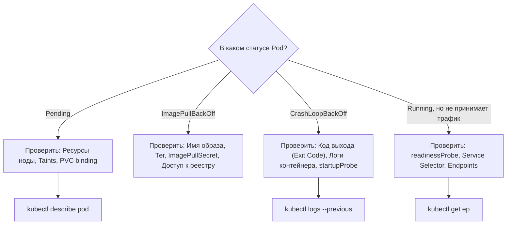
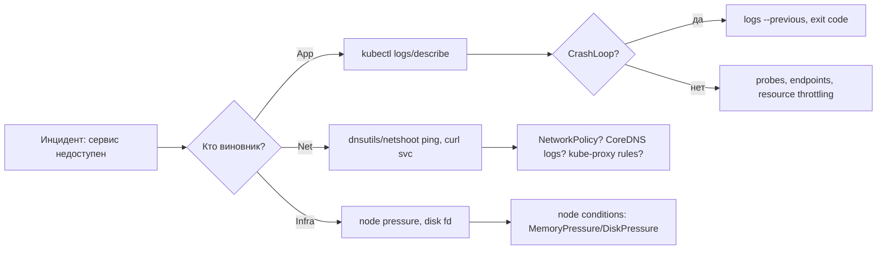

# 🚨 04. Справочник по устранению неполадок (Kubernetes Troubleshooting)

## 🗺️ Блок-схема диагностики упавшего Pod



---

## 🛑 Расшифровка типовых статусов и кодов выхода

### 1. Коды выхода (Exit Codes)
| Код выхода | Причина | Что делать |
| :--- | :--- | :--- |
| **`Exit Code 137`** | **`OOMKilled`** (Process killed by SIGKILL due to memory limit) | Увеличьте `resources.limits.memory` или устраните утечку памяти в коде. |
| **`Exit Code 143`** | **`SIGTERM`** (Graceful termination timeout) | Контейнер штатно завершался, но не успел уложиться в `terminationGracePeriodSeconds` (по дефолту 30с). |
| **`Exit Code 1`** | **Application Error** | Падение программы (Exception, паника, неверный конфиг). Читайте `kubectl logs`. |
| **`Exit Code 126`** | **Permission Denied** | Бинарник не имеет флага исполнения (`chmod +x`). |
| **`Exit Code 127`** | **Command Not Found** | Указанная в `command`/`ENTRYPOINT` утилита отсутствует в образе (часто в `alpine`/`distroless`). |

---

## 🛠️ Пошаговые сценарии решения проблем

### Сценарий 1: Pod в статусе `CrashLoopBackOff`
```bash
# 1. Читаем логи УПАВШЕЙ предыдущей инкарнации контейнера (--previous)
kubectl logs <pod-name> -n <namespace> --previous

# 2. Если в поде несколько контейнеров:
kubectl logs <pod-name> -c <container-name> -n <namespace> --previous

# 3. Проверяем секцию Last State и Events:
kubectl describe pod <pod-name> -n <namespace>
```

### Сценарий 2: Pod в статусе `Pending`
```bash
# Смотрим блок Events в самом низу вывода:
kubectl describe pod <pod-name> -n <namespace>
```
*Типичные причины в Events:*
- `0/10 nodes are available: 10 Insufficient memory` $\to$ Кластер переполнен. Нужен автоскейлинг (Cluster Autoscaler) или снижение `requests`.
- `0/5 nodes are available: node(s) had untolerated taint` $\to$ Нода заблокирована тselector/taint.
- `persistentvolumeclaim "data-pvc" not found` $\to$ Не создан или не смонтирован диск.

### Сценарий 3: Pod запущен (`Running`), но Service отдает 502/503
```bash
# 1. Проверяем, есть ли у сервиса живые Endpoints:
kubectl get endpoints <service-name> -n <namespace>
# Если Endpoints: <none>, значит selector в Service не совпадает с labels в Deployment!

# 2. Проверяем readiness probe:
kubectl describe pod <pod-name> | grep -A 5 Readiness

# 3. Проверяем порт: TargetPort в Service должен строго совпадать с портом, который слушает приложение.
```

---

## 🔍 Интерактивная отладка: Ephemeral Containers (`kubectl debug`)

Если в production-образе (например, Distroless) нет ни `sh`, ни `curl`, ни `ping`:

```bash
# Подключаем отладочный контейнер с утилитами в сеть и namespaces целевого пода:
kubectl debug -it <pod-name> \
  --image=nicolaka/netshoot \
  --target=<container-name> \
  -n <namespace>
```
*(Внутри сразу доступны `tcpdump`, `curl`, `nslookup`, `htop` для отладки процессов целевого контейнера!)*

---

## 🔬 Deep Dive: систематический метод вместо гадания



### Продвинутые команды дежурного

```bash
# Сравнить манифест в Git с тем, что реально крутится (drift)
kubectl get deploy api -o yaml | kubectl-neat diff -f deploy.yaml

# Порт-форвард к поду за Service без Ingress (отладка локально)
kubectl port-forward svc/api 8080:80 -n prod

# Запустить netshoot в сети проблемного пода (общий net ns)
kubectl run debug --rm -it --image=nicolaka/netshoot --overrides='
{"spec":{"containers":[{"name":"debug","image":"nicolaka/netshoot","command":["sh"],
"securityContext":{},"stdin":true,"tty":true}]}}' -n prod

# Кто съел квоту namespace?
kubectl describe resourcequota -n team-a compute-resources
```

### Exit Code 137 vs 143 — не путать!

137 = SIGKILL: либо OOMKilled (смотрите `Last State`), либо `terminationGracePeriodSeconds` истек. 143 = SIGTERM доставлен и обработан приложением штатно.

---

<!-- enriched:v1 -->

## 🧨 Типовые грабли Production

| Симптом | Причина | Быстрое решение |
| :--- | :--- | :--- |
| Pod OOMKill'ed при старте | Java/Go резервируют память ≠ `requests` | Настроить `-XX:MaxRAMPercentage`, `GOMEMLIMIT` |
| Rolling update «мигает» 502 | Нет PDB + readiness гонки | `PodDisruptionBudget` + `preStop sleep 5` |
| DNS timeout раз в N минут | conntrack race / NodeLocal DNSCache | Включить `NodeLocal DNSCache`, обновить ядро |
| Эвикции при низкой утилизации | `requests` задраны «с запасом» | VPA в режиме recommendation, перерасчет |

!!! note "Requests vs Limits"
    `requests` — это планировщик (гарантия), `limits` — троттлинг/OOM (потолок). CPU без limit = Burstable и обычно **лучше** для latency-чувствительных сервисов (нет throttling).

## 🧪 Hands-on Lab (15 минут)

```bash
# 1. Разверните kind-кластер и воспроизведите сценарий из таблицы
kind create cluster --config - <<EOF
kind: Cluster
apiVersion: kind.x-k8s.io/v1alpha4
nodes:
- role: control-plane
- role: worker
EOF
kubectl get events -n prod --sort-by=.lastTimestamp | tail && \
kubectl describe pod $(kubectl get po -n prod -l app=api -o name | head -1) -n prod | grep -A20 Events && \
kubectl logs -n prod -l app=api --previous --tail=50 || true
```

## ✅ Чек-лист зрелости темы

- [ ] Все Deployment имеют `requests`/`limits`, liveness/readiness/startup пробы

    ??? tip "Как закрыть пункт"
        Requests по данным недели/VPA-рекомендаций; probes разделены по смыслу (liveness ≠ зависимость к БД); startup для медленного старта. Автопроверка: kube-score/Kyverno в CI блокирует деплой без проб.

- [ ] Настроен `PodDisruptionBudget` и `topologySpreadConstraints`

    ??? tip "Как закрыть пункт"
        PDB допускает ≥1 нарушение (minAvailable N-1, не N — иначе drain вечен). Spread по zones+nodes: реплики переживают отказ AZ. Тест: kubectl drain проходит без нарушения SLO ([04.9](09-k8s-cluster-operations.md)).

- [ ] Есть NetworkPolicy по умолчанию (default-deny) в каждом namespace

    ??? tip "Как закрыть пункт"
        Default-deny ingress+egress + явные allow (DNS первым делом!). Шаблон — [18.1](../18-templates/01-containers-and-k8s.md). Проверка: чужой под не достучался, легитимный клиент — достучался.

- [ ] RBAC минимально-привилегированный, ServiceAccount токены не монтируются лишний раз

    ??? tip "Как закрыть пункт"
        automountServiceAccountToken: false по умолчанию; роли перечисляют verbs/resources явно, без wildcards. Аудит: kubectl-who-can на критичные права; токены в подах только там, где реально нужен API.

- [ ] Проверяется совместимость манифестов с новой версией K8s (kubent/pluto)

    ??? tip "Как закрыть пункт"
        kubent/pluto в CI перед минорным апгрейдом; deprecated API — блокирующий warning. Список удалённых API целевой версии приложен к PR апгрейда ([04.9](09-k8s-cluster-operations.md)).

---

## 🧭 Что дальше

| Шаг | Материал |
| :--- | :--- |
| 🚑 Симуляции | [Сломай и почини: K8s](../17-break-fix/01-incident-simulations.md) |
| 💪 Практика | [Задачи-диагностика K8s](../15-hands-on-practice/01-100-devops-practical-tasks-part1.md) |

---

## ✅ Проверь себя

**В1. Под в CrashLoopBackOff. Протокол диагностики?**
<details><summary>Ответ</summary>
1) describe pod → Last State: exit code; 2) logs --previous (логи умершего процесса); 3) интерпретация: 137/143 = SIGKILL/SIGTERM (OOMKilled — смотреть memory limits), 1 = ошибка приложения; 4) если убивает liveness probe — увеличить initialDelay/пороги.
</details>

**В2. Pod Pending: топ-причины в порядке проверки?**
<details><summary>Ответ</summary>
Смотреть Events из describe: Insufficient cpu/memory (квоты, лимиты нод) → untolerated taint → node affinity mismatch → PVC Pending → Cluster Autoscaler упёрся в max nodes.
</details>

**В3. ImagePullBackOff vs ErrImageNeverPull vs RunContainerError?**
<details><summary>Ответ</summary>
PullBackOff — не скачать образ (имя/tag, registry недоступен, нет imagePullSecrets). NeverPull — политика запрещает pull, локального образа нет. RunContainerError — образ скачан, но старт падает (cmd не найден, права).
</details>

**В4. Сервис не достаёт до подов. Где искать?**
<details><summary>Ответ</summary>
kubectl get ep svc -o wide: пустые endpoints → selector не матчит labels подов. Endpoints есть, но timeout/404 → readinessProbe false (под исключён из балансировки), неверный targetPort, режет NetworkPolicy.
</details>

**В5. OOMKilled, хотя приложение использует меньше лимита. Возможные причины?**
<details><summary>Ответ</summary>
OOM-killer считает память cgroup целиком (page cache/tmpfs); JVM -Xmx выше лимита контейнера; форки воркеров умножают RSS. Смотреть memory.workingset в метриках и /sys/fs/cgroup внутри пода, а не ps aux.
</details>
