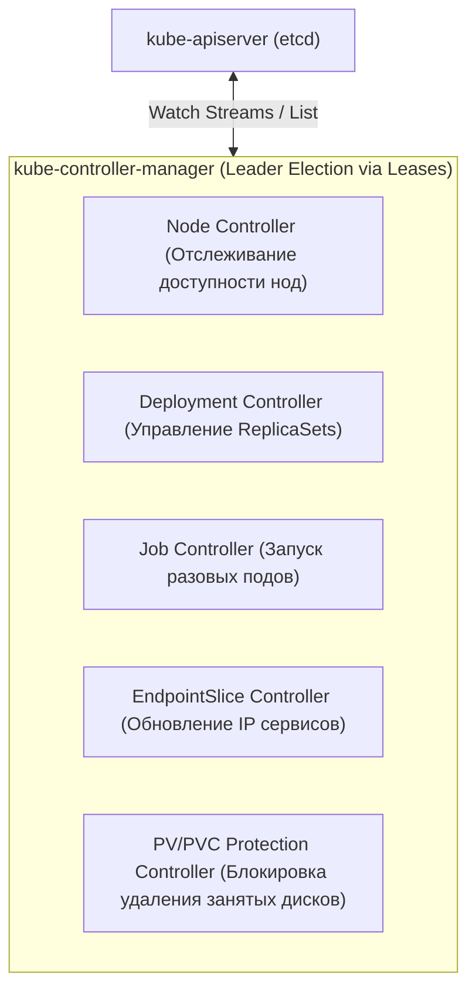
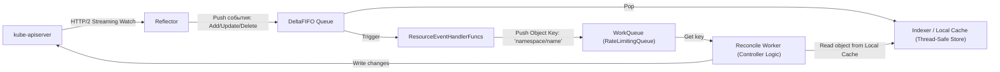
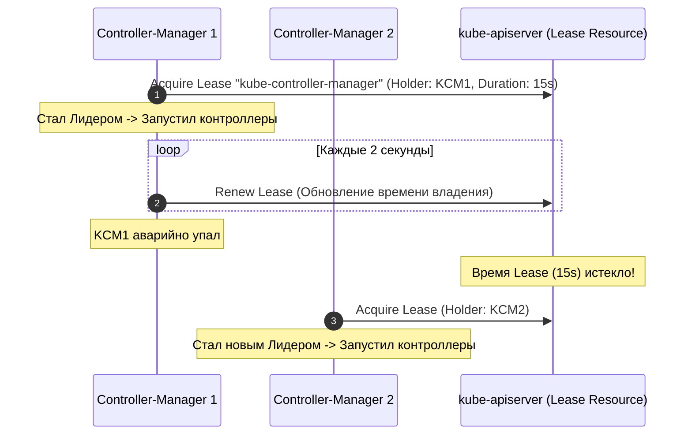

# ⚙️ 05. Внутреннее устройство контроллеров Kubernetes и Informer Pattern

## 🏛️ Архитектура Kube-Controller-Manager

`kube-controller-manager` — это единый демон, объединяющий множество независимых циклов управления (Control Loops). Каждый контроллер непрерывно сверяет **желаемое состояние (Desired State)** из манифестов с **фактическим состоянием (Actual State)** в кластере.



---

## 🔄 Шаблон Informer и Client-Go Architecture

Контроллеры **никогда не опрашивают API Server в цикле (No Polling!)**, чтобы не перегружать etcd. Вместо этого используется реактивная событийно-ориентированная архитектура **Informer Pattern**:



### Ключевые компоненты:
1. **`Reflector`:** Устанавливает долговременное HTTP/2 соединение с API Server через `ListWatch`. Сначала выполняет `List` для получения начального снимка, затем слушает стрим `Watch`.
2. **`DeltaFIFO`:** Очередь, хранящая типы изменений (`Added`, `Updated`, `Deleted`, `Sync`).
3. **`Indexer (Local Cache)`:** Локальная копия состояния объектов в памяти контроллера. Все операции чтения `lister.Get()` обращаются в память, а не в API Server!
4. **`WorkQueue`:** Очередь с поддержкой дедупликации ключей, экспоненциального бэкоффа при ошибках (`RateLimitingQueue`) и параллельной обработки пулом воркеров.

---

## 👑 Механизм Leader Election (Выборы лидера)

Для обеспечения высокой доступности (HA) запускается несколько экземпляров `kube-controller-manager`, но активным может быть только один. Выборы лидера реализованы через ресурс `Lease` в namespace `kube-system`:



---

## 🔬 Deep Dive: Informer pattern — почему не поллинг

```text
ListAndWatch ─► DeltaFIFO ─► Indexer (локальный кэш) ─► EventHandlers ─► Workqueue
      ▲                                                              │
      └────────────── re-list/watch при resync/ошибке ◄──────────────┘
```

- **ResourceVersion** позволяет watch «с места, где остановились»; при compaction — полный relist.
- **Rate-limited workqueue:** повторная обработка ключа с exponential backoff — контроллер сам себе ретраи.
- **Level-triggered reconcile:** сравниваем желаемое состояние из кэша с фактическим из API, идемпотентно.

### Минимальный controller-runtime скелет

```go
func (r *Reconciler) Reconcile(ctx context.Context, req ctrl.Request) (ctrl.Result, error) {
    var pod v1.Pod
    if err := r.Get(ctx, req.NamespacedName, &pod); err != nil {
        return ctrl.Result{}, client.IgnoreNotFound(err) // удален — ок
    }
    // level-triggered: приводим к желаемому состоянию, НЕ реагируем на события поштучно
    if !hasSidecar(&pod) {
        controllerutil.CreateOrPatch(...)
    }
    return ctrl.Result{RequeueAfter: time.Minute}, nil // периодический ресинк
}
```

!!! question «Вопрос с собеседования»
    «Чем watch отличается от poll?» — Watch — HTTP long-poll стрим событий с ResourceVersion (мгновенная доставка, O(изменения)); poll — периодический LIST (лаг до интервала, нагрузка на etcd).

---

<!-- enriched:v1 -->

## 🧨 Типовые грабли Production

| Симптом | Причина | Быстрое решение |
| :--- | :--- | :--- |
| Pod OOMKill'ed при старте | Java/Go резервируют память ≠ `requests` | Настроить `-XX:MaxRAMPercentage`, `GOMEMLIMIT` |
| Rolling update «мигает» 502 | Нет PDB + readiness гонки | `PodDisruptionBudget` + `preStop sleep 5` |
| DNS timeout раз в N минут | conntrack race / NodeLocal DNSCache | Включить `NodeLocal DNSCache`, обновить ядро |
| Эвикции при низкой утилизации | `requests` задраны «с запасом» | VPA в режиме recommendation, перерасчет |

!!! note "Requests vs Limits"
    `requests` — это планировщик (гарантия), `limits` — троттлинг/OOM (потолок). CPU без limit = Burstable и обычно **лучше** для latency-чувствительных сервисов (нет throttling).

## 🧪 Hands-on Lab (15 минут)

```bash
# 1. Разверните kind-кластер и воспроизведите сценарий из таблицы
kind create cluster --config - <<EOF
kind: Cluster
apiVersion: kind.x-k8s.io/v1alpha4
nodes:
- role: control-plane
- role: worker
EOF
kubectl get --raw /metrics | grep -E 'workqueue_depth|reconcile_errors' | head && \
kubectl get lease -n kube-system | head && kubectl -n kube-system get cm kube-controller-manager -o yaml | head -5 || true
```

## ✅ Чек-лист зрелости темы

- [ ] Все Deployment имеют `requests`/`limits`, liveness/readiness/startup пробы

    ??? tip "Как закрыть пункт"
        Requests по данным недели/VPA-рекомендаций; probes разделены по смыслу (liveness ≠ зависимость к БД); startup для медленного старта. Автопроверка: kube-score/Kyverno в CI блокирует деплой без проб.

- [ ] Настроен `PodDisruptionBudget` и `topologySpreadConstraints`

    ??? tip "Как закрыть пункт"
        PDB допускает ≥1 нарушение (minAvailable N-1, не N — иначе drain вечен). Spread по zones+nodes: реплики переживают отказ AZ. Тест: kubectl drain проходит без нарушения SLO ([04.9](09-k8s-cluster-operations.md)).

- [ ] Есть NetworkPolicy по умолчанию (default-deny) в каждом namespace

    ??? tip "Как закрыть пункт"
        Default-deny ingress+egress + явные allow (DNS первым делом!). Шаблон — [18.1](../18-templates/01-containers-and-k8s.md). Проверка: чужой под не достучался, легитимный клиент — достучался.

- [ ] RBAC минимально-привилегированный, ServiceAccount токены не монтируются лишний раз

    ??? tip "Как закрыть пункт"
        automountServiceAccountToken: false по умолчанию; роли перечисляют verbs/resources явно, без wildcards. Аудит: kubectl-who-can на критичные права; токены в подах только там, где реально нужен API.

- [ ] Проверяется совместимость манифестов с новой версией K8s (kubent/pluto)

    ??? tip "Как закрыть пункт"
        kubent/pluto в CI перед минорным апгрейдом; deprecated API — блокирующий warning. Список удалённых API целевой версии приложен к PR апгрейда ([04.9](09-k8s-cluster-operations.md)).

---

## 🧭 Что дальше

| Шаг | Материал |
| :--- | :--- |
| 🎤 Проверить себя | [Senior-вопросы по контроллерам](../14-interview-prep/03-100-devops-interview-questions-bank-part1.md) |
| ➡️ Дальше | [Все контроллеры: справочник](07-all-kubernetes-controllers-reference.md) |

---

## ✅ Проверь себя

**В1. Из чего состоит Informer Pattern и зачем каждый компонент?**
<details><summary>Ответ</summary>
Reflector (watch из apiserver) → DeltaFIFO (очередь изменений) → Indexer/local store (кэш с индексами) + EventHandler (колбэки Add/Update/Delete в ваш workqueue). Lister читает из кэша без похода в API; resync переотправляет события для самовосстановления.
</details>

**В2. Что такое level-triggered reconcile и почему это надёжнее event-driven?**
<details><summary>Ответ</summary>
Каждый цикл пересчитывает полный diff «желаемое vs текущее» и чинит расхождения. Пропущенный event или чужая правка исправляются следующим sync'ом. Edge-triggered («реагируй на событие») теряет события при рестарте и копит дрифт навсегда.
</details>

**В3. Зачем контроллерам ResourceVersion и optimistic concurrency?**
<details><summary>Ответ</summary>
Каждое обновление объекта повышает его RV. Update со старым RV отклоняется конфликтом — два контроллера не затрут изменения друг друга молча: проигравший получает Conflict и ретраит с свежим состоянием. Дешевле distributed-локов.
</details>

**В4. Что делает ownerReference (OwnerReferences) на объекте?**
<details><summary>Ответ</summary>
Связывает ребёнка с родителем: GC удаляет детей каскадом после удаления владельца, а Owns() у контроллера триггерит reconcile родителя при изменении ребёнка. Без ownerRef — объекты-сироты после удаления деплоймента.
</details>
