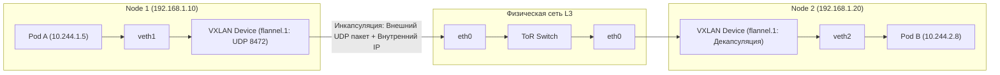

# 🌐 06. Глубокое погружение в сеть K8s: Путь сетевого пакета (Packet Flow)

## 📦 1. Путь пакета Pod-to-Pod на одном хосте

Каждый Pod находится в своем изолированном сетевом пространстве имен (`Network Namespace`). Связь с хостом организуется через виртуальную пару интерфейсов **veth pair (Virtual Ethernet Pair)**:

```mermaid
graph TD
    subgraph PodNamespace["Pod Network Namespace (eth0)"]
        App["Процесс приложения"]
    end
    
    subgraph HostNamespace["Host Network Namespace"]
        VethHost["vethXXXXX"]
        Bridge["Linux Bridge (cbr0 / cni0) или Open vSwitch"]
        VethHost2["vethYYYYY"]
    end
    
    subgraph PodNamespace2["Target Pod Namespace (eth0)"]
        App2["Целевое приложение"]
    end
    
    App -->|eth0 (veth peer)| VethHost
    VethHost --> Bridge
    Bridge --> VethHost2
    VethHost2 -->|veth peer| App2
```

---

## 🚚 2. Путь пакета Pod-to-Pod между разными нодами (Overlay vs Direct Routing)



- **Overlay Network (VXLAN/Geneve):** Пакет пода заворачивается в стандартный UDP-пакет (оверхед ~50 байт на заголовок, требует уменьшения MTU до `1450`).
- **Direct Routing (BGP / Calico / Cilium):** Ноды передают пакеты напрямую в физическую сеть без инкапсуляции. Максимальная производительность (Wire speed) и MTU 1500/9000 (Jumbo frames).

---

## 🔀 3. Как работает ClusterIP: iptables vs IPVS vs eBPF

Виртуальный IP адрес сервиса (`ClusterIP`, например `10.96.0.100`) **не существует ни на одном сетевом интерфейсе**. Это просто виртуальная запись для подмены адреса:

### 1. Режим `iptables` (Вероятностный DNAT)
`kube-proxy` генерирует цепочки правил в таблице `nat`. Балансировка между 3 репликами строится через модуль `statistic`:
```text
-A KUBE-SVC-XXX -m statistic --mode random --probability 0.33333 -j KUBE-SEP-AAA (Под 1)
-A KUBE-SVC-XXX -m statistic --mode random --probability 0.50000 -j KUBE-SEP-BBB (Под 2)
-A KUBE-SVC-XXX -j KUBE-SEP-CCC (Под 3)
```
*Проблема:* При 10 000 сервисов таблица iptables разрастается до сотен тысяч строк, и каждый пакет линейно сканирует всю таблицу $O(N)$, вызывая деградацию сети.

### 2. Режим `IPVS` (IP Virtual Server)
Использует хэш-таблицы в ядре Linux $O(1)$. Поддерживает продвинутые алгоритмы: Least Connection (`lc`), Round Robin (`rr`), Source Hashing (`sh`).

### 3. Режим `Cilium eBPF` (Socket Layer Translation)
Cilium перехватывает системный вызов `connect()` в пространстве сокетов (`sock_ops`) и подменяет `ClusterIP` на реальный `IP пода` еще **до того, как пакет начнет формироваться в стеке TCP/IP** хоста. Zero-overhead.

---

## 🎯 4. `externalTrafficPolicy: Cluster` vs `Local`

```mermaid
graph TD
    Client([Внешний клиент]) --> Node1["Node 1 (Приняла трафик)"]
    
    subgraph ClusterPolicy["externalTrafficPolicy: Cluster (По умолчанию)"]
        Node1 -->|SNAT: Подменяет IP клиента на IP Node 1| Node2["Node 2 (Где реально живет Pod)"]
        Note over Node2: Под видит IP Node 1, реальный IP клиента ПОТЕРЯН! Лишний сетевой хоп!
    end
    
    subgraph LocalPolicy["externalTrafficPolicy: Local (Рекомендуется)"]
        Node1L["Node 1 (Трафик принимается ТОЛЬКО если на ноде есть Pod)"] --> PodDirect["Pod на Node 1"]
        Note over PodDirect: IP клиента СОХРАНЕН! Нулевые лишние сетевые хопы!
    end
```

---

## 🔍 5. CoreDNS: Проблема `ndots:5` и оптимизация

По умолчанию в контейнере генерируется `/etc/resolv.conf`:
```ini
nameserver 10.96.0.10
search production.svc.cluster.local svc.cluster.local cluster.local company.internal
options ndots:5
```

### В чем проблема `ndots:5`?
Если приложение делает запрос к `api.stripe.com` (в имени 2 точки, что меньше 5), резолвер Linux делает **4 последовательных неудачных DNS запроса** перед тем, как запросить настоящий внешний домен:
1. `api.stripe.com.production.svc.cluster.local` $\to$ NXDOMAIN
2. `api.stripe.com.svc.cluster.local` $\to$ NXDOMAIN
3. `api.stripe.com.cluster.local` $\to$ NXDOMAIN
4. `api.stripe.com.company.internal` $\to$ NXDOMAIN
5. `api.stripe.com.` $\to$ **SUCCESS (только на 5-й раз!)**

### Решение:
- Ставить точку в конце абсолютных внешних доменов в коде приложения: `https://api.stripe.com./`
- Или переопределять `dnsConfig` в манифесте пода:
```yaml
spec:
  dnsConfig:
    options:
      - name: ndots
        value: "2"
```

---

## 🔬 Deep Dive: Service → DNAT → под. Что происходит с src IP?

| Путь | Сохраняется ли клиентский IP? | Инструмент |
| :--- | :--- | :--- |
| Pod → Service → Pod | да (DNAT только dst) | — |
| External LB → nodePort SNAT | **нет** (src = node IP) | `externalTrafficPolicy: Local` |
| Ingress L7 | нет, но добавляется `X-Forwarded-For` | PROXY protocol |

```bash
# Посмотреть DNAT правила конкретного сервиса (iptables mode)
iptables-save -t nat | grep "K-SVC.*my-svc"

# conntrack: увидеть трансляцию вживую
conntrack -L -p tcp --dport 80 | head

# eBPF-режим Cilium: service map вместо iptables
cilium service list | grep my-svc
hubble observe --to-label app=backend --since 5m
```

### MTU — невидимый убийца

VXLAN инкапсуляция съедает 50 байт: если физическая MTU 1500, внутри подов должно быть 1450. Симптом: мелкие пакеты ходят (ping OK), TLS handshake зависает (большие сертификаты режутся).

```bash
ip -n cni0 link | grep mtu
ping -M do -s 1422 10.96.0.10   # проверить PMTU до DNS сервиса
```

!!! tip «Отладка пути пакета»
    `tcpdump -i any 'host 10.244.1.5 and port 443'` на ноде покажет пакет ДВАЖДЫ (eth0 → vxlan.calico/cni0): это нормально и подтверждает инкапсуляцию.

---

<!-- enriched:v1 -->

## 🧨 Типовые грабли Production

| Симптом | Причина | Быстрое решение |
| :--- | :--- | :--- |
| Pod OOMKill'ed при старте | Java/Go резервируют память ≠ `requests` | Настроить `-XX:MaxRAMPercentage`, `GOMEMLIMIT` |
| Rolling update «мигает» 502 | Нет PDB + readiness гонки | `PodDisruptionBudget` + `preStop sleep 5` |
| DNS timeout раз в N минут | conntrack race / NodeLocal DNSCache | Включить `NodeLocal DNSCache`, обновить ядро |
| Эвикции при низкой утилизации | `requests` задраны «с запасом» | VPA в режиме recommendation, перерасчет |

!!! note "Requests vs Limits"
    `requests` — это планировщик (гарантия), `limits` — троттлинг/OOM (потолок). CPU без limit = Burstable и обычно **лучше** для latency-чувствительных сервисов (нет throttling).

## 🧪 Hands-on Lab (15 минут)

```bash
# 1. Разверните kind-кластер и воспроизведите сценарий из таблицы
kind create cluster --config - <<EOF
kind: Cluster
apiVersion: kind.x-k8s.io/v1alpha4
nodes:
- role: control-plane
- role: worker
EOF
kubectl -n kube-system get po -o wide | grep -E 'kube-proxy|cilium|calico' && \
sudo conntrack -L -p tcp --dport 443 2>/dev/null | head && sudo iptables-save -t nat | grep K-SVC | head -5
```

## ✅ Чек-лист зрелости темы

- [ ] Все Deployment имеют `requests`/`limits`, liveness/readiness/startup пробы

    ??? tip "Как закрыть пункт"
        Requests по данным недели/VPA-рекомендаций; probes разделены по смыслу (liveness ≠ зависимость к БД); startup для медленного старта. Автопроверка: kube-score/Kyverno в CI блокирует деплой без проб.

- [ ] Настроен `PodDisruptionBudget` и `topologySpreadConstraints`

    ??? tip "Как закрыть пункт"
        PDB допускает ≥1 нарушение (minAvailable N-1, не N — иначе drain вечен). Spread по zones+nodes: реплики переживают отказ AZ. Тест: kubectl drain проходит без нарушения SLO ([04.9](09-k8s-cluster-operations.md)).

- [ ] Есть NetworkPolicy по умолчанию (default-deny) в каждом namespace

    ??? tip "Как закрыть пункт"
        Default-deny ingress+egress + явные allow (DNS первым делом!). Шаблон — [18.1](../18-templates/01-containers-and-k8s.md). Проверка: чужой под не достучался, легитимный клиент — достучался.

- [ ] RBAC минимально-привилегированный, ServiceAccount токены не монтируются лишний раз

    ??? tip "Как закрыть пункт"
        automountServiceAccountToken: false по умолчанию; роли перечисляют verbs/resources явно, без wildcards. Аудит: kubectl-who-can на критичные права; токены в подах только там, где реально нужен API.

- [ ] Проверяется совместимость манифестов с новой версией K8s (kubent/pluto)

    ??? tip "Как закрыть пункт"
        kubent/pluto в CI перед минорным апгрейдом; deprecated API — блокирующий warning. Список удалённых API целевой версии приложен к PR апгрейда ([04.9](09-k8s-cluster-operations.md)).

---

## 🧭 Что дальше

| Шаг | Материал |
| :--- | :--- |
| ➡️ Дальше | [eBPF datapath: Cilium](../12-advanced-networking-and-mesh/02-cni-cilium-and-calico.md) |
| 🎤 Проверить себя | [Вопросы: путь пакета](../14-interview-prep/03-100-devops-interview-questions-bank-part1.md) |
