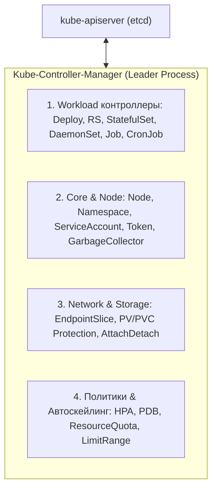

# 🎮 07. Полный справочник по контроллерам Kubernetes: Логика, Алгоритмы и Edge Cases

Внутри `kube-controller-manager` работает более 30 встроенных контроллеров. Каждый из них реализует паттерн **Reconciliation Loop (Цикл сверки)**:
$$\text{Reconcile}(\text{Desired State in Spec}) \Longleftrightarrow \text{Actual State in Status}$$



---

## 🏗️ 1. Workload-контроллеры

### 1.1. Deployment Controller
Управляет жизненным циклом `ReplicaSet`.
- **Логика обновления (RollingUpdate):** При изменении `spec.template` создает новый `ReplicaSet` (v2) и плавно увеличивает его реплики, одновременно уменьшая реплики старого `ReplicaSet` (v1).
- **Математика Surge & Unavailable:**
  $$\text{Max Allowed Pods} = \text{replicas} + \text{maxSurge}$$
  $$\text{Min Available Pods} = \text{replicas} - \text{maxUnavailable}$$
- **Откат (Rollback):** Не хранит копии шаблонов сам, а просто находит старый `ReplicaSet` по хэшу `pod-template-hash` в аннотации `deployment.kubernetes.io/revision` и меняет его масштаб.
- **Pause / Resume:** Позволяет накопить серию правок перед накатом (`kubectl rollout pause` / `resume`).

---

### 1.2. StatefulSet Controller
Управляет подами с постоянной идентичностью и собственным состоянием.
- **Порядковые индексы (Ordinals):** Создает поды строго по очереди: `app-0` $\to$ `app-1` $\to$ `app-2`. Следующий под создается только тогда, когда предыдущий перешел в статус `Running` и `Ready`.
- **Масштабирование вниз (Scale Down):** Удаляет поды в строго обратном порядке: `app-2` $\to$ `app-1` $\to$ `app-0`.
- **VolumeClaimTemplates:** Для каждого пода `app-N` автоматически генерирует уникальный PVC `data-app-N`. При удалении пода или уменьшении реплик PVC **никогда не удаляются автоматически** (защита от потери данных!).
- **Стратегия Partition (Канареечный деплой для БД):**
  Параметр `spec.updateStrategy.rollingUpdate.partition: 2` обновит только поды с индексом $\ge 2$ (например, `app-2`), оставив `app-0` и `app-1` на старой версии для тестирования.

---

### 1.3. DaemonSet Controller
Гарантирует запуск одной копии пода на всех (или выбранных через `nodeSelector`/`affinity`) нодах.
- **Планирование:** Начиная с K8s 1.12+ DaemonSet Controller не назначает `spec.nodeName` сам, а создает поды с `NodeAffinity`, позволяя стандартному `default-scheduler` учитывать Taints, Tolerations и загрузку ноды.
- **Поддержка динамического добавления нод:** При подключении нового рабочего сервера в кластер DaemonSet мгновенно создает на нем под.

---

### 1.4. Job & CronJob Controllers
- **Job Controller:** Отслеживает поды до успешного завершения (`Pod Phase: Succeeded`).
  - `completions`: Сколько успешных подов должно завершиться.
  - `parallelism`: Сколько подов запускать одновременно.
  - `backoffLimit`: Количество перезапусков при сбое перед тем, как пометить Job как `Failed`.
  - **Indexed Jobs:** Каждому поду выдается индекс через переменную окружения `JOB_COMPLETION_INDEX` (от `0` до `N-1`) для распределенной параллельной обработки очередей.
- **CronJob Controller (v2):** Написан на Go с использованием таймеров.
  - `concurrencyPolicy`:
    - `Allow` (дефолт) — запуск параллельно, даже если прошлый Job еще работает.
    - `Forbid` — пропустить новый запуск, если старый еще не завершился.
    - `Replace` — принудительно убить старый незавершенный Job и запустить новый.

---

## 🏛️ 2. Core & Системные контроллеры

### 2.1. Node Controller
Отслеживает здоровье серверов:
1. Каждые `node-monitor-period` (5с) проверяет аренду `Lease` ноды в `kube-node-lease`.
2. Если нода не обновляет Lease дольше `node-monitor-grace-period` (40с), контроллер переводит ноду в статус `NotReady` и накладывает Taint `node.kubernetes.io/unreachable:NoSchedule`.
3. По истечении `pod-eviction-timeout` (по умолчанию 300с / 5 минут) Node Controller удаляет поды с упавшей ноды и пересоздает их на живых серверах через контроллеры Workload.

---

### 2.2. Garbage Collector Controller (Сборщик мусора)
Управляет каскадным удалением зависимых ресурсов через механизм `ownerReferences`:
- **Foreground Deletion:** Родительский ресурс (Deployment) переходит в состояние `deletionTimestamp`, получает finalizer `foregroundDeletion` и ждет, пока все дочерние ReplicaSet и Pods будут удалены.
- **Background Deletion:** Родительский ресурс удаляется мгновенно, а Garbage Collector удаляет дочерние ресурсы в фоновом режиме.
- **Orphan:** Дочерние ресурсы остаются жить, у них просто зануляется поле `ownerReferences`.

---

### 2.3. EndpointSlice Controller
Разбивает списки IP-адресов сервисов на масштабируемые чанки (по умолчанию до 100 эндпоинтов на один объект `EndpointSlice`), решая проблему огромного сетевого оверхеда старого `Endpoints` контроллера при тысячах реплик.

---

## 📈 3. Контроллеры автоскейлинга и ограничений

### 3.1. Horizontal Pod Autoscaler (HPA)
Цикл сверки срабатывает каждые 15 секунд (`--horizontal-pod-autoscaler-sync-period`).

**Формула расчета количества реплик:**
$$\text{DesiredReplicas} = \left\lceil \text{CurrentReplicas} \times \left( \frac{\text{CurrentMetricValue}}{\text{DesiredMetricValue}} \right) \right\rceil$$

*Пример:* Текущие реплики = 4, целевая утилизация CPU = 50%, текущая = 75%.
$$\text{DesiredReplicas} = \left\lceil 4 \times \left( \frac{75}{50} \right) \right\rceil = \lceil 4 \times 1.5 \rceil = 6\text{ реплик}$$

- **Stabilization Window:** Окно сглаживания (по умолчанию 5 минут на Scale Down), предотвращающее эффект "флаппинга" (Flapping) — резкого скакания числа реплик вверх-вниз при импульсной нагрузке.

---

### 3.2. PodDisruptionBudget (PDB) Controller
Защищает сервис от деградации во время добровольных административных работ (`kubectl drain`, авто-обновление нод):
```yaml
apiVersion: policy/v1
kind: PodDisruptionBudget
metadata:
  name: api-pdb
spec:
  minAvailable: 80% # Гарантирует, что при drain ноды 80% реплик всегда останутся доступны
  selector:
    matchLabels:
      app: web-api
```

---

## 🔬 Deep Dive: что делает каждый контроллер при вашем apply

| Ваше действие | Контроллер | Реакция |
| :--- | :--- | :--- |
| `kubectl scale rs --replicas=5` | ReplicaSet | создает 3 Pod'а через API |
| `kubectl drain node` | Eviction API → PDB check | уважает disruption budget |
| PVC delete | PV Protection | держит PV до освобождения подов (`Terminating`) |
| Node reboot | Node Lifecycle | taint `node.kubernetes.io/unreachable` после 40s → eviction таймер |
| HPA превышает target | Horizontal Pod Autoscaler | меняет `.spec.replicas` Deployment'а |

### Edge cases, о которых спрашивают на собесах

1. **Deployment ↔ RS orphan:** ручной RS с тем же selector'ом перехватывает поды — всегда используйте `ownerReferences` и уникальные селекторы.
2. **StatefulSet partition update:** `partition: 3` катит новую версию только подам ≥3 — канареечно для stateful.
3. **HPA vs Vertical:** одновременно VPA (Auto) и HPA на CPU конфликтуют — VPA в режиме Initial/Off.
4. **Job TTL:** `ttlSecondsAfterFinished: 100` — иначе Completed джобы копятся и едут etcd.

```bash
# Какие контроллеры вообще запущены и их лидеры
kubectl -n kube-system get lease kube-scheduler -o jsonpath='{.spec.holderIdentity}'; echo
kubectl get deploy -n kube-system | grep -E 'controller|scheduler'
```

!!! note «Синхронизация»
    Все контроллеры используют `--leader-elect=true`: только одна реплика active, остальные hot standby через Lease в etcd.

---

<!-- enriched:v1 -->

## 🧨 Типовые грабли Production

| Симптом | Причина | Быстрое решение |
| :--- | :--- | :--- |
| Pod OOMKill'ed при старте | Java/Go резервируют память ≠ `requests` | Настроить `-XX:MaxRAMPercentage`, `GOMEMLIMIT` |
| Rolling update «мигает» 502 | Нет PDB + readiness гонки | `PodDisruptionBudget` + `preStop sleep 5` |
| DNS timeout раз в N минут | conntrack race / NodeLocal DNSCache | Включить `NodeLocal DNSCache`, обновить ядро |
| Эвикции при низкой утилизации | `requests` задраны «с запасом» | VPA в режиме recommendation, перерасчет |

!!! note "Requests vs Limits"
    `requests` — это планировщик (гарантия), `limits` — троттлинг/OOM (потолок). CPU без limit = Burstable и обычно **лучше** для latency-чувствительных сервисов (нет throttling).

## 🧪 Hands-on Lab (15 минут)

```bash
# 1. Разверните kind-кластер и воспроизведите сценарий из таблицы
kind create cluster --config - <<EOF
kind: Cluster
apiVersion: kind.x-k8s.io/v1alpha4
nodes:
- role: control-plane
- role: worker
EOF
kubectl get pdb,hpa,vpa -A 2>/dev/null | head -20 && \
kubectl get sts -A && kubectl get jobs -A --sort-by=.metadata.creationTimestamp | tail -10
```

## ✅ Чек-лист зрелости темы

- [ ] Все Deployment имеют `requests`/`limits`, liveness/readiness/startup пробы

    ??? tip "Как закрыть пункт"
        Requests по данным недели/VPA-рекомендаций; probes разделены по смыслу (liveness ≠ зависимость к БД); startup для медленного старта. Автопроверка: kube-score/Kyverno в CI блокирует деплой без проб.

- [ ] Настроен `PodDisruptionBudget` и `topologySpreadConstraints`

    ??? tip "Как закрыть пункт"
        PDB допускает ≥1 нарушение (minAvailable N-1, не N — иначе drain вечен). Spread по zones+nodes: реплики переживают отказ AZ. Тест: kubectl drain проходит без нарушения SLO ([04.9](09-k8s-cluster-operations.md)).

- [ ] Есть NetworkPolicy по умолчанию (default-deny) в каждом namespace

    ??? tip "Как закрыть пункт"
        Default-deny ingress+egress + явные allow (DNS первым делом!). Шаблон — [18.1](../18-templates/01-containers-and-k8s.md). Проверка: чужой под не достучался, легитимный клиент — достучался.

- [ ] RBAC минимально-привилегированный, ServiceAccount токены не монтируются лишний раз

    ??? tip "Как закрыть пункт"
        automountServiceAccountToken: false по умолчанию; роли перечисляют verbs/resources явно, без wildcards. Аудит: kubectl-who-can на критичные права; токены в подах только там, где реально нужен API.

- [ ] Проверяется совместимость манифестов с новой версией K8s (kubent/pluto)

    ??? tip "Как закрыть пункт"
        kubent/pluto в CI перед минорным апгрейдом; deprecated API — блокирующий warning. Список удалённых API целевой версии приложен к PR апгрейда ([04.9](09-k8s-cluster-operations.md)).

---

## 🧭 Что дальше

| Шаг | Материал |
| :--- | :--- |
| 🎤 Проверить себя | [Вопросы по workloads](../14-interview-prep/03-100-devops-interview-questions-bank-part1.md) |
| ➡️ Дальше | [Автоскейлинг: HPA/VPA/KEDA](08-k8s-autoscaling.md) |

---

## ✅ Проверь себя

**В1. Кто именно создаёт pod'ы: Deployment или ReplicaSet?**
<details><summary>Ответ</summary>
ReplicaSet. Deployment-контроллер управляет ТОЛЬКО ReplicaSet'ами (создаёт новый RS при изменении template, масштабирует старый вниз). Поэтому scale deployment меняет replicas у RS, а прямой edit RS перезатрётся стратегией Deployment.
</details>

**В2. Чем StatefulSet отличается от Deployment по идентичности подов?**
<details><summary>Ответ</summary>
Стабильное имя (web-0, web-1...), стабильный DNS (pod-0.svc.headless), упорядоченное создание/удаление (по индексу), свои PVC per-pod (volumeClaimTemplates переживают пересоздание). Deployment — взаимозаменяемые клоны без сетевой идентичности.
</details>

**В3. Что делает Job, а что DaemonSet?**
<details><summary>Ответ</summary>
Job — конечная задача до успешного завершения (completions, parallelism, backoffLimit, cron через CronJob). DaemonSet — по одному поду НА КАЖДУЮ (или отобранную selector'ом) ноду постоянно: log-collectors, node-exporter, CNI.
</details>

**В4. Зачем нужен TTL-after-finished для Job?**
<details><summary>Ответ</summary>
Завершённые Job/Pod висят в etcd вечно (для логов/status), размножаясь cron-джобами. ttlSecondsAfterFinished автоматически удалит job+поды через N секунд после завершения — иначе контроллер etcd задыхается от мусора.
</details>
