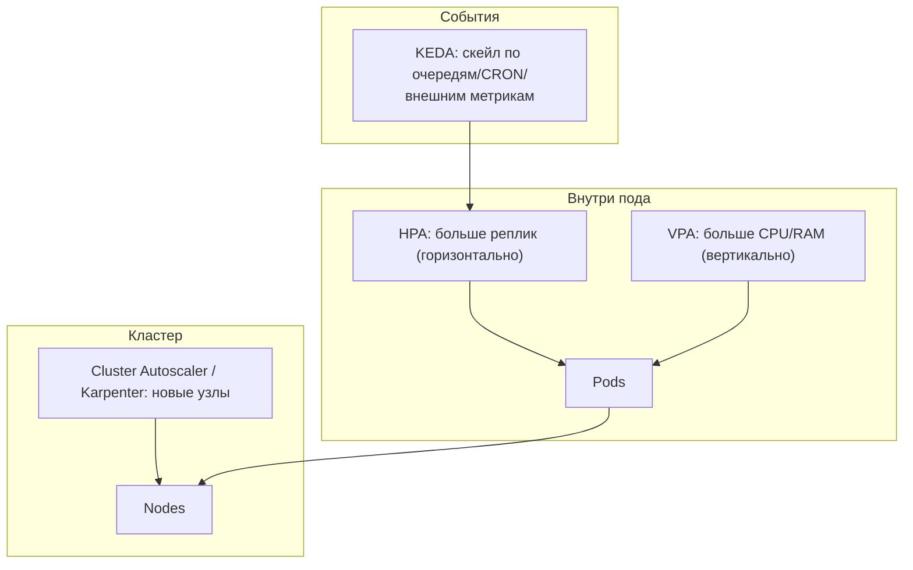
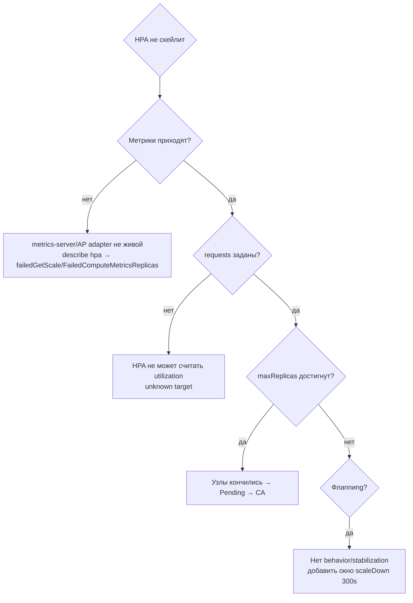

# 📈 08. Автоскейлинг Kubernetes: HPA, VPA, KEDA, Cluster Autoscaler

## ⚙️ Четыре оси масштабирования



| Механизм | Что меняет | Триггер | Типичный кейс |
| :--- | :--- | :--- | :--- |
| HPA | Кол-во реплик | CPU/RAM/custom metrics | Web-API под RPS |
| VPA | requests/limits пода | Утилизация за историю | Джобы с непредсказуемым профилем |
| KEDA | Реплики 0→N и N→0 | Kafka/RabbitMQ/SQS, cron, Prometheus | Воркеры очередей |
| Cluster Autoscaler / Karpenter | Кол-во узлов | Pending-поды | Пиковые нагрузки, spot-пулы |

---

## 📝 HPA: Horizontal Pod Autoscaler

```yaml
apiVersion: autoscaling/v2
kind: HorizontalPodAutoscaler
metadata:
  name: shop-api
spec:
  scaleTargetRef:
    apiVersion: apps/v1
    kind: Deployment
    name: shop-api
  minReplicas: 3
  maxReplicas: 30
  metrics:
    - type: Resource
      resource:
        name: cpu
        target: { type: Utilization, averageUtilization: 70 }
    - type: Pods
      pods:
        metric: { name: http_requests_per_second }
        target: { type: AverageValue, averageValue: "500" }
  behavior:                       # гашение «пилы» — обязательно для прода
    scaleDown:
      stabilizationWindowSeconds: 300   # не убирать реплики раньше 5 мин после пика
      policies:
        - { type: Percent, value: 25, periodSeconds: 60 }   # вниз ≤25% в минуту
    scaleUp:
      policies:
        - { type: Percent, value: 100, periodSeconds: 30 }  # вверх можно быстро
```

Критические условия работы:

1. **HPA = ratio `usage/request`**. Если requests занижены — HPA душит приложение при низкой реальной нагрузке; если завышены — никогда не срабатывает. Requests сначала выверяются (VPA в режиме recommendation или анализ за месяц).
2. **Метрики**: `Resource` берётся из metrics-server; кастомные (`Pods`/`External`) — из Prometheus Adapter или KEDA.
3. **Не смешивать HPA и VPA на одном ресурсе (CPU)** — они дерутся. VPA только по памяти, либо режим `Auto` у Karpenter-style решений.

Диагностика:

```bash
kubectl get hpa shop-api -w                     # текущее/target/replcas
kubectl describe hpa shop-api | tail -15        # события: "failed to get..." причины
kubectl get --raw "/apis/metrics.k8s.io/v1beta1/pods" | jq '.items[0]'
```

---

## 🎯 VPA: Vertical Pod Autoscaler

VPA не пересоздаёт поды сам в `Off`-режиме — безопасный способ начать:

```yaml
apiVersion: autoscaling.k8s.io/v1
kind: VerticalPodAutoscaler
metadata:
  name: shop-api
spec:
  targetRef: { apiVersion: "apps/v1", kind: Deployment, name: shop-api }
  updatePolicy:
    updateMode: "Initial"       # Off=только рекомендации | Initial=при создании | Recreate=эвиктит!
  resourcePolicy:
    containerPolicies:
      - containerName: shop-api
        minAllowed: { cpu: 100m, memory: 128Mi }
        maxAllowed: { memory: 4Gi }
        controlledResources: [memory]     # CPU оставили HPA
```

```bash
kubectl describe vpa shop-api | grep -A5 "Recommendation"   # Lower/Target/Upper
```

Практика: гонять `updateMode: Off` постоянно, раз в неделю забирать рекомендации в PR к манифестам. `Recreate` в проде опасен — VPA эвиктит поды в произвольный момент.

---

## ⚡ KEDA: событийный автоскейлинг

Главные суперсилы: **scale-to-zero** и метрики из внешних систем без Prometheus Adapter.

```yaml
apiVersion: keda.sh/v1alpha1
kind: ScaledObject
metadata:
  name: order-worker
spec:
  scaleTargetRef: { name: order-worker }
  minReplicaCount: 0              # ночью воркеров нет вообще
  maxReplicaCount: 50
  cooldownPeriod: 120
  triggers:
    - type: kafka                 # lag очереди → реплики
      metadata:
        bootstrapServers: kafka-bootstrap:9092
        consumerGroup: order-workers
        topic: orders
        lagThreshold: "1000"
    - type: cron                  # к утру заранее разогреть
      metadata:
        timezone: Europe/Moscow
        start: "0 7 * * 1-5"
        end: "0 20 * * 1-5"
        desiredReplicas: "5"
```

```bash
kubectl get scaledobject,hpa -n shop    # KEDA создаёт HPA под капотом
```

Грабли KEDA: `minReplicaCount: 0` требует readiness-probe терпения (под стартует с нуля); Kafka-триггер считает **lag группы** — зависший консьюмер с нулевым потреблением лжи о здоровье не покажет.

---

## 🖥️ Cluster Autoscaler против Karpenter

Cluster Autoscaler добавляет узел только когда есть **Pending-под**, и ждёт цикл провайдера (минуты). Karpenter (AWS/другие облака) сам выбирает тип инстанса под суммарные запросы — быстрее и дешевле на неоднородных нагрузках.

Конфигурация CA через аннотации на NodeGroup/ASG + важные флаги:

```yaml
# ClusterAutoscaler deployment: ключевые аргументы
--nodes-min=3:5          # границы пула
--scale-down-unneeded-time=10m
--scale-down-utilization-threshold=0.5
--skip-nodes-with-local-storage=false
--balance-similar-node-groups=true
```

Связка с подами — правильные приоритеты эвикции при scale-down:

```yaml
metadata:
  annotations:
    cluster-autoscaler.kubernetes.io/safe-to-evict: "false"   # для stateful/одиночек
spec:
  priorityClassName: critical-apps      # PDB+priority решают, кого выдавить первым
```

Обязательное условие: **PDB (PodDisruptionBudget)** на каждом сервисе — иначе CA/Karpenter может осушить узел вместе со всеми репликами приложения.

---

## 🔬 Deep Dive: почему автоскейлер «не работает» — чек-лист диагностики



Типовая производственная цепочка: пик нагрузки → HPA упёрся в maxReplicas → поды Pending → Cluster Autoscaler добавляет узел через 2–5 минут → latency уже болит. Вывод: **головной запас узлов** (overprovisioning-под с низким priority резервирует ёмкость) и алерт на `kube_deployment_status_replicas_available < desired` дольше 5 минут.

---

## 🧨 Типовые грабли Production

| Симптом | Причина | Быстрое решение |
| :--- | :--- | :--- |
| HPA показывает `<unknown>/70%` | Нет metrics-server или requests не заданы | Проверить AP-сервис metrics.k8s.io; проставить requests |
| Скейл-пила: растёт-падает каждые 2 мин | Нет `behavior.scaleDown.stabilizationWindow` | Окно 300s + процентные политики |
| VPA перезапустил все поды в пике | updateMode Recreate | Только Initial/Off в проде; рекомендации руками |
| KEDA не видит lag | Неверный consumerGroup/ACL | `kafka-consumer-groups --describe`; проверить SASL-права |
| Узлы добавляются, но поды всё равно Pending | Taints/tolerations/affinity не совпадают | `kubectl describe pod` → Events; сверить nodeSelector |
| CA удаляет «нужный» узел ночью | Поды safe-to-evict, PDB нет | PDB на всё stateful; аннотация false для одиночек |
| Scale-to-zero, а первый запрос таймаутит | Холодный старт > probe timeout | minReplicas≥1 для синхронных API; zero — только для очередей |

## 🧪 Hands-on Lab

```bash
# 1. Разогнать HPA локально (kind/minikube)
kubectl create deployment loadgen --image=httpd --replicas=1
kubectl set resources deploy/loadgen --requests=cpu=100m
kubectl autoscale deploy/loadgen --min=1 --max=5 --cpu-percent=50
kubectl run bomb --rm -it --image=busybox -- sh -c 'while :; do :; done'   # CPU-нагрузка
kubectl get hpa loadgen -w

# 2. Посмотреть рекомендации VPA (если установлен) без риска
kubectl apply -f vpa-off.yaml && kubectl describe vpa | grep -A6 Recommendation

# 3. Диагностика цепочки метрик
kubectl top nodes && kubectl top pods --containers | head
```

## ✅ Чек-лист зрелости темы

- [ ] Все Deployment'ы имеют корректные requests (основа любого скейлинга)
- [ ] HPA с настроенным `behavior` (stabilization + политики), не дефолтным
- [ ] VPA в режиме Off/Initial как источник рекомендаций, не Recreate
- [ ] Очереди/джобы переведены на KEDA со scale-to-zero где уместно
- [ ] PDB и priorityClass на всех критичных сервисах перед включением CA/Karpenter
- [ ] Алерты: недобор реплик >5 мин, Pending-поды, исчерпание maxReplicas

---

## 🧭 Что дальше

| Шаг | Материал |
| :--- | :--- |
| 🔬 Закрепить | [Lab 09: HPA/KEDA нагрузочный тест](../16-guided-labs/09-lab-autoscaling-kind.md) |
| 🎤 Проверить себя | [Вопросы по скейлингу](../14-interview-prep/03-100-devops-interview-questions-bank-part1.md) |

---

## 🎤 Пять вопросов для повторения

---


## ✅ Проверь себя

> Отвечай вслух до раскрытия ответа. Если «не помню» — вернись к разделу.


**В1. HPA показывает <code>&lt;unknown&gt;/70%</code>. Назовите две самые частые причины и как их диагностировать.**

<details><summary>Ответ</summary>

Нет живого metrics-server (проверить AP-сервис metrics.k8s.io) или у подов не заданы requests — utilization не вычислить. Диагностика: <code>kubectl describe hpa</code> → события FailedComputeMetricsReplicas / FailedGetResourceMetric.

</details>


**В2. Почему VPA и HPA по одной и той же метрике CPU нельзя включать на один Deployment?**

<details><summary>Ответ</summary>

Оба меняют одну формулу: HPA меняет число реплик от отношения usage/request, а VPA меняет сами requests. Они начинают конкурировать: VPA поднимет request → utilization упадёт → HPA уменьшит реплики → usage вырастет → цикл. Компромисс: HPA по CPU + VPA только по памяти (controlledResources).

</details>


**В3. Что делает stabilizationWindowSeconds в behavior.scaleDown и почему без него прод «пилит»?**

<details><summary>Ответ</summary>

Это окно, в течение которого HPA смотрит историю рекомендаций и берёт минимум, прежде чем убирать реплики. Без него кратковременный спад трафика (обеденный провал, батч завершился) мгновенно уменьшает реплики, затем нагрузка возвращается — масштабирование превращается в пилу с холодными стартами.

</details>


**В4. Как KEDA реализует масштабирование с нуля и какое требование это накладывает на приложение?**

<details><summary>Ответ</summary>

KEDA создаёт HPA поверх ScaledObject и при нуле трафика сводит реплики к 0; активацию берёт на себя оператор, который будит deployment по внешнему триггеру (Kafka lag, очередь, cron). Приложение обязано быстро становиться готовым: readiness-probe должен терпеть холодный старт, поэтому для синхронных API обычно minReplicas≥1.

</details>


**В5. Чем Karpenter принципиально отличается от Cluster Autoscaler по логике добавления узлов?**

<details><summary>Ответ</summary>

Cluster Autoscaler работает с заранее созданными NodeGroup/ASG и реагирует на Pending-поды выбором готовой группы (медленно, минуты). Karpenter сам собирает узел под суммарные запросы ожидающих подов, выбирая тип инстанса напрямую у провайдера — быстрее и дешевле на неоднородных нагрузках.

</details>
