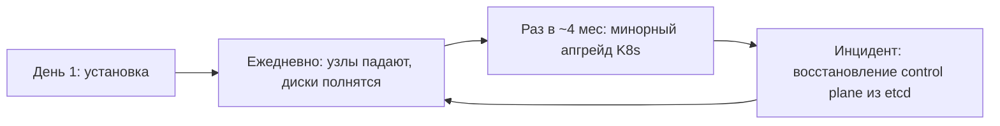
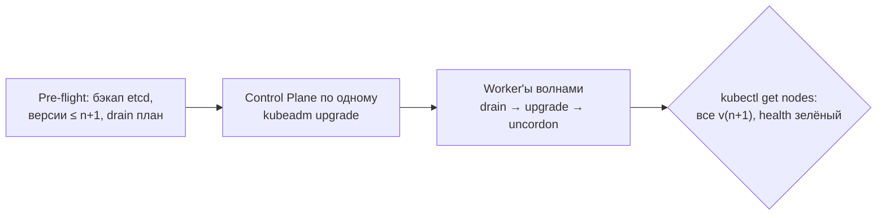

# 🛠️ 09. Эксплуатация Кластера: Апгрейды, etcd и Жизненный Цикл Узлов

## ⚙️ Что ломается в жизни кластера



Три операции, которые отличают «поднял kind» от эксплуатации: **апгрейд версии, бэкап/восстановление etcd, замена узла без боли**. Kubernetes поддерживает сдвиг **на одну минорную версию** (n → n+1). Пропуск версий = пересоздание.

---

## 📝 Бэкап etcd: страховка всего кластера

В etcd лежит ВСЁ: объекты, секреты, CRD. Восстановление etcd = восстановление кластера.

### Снимок (со control-plane узла)

```bash
# kubeadm-кластер: сертификаты и ключи etcd обычно в /etc/kubernetes/pki/etcd
ETCDCTL_API=3 etcdctl \
  --endpoints=https://127.0.0.1:2379 \
  --cacert=/etc/kubernetes/pki/etcd/ca.crt \
  --cert=/etc/kubernetes/pki/etcd/server.crt \
  --key=/etc/kubernetes/pki/etcd/server.key \
  snapshot save /backup/etcd-snapshot-$(date +%F-%H%M).db

# Проверка снимка (обязательно до того, как понадобится!)
etcdctl snapshot status /backup/etcd-snapshot-*.db --write-table=table

# Увезти с узла немедленно — бэкап на том же диске не бэкап
rsync -avz /backup/ backup-server:/etcd-backups/$(hostname)/
```

Крон-джоба + ретеншн:

```bash
# /etc/cron.d/etcd-backup — каждые 6 часов, держим 14 дней
17 */6 * * * root /usr/local/bin/etcd-snapshot.sh >> /var/log/etcd-backup.log 2>&1
find /backup -name 'etcd-snapshot-*.db' -mtime +14 -delete
```

!!! warning "Бэкап etcd содержит все секреты кластера"
    Хранить зашифрованным (age/gpg), доступ ограничить. Утечка снапшота = утечка всех Secret'ов всех namespace.

### Восстановление

```bash
# Остановить etcd + apiserver (у kubeadm: move manifests)
mv /etc/kubernetes/manifests/etcd.yaml /tmp/
systemctl stop kubelet

etcdctl snapshot restore /backup/etcd-snapshot-2026-08-01.db \
  --data-dir=/var/lib/etcd-restored \
  --name=cp-1 \
  --initial-cluster=cp-1=https://127.0.0.1:2380 \
  --initial-advertise-peer-urls=https://127.0.0.1:2380

rm -rf /var/lib/etcd && mv /var/lib/etcd-restored /var/lib/etcd   # старый data-dir сохранить!
mv /tmp/etcd.yaml /etc/kubernetes/manifests/
crictl ps | grep etcd     # подождать подъёма static pod
```

Нюансы восстановления:

- Restore создаёт **новый кластер etcd** — для multi-node восстанавливать нужно на каждом member со своим `--name` (или пересобрать CP заново).
- После restore все поды продолжат жить (они в kubelet), но состояние API откатится к моменту снапшота: новые Deployment'ы исчезнут из вида — сверяться с реальностью.
- Тренировать восстановление на стенде. Бэкап, который ни разу не разворачивали, — это не бэкап.

---

## 🚀 Апгрейд кластера (kubeadm): регламент



### Control plane (первый узел)

```bash
apt-get update && apt-get install -y --allow-change-held-packages \
  kubeadm=1.31.4-1.1                      # только kubeadm сначала!
kubeadm upgrade plan                       # читаем предупреждения
kubeadm upgrade apply v1.31.4 --etcd-upgrade=true

apt-get install -y --allow-change-held-packages kubelet=1.31.4-1.1 kubectl=1.31.4-1.1
systemctl daemon-reload && systemctl restart kubelet
```

Остальные CP: `kubeadm upgrade node` вместо `apply`. Затем worker'ы:

```bash
kubectl drain node-w3 --ignore-daemonsets --delete-emptydir-data --timeout=5m
# на узле:
apt-get install -y --allow-change-held-packages kubelet=1.31.4-1.1 kubeadm=1.31.4-1.1
kubeadm upgrade node
systemctl restart kubelet
# с ноутбука:
kubectl uncordon node-w3
```

Порядок и правила:

1. Один минор за раз; между апгрейдами дать поработать неделю.
2. Сначала все CP, потом worker'ы волнами (≤20% одновременно).
3. Перед волной проверить PDB: `kubectl get pdb -A | grep -v OK` — пусто.
4. Addons (CNI, metrics-server) — совместимые версии заранее; CNI часто требует обновления ДО или сразу после минора.
5. Окно на один worker — 15–30 минут; если дольше, стоп и разбор.

Проверки после каждой волны:

```bash
kubectl get nodes -o wide                          # версия и статус
kubectl get pods -n kube-system | grep -v Running  # пусто
kubectl get events -A --sort-by=.lastTimestamp | tail -20
kubectl run nettest --rm -it --image=busybox -- wget -qO- https://api.internal/health
```

---

## 🔄 Замена узла: drain без простоя

```bash
kubectl cordon node-old                 # новые поды больше не садятся
kubectl drain node-old \
  --ignore-daemonsets \                 # DS пересоздаст их kubelet сам
  --delete-emptydir-data \
  --disable-eviction \                  # через eviction API — уважает PDB
  --pod-selector='!app=critical'        # критичное эвиктить отдельно/вручную
```

- `--pod-selector` позволяет осушать частями: сначала stateless, потом stateful по одному.
- Если drain висит на `cannot delete Pods with local storage` — это данные emptyDir/hostPath: либо перенести (PV миграция), либо принять потерю осознанно.

---

## ⚡ Регулярная гигиена кластера

```bash
# Что занимает место в etcd (рост = утечка объектов)
ETCDCTL_API=3 etcdctl endpoint status --write-table=table      # db size, raft index

# Завершённые/зависшие объекты
kubectl get pods -A --field-selector=status.phase=Succeeded
kubectl get jobs -A | awk '$3==$2 {print}'                     # завершённые jobs
kubectl get ev -A --field-selector=type=Warning | wc -l

# Сертификаты kubeadm истекают через год — проверять заранее!
kubeadm certs check-expiration

# Версионный дрейф: kubelet не должен отставать от apiserver более чем на минор
kubectl get nodes -o custom-columns=N:.metadata.name,V:.status.nodeInfo.kubeletVersion
```

---

## 🔬 Deep Dive: почему апгрейд «завис» и что смотреть

Хронология зависшего апгрейда почти всегда одна:

1. **Pre-drain hook** (или DaemonSet-обновление) не завершился — kubelet ждёт.
2. **PDB запрещает эвикцию**: `drain` пишет `error when evicting pods "x" - cannot evict`. Это НЕ ошибка, это защита: смотреть `kubectl describe pdb`.
3. **kubelet не стартует после обновления**: `journalctl -u kubelet -n 50` — чаще swap включился при ребуте (`swapoff -a`, убрать из fstab) или cgroup-driver разошёлся с containerd.
4. **CP поднялся, но apiserver 500**: смотреть `crictl logs <etcd-container>` и `/etc/kubernetes/manifests` — статические поды рестартуют сами.

Правило отката: минорный апгрейд kubelet назад **не поддерживается официально**. Откат CP = восстановление etcd-снапшота на прежней версии (см. выше). Поэтому снапшот перед апгрейдом — не опция.

---

## 🧨 Типовые грабли Production

| Симптом | Причина | Быстрое решение |
| :--- | :--- | :--- |
| `drain` висит часами | PDB блокирует эвикцию / DS без ignore-daemonsets | `--disable-eviction`, разобрать pdb violations, DS флаг |
| После restore часть объектов «исчезла» | Снапшот старше ручных изменений | Это ожидаемо: GitOps вернёт состояние из Git |
| Апгрейд упал на `preflight` | Кубелеты уже новее CP / swap / диск >10% занят etcd | `kubeadm upgrade plan` читать целиком |
| kubelet crashloop после ребута узла | Swap on или cgroup driver mismatch | `swapoff -a`; сверить `SystemdCgroup=true` в config.toml |
| etcd db size растёт бесконечно | Нет компакции/дефрагментации | Автокомпакция включена по умолчанию у kubeadm; проверить `endpoint status` |
| Сертификаты истекли ночью, всё красное | Забыли про годовой цикл kubeadm certs | `kubeadm certs renew all` + restart static pods |

## 🧪 Hands-on Lab

```bash
# На kind/minikube — безопасно тренировать drain/cordon
kind create cluster --image kindest/node:v1.30.5
kubectl get nodes
kubectl drain kind-control-plane --ignore-daemonsets --force || true
kubectl uncordon kind-control-plane

# Снапшот etcd прямо из kind (etcdctl есть в контейнере control-plane)
docker exec kind-control-plane etcdctl \
  --endpoints=https://127.0.0.1:2379 --cacert=/etc/kubernetes/pki/etcd/ca.crt \
  --cert=/etc/kubernetes/pki/etcd/server.crt --key=/etc/kubernetes/pki/etcd/server.key \
  snapshot save /tmp/snap.db && docker cp kind-control-plane:/tmp/snap.db .
```

## ✅ Чек-лист зрелости темы

- [ ] Автоматический снапшот etcd каждые N часов + вывоз с узла + шифрование
- [ ] Восстановление etcd отрепетировано на стенде за последние 3 месяца
- [ ] Регламент апгрейда документирован: окно, волны, откат, ответственный
- [ ] PDB покрывают все stateful и критичные сервисы
- [ ] Мониторинг срока жизни сертификатов и размера БД etcd
- [ ] Версии kubelet/CNI/addons отслеживаются (не дальше n+1 от CP)

---

## 🧭 Что дальше

| Шаг | Материал |
| :--- | :--- |
| 🚑 Симуляции | [Инциденты etcd и drain](../17-break-fix/02-incident-simulations-part2.md) |
| 🎤 Проверить себя | [Вопросы: эксплуатация](../14-interview-prep/04-100-devops-interview-questions-bank-part2.md) |

---

## 🎤 Пять вопросов для повторения


**В1. Как снять снапшот etcd в kubeadm-кластере и что обязательно сделать сразу после?**

<details><summary>Ответ</summary>

etcdctl snapshot save с сертификатами из /etc/kubernetes/pki/etcd, затем snapshot status для проверки целостности и немедленный вывоз файла с узла (rsync/S3), т.к. бэкап на том же диске — не бэкап. Снапшот содержит все секреты кластера — хранить зашифрованным.

</details>


**В2. Почему etcdctl snapshot restore создаёт «новый кластер» и что это значит для multi-node control plane?**

<details><summary>Ответ</summary>

Restore инициализирует новый Raft-кластер с новым cluster ID. Для multi-node восстанавливать нужно на каждом member со своим --name и initial-cluster параметрами, иначе члены не соберутся. Старый data-dir сохранить для форензики, а состояние объектов после restore сверить с реальностью (оно откатится к моменту снапшота).

</details>


**В3. Какое ограничение версий действует при апгрейде Kubernetes и в каком порядке обновлять узлы?**

<details><summary>Ответ</summary>

Сдвиг только на одну минорную версию (n→n+1), пропуск версий не поддерживается. Порядок: сначала все control-plane узлы (kubeadm upgrade apply на первом, upgrade node на остальных), затем worker'ы волнами ≤20% с drain/uncordon. Между апгрейдами давать кластеру поработать.

</details>


**В4. <code>kubectl drain</code> висит уже час. Назовите две самые частые причины.**

<details><summary>Ответ</summary>

PodDisruptionBudget запрещает эвикцию (drain честно ждёт — это защита, смотреть kubectl describe pdb) или DaemonSet-поды без флага --ignore-daemonsets. Также зависшие поды с emptyDir/hostPath требуют осознанного --delete-emptydir-data.

</details>


**В5. Где посмотреть сроки жизни сертификатов kubeadm-кластера и как их продлить?**

<details><summary>Ответ</summary>

kubeadm certs check-expiration покажет все сертификаты и CA. Продление: kubeadm certs renew all + рестарт статических подов control plane (kubelet перечитает манифесты). Мониторить дату заранее — истёкший apiserver-сертификат кладёт весь доступ к кластеру.

</details>
