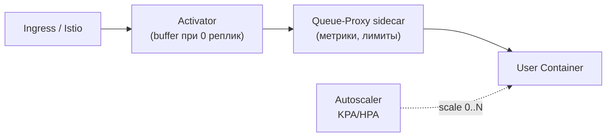

# ⚡ 10. Serverless на Kubernetes: Knative и OpenFaaS

## 🗺️ Ландшафт FaaS

| Проект | Модель | Масштабирование | Кому подходит |
|---|---|---|---|
| **Knative Serving** | контейнер = функция, Revision-модель | scale-to-zero, concurrency-based | enterprise, платформенные команды |
| **Knative Eventing** | событийная шина (sources→brokers) | по числу событий | event-driven архитектуры |
| **OpenFaaS** | функция в контейнере (of-watchdog) | по очереди запросов | быстрый старт, простой UX |
| KEDA + Deployment | свой DIY serverless | scale-to-zero по метрикам | когда не нужна полная платформа |



## ⚙️ Knative Serving: ревизии и трафик

Установка на kind:

```bash
kubectl apply -f https://github.com/kubernetes-sigs/knative-operator/releases/latest/download/knative.yaml
kubectl apply -f https://github.com/knative/serving/releases/latest/download/serving-core.yaml
# для magic DNS: serving-default-domain; для сети — Kourier или существующий Istio
```

Минимальный сервис:

```yaml
apiVersion: serving.knative.dev/v1
kind: Service
metadata:
  name: log-parser
spec:
  template:
    metadata:
      annotations:
        autoscaling.knative.dev/minScale: "0"        # scale-to-zero
        autoscaling.knative.dev/maxScale: "20"
        autoscaling.knative.dev/target: "50"          # concurrent requests per pod
    spec:
      containers:
        - image: registry.local/platform/log-parser:1.4
          resources:
            requests: { cpu: 100m, memory: 128Mi }
          readinessProbe: { httpGet: { path: /healthz } }
  traffic:
    - revisionName: log-parser-00001
      percent: 90
    - revisionName: log-parser-00002
      percent: 10                                     # канареечный релиз из коробки!
```

**Ревизия (Revision)** — неизменяемый снимок конфигурации. Каждый `kubectl apply` с новым образом = новая ревизия → откат это «перевесить трафик на прошлую ревизию», а не redeploy:

```bash
kn service list
kn revision list
kn service update log-parser --image registry.local/platform/log-parser:1.5 --traffic 1.5=100
kn service update log-parser --traffic @latest=10,log-parser-00001=90   # канарейка
kn route describe                                                       # URL с тегами
```

## 📬 Eventing: события вместо поллинга

```yaml
# Источник: новые объекты в бакете → Broker
apiVersion: sources.knative.dev/v1
kind: SinkBinding
metadata: { name: s3-events }
spec:
  sink: { ref: { apiVersion: eventing.knative.dev/v1, kind: Broker, name: default } }
  subject: ...
---
# Подписчики через Trigger с фильтрацией:
apiVersion: eventing.knative.dev/v1
kind: Trigger
metadata: { name: on-image-uploaded }
spec:
  broker: default
  filter:
    attributes: { type: s3.object.created, prefix: uploads/images }
  subscriber:
    ref: { apiVersion: serving.knative.dev/v1, kind: Service, name: thumbnailer }
```

Паттерн: thumbnailer масштабируется 0→N под наплыв событий и обратно в ноль ночью. CloudEvents — стандартный формат конвертов между компонентами.

## 🐟 OpenFaaS: простота за час

```bash
arkade install openfaas
export OPENFAAS_URL=http://127.0.0.1:31112 && echo pass | faas-cli login -u admin --password-stdin

faas-cli new resize-img --lang python3-http     # шаблон функции
faas-cli up                                      # build+push+deploy одной командой
```

```python
# ./resize-img/handler.py — контракт OpenFaaS
def handle(event, context):
    if event.method != "POST":
        return {"statusCode": 405, "body": "POST only"}
    resized = resize(base64.b64decode(event.body), max_side=512)
    return {"statusCode": 200,
            "body": base64.b64encode(resized).decode(),
            "headers": {"Content-Type": "image/png"}}
```

Фичи: `annotations: prometheus.io.scrape` автоскейл по RPS, secrets через `faas-cli secret create`, async-режим (`/async-function/<name>`) через NATS.

## ⚠️ Cold start и подводные камни

| Проблема | Суть | Митигация |
|---|---|---|
| Cold start | 0 реплик → первый запрос ждёт pull+start (сотни мс–секунды) | minScale=1 для критичных; образы маленькие (distroless); keep-alive |
| Состояние | функции stateless по определению | состояние в Redis/S3/БД |
| Долгие задачи | таймауты платформы | KEDA+CronJob/Workflows вместо FaaS |
| Стоимость чата | пустые warm-pod'ы жрут CPU | трезвый minScale; KEDA scale-to-zero |

Правило выбора: **FaaS для bursty/event-driven задач** (webhooks, обработка файлов, cron-джобы); стабильный долгоживущий API — обычный Deployment за Ingress.

## ❓ Пять вопросов для самопроверки

---


## ✅ Проверь себя

> Отвечай вслух до раскрытия ответа. Если «не помню» — вернись к разделу.


**В1. Что такое Revision в Knative и чем откат через него лучше redeploy?**
<details><summary>Ответ</summary>
Revision — неизменяемый снимок шаблона пода. Откат = перевод трафика на старую ревизию (мгновенно, без пересборки/перепулла), плюс можно держать две версии параллельно с процентным сплитом (канарейка) — redeploy такого не даёт.
</details>

**В2. Как работает scale-to-zero и кто буферизует запросы при нуле реплик?**
<details><summary>Ответ</summary>
Autoscaler видит ноль активных подов и ставит endpoint на Activator: он принимает запросы, триггерит масштабирование вверх и буферизует/проксирует до готовности первого пода. Цена этого удобства — cold start latency первого запроса.
</details>

**В3. Зачем Queue-Proxy sidecar в каждом Knative-поде?**
<details><summary>Ответ</summary>
Он считает реальную конкурентность запросов (для KPA-autoscaler'а), ограничивает параллелизм к контейнеру (queue depth), проксирует health/readiness и собирает метрики — пользовательский код остаётся чистым от платформенной логики.
</details>

**В4. Когда НЕ стоит тащить Knative, а хватит KEDA?**
<details><summary>Ответ</summary>
Если нужен только scale-to-zero для обычных Deployment по метрике (длина очереди, cron) — KEDA проще: меньше CRD, без новой сетевой модели, без ревизий. Knative берут ради ревизий/traffic split/eventing как платформы, а не ради одного скейлинга.
</details>

**В5. Какие классы задач противопоказаны FaaS?**
<details><summary>Ответ</summary>
Долгие процессы (>таймаута платформы), stateful-приложения с локальным состоянием, постоянные WebSocket-соединения, задачи со строгими SLA на латентность первого байта (cold start). Их место — Deployment/StatefulSet или Job/KEDA-воркеры.
</details>

---

*Что дальше:* [08. Автоскейлинг HPA/VPA/KEDA](08-k8s-autoscaling.md) · [05. Progressive Delivery](../05-gitops-and-cicd/05-progressive-delivery.md)
