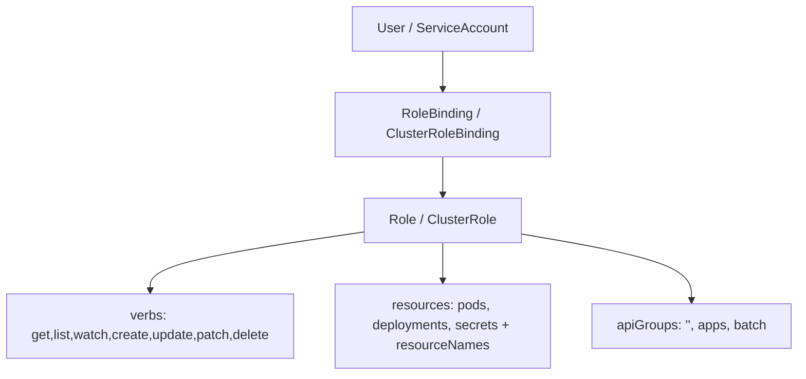

# 🔐 11. RBAC, ServiceAccounts и Pod Security Standards

> Кто может что — единственная защита от `kubectl delete`. RBAC + PSS — как не выстрелить себе в ногу в проде.

## 🏛️ RBAC: модель управления доступом



| Объект | Scope | Что описывает |
|---|---|---|
| **ServiceAccount (SA)** | namespace | identity для пода (`spec.serviceAccountName`), токен в `/var/run/secrets/kubernetes.io/serviceaccount/token` |
| **Role** | namespace | набор правил внутри одного namespace |
| **ClusterRole** | кластер | те же правила, но cluster-scope + может читать cluster-ресурсы (`nodes`, `clusterroles`) |
| **RoleBinding** | namespace | связывает SA/User/Group → Role (в том же namespace) |
| **ClusterRoleBinding** | кластер | связывает SA/User/Group → ClusterRole (на весь кластер) |

### verbs и ресурсы — точный список

```bash
kubectl api-resources --verbs=list --namespaced -o wide | head -30
# верифицируйте имя ресурса перед написанием Role:
kubectl explain role.rules.verbs
kubectl explain role.rules.resources
```

**Частые ресурсы:** `pods`, `pods/log`, `pods/exec`, `deployments` (`apps`), `configmaps`, `secrets`, `services`, `ingresses` (`networking.k8s.io`), `jobs` (`batch`), `cronjobs`, `roles/rolebindings` (`rbac.authorization.k8s.io`).

**verbs:** `get`, `list`, `watch`, `create`, `update`, `patch`, `delete`, `deletecollection` — `*` используйте только для дебага, в проде — минимальный набор.

### Minimal Role — пример least privilege

```yaml
apiVersion: v1
kind: ServiceAccount
metadata:
  name: deployer
  namespace: shop
automountServiceAccountToken: false  # токен только там где нужно
---
apiVersion: rbac.authorization.k8s.io/v1
kind: Role
metadata:
  name: deployer-role
  namespace: shop
rules:
  - apiGroups: ["apps"]
    resources: ["deployments"]
    verbs: ["get","list","watch","patch","update"]
    # resourceNames ограничивает до конкретного деплоя — ультра-минимализм
    resourceNames: ["shop-api"]
  - apiGroups: [""]
    resources: ["pods","pods/log"]
    verbs: ["get","list","watch"]
  - apiGroups: [""]
    resources: ["configmaps"]
    verbs: ["get","list"]
---
apiVersion: rbac.authorization.k8s.io/v1
kind: RoleBinding
metadata:
  name: deployer-binding
  namespace: shop
subjects:
  - kind: ServiceAccount
    name: deployer
    namespace: shop
roleRef:
  kind: Role
  name: deployer-role
  apiGroup: rbac.authorization.k8s.io
```

```yaml
# ClusterRole для чтения узлов и логов (SRE) — один на кластер
apiVersion: rbac.authorization.k8s.io/v1
kind: ClusterRole
metadata:
  name: sre-readonly
rules:
  - apiGroups: [""]
    resources: ["nodes","pods","namespaces","events"]
    verbs: ["get","list","watch"]
  - apiGroups: ["apps"]
    resources: ["deployments","replicasets","daemonsets"]
    verbs: ["get","list","watch"]
---
apiVersion: rbac.authorization.k8s.io/v1
kind: ClusterRoleBinding
metadata:
  name: sre-team
subjects:
  - kind: Group
    name: sre-team
    apiGroup: rbac.authorization.k8s.io
roleRef:
  kind: ClusterRole
  name: sre-readonly
  apiGroup: rbac.authorization.k8s.io
```

### Агрегация ClusterRole

```yaml
apiVersion: rbac.authorization.k8s.io/v1
kind: ClusterRole
metadata:
  name: monitoring:view
  labels:
    kubernetes.io/bootstrapping: rbac-defaults
aggregationRule:
  clusterRoleSelectors:
    - matchLabels:
        rbac.authorization.k8s.io/aggregate-to-monitoring-view: "true"
rules: []  # заполняется автоматически из помеченных ClusterRole
---
apiVersion: rbac.authorization.k8s.io/v1
kind: ClusterRole
metadata:
  name: custom-metrics-reader
  labels:
    rbac.authorization.k8s.io/aggregate-to-monitoring-view: "true"
rules:
  - apiGroups: [""]
    resources: ["pods"]
    verbs: ["get","list"]
```

---

## 🔍 Отладка RBAC: can-i и audit

```bash
# От имени SA проверить доступ
kubectl auth can-i get pods --as=system:serviceaccount:shop:deployer -n shop
# yes / no

# Все права SA в namespace
kubectl auth can-i --list --as=system:serviceaccount:shop:deployer -n shop

# Все права текущего пользователя
kubectl auth can-i --list -n shop

# Кто может что — установить аудит
kubectl create -f https://raw.githubusercontent.com/aquasecurity/kubectl-who-can/master/install.yaml
kubectl who-can get secrets -n shop

# Логи apiserver audit (если включён)
journalctl -u kube-apiserver | grep -i "forbidden"`
kubectl get events -A --field-selector reason=Forbidden
```

**Типичный 403:**

```
Error from server (Forbidden): deployments.apps "shop-api" is forbidden: User "system:serviceaccount:shop:deployer" cannot patch resource "deployments" in API group "apps" in the namespace "shop"
```

→ Смотреть: `verb` табличного? `resourceNames` режет? не тот `namespace` в Binding? `apiGroup` пустой vs `apps`?

---

## 🛡️ Pod Security Standards (PSS)

PSS — 3 профиля, включаются label'ом на namespace (замена deprecated PSP).

| Профиль | Что запрещает/требует | Когда использовать |
|---|---|---|
| **privileged** | ничего — всё разрешено | `kube-system`, CNI |
| **baseline** | `hostNetwork/hostPID/hostIPC`, `hostPath`, `privileged` контейнер | dev, доверенные команды |
| **restricted** | + `runAsNonRoot:true`, `seccomp: RuntimeDefault`, `allowPrivilegeEscalation:false`, `capabilities drop ALL`, `runAsUser>0`, `seLinux` | production, **дефолт** |

```bash
kubectl label ns shop pod-security.kubernetes.io/enforce=restricted
kubectl label ns shop pod-security.kubernetes.io/audit=restricted
kubectl label ns shop pod-security.kubernetes.io/warn=restricted
# enforce = блок, audit = в лог, warn = warning в kubectl
```

### SecurityContext: pod vs container

```yaml
apiVersion: v1
kind: Pod
metadata:
  name: secure-app
  namespace: shop
spec:
  serviceAccountName: shop-sa
  automountServiceAccountToken: false
  securityContext:
    runAsNonRoot: true
    runAsUser: 10001
    runAsGroup: 3000
    fsGroup: 2000              # gid для volume'ов
    seccompProfile:
      type: RuntimeDefault     # или Localhost/localhost/profile.json
  containers:
    - name: app
      image: nginxinc/nginx-unprivileged:1.27-alpine
      securityContext:
        allowPrivilegeEscalation: false
        readOnlyRootFilesystem: true
        runAsNonRoot: true
        capabilities:
          drop: ["ALL"]
          # add: ["NET_BIND_SERVICE"]  # только если нужно <1024
        seccompProfile:
          type: RuntimeDefault
      ports:
        - containerPort: 8080
      volumeMounts:
        - mountPath: /tmp
          name: tmp
        - mountPath: /cache
          name: cache
      resources:
        requests: { cpu: "100m", memory: "128Mi" }
        limits:   { cpu: "500m", memory: "256Mi" }
  volumes:
    - name: tmp
      emptyDir: {}
    - name: cache
      emptyDir: {}
```

**Поля шпаргалка:**

| Поле | Где | Что делает |
|---|---|---|
| `runAsNonRoot: true` | pod/container | kubelet откажется запускать если образ USER 0 |
| `runAsUser: 10001` | pod/container | принудительный uid |
| `fsGroup: 2000` | pod | chown volume'ов при монте |
| `readOnlyRootFilesystem: true` | container | `/` только для чтения — требует `emptyDir` для `/tmp`/`/cache` |
| `allowPrivilegeEscalation: false` | container | нельзя получить больше привилегий чем родитель |
| `capabilities.drop: ["ALL"]` | container | сбросить все Linux caps (`NET_RAW` и т.д.) |
| `seccompProfile.type: RuntimeDefault` | pod/container | фильтр syscall'ов по дефолту runtime |
| `automountServiceAccountToken: false` | pod/SA | не монтировать токен в `/var/run/secrets` |

---

## 🚫 Запрещённые паттерны и их замена

```yaml
# ❌ АНТИПАТТЕРН: хостовые привилегии
spec:
  hostNetwork: true
  hostPID: true
  volumes: [{ name: host, hostPath: { path: / } }]
# → restricted отклонит: "hostPath volumes are forbidden"
# ✅ Замена: sidecar с node_exporter DaemonSet, без hostPath в приложениях

# ❌ АНТИПАТТЕРН: privileged контейнер
securityContext: { privileged: true }
# ✅ Замена: capabilities.add точечно, или RuntimeClass gvisor/kata

# ❌ АНТИПАТТЕРН: mount SA токена везде
# automountServiceAccountToken defaults to true
# ✅ Замена: SA с false, монт только где нужно:
# spec: { serviceAccountName: shop-sa, automountServiceAccountToken: true }  # точечно
```

---

## 🧪 Hands-on Lab (20 мин, kind)

### Подготовка

```bash
kind create cluster --name rbac-lab
kubectl create ns shop
kubectl label ns shop pod-security.kubernetes.io/enforce=restricted --overwrite
kubectl label ns shop pod-security.kubernetes.io/warn=restricted --overwrite
kubectl create serviceaccount deployer -n shop
kubectl create serviceaccount shop-sa -n shop
```

### Шаг 1. Задеплойте least-privilege и проверьте can-i

```bash
kubectl apply -f - <<'YAML'
apiVersion: rbac.authorization.k8s.io/v1
kind: Role
metadata: { name: deployer-role, namespace: shop }
rules:
  - { apiGroups: ["apps"], resources: ["deployments"], verbs: ["get","list","watch","patch"], resourceNames: ["shop-api"] }
  - { apiGroups: [""],  resources: ["pods"], verbs: ["get","list"] }
YAML
kubectl create rolebinding deployer-binding --role=deployer-role --serviceaccount=shop:deployer -n shop --dry-run=client -o yaml | kubectl apply -f -

kubectl auth can-i patch deployments --as=system:serviceaccount:shop:deployer -n shop  # yes (но только shop-api!)
kubectl auth can-i create deployments --as=system:serviceaccount:shop:deployer -n shop # no
kubectl auth can-i --list --as=system:serviceaccount:shop:deployer -n shop
```

### Шаг 2. PSS restricted отклонит privileged pod

```bash
kubectl apply -f - <<'YAML' 2>&1 | head -30
apiVersion: v1
kind: Pod
metadata: { name: bad-privileged, namespace: shop }
spec:
  containers:
  - name: app
    image: nginx:1.27
    securityContext: { privileged: true }
YAML
# Ожидаемо: Forbidden: violates PodSecurity "restricted:latest": privileged (container "app" must not set securityContext.privileged=true)

# Почините:
kubectl apply -f - <<'YAML'
apiVersion: v1
kind: Pod
metadata: { name: good, namespace: shop }
spec:
  serviceAccountName: shop-sa
  automountServiceAccountToken: false
  securityContext: { runAsNonRoot: true, runAsUser: 10001, fsGroup: 2000, seccompProfile: { type: RuntimeDefault } }
  containers:
  - name: app
    image: nginxinc/nginx-unprivileged:1.27-alpine
    securityContext: { allowPrivilegeEscalation: false, readOnlyRootFilesystem: true, capabilities: { drop: ["ALL"] } }
    ports: [{ containerPort: 8080 }]
    volumeMounts: [{ name: tmp, mountPath: /tmp }]
  volumes: [{ name: tmp, emptyDir: {} }]
YAML
kubectl get pod good -n shop   # Running
```

### Шаг 3. readOnlyRootFilesystem failure → fix с emptyDir

```bash
# Под без tmp volume с readOnlyRootFilesystem упадёт:
kubectl apply -f - <<'YAML' 2>&1 | grep -i "readonly"
apiVersion: v1
kind: Pod
metadata: { name: ro-fail, namespace: shop }
spec:
  securityContext: { runAsNonRoot: true, runAsUser: 10001, seccompProfile: { type: RuntimeDefault } }
  containers:
  - name: app
    image: nginxinc/nginx-unprivileged:1.27-alpine
    securityContext: { readOnlyRootFilesystem: true, allowPrivilegeEscalation: false, capabilities: { drop: ["ALL"] } }
YAML
# nginx: [emerg] mkdir() "/var/cache/nginx/client_temp" failed (30: Read-only file system)
# Фикс — добавить emptyDir volumeMounts для /var/cache/nginx и /tmp как выше
```

### Шаг 4. runAsNonRoot failure

```bash
kubectl apply -f - <<'YAML' 2>&1
apiVersion: v1
kind: Pod
metadata: { name: root-fail, namespace: shop }
spec:
  securityContext: { runAsNonRoot: true }
  containers:
  - name: app
    image: nginx:1.27  # USER 0 внутри
YAML
# Error: container has runAsNonRoot and image will run as root

# Фикс: взять nginxinc/nginx-unprivileged или указать runAsUser: 101
```

---

## 🚑 Break-Fix сценарии (как в 17-break-fix)

### Incident RBAC-1: 403 Forbidden patch deployment

```bash
kubectl -n shop auth can-i patch deployments --as=system:serviceaccount:shop:deployer
# no
kubectl get role deployer-role -n shop -o yaml
# rules: verbs patch, но resourceNames: ["shop-api"] — патчите другой деплой shop-api-v2
kubectl patch deploy shop-api-v2 -n shop --patch '{"spec":{"replicas":3}}' --as=system:serviceaccount:shop:deployer
# Forbidden: cannot patch resource "deployments" with name "shop-api-v2"
# Фикс: убрать resourceNames или добавить второе имя, или использовать wildcard без resourceNames
kubectl patch role deployer-role -n shop --type=json -p '[{"op":"remove","path":"/rules/0/resourceNames"}]'
kubectl auth can-i patch deployments --as=system:serviceaccount:shop:deployer -n shop # yes
```

### Incident RBAC-2: Wrong namespace в RoleBinding

```bash
kubectl get rolebinding deployer-binding -n shop -o yaml
# subjects[0].namespace: default  (опечатка!)
# namespace SA не совпадает — user system:serviceaccount:default:deployer не имеет прав в shop
# Фикс: kubectl patch rolebinding deployer-binding -n shop --type merge -p '{"subjects":[{"kind":"ServiceAccount","name":"deployer","namespace":"shop"}]}'
```

### Incident RBAC-3: Missing ServiceAccount → падает pod

```bash
kubectl apply -f - <<'YAML'
apiVersion: v1
kind: Pod
metadata: { name: missing-sa, namespace: shop }
spec:
  serviceAccountName: not-exist
  containers: [{ name: app, image: nginxinc/nginx-unprivileged:1.27 }]
YAML
# kubectl describe pod missing-sa -n shop | grep -i serviceaccount
# MountVolume.SetUp failed: serviceaccount "not-exist" not found
# Фикс: kubectl create sa not-exist -n shop  или  исправить spec.serviceAccountName
```

### Incident PSS-1: privileged pod rejected

См. Шаг 2 выше. Дополнительно audit:

```bash
kubectl label ns shop pod-security.kubernetes.io/audit=restricted --overwrite
kubectl apply -f bad-privileged.yaml --dry-run=server 2>&1 | grep -i privileged
kubectl get events -n shop --field-selector reason=FailedCreate | grep PodSecurity
```

### Incident PSS-2: read-only filesystem failure

См. Шаг 3. Диагностика: `kubectl logs good -n shop` + `kubectl describe pod ro-fail -n shop | grep -A5 Failed`.

---

## 🔐 Hardening чек-лист (для CI и Kyverno)

```bash
# kube-score / kubesec как gate
kube-score score deployment.yaml
kubesec scan deployment.yaml

# Kyverno: require restricted (enforce mode) — см. 20-01 Policy as Code
kubectl apply -f - <<'YAML'
apiVersion: kyverno.io/v1
kind: ClusterPolicy
metadata: { name: require-run-as-non-root }
spec:
  validationFailureAction: Enforce
  background: true
  rules:
    - name: check-runAsNonRoot
      match: { any: [{ resources: { kinds: ["Pod"] } }] }
      validate:
        message: "runAsNonRoot required"
        pattern:
          spec:
            securityContext:
              runAsNonRoot: true
YAML
```

---

## 🧨 Типовые грабли RBAC/PSS (только эта тема)

| Симптом | Причина | Быстрое решение |
|---|---|---|
| `403 Forbidden` на `get pods` | Нет verb `list`/`watch`, или `apiGroup` `""` vs `apps` | `kubectl auth can-i --list --as=... -n $NS`; исправить `verbs`/`apiGroups` |
| `cannot patch ... with name "X"` | `resourceNames` режет имя | Убрать `resourceNames` или добавить имя |
| `serviceaccount "X" not found` | Опечатка SA или не в том namespace | `kubectl get sa -A | grep X`; создать SA в $NS |
| Pod `FailedCreate: violates PodSecurity` `privileged` | Namespace `enforce=restricted`, pod просит `privileged:true` | Убрать `privileged`, добавить `seccomp/capabilities.drop ALL` |
| Pod `runAsNonRoot` + image root | `nginx:1.27` USER 0 + `runAsNonRoot:true` | Взять `nginx-unprivileged` или `runAsUser: 101` |
| `Read-only file system` `/var/cache/nginx` | `readOnlyRootFilesystem:true` без `emptyDir` | `volumeMounts: /tmp, /cache` + `emptyDir` |
| SA токен в каждом поде | `automountServiceAccountToken:true` дефолт | `automountServiceAccountToken:false` на SA и pod'ах |
| `403` после `kubectl apply -f rbac.yaml` но `can-i` yes | Кэш RBAC (до 1мин) или не тот context/namespace | `kubectl auth can-i --as=... -n $NS --list` + `kubectl config current-context` |

---

## ✅ Чек-лист зрелости RBAC/PSS

- [ ] Все SA с `automountServiceAccountToken: false` кроме нуждающихся, Role — least privilege без `*`
- [ ] Namespace'ы `shop/prod` с `pod-security.kubernetes.io/enforce=restricted` + `warn/audit`
- [ ] Все pod'ы с `runAsNonRoot`, `RuntimeDefault`, `drop ALL`, `readOnlyRootFilesystem` (с volumes где нужно)
- [ ] CI gate: `kube-score`/`kubesec` + Kyverno `Enforce` в кластере (policy `require-run-as-non-root`)
- [ ] RBAC аудит: `kubectl-who-can` + `audit --list` ежеквартально, роли версионированы в Git

---

## 🎤 Пять вопросов для повторения

**В1. Почему RoleBinding в `shop` с subject `default:deployer` даёт 403 на `get pods` в `shop`?**

<details><summary>Ответ</summary>

Subject namespace — часть identity: `system:serviceaccount:default:deployer ≠ system:serviceaccount:shop:deployer`. Binding ищет SA в `default`, а pod стоит в `shop` с токеном `shop:deployer` — нет связи. Фикс: `subjects[0].namespace: shop`.

</details>

**В2. Чем `Role` отличается от `ClusterRole` и когда нужен каждый?**

<details><summary>Ответ</summary>

`Role` namespaced, правила только в своём namespace; `ClusterRole` cluster-scope + может разрешать `nodes`/`clusterroles`. Binding тип определяет scope доступа: `RoleBinding` → `ClusterRole` даёт права только в своём namespace (эскалация без `ClusterRoleBinding`). Правило: namespace-ресурсы — `Role`, глобальные — `ClusterRole`.

</details>

**В3. Pod с `runAsNonRoot: true` и образом `nginx:1.27` не создаётся. Почему?**

<details><summary>Ответ</summary>

Образ `nginx:1.27` имеет `USER 0`; `runAsNonRoot` просит kubelet проверить что effective uid ≠0 — проверка проваливается до запуска. Фикс: `nginxinc/nginx-unprivileged:1.27` (USER 101) или `runAsUser: 101` + `allowPrivilegeEscalation:false`.

</details>

**В4. Что делает `readOnlyRootFilesystem: true` и как починить падение nginx с этой опцией?**

<details><summary>Ответ</summary>

Делает корневую ФС read-only — любая запись (`/tmp`, `/var/cache/nginx`) = `Read-only file system`. Фикс: `emptyDir` volume'ы для `/tmp`, `/var/cache/nginx`, `/var/run`. Для логов — `emptyDir` или sidecar.

</details>

**В5. Как быстро проверить что ServiceAccount `deployer` может `patch deployments/shop-api` в `shop`?**

<details><summary>Ответ</summary>

`kubectl auth can-i patch deployments --as=system:serviceaccount:shop:deployer -n shop` (+ `--list` для всех прав). Если `resourceNames` ограничивает — проверить второе имя, `apiGroups: ["apps"]` и `resources: ["deployments"]`. Для кластерного аудита — `kubectl who-can patch deployments -n shop`.

</details>

---

## 🧭 Что дальше

| Шаг | Материал |
|---|---|
| 🔬 Закрепить | [Lab 03: kind приложение](../16-guided-labs/03-lab-kubernetes-kind-app.md) + повтори с `restricted` label |
| 💪 Практика | [20.1 Policy as Code](../20-senior-stack/01-policy-as-code.md) — Kyverno require PSS |
| 🎤 Проверить | [K8s Troubleshooting](../04-kubernetes/04-k8s-troubleshooting-handbook.md) — 403 vs PSS |

<!-- enriched:v1 -->
