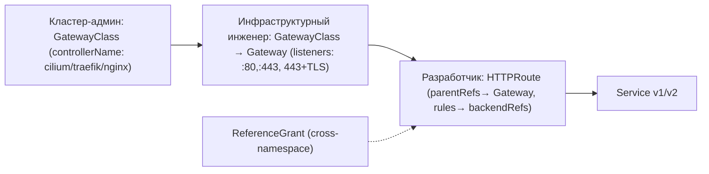

# 🌐 12. Gateway API: Замена Ingress для Прода

> Ingress — frozen с 2018. Gateway API (v1 с K8s 1.28) — роли (infra/dev), кросс-namespace, вес 90/10, mTLS, TCP/UDP/TLSRoute из коробки.

## 🧭 Модель ролей



| Объект | Кто создаёт | Что описывает |
|---|---|---|
| **GatewayClass** | Админ | контроллер `spec.controllerName: io.cilium/gateway` (или `traefik.io/gateway-controller`) + параметры |
| **Gateway** | Инфра/SRE | слушатели `listeners[]` (hostname `*.example.com`, port 80/443, protocol HTTP/HTTPS/TLS, TLS `certificateRefs` на Secret от cert-manager) + `addresses` |
| **HTTPRoute** | Dev | правила `rules[] → matches(path, headers) → backendRefs(service, port, weight)` + `parentRefs` → Gateway |
| **ReferenceGrant** | Инфра | разрешает HTTPRoute из ns `shop` ссылаться на Service/Gateway в другом ns |
| **GRPCRoute/TCPRoute/TLSRoute** | Dev | то же для gRPC/TCP/TLS passthrough |

### Ingress vs Gateway API

| Критерий | Ingress | Gateway API |
|---|---|---|
| Роли | один объект, аннотации vendor-specific (`nginx.ingress.kubernetes.io/...`) | разделение Gateway (SRE) / HTTPRoute (dev) |
| Кросс-namespace | нельзя (ExternalName хак) | `ReferenceGrant` штатный |
| Трафик-сплит 90/10 | аннотация `canary` (nginx) | `backendRefs: [v1 weight 90, v2 weight 10]` декларативно |
| TLS/mTLS | Secret + аннотации | `Gateway.spec.listeners.tls.certificateRefs` + `mode: Terminate/Passthrough` |
| Header/weight матчинг | аннотации | `matches: headers/path/queryParams` нативно |
| Статус/conditions | `ingress.status.loadBalancer` | `Gateway/HTTPRoute .status.conditions + .status.parents` |

---

## 📦 Минимальные манифесты

### GatewayClass + Gateway

```yaml
apiVersion: gateway.networking.k8s.io/v1
kind: GatewayClass
metadata:
  name: cilium
spec:
  controllerName: io.cilium/gateway-controller
  description: Cilium Gateway eBPF datapath
---
apiVersion: gateway.networking.k8s.io/v1
kind: Gateway
metadata:
  name: prod-gateway
  namespace: infra-gateway
spec:
  gatewayClassName: cilium
  # опционально: addresses:
  # - type: IPAddress
  #   value: 203.0.113.10
  listeners:
    - name: http
      hostname: "*.example.com"   # wildcard
      port: 80
      protocol: HTTP
      allowedRoutes:
        namespaces:
          from: Selector
          selector:
            matchLabels:
              gateway: allowed
    - name: https
      hostname: "*.example.com"
      port: 443
      protocol: HTTPS
      tls:
        mode: Terminate
        certificateRefs:
          - name: wildcard-example-com
            namespace: infra-gateway
            kind: Secret
      allowedRoutes:
        namespaces:
          from: Selector
---
apiVersion: cert-manager.io/v1
kind: Certificate
metadata: { name: wildcard-example-com, namespace: infra-gateway }
spec:
  secretName: wildcard-example-com
  issuerRef: { name: letsencrypt-prod, kind: ClusterIssuer }
  dnsNames: ["*.example.com", "example.com"]
```

### HTTPRoute 90/10 + cross-namespace + header

```yaml
apiVersion: gateway.networking.k8s.io/v1
kind: HTTPRoute
metadata:
  name: shop-api
  namespace: shop
  labels:
    gateway: allowed   # чтобы Gateway с selector его принял
spec:
  parentRefs:
    - name: prod-gateway
      namespace: infra-gateway
      sectionName: https
      # port: 443  # можно уточнить listener
  hostnames:
    - shop.example.com
  rules:
    - matches:
        - path: { type: PathPrefix, value: /api }
          headers:
            - name: x-beta
              value: "true"
      # точечный хедер — 100% на v2 для тестировщиков
      backendRefs:
        - name: shop-api-v2
          port: 80
          weight: 100
    - matches:
        - path: { type: PathPrefix, value: /api }
      # основной сплит 90/10
      backendRefs:
        - name: shop-api-v1
          port: 80
          weight: 90
        - name: shop-api-v2
          port: 80
          weight: 10
      filters:
        - type: RequestHeaderModifier
          requestHeaderModifier:
            add:
              - name: X-Forwarded-Proto
                value: https
            set:
              - name: X-Request-Id
                value: "%REQID%"  # на Cilium/Envoy поддерживается
        - type: ResponseHeaderModifier
          responseHeaderModifier:
            add:
              - name: X-Served-By
                value: gateway-api
      timeouts:
        request: 30s
        backendRequest: 10s
```

### ReferenceGrant для кросс-namespace

```yaml
# Разрешить HTTPRoute из shop ссылаться на Service в shop-v2
apiVersion: gateway.networking.k8s.io/v1beta1
kind: ReferenceGrant
metadata: { name: allow-shop-to-v2, namespace: shop-v2 }
spec:
  from:
    - group: gateway.networking.k8s.io
      kind: HTTPRoute
      namespace: shop
  to:
    - group: ""
      kind: Service
      name: shop-api-v2  # или без name — все
---
# Разрешить Gateway в infra-gateway ссылаться на Secret в cert-manager ns
apiVersion: gateway.networking.k8s.io/v1beta1
kind: ReferenceGrant
metadata: { name: allow-gateway-to-cert, namespace: infra-gateway }
spec:
  from:
    - group: gateway.networking.k8s.io
      kind: Gateway
      namespace: infra-gateway
  to:
    - group: ""
      kind: Secret
```

---

## 🔀 Миграция Ingress → Gateway API

```bash
# 1. Был:
kubectl get ingress shop-api -n shop -o yaml
# apiVersion: networking.k8s.io/v1
# spec:
#   ingressClassName: nginx
#   tls: [{ hosts: [shop.example.com], secretName: shop-tls }]
#   rules: [{ host: shop.example.com, http: { paths: [{ path: /api, backend: {service:{name: shop-api-v1, port:{number:80}}}}]}}]

# 2. Gateway уже создан (выше) → мигрируем правилом:
# - Удалите Ingress только после проверки HTTPRoute!
kubectl apply -f gateway.yaml -f httproute-90-10.yaml --dry-run=server
kubectl get gateway prod-gateway -n infra-gateway -o yaml | grep -A5 conditions
kubectl get httproute shop-api -n shop -o yaml | grep -A5 parentRefs
curl -H "Host: shop.example.com" http://<GATEWAY_IP>/api -v  # через HTTPRoute

# 3. После smoke:
kubectl delete ingress shop-api -n shop
```

**Автомиграция:** `ingress2gateway` ( https://gateway-api.sigs.k8s.io/guides/):

```bash
go install github.com/kubernetes-sigs/ingress2gateway@latest
ingress2gateway print --input ingress.yaml --providers cilium
```

---

## 🧪 Hands-on Lab (15 мин, kind + Cilium/Traefik/NGINX Gateway)

> Gateway API — GA с K8s 1.22+, контроллер нужен. В kind — поставьте один из: **Cilium** (`cilium install`), **Traefik** (`helm install traefik`), **NGINX Gateway Fabric** (`kubectl apply -f https://raw.githubusercontent.com/nginxinc/nginx-gateway-fabric/main/deploy/crds.yaml`).

### Установка контроллера (вариант Cilium в kind — самый простой для GW API)

```bash
kind create cluster --name gwapi --config - <<'EOF'
kind: Cluster
apiVersion: kind.x-k8s.io/v1alpha4
nodes:
  - role: control-plane
    extraPortMappings:
      - containerPort: 30080
        hostPort: 30080
      - containerPort: 30443
        hostPort: 30443
EOF

# Cilium с Gateway API (Cilium ≥1.14)
helm repo add cilium https://helm.cilium.io/
helm install cilium cilium/cilium --version 1.15.0 --namespace kube-system \
  --set gatewayAPI.enabled=true --set kubeProxyReplacement=strict --wait

# Альтернатива без Cilium — Traefik Gateway:
# helm repo add traefik https://helm.traefik.io/traefik
# helm install traefik traefik/traefik --set providers.kubernetesGateway.enabled=true

kubectl get crds | grep gateway
kubectl get gatewayclass
```

### Деплой демо и 90/10

```bash
kubectl create ns shop infra-gateway
kubectl label ns shop gateway=allowed --overwrite

kubectl apply -f - <<'YAML'
apiVersion: gateway.networking.k8s.io/v1
kind: GatewayClass
metadata: { name: cilium }
spec: { controllerName: io.cilium/gateway-controller }
YAML

kubectl apply -f - <<'YAML'
apiVersion: gateway.networking.k8s.io/v1
kind: Gateway
metadata: { name: prod-gateway, namespace: infra-gateway }
spec:
  gatewayClassName: cilium
  listeners:
    - name: http
      port: 80
      protocol: HTTP
      allowedRoutes: { namespaces: { from: Selector, selector: { matchLabels: { gateway: allowed } } } }
YAML

kubectl get gateway -n infra-gateway prod-gateway -o wide

# Два бэкенда
kubectl -n shop create deploy shop-api-v1 --image=ghcr.io/stefanprodan/podinfo:6.5.0 --port=9898
kubectl -n shop create deploy shop-api-v2 --image=ghcr.io/stefanprodan/podinfo:6.5.0 --port=9898
kubectl -n shop expose deploy shop-api-v1 --port=80 --target-port=9898 --name=shop-api-v1
kubectl -n shop expose deploy shop-api-v2 --port=80 --target-port=9898 --name=shop-api-v2
kubectl -n shop set env deploy/shop-api-v2 PODINFO_UI_COLOR=blue
kubectl -n shop rollout status deploy/shop-api-v1
kubectl -n shop rollout status deploy/shop-api-v2

# HTTPRoute 90/10 (код из раздела)
kubectl apply -f httproute-90-10.yaml
kubectl -n shop get httproute shop-api -o wide
kubectl -n infra-gateway get gateway prod-gateway -o yaml | grep -A10 status

# Получить IP Gateway
GW_IP=$(kubectl -n infra-gateway get gateway prod-gateway -o jsonpath='{.status.addresses[0].value}')
# В kind с Cilium — может быть 10.96.x.x, пробросьте через port-forward:
kubectl -n infra-gateway port-forward svc/prod-gateway-cilium 30080:80 &
curl -H "Host: shop.example.com" http://127.0.0.1:30080/api | grep -o '"color": "[^"]*"'

# Проверка сплита: 20 запросов — ~18 v1, ~2 v2
for i in $(seq 1 20); do curl -s -H "Host: shop.example.com" http://127.0.0.1:30080/api | jq -r '.message // .color' | head -1; done | sort | uniq -c

# canary по хедеру: должен попасть на v2 100%
curl -s -H "Host: shop.example.com" -H "x-beta: true" http://127.0.0.1:30080/api | grep -o blue
```

**Expected:** `Gateway Programmed True`, `HTTPRoute Accepted True`, `curl -H Host: shop.example.com` → 200, 90/10 распределение, хедер `x-beta: true` → только v2.

### Verification и отладка

```bash
kubectl get gatewayclass
kubectl describe gateway prod-gateway -n infra-gateway
kubectl get httproute -A -o wide
kubectl describe httproute shop-api -n shop | grep -E 'Parents|Conditions|Message'
kubectl -n infra-gateway get events --field-selector reason=Accepted
# Cilium/Traefik логи
kubectl -n kube-system logs -l app.kubernetes.io/name=cilium --tail=50 | grep -i gateway
# dry-run нового HTTPRoute:
kubectl apply -f httproute-new.yaml --dry-run=server
```

---

## 🚑 Break-Fix Gateway API

| # | Симптом | Причина | Диагностика | Фикс |
|---|---|---|---|---|
| 1 | `HTTPRoute shop-api Not Accepted: No matching Gateway` | `parentRefs.name` опечатка или `namespace` не тот | `kubectl describe httproute shop-api -n shop | grep -A3 Parent` + `kubectl get gateway -A` | исправить `parentRefs[0].name: prod-gateway, namespace: infra-gateway` |
| 2 | `Gateway http listener: 0 routes, AllowedRoutes selector mismatch` | ns `shop` без label `gateway: allowed` | `kubectl get ns shop --show-labels` + `kubectl describe gateway prod-gateway -n infra-gateway | grep -A5 allowedRoutes` | `kubectl label ns shop gateway=allowed --overwrite` |
| 3 | `Failed: Secret not found` на Gateway TLS | `certificateRefs` указывает Secret в другом ns без `ReferenceGrant` | `kubectl describe gateway prod-gateway -n infra-gateway | grep -A5 certificateRefs` + `kubectl get referencegrant -A` | создать `ReferenceGrant` в ns Secret |
| 4 | `502 Bad Gateway` 10% запросов (v2) | `shop-api-v2` Service без endpoints (label селектора) | `kubectl get endpoints -n shop shop-api-v2` `ENDPOINTS <none>` + `kubectl get svc shop-api-v2 -o yaml | grep selector` | fix `selector: app: shop-api-v2` vs `app.kubernetes.io/name` |
| 5 | `curl: 404` через Gateway, но `kubectl get httproute` Accepted | `hostnames: shop.example.com` не совпадает с `curl -H Host:` | `curl -H "Host: wrong.com"` vs `shop.example.com`; `kubectl get httproute shop-api -o yaml | grep hostnames` | добавить `hostnames` или `curl -H "Host: shop.example.com"` |

---

## 🔐 TLS с cert-manager

```yaml
apiVersion: cert-manager.io/v1
kind: ClusterIssuer
metadata: { name: letsencrypt-prod }
spec:
  acme:
    server: https://acme-v02.api.letsencrypt.org/directory
    email: admin@example.com
    privateKeySecretRef: { name: letsencrypt-prod }
    solvers:
      - http01: { ingress: { class: cilium } }  # для Gateway API: gatewayHTTPRoute
        # для wildcards:
      - dns01:
          cloudflare:
            email: admin@example.com
            apiTokenSecretRef: { name: cloudflare-api-token-secret, key: api-token }
---
apiVersion: gateway.networking.k8s.io/v1
kind: Gateway
metadata: { name: prod-gateway-tls, namespace: infra-gateway }
spec:
  gatewayClassName: cilium
  listeners:
    - name: https
      port: 443
      protocol: HTTPS
      hostname: "*.example.com"
      tls:
        mode: Terminate
        certificateRefs: [{ name: wildcard-example-com, kind: Secret }]
      allowedRoutes: { namespaces: { from: All } }
```

**Проверка:** `kubectl get certificate -n infra-gateway wildcard-example-com -o wide` → `Ready True`, `kubectl get secret wildcard-example-com -n infra-gateway`, `openssl s_client -connect shop.example.com:443 -servername shop.example.com | openssl x509 -noout -dates`.

---

## ✅ Чек-лист зрелости Gateway API

- [ ] `GatewayClass` 1 на кластер, `Gateway` per-env (infra-gateway/prod), `HTTPRoute` per-service в dev ns
- [ ] `ReferenceGrant` только где нужен кросс-namespace, `allowedRoutes.from: Selector` с label
- [ ] Каждый `HTTPRoute` с `hostnames`, `timeouts`, `filters` header modifier, `backendRefs.weight` 90/10 для canary
- [ ] `kubectl get gateway,httproute -A` → `Programmed/Accepted True`, `events` чистые
- [ ] TLS через `ClusterIssuer` + `Certificate`, `Gateway.tls.certificateRefs` на Secret с `ReferenceGrant`
- [ ] Старый Ingress удалён только после `curl -H Host:` smoke на Gateway

---

## 🎤 Пять вопросов для повторения

**В1. Чем Gateway отличается от HTTPRoute и кто их создаёт?**

<details><summary>Ответ</summary>

Gateway — инфраструктурный объект (слушатели :80/:443, hostname, TLS, addresses, allowedRoutes) — создаёт SRE. HTTPRoute — dev-объект (matches path/headers, backendRefs с weight, parentRefs → Gateway) — создаёт команда сервиса. Разделение ролей — главное отличие от Ingress.

</details>

**В2. Как сделать cross-namespace route?**

<details><summary>Ответ</summary>

`ReferenceGrant` в namespace цели (Service или Secret). Пример: HTTPRoute из `shop` → Service `shop-api-v2` в `shop-v2` требует `ReferenceGrant` в `shop-v2` с `from: HTTPRoute shop` → `to: Service`. Без него `Not Accepted: RefNotPermitted`.

</details>

**В3. Как проверить что Gateway принял HTTPRoute?**

<details><summary>Ответ</summary>

`kubectl get gateway -n infra-gateway`, `kubectl describe gateway prod-gateway | grep -A10 Conditions`, `kubectl get httproute shop-api -n shop -o yaml | grep -A10 status.parents` → `Accepted True`, `Programmed True`, `ResolvedRefs True`. `kubectl get events --field-selector reason=Accepted`.

</details>

**В4. Как мигрировать Ingress → Gateway API?**

<details><summary>Ответ</summary>

1) Развернуть GatewayClass+Gateway, 2) конвертировать `ingress2gateway print --input ingress.yaml`, 3) `kubectl apply --dry-run=server`, 4) smoke `curl -H Host: shop.example.com http://GW_IP/api`, 5) удалить Ingress. Автомиграция: `go install github.com/kubernetes-sigs/ingress2gateway`.

</details>

**В5. Чем weights 90/10 в backendRefs лучше аннотации canary у Ingress?**

<details><summary>Ответ</summary>

Декларативно, без vendor-аннотаций, с header/path матчингом в одном объекте, нативным кросс-namespace, статусом `Accepted`, интеграцией с `GRPCRoute/TCPRoute`. Ingress canary — через `nginx.ingress.kubernetes.io/canary-weight` — NGINX-specific, непереносим.

</details>

---

## 🧭 Что дальше

| Шаг | Материал |
|---|---|
| 🔬 Закрепить | [Traefik/Nginx](../12-advanced-networking-and-mesh/03-traefik-and-nginx-advanced.md) — сравните `IngressRoute` CRD vs Gateway API |
| 💪 Практика | [CNI Cilium](../12-advanced-networking-and-mesh/02-cni-cilium-and-calico.md) — Gateway с eBPF datapath |
| 🎤 Проверить | [K8s Troubleshooting](../04-kubernetes/04-k8s-troubleshooting-handbook.md) — 502/404 Gateway vs Ingress |

<!-- enriched:v1 -->
