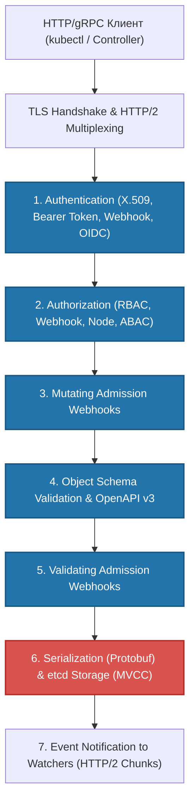
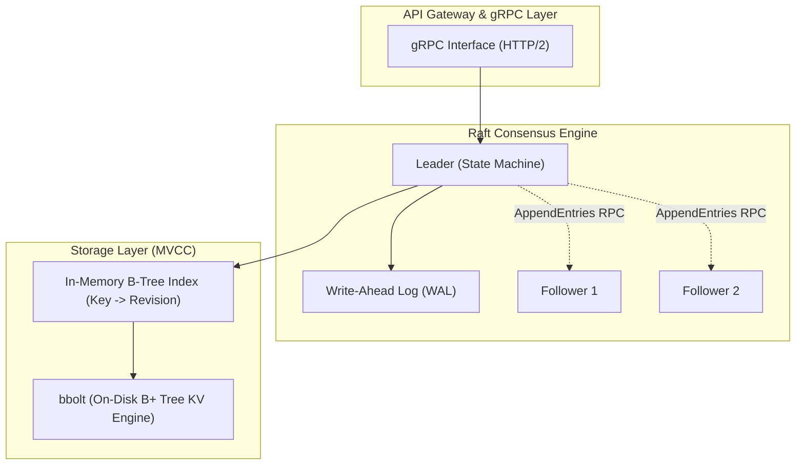

# 🏛️ 13. Kube-apiserver и etcd: Ядро Control Plane

> Kube-apiserver и etcd формируют фундамент отказоустойчивости и консистентности Kubernetes. Если API-сервер — это единственный шлюз для взаимодействия с кластером, то etcd — единственный источник истины (Single Source of Truth).

---

## 🏗️ Архитектура и Жизненный Цикл Запроса к API-серверу

`kube-apiserver` спроектирован как stateless-сервис, масштабируемый горизонтально за балансировщиком нагрузки (L4/L7). Он выполняет функции REST-интерфейса, валидации, мутации, авторизации и сохранения состояния объектов.

### Конвейер обработки HTTP-запроса (Request Pipeline)

Каждый входящий запрос к API-серверу проходит через строго детерминированную цепочку фильтров (HTTP Handler Chain).



#### 1. Аутентификация (Authentication)
API-сервер проверяет подлинность клиента, используя настроенные плагины (вызываются последовательно до первого успешного совпадения):
- **X.509 Client Certificates:** Проверка клиентского сертификата через CA (`--client-ca-file`). Поле `CN` (Common Name) мапится на `User`, а поля `O` (Organization) — на `Groups`.
- **Bearer Tokens / Bootstrap Tokens:** Статические токены или токены инициализации узлов.
- **ServiceAccount Tokens (TokenRequest API):** Временные JWT-токены с подписью OIDC (`--service-account-key-file`, `--service-account-issuer`), привязанные к конкретным подам (Bound Service Account Tokens).
- **OpenID Connect (OIDC):** Интеграция с корпоративными IdP (Keycloak, Okta, Dex, Google).
- **Webhook Token Authentication:** Делегирование проверки внешнему сервису.

> [!NOTE]
> В случае неудачи всех методов возвращается `401 Unauthorized`. Анонимные запросы (`system:anonymous`) допускаются, если включен флаг `--anonymous-auth=true`, но обычно блокируются на этапе авторизации.

#### 2. Авторизация (Authorization)
После успешного определения субъекта (`User`, `Groups`) проверяются права на выполнение операции над ресурсом:
- **RBAC (Role-Based Access Control):** Проверка сопоставлений `RoleBinding` и `ClusterRoleBinding`.
- **Node Authorization:** Специальный авторизатор для `kubelet`, разрешающий доступ только к ресурсам, привязанным к конкретному узлу (поды, секреты, ConfigMap этого узла).
- **Webhook Authorization:** Внешний сервис авторизации.

#### 3. Admission Controllers (Контроллеры Допуска)
Если запрос изменяет состояние (`POST`, `PUT`, `PATCH`, `DELETE`), он проходит через двухфазный контроль:
1. **Mutating Admission:** Модифицирует объект (например, внедрение sidecar-контейнеров, простановка дефолтных `securityContext` или `storageClass`). Плагины выполняются последовательно; пользовательские вебхуки вызываются параллельно или циклически при мутациях.
2. **Object Validation:** Проверка структуры схемы данных по OpenAPI/CRD схемам.
3. **Validating Admission:** Финальная проверка бизнес-правил (например, запрет привилегированных контейнеров, проверка квот `ResourceQuota`). При отклонении хотя бы одним контроллером запрос отклоняется с кодом `403 Forbidden`.

---

## 📦 etcd: Распределенное Консистентное Хранилище

`etcd` — это строго консистентная распределенная ключ-значение база данных, использующая алгоритм консенсуса **Raft**. Kubernetes хранит в etcd абсолютно все декларативное состояние кластера в формате `/registry/<resource_group>/<resource_name>/<namespace>/<name>`.

### Внутренняя архитектура etcd



### Ключевые концепции etcd

1. **Raft Consensus & Quorum:**
   - Для сохранения работоспособности кластеру etcd из $N$ узлов требуется кворум: $Q = \lfloor N/2 \rfloor + 1$.
   - Кластер из 3 узлов переносит отказ 1 узла ($Q=2$). Кластер из 5 узлов переносит отказ 2 узлов ($Q=3$). Четное количество узлов (например, 4) не увеличивает отказоустойчивость ($Q=3$, отказ 1 узла допустим, при отказе 2 — потеря кворума), но увеличивает накладные расходы на репликацию.

2. **MVCC (Multi-Version Concurrency Control):**
   - etcd не перезаписывает данные по месту. Каждая операция изменения (`PUT`, `DELETE`) инкрементирует глобальную 64-битную **Revision**.
   - Предыдущие версии ключей сохраняются, что позволяет API-серверу эффективно реализовать механизм **Watch**: клиенты подписываются на изменения, начиная с определенной ревизии (`resourceVersion`), без блокировок чтения.

3. **WAL (Write-Ahead Log) и Snapshot:**
   - Каждая транзакция сначала синхронно записывается в WAL на диск (`fdatasync`), затем реплицируется кворуму, и только после подтверждения коммитится в bbolt DB.
   - Периодически создается Snapshot состояния, после чего старые сегменты WAL усекаются.

4. **Compaction (Сжатие) и Defragmentation (Дефрагментация):**
   - **Compaction:** Помечает старые ревизии ключей до указанной границы как удаленные, освобождая логическое пространство в MVCC.
   - **Defragmentation:** Физически перестраивает B+ дерево хранилища `bbolt`, возвращая неиспользуемые страницы диску файловой системы (освобождает место в файле `member/snap/db`).

---

## 🛠️ Production-Ready Конфигурации

### 1. Манифест Kube-apiserver (`/etc/kubernetes/manifests/kube-apiserver.yaml`)

Конфигурация с включенным аудитом, защитой от перегрузок (Flow Schema / API Priority and Fairness), шифрованием секретов и оптимизированными лимитами inflight-запросов:

```yaml
apiVersion: v1
kind: Pod
metadata:
  name: kube-apiserver
  namespace: kube-system
  labels:
    component: kube-apiserver
    tier: control-plane
spec:
  hostNetwork: true
  priorityClassName: system-node-critical
  containers:
  - name: kube-apiserver
    image: registry.k8s.io/kube-apiserver:v1.30.2
    command:
    - kube-apiserver
    - --advertise-address=192.168.10.10
    - --allow-privileged=true
    - --authorization-mode=Node,RBAC
    - --client-ca-file=/etc/kubernetes/pki/ca.crt
    - --enable-admission-plugins=NodeRestriction,LimitRanger,ResourceQuota,MutatingAdmissionWebhook,ValidatingAdmissionWebhook
    - --enable-bootstrap-token-auth=true
    - --etcd-cafile=/etc/kubernetes/pki/etcd/ca.crt
    - --etcd-certfile=/etc/kubernetes/pki/apiserver-etcd-client.crt
    - --etcd-keyfile=/etc/kubernetes/pki/apiserver-etcd-client.key
    - --etcd-servers=https://192.168.10.10:2379,https://192.168.10.11:2379,https://192.168.10.12:2379
    - --kubelet-client-certificate=/etc/kubernetes/pki/apiserver-kubelet-client.crt
    - --kubelet-client-key=/etc/kubernetes/pki/apiserver-kubelet-client.key
    - --kubelet-preferred-address-types=InternalIP,ExternalIP,Hostname
    - --proxy-client-cert-file=/etc/kubernetes/pki/front-proxy-client.crt
    - --proxy-client-key-file=/etc/kubernetes/pki/front-proxy-client.key
    - --requestheader-allowed-names=front-proxy-client
    - --requestheader-client-ca-file=/etc/kubernetes/pki/front-proxy-ca.crt
    - --requestheader-extra-headers-prefix=x-remote-extra-
    - --requestheader-group-headers=x-remote-group
    - --requestheader-username-headers=x-remote-user
    - --secure-port=6443
    - --service-account-issuer=https://kubernetes.default.svc.cluster.local
    - --service-account-key-file=/etc/kubernetes/pki/sa.pub
    - --service-account-signing-key-file=/etc/kubernetes/pki/sa.key
    - --service-cluster-ip-range=10.96.0.0/12
    - --tls-cert-file=/etc/kubernetes/pki/apiserver.crt
    - --tls-private-key-file=/etc/kubernetes/pki/apiserver.key
    # Production Hardening & Scalability
    - --max-requests-inflight=1500
    - --max-mutating-requests-inflight=500
    - --audit-log-path=/var/log/kubernetes/audit.log
    - --audit-log-maxage=30
    - --audit-log-maxbackup=10
    - --audit-log-maxsize=100
    - --audit-policy-file=/etc/kubernetes/audit-policy.yaml
    - --encryption-provider-config=/etc/kubernetes/encryption-config.yaml
    resources:
      requests:
        cpu: 1000m
        memory: 2Gi
      limits:
        cpu: 4000m
        memory: 8Gi
    volumeMounts:
    - mountPath: /etc/kubernetes/
      name: k8s-certs
      readOnly: true
    - mountPath: /var/log/kubernetes/
      name: audit-logs
      readOnly: false
  volumes:
  - hostPath:
      path: /etc/kubernetes
    name: k8s-certs
  - hostPath:
      path: /var/log/kubernetes
    name: audit-logs
```

### 2. Скрипт автоматизированного бэкапа и обслуживания etcd

```bash
#!/usr/bin/env bash
# /usr/local/bin/etcd-backup-maintenance.sh
set -euo pipefail

BACKUP_DIR="/var/backups/etcd"
TIMESTAMP=$(date +"%Y%m%d_%H%M%S")
SNAPSHOT_FILE="${BACKUP_DIR}/etcd-snapshot-${TIMESTAMP}.db"
RETENTION_DAYS=7

export ETCDCTL_API=3
CACERT="/etc/kubernetes/pki/etcd/ca.crt"
CERT="/etc/kubernetes/pki/etcd/server.crt"
KEY="/etc/kubernetes/pki/etcd/server.key"
ENDPOINTS="https://127.0.0.1:2379"

mkdir -p "${BACKUP_DIR}"

echo "[$(date)] Starting etcd backup..."
etcdctl --cacert="${CACERT}" --cert="${CERT}" --key="${KEY}" \
  --endpoints="${ENDPOINTS}" \
  snapshot save "${SNAPSHOT_FILE}"

echo "[$(date)] Validating snapshot integrity..."
etcdctl --write-out=table snapshot status "${SNAPSHOT_FILE}"

# Сжатие снимка
gzip -9 "${SNAPSHOT_FILE}"
echo "[$(date)] Snapshot saved as ${SNAPSHOT_FILE}.gz"

# Автоматический Compaction и Defragmentation
echo "[$(date)] Running compaction and defragmentation..."
REV=$(etcdctl --cacert="${CACERT}" --cert="${CERT}" --key="${KEY}" \
  --endpoints="${ENDPOINTS}" \
  endpoint status --write-out=json | jq -r '.[0].Status.header.revision')

etcdctl --cacert="${CACERT}" --cert="${CERT}" --key="${KEY}" \
  --endpoints="${ENDPOINTS}" \
  compact "${REV}"

etcdctl --cacert="${CACERT}" --cert="${CERT}" --key="${KEY}" \
  --endpoints="${ENDPOINTS}" \
  defrag

# Удаление старых бэкапов
find "${BACKUP_DIR}" -type f -name "etcd-snapshot-*.db.gz" -mtime +${RETENTION_DAYS} -delete
echo "[$(date)] Maintenance completed successfully."
```

---

## ⚡ CLI Шпаргалка: Диагностика и Управление

### Работа с `etcdctl`

```bash
# Алиас для удобного вызова etcdctl с TLS сертификатами
alias k-etcd='ETCDCTL_API=3 etcdctl \
  --cacert=/etc/kubernetes/pki/etcd/ca.crt \
  --cert=/etc/kubernetes/pki/etcd/server.crt \
  --key=/etc/kubernetes/pki/etcd/server.key \
  --endpoints=https://127.0.0.1:2379'

# 1. Проверка здоровья всех участников кластера
k-etcd endpoint health --cluster -w table

# 2. Проверка статуса (размер БД, лидер, текущая ревизия)
k-etcd endpoint status --cluster -w table

# 3. Список активных тревог (Alarms)
k-etcd alarm list

# 4. Снятие тревоги по исчерпанию места (после defrag)
k-etcd alarm disarm

# 5. Просмотр ключей Kubernetes в etcd (подсчет по ресурсам)
k-etcd get /registry --prefix --keys-only | cut -d/ -f3 | sort | uniq -c | sort -nr

# 6. Чтение конкретного секрета напрямую из etcd (RAW Protobuf/Decrypted)
k-etcd get /registry/secrets/default/my-secret --print-value-only
```

### Восстановление etcd из снимка (Disaster Recovery)

```bash
# 1. Остановить kube-apiserver на всех Control Plane нодах
mv /etc/kubernetes/manifests/kube-apiserver.yaml /tmp/

# 2. Остановить etcd static pod
mv /etc/kubernetes/manifests/etcd.yaml /tmp/

# 3. Очистить старую директорию данных
rm -rf /var/lib/etcd/member

# 4. Восстановить snapshot на первом узле (создание нового кластера)
ETCDCTL_API=3 etcdctl snapshot restore /var/backups/etcd/etcd-snapshot-latest.db \
  --name=master-01 \
  --initial-cluster=master-01=https://192.168.10.10:2380 \
  --initial-cluster-token=etcd-cluster-token-1 \
  --initial-advertise-peer-urls=https://192.168.10.10:2380 \
  --data-dir=/var/lib/etcd

# 5. Вернуть манифесты на место
mv /tmp/etcd.yaml /etc/kubernetes/manifests/
mv /tmp/kube-apiserver.yaml /etc/kubernetes/manifests/
```

---

## 🚒 Troubleshooting: Реальные Инциденты и Решения

### Сценарий 1: etcd Alarm `NOSPACE` (`database space exceeded`)

- **Симптом:** `kube-apiserver` перестает принимать любые мутирующие запросы (`POST`, `PUT`, `DELETE`) с ошибкой `500 Internal Server Error: etcdserver: mvcc: database space exceeded`.
- **Первопричина:** Размер базы `bbolt` превысил квоту (`--quota-backend-bytes`, по умолчанию 2GB). Это происходит из-за отсутствия регулярного compact/defrag при частых обновлениях (например, спам от Helm release history или агрессивный controller reconciliation).
- **Диагностика:**
  ```bash
  k-etcd alarm list
  # Вывод: memberID:102394120938 alarm:NOSPACE
  k-etcd endpoint status -w table
  # Показывает DB SIZE около 2.1 GB
  ```
- **Решение:**
  ```bash
  # 1. Получаем текущую ревизию
  REV=$(k-etcd endpoint status --write-out=json | jq -r '.[0].Status.header.revision')

  # 2. Выполняем сжатие истории до текущей ревизии
  k-etcd compact $REV

  # 3. Дефрагментируем все узлы кластера
  k-etcd defrag --cluster

  # 4. Снимаем тревогу NOSPACE
  k-etcd alarm disarm

  # 5. Проверяем работоспособность
  k-etcd alarm list
  kubectl get pods -A
  ```

---

### Сценарий 2: Зависший Validating/Mutating Webhook блокирует API

- **Симптом:** Любые команды `kubectl create` / `kubectl delete` завершаются таймаутом `Error from server (InternalError): Internal error occurred: failed calling webhook... context deadline exceeded`.
- **Первопричина:** Сторонний admission controller (например, Cert-Manager, Istio, Kyverno) упал, но в конфигурации вебхука выставлен `failurePolicy: Fail`.
- **Диагностика:**
  ```bash
  # Поиск сломанного вебхука
  kubectl get validatingwebhookconfigurations -A
  kubectl get mutatingwebhookconfigurations -A
  ```
- **Решение:**
  ```bash
  # Временно переключить failurePolicy на Ignore для восстановления доступа
  kubectl patch validatingwebhookconfiguration broken-webhook \
    --type='json' -p='[{"op": "replace", "path": "/webhooks/0/failurePolicy", "value": "Ignore"}]'

  # Либо экстренно удалить конфигурацию вебхука
  kubectl delete validatingwebhookconfiguration broken-webhook
  ```
