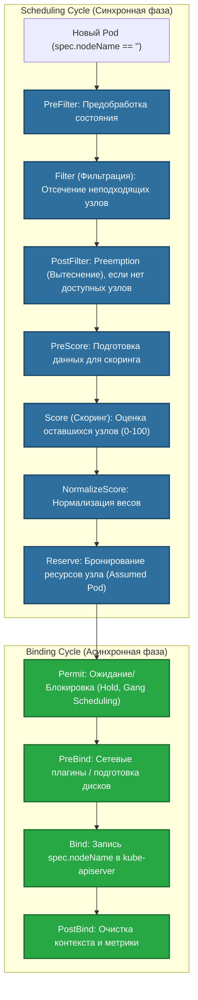
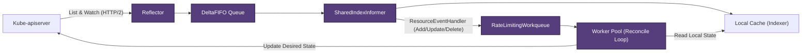

# 🧠 14. Kube-scheduler и Controller Manager: Мозг и Рефлексы Kubernetes

> Если etcd — это память кластера, а API-сервер — нервная система, то Kube-scheduler — это мозг, принимающий решения о размещении, а Kube-controller-manager — автономная нервная система, непрерывно возвращающая реальное состояние к желаемому.

---

## 🧭 Kube-scheduler: Архитектура и Scheduling Framework

`kube-scheduler` отвечает за назначение вновь созданных подов (где `spec.nodeName == ""`) на наиболее подходящие рабочие узлы кластера. Начиная с Kubernetes 1.19+, планировщик построен на базе расширяемой архитектуры **Scheduling Framework**.

### Фазы планирования (Scheduling Cycle & Binding Cycle)

Планирование разделено на две последовательные фазы:
1. **Scheduling Cycle (Синхронный, однопоточный для пода):** Выбирает узел для пода.
2. **Binding Cycle (Асинхронный):** Привязывает под к узлу в API-сервере.



### Ключевые механизмы размещения

#### 1. Node Affinity и Anti-Affinity
Определяет предпочтения или жесткие требования размещения пода на основе меток узлов (`labels`):
- `requiredDuringSchedulingIgnoredDuringExecution` (Hard requirement): Если условий нет — под останется в `Pending`.
- `preferredDuringSchedulingIgnoredDuringExecution` (Soft requirement): Планировщик добавит вес узлу в фазе `Score`.

#### 2. Taints и Tolerations (Ограничения и Допуски)
Позволяют узлам отталкивать поды, не имеющие соответствующих допусков:
- `NoSchedule`: Поды без toleration не попадут на узел (уже запущенные не выселяются).
- `PreferNoSchedule`: Планировщик старается избегать размещения.
- `NoExecute`: Поды без toleration немедленно эвиктятся с узла (с возможностью задержки `tolerationSeconds`).

#### 3. Pod Topology Spread Constraints
Равномерно распределяет поды между зонами доступности (`topology.kubernetes.io/zone`), стойками или хостами:
$$\text{skew} = |\text{count}(T_i) - \min(\text{count}(T))| \le \text{maxSkew}$$

---

## ⚙️ Kube-controller-manager: Архитектура Контроллеров

`kube-controller-manager` объединяет десятки независимых циклов управления (Reconciliation Loops) в одном бинарнике (DeploymentController, ReplicaSetController, NodeLifecycleController, EndpointSliceController и др.).

### Архитектура Informer, Reflector и Workqueue

Контроллеры в Kubernetes являются **level-triggered** (реагируют на текущее состояние), а не **edge-triggered** (не полагаются только на единичные события).



1. **Reflector:** Устанавливает соединение `ListWatch` с API-сервером и складывает дельты изменений в `DeltaFIFO`.
2. **SharedIndexInformer:** Обновляет локальный in-memory кэш (чтобы контроллеры не перегружали API-сервер запросами `GET`) и передает события в обработчики.
3. **RateLimitingWorkqueue:** Очередь с поддержкой дедупликации ключей (например, `namespace/name`) и экспоненциальной задержкой при ошибках.
4. **Reconcile():** Функция бизнес-логики:
   $$\text{Current State} \xrightarrow[\text{Actions to converge}]{\text{Reconcile()}} \text{Desired State}$$

---

## 🛠️ Production-Ready Конфигурации

### 1. Pod со сложными правилами размещения (Zone Spread + Hard Affinity + Tolerations)

```yaml
apiVersion: apps/v1
kind: Deployment
metadata:
  name: payment-gateway
  namespace: production
spec:
  replicas: 6
  selector:
    matchLabels:
      app.kubernetes.io/name: payment-gateway
  template:
    metadata:
      labels:
        app.kubernetes.io/name: payment-gateway
    spec:
      # Равномерное распределение по 3 зонам доступности
      topologySpreadConstraints:
      - maxSkew: 1
        topologyKey: topology.kubernetes.io/zone
        whenUnsatisfiable: DoNotSchedule
        labelSelector:
          matchLabels:
            app.kubernetes.io/name: payment-gateway
      - maxSkew: 1
        topologyKey: kubernetes.io/hostname
        whenUnsatisfiable: ScheduleAnyway
        labelSelector:
          matchLabels:
            app.kubernetes.io/name: payment-gateway

      # Размещение только на Compute-оптимизированных узлах
      affinity:
        nodeAffinity:
          requiredDuringSchedulingIgnoredDuringExecution:
            nodeSelectorTerms:
            - matchExpressions:
              - key: node.kubernetes.io/instance-type
                operator: In
                values: ["c6i.2xlarge", "c6i.4xlarge"]
        # Анти-аффинити к подам базы данных (разнос по разным хостам)
        podAntiAffinity:
          preferredDuringSchedulingIgnoredDuringExecution:
          - weight: 100
            podAffinityTerm:
              labelSelector:
                matchExpressions:
                - key: app.kubernetes.io/name
                  operator: In
                  values: ["redis-cache", "postgres"]
              topologyKey: kubernetes.io/hostname

      # Допуск на выделенные узлы для критичных платежных сервисов
      tolerations:
      - key: "workload"
        operator: "Equal"
        value: "payments"
        effect: "NoSchedule"

      containers:
      - name: payment-api
        image: registry.example.com/payment-api:v2.4.0
        resources:
          requests:
            cpu: 1000m
            memory: 2Gi
          limits:
            cpu: 2000m
            memory: 4Gi
```

### 2. Пользовательский Scheduling Profile (`KubeSchedulerConfiguration`)

```yaml
apiVersion: kubescheduler.config.k8s.io/v1
kind: KubeSchedulerConfiguration
leaderElection:
  leaderElect: true
  resourceNamespace: kube-system
  resourceName: kube-scheduler
profiles:
  - schedulerName: default-scheduler
    plugins:
      score:
        disabled:
          - name: NodeResourcesBalancedAllocation
        enabled:
          # Приоритет плотной упаковки ресурсов (Bin-Packing) для экономии Cloud-инстансов
          - name: NodeResourcesFit
            weight: 100
    pluginConfig:
      - name: NodeResourcesFit
        args:
          scoringStrategy:
            type: MostAllocated
            resources:
              - name: cpu
                weight: 1
              - name: memory
                weight: 1
```

---

## ⚡ CLI Шпаргалка: Диагностика Планирования и Контроллеров

```bash
# 1. Поиск подов, застрявших в Pending
kubectl get pods -A --field-selector=status.phase=Pending

# 2. Детальный анализ причины сбоя планирования конкретного пода
kubectl describe pod <pod-name> | grep -A 10 "Events:"

# 3. Проверка доступных ресурсов и Taints на всех нодах
kubectl get nodes -o custom-columns=\
NAME:.metadata.name,\
TAINTS:.spec.taints,\
CPU_ALLOC:.status.allocatable.cpu,\
MEM_ALLOC:.status.allocatable.memory

# 4. Проверка статуса лидерства (Leader Election) контроллеров и шедулера
kubectl get leases -n kube-system

# 5. Просмотр логов планировщика с повышенным уровнем детализации
kubectl logs -n kube-system -l component=kube-scheduler --tail=200 -f

# 6. Симуляция размещения пода с помощью плагина kube-capacity
kubectl top nodes
```

---

## 🚒 Troubleshooting: Реальные Инциденты и Решения

### Сценарий 1: `0/N nodes available: Insufficient cpu/memory, MatchNodeSelector`

- **Симптом:** Поды висят в статусе `Pending`, в Event видна ошибка `0/12 nodes available: 3 node(s) had untolerated taint, 9 Insufficient memory`.
- **Первопричина:** Сумма `requests.memory` запланированных подов превышает аллокационный объем узлов (`status.allocatable`), либо неверно указан `nodeSelector` / `tolerations`.
- **Диагностика:**
  ```bash
  # Сравнение запросов и реальной емкости
  kubectl describe nodes | grep -A 8 "Allocated resources:"
  ```
- **Решение:**
  1. Оптимизировать `requests.memory` приложений (уменьшить завышенные овербукинги).
  2. Добавить новые рабочие узлы через Cluster Autoscaler / Karpenter.
  3. Проверить корректность Taints:
     ```bash
     kubectl taint nodes node-01 workload=payments:NoSchedule-
     ```

---

### Сценарий 2: Гонка обновлений в Контроллере (`409 Conflict: OperationCannotBeFulfilled`)

- **Симптом:** Кастомный контроллер или оператор падает с ошибкой `Operation cannot be fulfilled on deployments.apps "app": the object has been modified; please apply your changes to the latest version and try again`.
- **Первопричина:** Нарушение Optimistic Concurrency Control. Поле `resourceVersion` изменилось в etcd другим контроллером между чтением из кэша и отправкой `UPDATE`.
- **Решение:**
  Использовать в коде контроллера `retry.RetryOnConflict(retry.DefaultBackoff, func() error { ... })` либо выполнять `PATCH` вместо `UPDATE` (Server-Side Apply).
