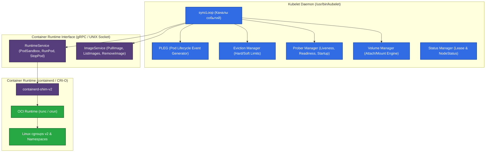

# ⚙️ 15. Kubelet и Container Runtime Interface (CRI)

> Kubelet — это главный агент Kubernetes на каждом рабочем узле (Node Agent). Он управляет жизненным циклом подов, монтирует тома, следит за здоровьем контейнеров и взаимодействует с низкоуровневой средой исполнения через CRI.

---

## 🏛️ Архитектура Kubelet: Внутренние Механизмы

Kubelet не запускается внутри пода (за редким исключением виртуализированных кластеров), а работает как системная служба Linux (`systemd`).



### 1. `syncLoop` и PLEG (Pod Lifecycle Event Generator)

`syncLoop` — центральный мультиплексирующий цикл Kubelet, принимающий события из 5 каналов:
- **Config Channel:** Обновления манифестов от API-сервера, локальных файлов (`/etc/kubernetes/manifests`) или HTTP-эндпоинтов.
- **PLEG Channel:** Изменения состояния контейнеров.
- **Probe Channel:** Результаты `liveness`, `readiness`, `startup` проверок.
- **Housekeeping Timer:** Периодическая очистка старых контейнеров и неиспользуемых образов.
- **Sync Timer:** Периодическая принудительная синхронизация состояния подов.

#### Механизм PLEG
Каждую секунду (по умолчанию) PLEG опрашивает контейнерный рантайм через CRI (`ListPodSandbox`, `ListContainers`), сравнивает текущий список контейнеров с предыдущим и генерирует события (`ContainerStarted`, `ContainerDied`, `ContainerRemoved`).

> [!WARNING]
> Если опрос CRI занимает более 3 минут (например, из-за блокировок ввода-вывода или зависания shim), Kubelet сообщает в лог: `PLEG is not healthy: pleg was last seen active ...m...s ago; threshold is 3m0s`, узел переходит в статус `NotReady`, а планировщик перестает отправлять новые поды.

---

### 2. Управление cgroups (systemd vs cgroupfs)

Linux cgroups (контрольные группы) изолируют и лимитируют ресурсы CPU, Memory, I/O.
- **cgroupfs:** Прямая запись Kubelet в файловую систему `/sys/fs/cgroup`. **Устарело и не рекомендуется.** Приводит к конфликтам с `systemd`.
- **systemd:** Kubelet делегирует создание cgroup системному менеджеру `systemd` как единому источнику управления иерархией процессов.

```
/sys/fs/cgroup/ (cgroups v2)
├── kubepods.slice/
│   ├── kubepods-burstable.slice/
│   │   └── kubepods-burstable-pod<UID>.slice/
│   │       ├── cri-containerd-<ContainerID>.scope
│   │       └── cri-containerd-<PauseID>.scope
│   └── kubepods-guaranteed.slice/
├── system.slice/ (system services)
└── user.slice/
```

---

### 3. Eviction Manager (Механизм Вытеснения)

Kubelet непрерывно отслеживает дефицит ресурсов хоста. При достижении пороговых значений узел помечается соответствующим Taint (`node.kubernetes.io/disk-pressure`, `node.kubernetes.io/memory-pressure`), а Kubelet начинает вытеснение подов в порядке: **BestEffort $\to$ Burstable $\to$ Guaranteed**.

| Сигнал | По умолчанию (Hard) | Описание |
|---|---|---|
| `memory.available` | `< 100Mi` | Доступная физическая память |
| `nodefs.available` | `< 10%` | Свободное место на системном диске (`/var/lib/kubelet`) |
| `nodefs.inodesFree` | `< 5%` | Свободные inodes на системном диске |
| `imagefs.available`| `< 15%` | Свободное место на выделенном диске образов |

---

## 🛠️ Production-Ready Конфигурации

### 1. KubeletConfiguration (`/var/lib/kubelet/config.yaml`)

```yaml
apiVersion: kubelet.config.k8s.io/v1beta1
kind: KubeletConfiguration
address: 0.0.0.0
port: 10250
readOnlyPort: 0 # Отключение небезопасного порта 10255 (CIS Benchmark)
anonymous:
  enabled: false
authentication:
  x509:
    clientCAFile: /etc/kubernetes/pki/ca.crt
  webhook:
    enabled: true
    cacheTTL: 2m0s
authorization:
  mode: Webhook
cgroupDriver: systemd
cgroupsPerQOS: true

# Резервирование ресурсов для ОС и системных демонов
systemReserved:
  cpu: 500m
  memory: 1Gi
  ephemeral-storage: 2Gi
kubeReserved:
  cpu: 500m
  memory: 1Gi
  ephemeral-storage: 2Gi
kubeReservedCgroup: /system.slice/kubelet.service
systemReservedCgroup: /system.slice

# Пороги вытеснения подов (Eviction Thresholds)
evictionHard:
  memory.available: "500Mi"
  nodefs.available: "10%"
  nodefs.inodesFree: "5%"
  imagefs.available: "15%"
evictionSoft:
  memory.available: "1Gi"
  nodefs.available: "15%"
evictionSoftGracePeriod:
  memory.available: "1m30s"
  nodefs.available: "1m30s"
evictionMaxPodGracePeriod: 60

# Очистка неиспользуемых образов (Garbage Collection)
imageGCHighThresholdPercent: 80
imageGCLowThresholdPercent: 70
maxPods: 110
syncFrequency: 1m0s
containerLogMaxSize: 50Mi
containerLogMaxFiles: 5
```

### 2. Конфигурация CRI containerd (`/etc/containerd/config.toml`)

```toml
version = 2

[plugins."io.containerd.grpc.v1.cri"]
  sandbox_image = "registry.k8s.io/pause:3.9"
  max_concurrent_downloads = 10

  [plugins."io.containerd.grpc.v1.cri".containerd.runtimes.runc]
    runtime_type = "io.containerd.runc.v2"

    [plugins."io.containerd.grpc.v1.cri".containerd.runtimes.runc.options]
      SystemdCgroup = true # Критично: согласование cgroup с Kubelet

  [plugins."io.containerd.grpc.v1.cri".registry.mirrors."docker.io"]
    endpoint = ["https://mirror.gcr.io", "https://registry-1.docker.io"]
```

---

## ⚡ CLI Шпаргалка: Управление и Диагностика через `crictl`

```bash
# Настройка эндпоинта CRI для crictl
export CONTAINER_RUNTIME_ENDPOINT="unix:///run/containerd/containerd.sock"

# 1. Список запущенных Pod Sandbox
crictl pods

# 2. Список активных контейнеров с их статусом
crictl ps -a --name payment-api

# 3. Чтение логов контейнера напрямую в обход Kubelet
crictl logs <container-id> --tail=100

# 4. Просмотр реального потребления ресурсов контейнерами
crictl stats

# 5. Ручной запуск сборщика мусора неиспользуемых образов
crictl rmi --prune

# 6. Проверка здоровья Kubelet через systemd
journalctl -u kubelet -f --no-tail -n 100
```

---

## 🚒 Troubleshooting: Реальные Инциденты и Решения

### Сценарий 1: Узел переходит в статус `NotReady: PLEG is not healthy`

- **Симптом:** Node периодически переключается в `NotReady`. В логах `kubelet`: `PLEG is not healthy: pleg was last seen active 3m12s ago`.
- **Первопричина:** Высокая утилизация диска I/O (iowait) или зависание D-Bus/systemd/containerd-shim, из-за чего вызовы `crictl pods` блокируются дольше таймаута.
- **Диагностика:**
  ```bash
  # Замер времени ответа рантайма CRI
  time crictl pods > /dev/null

  # Проверка iostat
  iostat -xz 1 10
  ```
- **Решение:**
  1. Вынести хранилище containerd (`/var/lib/containerd`) и логи (`/var/log/pods`) на быстрый NVMe диск.
  2. Перезапустить зависший containerd: `systemctl restart containerd`.

---

### Сценарий 2: Несоответствие cgroup драйверов (`misconfiguration of cgroup driver`)

- **Симптом:** После установки или перезагрузки службы `systemctl status kubelet` падает с ошибкой: `Failed to run kubelet: misconfiguration: kubelet cgroup driver: "systemd" is different from docker/containerd cgroup driver: "cgroupfs"`.
- **Решение:**
  Убедиться, что в `/etc/containerd/config.toml` указан `SystemdCgroup = true`, а в `/var/lib/kubelet/config.yaml` указан `cgroupDriver: systemd`. Перезапустить оба демона:
  ```bash
  systemctl restart containerd kubelet
  ```
