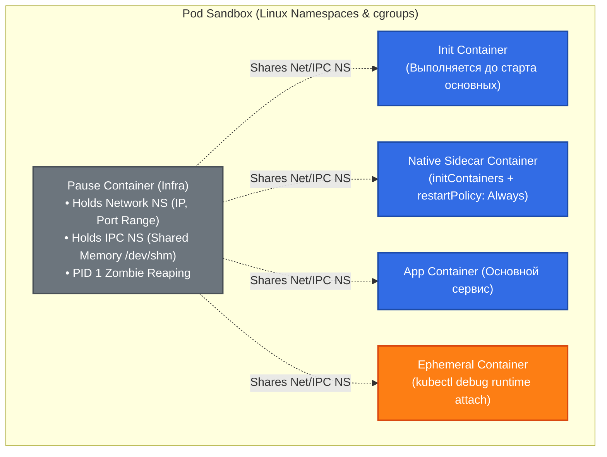

# 📦 16. Анатомия Pod: От Pause-контейнера до Sidecar и QoS

> Pod — наименьшая развертываемая единица в Kubernetes. Понимание того, как контейнеры объединяются в единое целое на уровне ядра Linux (Namespaces, cgroups, Pause-контейнер), критично для правильного профилирования и устранения аварий.

---

## 🔬 Внутреннее Устройство Pod: Linux Namespaces и Pause Container

Pod представляет собой не физическую сущность, а группу процессов Linux, объединенных общими пространствами имен (**Namespaces**) и ограниченных контрольными группами (**cgroups**).



### Разделяемые пространства имен:
1. **Network Namespace:** Все контейнеры в поде имеют один и тот же IP-адрес, общую таблицу маршрутизации и сетевые порты (`localhost`).
2. **IPC Namespace:** Контейнеры могут взаимодействовать через общую память (POSIX shared memory, `/dev/shm`).
3. **UTS Namespace:** Общее доменное имя и `hostname`.
4. **PID Namespace (Опционально):** При включении `spec.shareProcessNamespace: true` контейнеры видят процессы друг друга в `ps aux` и могут посылать сигналы (`kill`).
5. **Mount Namespace:** **Изолирован** для каждого контейнера, но позволяет монтировать общие тома (`volumeMounts`).

---

## 🔄 Жизненный Цикл: Init, Sidecar, App и Ephemeral Контейнеры

### 1. Порядок запуска контейнеров

1. **Pause Container:** Создается рантаймом через CRI `RunPodSandbox`.
2. **Init Containers:** Выполняются строго последовательно. Если один падает — весь под перезапускается (согласно `restartPolicy`).
3. **Native Sidecars (Kubernetes 1.28+):** Задаются в `initContainers` с флагом `restartPolicy: Always`. Стартуют перед основными контейнерами, ждут готовности (`startupProbe`) и работают параллельно на протяжении всей жизни пода.
4. **App Containers:** Стартуют параллельно после успешного завершения всех Init-контейнеров.
5. **Ephemeral Containers:** Добавляются динамически на лету к уже запущенному поду (`kubectl debug`) без перезапуска пода.

### 2. Pod Phase vs Pod Conditions

| Pod Condition | Значение `True` означает |
|---|---|
| `PodScheduled` | Под успешно назначен планировщиком на конкретную ноду. |
| `PodReadyToStartContainers` | (K8s 1.28+) Сеть инициализирована, Sandbox готов. |
| `Initialized` | Все `initContainers` успешно завершились. |
| `ContainersReady` | Все основные контейнеры в поде прошли `readinessProbe`. |
| `Ready` | Под готов принимать трафик от Service (эндпоинты обновлены). |

---

## ⚖️ Quality of Service (QoS) и Linux OOM Score

Kubernetes классифицирует поды по трем классам обслуживания (**QoS Classes**), определяя приоритет выживания процессов при нехватке памяти (Out Of Memory):


### Формула расчета `oom_score_adj`:
1. **Guaranteed:**
   - **Условие:** Для *каждого* контейнера указаны `requests` и `limits` по CPU и Memory, причем `requests == limits`.
   - `oom_score_adj = -997` (ядро Linux убьет процесс только после системных демонов).
2. **BestEffort:**
   - **Условие:** Ни для одного контейнера не указаны `requests` и `limits`.
   - `oom_score_adj = 1000` (первые кандидаты на `SIGKILL 137`).
3. **Burstable:**
   - **Условие:** Указаны хотя бы минимальные `requests` или `requests < limits`.
   - $$\text{oom\_score\_adj} = 1000 - \frac{\text{memoryRequest}}{\text{nodeAllocatableMemory}} \times 1000$$

---

## 🛠️ Production-Ready Конфигурации

### Pod со всеми типами контейнеров и Guaranteed QoS

```yaml
apiVersion: v1
kind: Pod
metadata:
  name: secured-api
  namespace: backend
  labels:
    app.kubernetes.io/name: secured-api
spec:
  shareProcessNamespace: true # Общий PID namespace для мониторинга процессов
  terminationGracePeriodSeconds: 60

  # 1. Init Контейнер (Миграция БД)
  initContainers:
  - name: db-migration
    image: migrate/migrate:v4.16.2
    command: ["migrate", "-path=/migrations", "-database=$(DB_URL)", "up"]
    env:
      - name: DB_URL
        valueFrom:
          secretKeyRef:
            name: db-credentials
            key: url
    resources:
      requests: {cpu: "200m", memory: "256Mi"}
      limits: {cpu: "200m", memory: "256Mi"}

  # 2. Native Sidecar (Kubernetes 1.28+) — Vault Agent для ротации токенов
  - name: vault-agent
    image: hashicorp/vault:1.15.2
    restartPolicy: Always # Делает initContainer долгоживущим sidecar'ом!
    command: ["vault", "agent", "-config=/etc/vault/config.hcl"]
    volumeMounts:
    - name: vault-secrets
      mountPath: /vault/secrets
    resources:
      requests: {cpu: "100m", memory: "128Mi"}
      limits: {cpu: "100m", memory: "128Mi"}

  # 3. Основной контейнер приложения (Guaranteed QoS)
  containers:
  - name: app
    image: registry.example.com/api-server:v1.9.0
    ports:
    - containerPort: 8080
      name: http
    resources:
      requests:
        cpu: "1000m"
        memory: "1024Mi"
      limits:
        cpu: "1000m"
        memory: "1024Mi"
    livenessProbe:
      httpGet: {path: /healthz, port: 8080}
      initialDelaySeconds: 15
      periodSeconds: 10
    readinessProbe:
      httpGet: {path: /ready, port: 8080}
      initialDelaySeconds: 5
      periodSeconds: 5
    volumeMounts:
    - name: vault-secrets
      mountPath: /vault/secrets
      readOnly: true

  volumes:
  - name: vault-secrets
    emptyDir:
      medium: Memory
```

---

## ⚡ CLI Шпаргалка: Отладка Подов и Ephemeral Контейнеры

```bash
# 1. Подключение Ephemeral Debug контейнера со швейцарским ножом утилит
kubectl debug -it <pod-name> --image=nicolaka/netshoot --target=app

# 2. Проверка назначенного QoS класса
kubectl get pod <pod-name> -o jsonpath='{.status.qosClass}'

# 3. Просмотр oom_score_adj внутри ноды для процесса контейнера
PID=$(crictl inspect --output go-template --template '{{.info.pid}}' <container-id>)
cat /proc/$PID/oom_score_adj

# 4. Проверка причин перезапуска и завершения предыдущей реплики
kubectl get pod <pod-name> -o jsonpath='{.status.containerStatuses[*].lastState.terminated}' | jq .

# 5. Просмотр логов завершившегося контейнера
kubectl logs <pod-name> -c app --previous
```

---

## 🚒 Troubleshooting: Реальные Инциденты и Решения

### Сценарий 1: Контейнер падает с кодом `OOMKilled: Exit Code 137`

- **Симптом:** Под периодически переходит в `CrashLoopBackOff`, в описании `Last State: Terminated, Reason: OOMKilled, Exit Code: 137`.
- **Первопричина:** Процесс внутри контейнера превысил значение `resources.limits.memory`, и ядро Linux (cgroup OOM Killer) послало `SIGKILL` (128 + 9 = 137).
- **Диагностика:**
  ```bash
  kubectl describe pod <pod-name> | grep -E "OOMKilled|Exit Code"
  ```
- **Решение:**
  1. Увеличить `limits.memory` в манифесте.
  2. Проанализировать утечку памяти (Memory Leak) с помощью heap dump или профилировщика.

---

### Сценарий 2: Зависание в `Init:CrashLoopBackOff` или `Init:0/1`

- **Симптом:** Под не переходит к запуску основного приложения, оставаясь в статусе `Init:0/1`.
- **Первопричина:** Init-контейнер не может подключиться к БД, выполнить миграции или ожидает недоступный ресурс.
- **Диагностика:**
  ```bash
  # Просмотр логов конкретного init-контейнера
  kubectl logs <pod-name> -c db-migration
  ```
- **Решение:**
  Устранить сетевую недоступность зависимых сервисов или исправить скрипт миграции.
