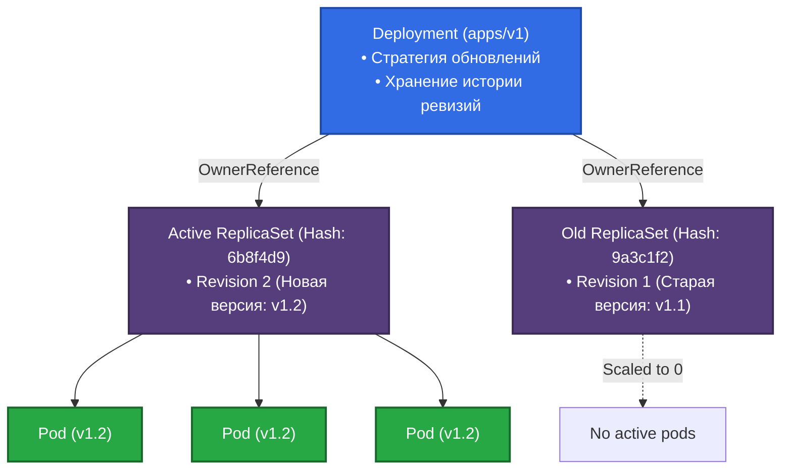
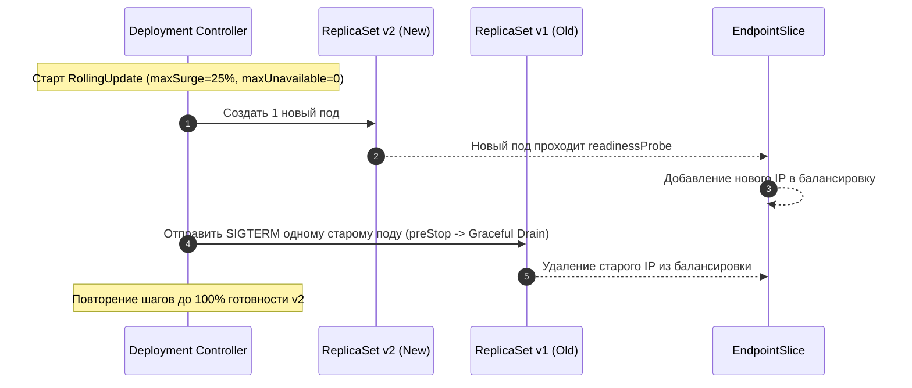

# 🔄 17. Deployments и ReplicaSets: Стратегии Обновлений и Откат

> Deployment — абстракция декларативного управления жизненным циклом stateless-приложений. Он управляет объектами ReplicaSet через контроллерные связи (`OwnerReferences`), обеспечивая бесшовные обновления (Zero-Downtime) и мгновенный откат.

---

## 🏛️ Архитектура: Связь Deployment, ReplicaSet и Pod

Deployment не создает поды напрямую. Он делегирует создание и масштабирование подов контроллеру `ReplicaSet`.



### Генерация хэша и `pod-template-hash`
1. При изменении `spec.template` Deployment вычисляет 32-битный FNV-1a хэш от шаблона пода.
2. Deployment создает новый `ReplicaSet` с именем `<deployment-name>-<pod-template-hash>` и меткой `pod-template-hash`.
3. Все поды, порождаемые этим ReplicaSet, получают эту же метку, что предотвращает конфликты селекторов между старыми и новыми подами.

---

## 🚀 Стратегии Обновления (RollingUpdate vs Recreate)

### 1. RollingUpdate (Плавное обновление без простоя)

Контролируется двумя ключевыми параметрами (могут быть числами или процентами от `spec.replicas`):

- **`maxSurge`:** Максимальное количество подов, которое может быть создано сверх желаемого числа реплик.
  $$\text{Max Pods Running} = \text{replicas} + \text{maxSurge}$$
- **`maxUnavailable`:** Максимальное количество подов, которое может быть недоступно во время обновления.
  $$\text{Min Available Pods} = \text{replicas} - \text{maxUnavailable}$$



### 2. Recreate (Пересоздание)
Сначала полностью останавливает (`replicas: 0`) все старые поды, и только после их полного завершения создает новые поды.
- **Trade-off:** Гарантирует отсутствие одновременной работы двух версий (критично для монопольного доступа к данным или несовместимых изменений схемы БД), но приводит к неизбежному **downtime**.

---

## 🛠️ Production-Ready Конфигурации

### Манифест Zero-Downtime Deployment

```yaml
apiVersion: apps/v1
kind: Deployment
metadata:
  name: order-service
  namespace: production
  labels:
    app.kubernetes.io/name: order-service
spec:
  replicas: 4
  revisionHistoryLimit: 10 # Хранить последние 10 ревизий для отката
  progressDeadlineSeconds: 300 # 5 минут на завершение обновления
  strategy:
    type: RollingUpdate
    rollingUpdate:
      maxSurge: 25%       # Создавать не более +1 пода сверх лимита
      maxUnavailable: 0   # Ни один старый под не гасится, пока новый не готов!
  selector:
    matchLabels:
      app.kubernetes.io/name: order-service
  template:
    metadata:
      labels:
        app.kubernetes.io/name: order-service
    spec:
      terminationGracePeriodSeconds: 45 # Даем время на завершение активных транзакций
      containers:
      - name: app
        image: registry.example.com/order-service:v2.1.0
        ports:
        - containerPort: 8080
        lifecycle:
          preStop:
            exec:
              # Даем 10 секунд iptables/kube-proxy на исключение пода из эндпоинтов
              command: ["/bin/sh", "-c", "sleep 10"]
        readinessProbe:
          httpGet:
            path: /health/ready
            port: 8080
          initialDelaySeconds: 5
          periodSeconds: 5
          failureThreshold: 2
        livenessProbe:
          httpGet:
            path: /health/live
            port: 8080
          initialDelaySeconds: 15
          periodSeconds: 10
        resources:
          requests:
            cpu: 500m
            memory: 512Mi
          limits:
            cpu: 1000m
            memory: 1024Mi
```

---

## ⚡ CLI Шпаргалка: Управление Релизами и Откат

```bash
# 1. Отслеживание статуса текущего развертывания
kubectl rollout status deployment/order-service

# 2. Просмотр истории релизов и ревизий
kubectl rollout history deployment/order-service

# 3. Детальный просмотр конкретной ревизии
kubectl rollout history deployment/order-service --revision=3

# 4. Мгновенный откат на предыдущую ревизию
kubectl rollout undo deployment/order-service

# 5. Откат на конкретную ревизию
kubectl rollout undo deployment/order-service --to-revision=2

# 6. Временная заморозка обновления (Pause / Resume)
kubectl rollout pause deployment/order-service
# Вносим множество изменений...
kubectl rollout resume deployment/order-service

# 7. Принудительный перезапуск всех подов (Rolling Restart без изменения манифеста)
kubectl rollout restart deployment/order-service
```

---

## 🚒 Troubleshooting: Реальные Инциденты и Решения

### Сценарий 1: Зависший Rollout (`progressDeadlineSeconds exceeded`)

- **Симптом:** `kubectl rollout status` блокируется, а Deployment переходит в статус `Progressing: False, Reason: ProgressDeadlineExceeded`.
- **Первопричина:** Новая версия приложения падает при старте (`CrashLoopBackOff`) или не проходит `readinessProbe`. При `maxUnavailable: 0` старые поды продолжают обслуживать трафик, но выкатка новой версии зависает.
- **Диагностика:**
  ```bash
  kubectl describe deployment order-service | grep -A 8 "Conditions:"
  kubectl get pods -l app.kubernetes.io/name=order-service
  ```
- **Решение:**
  Выполнить экстренный откат:
  ```bash
  kubectl rollout undo deployment/order-service
  ```

---

### Сценарий 2: Потеря HTTP-запросов (502 Bad Gateway) во время деплоя

- **Симптом:** При RollingUpdate клиенты кратковременно получают `502 Bad Gateway` или `Connection Refused`.
- **Первопричина:** Асинхронность K8s. Kubelet посылает `SIGTERM` приложению одновременно с тем, как EndpointSlice контроллер начинает удалять IP пода из правил iptables/IPVS. Несколько миллисекунд трафик продолжает направляться на умирающий процесс.
- **Решение:**
  Добавить `preStop` хук `sleep 5` - `sleep 10` в контейнер, чтобы приложение продолжало принимать входящие соединения, пока сеть обновляет правила маршрутизации.
