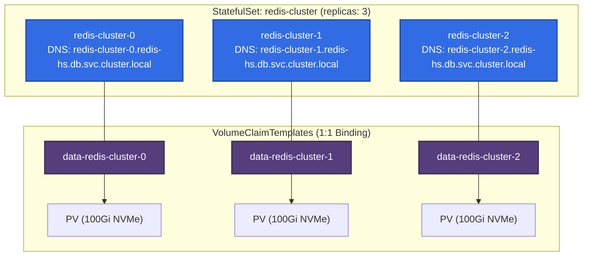
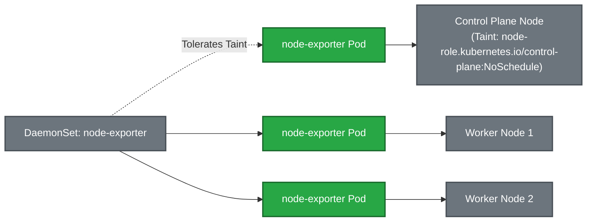

# 💾 18. StatefulSets и DaemonSets: Stateful Нагрузки и Системные Сервисы

> В то время как Deployments предназначены для взаимозаменяемых stateless-сервисов, StatefulSets и DaemonSets решают принципиально иные задачи: сохранение уникальной сетевой идентичности и данных для распределенных баз данных, а также гарантированный запуск агентов на каждом узле кластера.

---

## 🏛️ StatefulSet: Анатомия и Гарантии

StatefulSet спроектирован для распределенных систем (PostgreSQL, Kafka, Elasticsearch, Redis Cluster, ZooKeeper), требующих:
1. **Детерминированной сетевой идентичности (Deterministic Network Identity).**
2. **Персистентного хранилища, привязанного к порядковому номеру.**
3. **Строгой очередности запуска и масштабирования.**



### Ключевые механизмы StatefulSet:

- **Порядковые индексы (Ordinals):** Поды именуются от `0` до `N-1`. При масштабировании `N` подов запускаются строго последовательно ($0 \to 1 \to 2$). Завершение происходит в обратном порядке ($2 \to 1 \to 0$).
- **Headless Service (`clusterIP: None`):** DNS-сервер (CoreDNS) возвращает прямые A-записи с IP каждого пода вместо единого виртуального ClusterIP:
  $$\text{FQDN} = \langle\text{pod-name}\rangle.\langle\text{service-name}\rangle.\langle\text{namespace}\rangle\text{.svc.cluster.local}$$
- **`podManagementPolicy`:**
  - `OrderedReady` (Default): Строгий последовательный запуск.
  - `Parallel`: Поды создаются/удаляются одновременно (полезно при быстром масштабировании кэшей или Cassandra).
- **Canary обновления через `partition`:** Если в `spec.updateStrategy.rollingUpdate.partition: 2`, то обновятся только поды с индексами $\ge 2$.

---

## 📡 DaemonSet: Системные Демоны и Мониторинг

DaemonSet гарантирует, что на всех (или отфильтрованных через `nodeSelector`/`affinity`) узлах кластера запущено ровно по одной копии пода.

### Типичные юзкейсы DaemonSet:
- **Сетевые плагины (CNI):** Cilium, Calico, Flannel.
- **Сборщики логов:** FluentBit, Vector, Promtail.
- **Мониторинг узлов:** Node Exporter, Datadog Agent.
- **Хранилище:** Ceph OSD, Longhorn Engine.



---

## 🛠️ Production-Ready Конфигурации

### 1. Production StatefulSet (HA PostgreSQL Cluster)

```yaml
apiVersion: v1
kind: Service
metadata:
  name: postgres-hs
  namespace: database
  labels:
    app: postgres
spec:
  ports:
  - port: 5432
    name: postgres
  clusterIP: None # Headless Service
  selector:
    app: postgres
---
apiVersion: apps/v1
kind: StatefulSet
metadata:
  name: postgres
  namespace: database
spec:
  serviceName: "postgres-hs"
  replicas: 3
  podManagementPolicy: OrderedReady
  persistentVolumeClaimRetentionPolicy:
    whenDeleted: Retain # Не удалять PVC при удалении StatefulSet!
    whenScaled: Retain
  updateStrategy:
    type: RollingUpdate
    rollingUpdate:
      partition: 0
  selector:
    matchLabels:
      app: postgres
  template:
    metadata:
      labels:
        app: postgres
    spec:
      terminationGracePeriodSeconds: 120
      containers:
      - name: postgresql
        image: postgres:15.4-alpine
        ports:
        - containerPort: 5432
          name: postgres
        env:
        - name: POD_NAME
          valueFrom:
            fieldRef:
              fieldPath: metadata.name
        - name: PGDATA
          value: /var/lib/postgresql/data/pgdata
        volumeMounts:
        - name: datadir
          mountPath: /var/lib/postgresql/data
        resources:
          requests: {cpu: "1000m", memory: "2Gi"}
          limits: {cpu: "2000m", memory: "4Gi"}
  volumeClaimTemplates:
  - metadata:
      name: datadir
    spec:
      accessModes: [ "ReadWriteOnce" ]
      storageClassName: "gp3-encrypted"
      resources:
        requests:
          storage: 100Gi
```

### 2. Production DaemonSet (Node Exporter с HostNetwork)

```yaml
apiVersion: apps/v1
kind: DaemonSet
metadata:
  name: node-exporter
  namespace: monitoring
  labels:
    app.kubernetes.io/name: node-exporter
spec:
  selector:
    matchLabels:
      app.kubernetes.io/name: node-exporter
  template:
    metadata:
      labels:
        app.kubernetes.io/name: node-exporter
    spec:
      hostNetwork: true
      hostPID: true
      dnsPolicy: ClusterFirstWithHostNet
      tolerations:
      # Запуск на всех узлах, включая Control Plane и нестабильные ноды
      - operator: Exists
        effect: NoSchedule
      - operator: Exists
        effect: NoExecute
      containers:
      - name: node-exporter
        image: quay.io/prometheus/node-exporter:v1.6.1
        args:
        - --path.procfs=/host/proc
        - --path.sysfs=/host/sys
        - --path.rootfs=/host/root
        ports:
        - containerPort: 9100
          hostPort: 9100
          name: metrics
        volumeMounts:
        - name: proc
          mountPath: /host/proc
          readOnly: true
        - name: sys
          mountPath: /host/sys
          readOnly: true
        - name: root
          mountPath: /host/root
          readOnly: true
        resources:
          requests: {cpu: "50m", memory: "64Mi"}
          limits: {cpu: "200m", memory: "128Mi"}
      volumes:
      - name: proc
        hostPath: {path: /proc}
      - name: sys
        hostPath: {path: /sys}
      - name: root
        hostPath: {path: /}
```

---

## ⚡ CLI Шпаргалка: Управление StatefulSet и DaemonSet

```bash
# 1. Проверка состояния реплик StatefulSet
kubectl get statefulset -n database

# 2. Canary-деплой StatefulSet: обновляем только pod-2
kubectl patch statefulset postgres -n database -p '{"spec":{"updateStrategy":{"rollingUpdate":{"partition":2}}}}'

# 3. Проверка DNS-имен Headless Service
kubectl run -it --rm dns-test --image=nicolaka/netshoot -- nslookup postgres-0.postgres-hs.database.svc.cluster.local

# 4. Просмотр покрытия нод DaemonSet'ом
kubectl get daemonset node-exporter -n monitoring -o wide

# 5. Проверка зависших подов DaemonSet на кордонированных нодах
kubectl get pods -n monitoring -l app.kubernetes.io/name=node-exporter -o wide
```

---

## 🚒 Troubleshooting: Реальные Инциденты и Решения

### Сценарий 1: StatefulSet зависает при обновлении (`pod-1` не переходит в Ready)

- **Симптом:** Обновление StatefulSet остановилось. `postgres-1` находится в `CrashLoopBackOff`, а `postgres-0` и `postgres-2` не обновляются.
- **Первопричина:** При стратегии `OrderedReady` StatefulSet контроллер жестко блокирует обновление следующих подов, пока текущий порядковый номер не перейдет в статус `Ready`.
- **Решение:**
  1. Исследовать логи сломанного пода: `kubectl logs postgres-1 -n database`.
  2. В случае необходимости перевести `partition` на значение, изолирующее сломанный под, либо временно переключить `podManagementPolicy: Parallel`.

---

### Сценарий 2: Ошибка монтирования тома `Multi-Attach error for volume`

- **Симптом:** При пересоздании пода StatefulSet на другом узле под висит в `ContainerCreating` с ошибкой `Multi-Attach error for volume ... Volume is already exclusively attached to one node`.
- **Первопричина:** Предыдущий узел не успел корректно отмонтировать облачный блочный диск (EBS/GPD) до того, как Kubelet на новом узле попытался выполнить `AttachVolume`.
- **Решение:**
  Проверить статус `VolumeAttachment` в кластере и принудительно удалить зависший объект аттача:
  ```bash
  kubectl get volumeattachments | grep <pv-name>
  kubectl delete volumeattachment <attachment-id>
  ```
