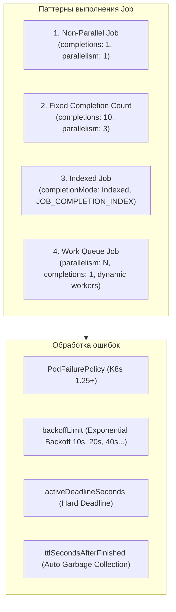
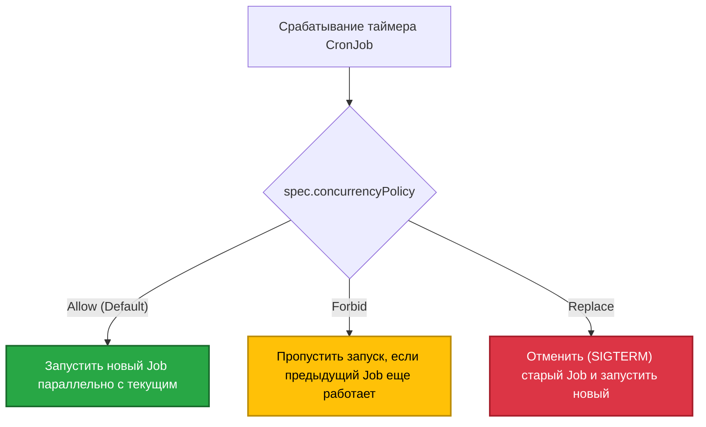

# ⏱️ 19. Jobs и CronJobs: Пакетная Обработка и Фоновые Задачи

> Kubernetes Job и CronJob предназначены для выполнения кратковременных batch-задач (вычисления, ETL, бэкапы, разовые миграции), завершающихся с кодом выхода 0, в отличие от непрерывно работающих сервисов.

---

## 🏗️ Архитектура Kubernetes Job и Паттерны Выполнения

Контроллер Job создает один или несколько подов и гарантирует, что указанное количество из них успешно завершит работу.



### Ключевые параметры Job:
- **`completions`:** Сколько подов должно успешно завершиться для признания задачи выполненной.
- **`parallelism`:** Максимальное количество одновременно запущенных подов.
- **`completionMode: Indexed`:** Каждому поду присваивается уникальный индекс от `0` до `completions-1` через переменную окружения `JOB_COMPLETION_INDEX`.
- **`podFailurePolicy`:** Позволяет гибко разделять сбои приложения (не ретраить при фатальных ошибках) и сбои инфраструктуры (ретраить при эвиктах и preemption).

---

## ⏰ CronJob: Расписание и Политики Параллелизма

CronJob управляет созданием объектов Job по расписанию в формате `crontab` (минута, час, день месяца, месяц, день недели).

### Матрица Concurrency Policy (Политики Параллелизма):



> [!IMPORTANT]
> **Параметр `startingDeadlineSeconds`:** Если по какой-то причине (например, API-сервер был недоступен) CronJob пропустил более 100 запланированных интервалов и `startingDeadlineSeconds` не задан, CronJob полностью прекратит создание задач с ошибкой в логах.

---

## 🛠️ Production-Ready Конфигурации

### 1. Высокопроизводительный Indexed Job с Pod Failure Policy

```yaml
apiVersion: batch/v1
kind: Job
metadata:
  name: video-transcoder-indexed
  namespace: batch-processing
spec:
  completions: 10
  parallelism: 4
  completionMode: Indexed
  backoffLimit: 3
  activeDeadlineSeconds: 1800 # Завершить весь Job через 30 минут максимум
  ttlSecondsAfterFinished: 3600 # Удалить завершенный Job и поды через 1 час

  podFailurePolicy:
    rules:
    # Если процесс завершился с кодом 42 (фатальная ошибка валидации) — не ретраить, а завалить Job
    - action: FailJob
      onExitCodes:
        containerName: transcoder
        operator: In
        values: [42]
    # При сбоях инфраструктуры (эвикция) — игнорировать и не тратить счетчик backoffLimit
    - action: Ignore
      onPodConditions:
      - type: DisruptionTarget

  template:
    metadata:
      labels:
        job: video-transcoder
    spec:
      restartPolicy: Never
      containers:
      - name: transcoder
        image: registry.example.com/transcoder:v1.4
        command: ["/bin/sh", "-c"]
        args:
        - |
          echo "Processing chunk index: $JOB_COMPLETION_INDEX"
          /usr/local/bin/process-chunk --index="$JOB_COMPLETION_INDEX"
        env:
        - name: JOB_COMPLETION_INDEX
          valueFrom:
            fieldRef:
              fieldPath: metadata.annotations['batch.kubernetes.io/job-completion-index']
        resources:
          requests: {cpu: "2000m", memory: "4Gi"}
          limits: {cpu: "4000m", memory: "8Gi"}
```

### 2. Production CronJob с временной зоной и защитой от зависаний

```yaml
apiVersion: batch/v1
kind: CronJob
metadata:
  name: database-nightly-backup
  namespace: storage
spec:
  schedule: "0 2 * * *" # Каждый день в 02:00
  timeZone: "Europe/Prague" # Поддержка TimeZone в K8s 1.27+
  concurrencyPolicy: Forbid # Запрет одновременных запусков
  startingDeadlineSeconds: 300 # Допустимое окно опоздания запуска (5 минут)
  successfulJobsHistoryLimit: 3 # Хранить 3 успешных запуска
  failedJobsHistoryLimit: 5     # Хранить 5 упавших запусков для дебага
  jobTemplate:
    spec:
      backoffLimit: 2
      activeDeadlineSeconds: 3600
      ttlSecondsAfterFinished: 86400
      template:
        spec:
          restartPolicy: OnFailure
          containers:
          - name: pg-dump
            image: postgres:15-alpine
            command:
            - /bin/sh
            - -c
            - |
              pg_dump -h db.prod -U postgres -d main | gzip > /backup/dump_$(date +%F).sql.gz
            volumeMounts:
            - name: s3-backup-storage
              mountPath: /backup
            resources:
              requests: {cpu: "500m", memory: "1Gi"}
              limits: {cpu: "1000m", memory: "2Gi"}
          volumes:
          - name: s3-backup-storage
            emptyDir: {}
```

---

## ⚡ CLI Шпаргалка: Диагностика и Ручной Запуск

```bash
# 1. Ручной запуск Job из существующего CronJob (On-Demand Run)
kubectl create job --from=cronjob/database-nightly-backup manual-backup-001 -n storage

# 2. Список всех cronjob и их последнего выполнения
kubectl get cronjobs -A

# 3. Приостановка выполнения CronJob (без его удаления)
kubectl patch cronjob database-nightly-backup -n storage -p '{"spec":{"suspend":true}}'

# 4. Возобновление CronJob
kubectl patch cronjob database-nightly-backup -n storage -p '{"spec":{"suspend":false}}'

# 5. Удаление завершенных подов старых Job
kubectl delete pod --field-selector=status.phase=Succeeded -A
```

---

## 🚒 Troubleshooting: Реальные Инциденты и Решения

### Сценарий 1: CronJob перестал запускаться (`Cannot determine if job needs to be started`)

- **Симптом:** Наступило время запуска, но новый Job не создается. В логах контроллера: `Cannot determine if job needs to be started: too many missed start time (> 100)`.
- **Первопричина:** Кластер или контроллер-менеджер находился в даунтайме, и CronJob с частым интервалом (например, каждую минуту) пропустил > 100 итераций без установленного `startingDeadlineSeconds`.
- **Решение:**
  1. Удалить и пересоздать CronJob с обязательным указанием `startingDeadlineSeconds: 200`.
  2. Либо временно пересоздать объект через `kubectl replace --force -f cronjob.yaml`.

---

### Сценарий 2: Бесконечный цикл рестартов и утечка ресурсов из-за `restartPolicy`

- **Симптом:** Ошибочный Job порождает сотни подов или забивает ноду логами.
- **Первопричина:** Неверная комбинация `restartPolicy: OnFailure` и отсутствия `backoffLimit`. Контейнер бесконечно перезапускается на той же ноде, скрывая ошибку от контроллера Job.
- **Решение:**
  Использовать `restartPolicy: Never` в сочетании с `backoffLimit: 2` или `podFailurePolicy`, чтобы при ошибке создавался новый чистый под, а лимит попыток четко контролировался.
