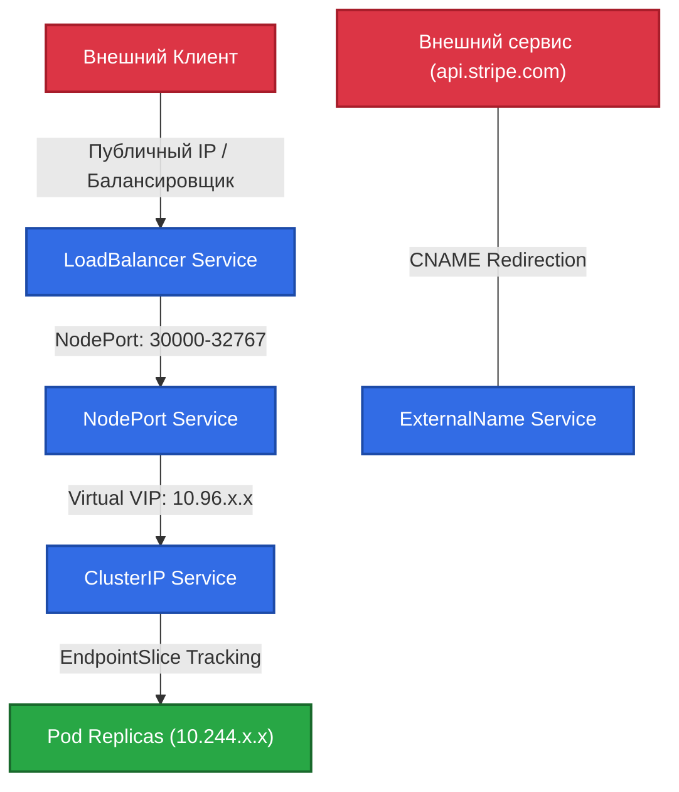
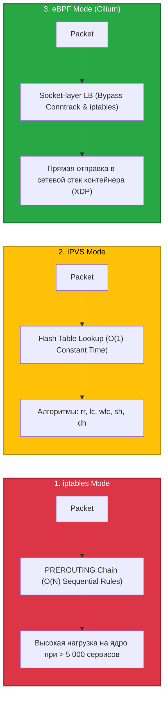
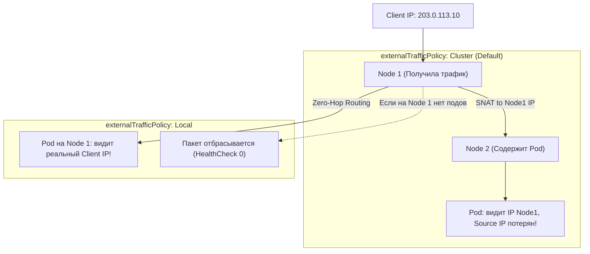

# 🌐 20. Services и EndpointSlice: Сетевая Маршрутизация и Проксирование

> Kubernetes Service — это абстракция стабильного сетевого эндпоинта (Virtual IP и DNS-имя) для динамического набора подов. EndpointSlice и kube-proxy обеспечивают масштабируемую маршрутизацию и балансировку трафика на транспортном уровне (L4).

---

## 🏛️ Типы Сервисов и Механизмы Маршрутизации



### 1. Сравнение типов сервисов:
- **`ClusterIP` (Default):** Выделяет виртуальный IP из диапазона `service-cluster-ip-range`. Доступен только внутри кластера. При `clusterIP: None` становится **Headless**, отдавая прямые DNS A-записи подов.
- **`NodePort`:** Открывает статический порт (по умолчанию `30000-32767`) на всех узлах кластера. Трафик проксируется на ClusterIP.
- **`LoadBalancer`:** Интегрируется с облачным провайдером (AWS NLB/ALB, GCP Cloud LB) или Bare-Metal балансировщиком (MetalLB, Cilium BGP) для выделения внешнего статического IP.
- **`ExternalName`:** Проксирование на уровне DNS (возвращает CNAME запись, например `db.aws.rds.com`), без участия `kube-proxy`.

---

## ⚡ Датаплейны kube-proxy: iptables vs IPVS vs eBPF

`kube-proxy` отвечает за трансляцию виртуальных VIP в реальные IP-адреса подов.



| Критерий | iptables | IPVS | eBPF (Cilium) |
|---|---|---|---|
| **Сложность поиска** | $O(N)$ (линейный перебор) | $O(1)$ (хэш-таблицы) | $O(1)$ (Kernel BPF Maps) |
| **Масштабируемость** | До ~5 000 подов/сервисов | > 50 000 сервисов | > 100 000 сервисов |
| **Алгоритмы балансировки** | Random (случайный) | Round-Robin, Least-Conn, Hashing | Least-Loaded, Random, Maglev |
| **Накладные расходы CPU** | Высокие (зависание `iptables-restore`) | Минимальные | Практически нулевые |

---

## 🔒 `externalTrafficPolicy`: Cluster vs Local



- **`Cluster`:** Равномерно распределяет трафик между всеми подами в кластере, но вызывает двойной прыжок (**Double Hop**) и перезаписывает Source IP клиента на IP ноды (SNAT).
- **`Local`:** Сохраняет реальный Source IP клиента и исключает межхостовый трафик, но направляет трафик только на поды локального узла. Балансировщик направляет трафик только на узлы с живыми подами (через `healthCheckNodePort`).

---

## 📈 Эволюция к EndpointSlice

Традиционный объект `Endpoints` хранил все IP-адреса подов сервиса в одном массиве. При 1 000 подов изменение состояния одного пода приводило к перезаписи объекта размером в сотни килобайт в etcd и рассылке мегабайтных дельт всем `kube-proxy`.

**`EndpointSlice` (K8s 1.21+ Default):**
- Разбивает список эндпоинтов на независимые слайсы по **100 эндпоинтов**.
- Снижает трафик API-сервера и нагрузку на etcd на **90%** в крупных кластерах.
- Поддерживает дуальный стек IPv4/IPv6 и указание топологических зон (`topology.kubernetes.io/zone`).

---

## 🛠️ Production-Ready Конфигурации

### 1. LoadBalancer Service с NLB, Source IP Preservation и EndpointSlice Topology

```yaml
apiVersion: v1
kind: Service
metadata:
  name: payment-ingress
  namespace: production
  annotations:
    # AWS Network Load Balancer (L4) с прямым пробросом трафика
    service.beta.kubernetes.io/aws-load-balancer-type: "external"
    service.beta.kubernetes.io/aws-load-balancer-nlb-target-type: "instance"
    service.beta.kubernetes.io/aws-load-balancer-scheme: "internet-facing"
spec:
  type: LoadBalancer
  externalTrafficPolicy: Local # Сохранение реального Client IP
  sessionAffinity: None
  selector:
    app.kubernetes.io/name: payment-gateway
  ports:
  - name: https
    port: 443
    targetPort: 8443
    protocol: TCP
```

### 2. Headless Service для кластера Kafka

```yaml
apiVersion: v1
kind: Service
metadata:
  name: kafka-brokers
  namespace: messaging
spec:
  clusterIP: None # Headless
  publishNotReadyAddresses: true # Для регистрации брокеров до прохождения проверок
  selector:
    app.kubernetes.io/name: kafka
  ports:
  - name: broker
    port: 9092
    targetPort: 9092
```

---

## ⚡ CLI Шпаргалка: Диагностика Сети и kube-proxy

```bash
# 1. Список сервисов и сопоставленных EndpointSlices
kubectl get svc,endpointslices -o wide

# 2. Детальный просмотр адресов внутри EndpointSlice
kubectl describe endpointslice payment-ingress-xyz

# 3. Инспекция правил IPVS на рабочем узле
ipvsadm -ln

# 4. Просмотр сгенерированных цепочек iptables для сервиса
iptables-save | grep KUBE-SVC-PAYMENT

# 5. Проверка сервисов в eBPF таблицах Cilium
cilium service list
```

---

## 🚒 Troubleshooting: Реальные Инциденты и Решения

### Сценарий 1: Утерян реальный IP-адрес клиента (WAF/Rate Limiting блокирует IP ноды)

- **Симптом:** Приложение в логах видит все входящие соединения с внутреннего IP-адреса узла K8s (например, `10.240.0.15`), из-за чего модуль защиты от DDoS блокирует всю ноду целиком.
- **Первопричина:** Сервис сконфигурирован с `externalTrafficPolicy: Cluster`.
- **Решение:**
  Переключить сервис в режим сохранения IP:
  ```bash
  kubectl patch svc payment-ingress -p '{"spec":{"externalTrafficPolicy":"Local"}}'
  ```

---

### Сценарий 2: Пакеты теряются из-за переполнения таблицы Conntrack

- **Симптом:** Сервисы выдают случайные таймауты подключения под высокой нагрузкой. В `dmesg` на узле: `nf_conntrack: table full, dropping packet`.
- **Первопричина:** iptables/IPVS используют Linux `conntrack` для отслеживания состояний сессий. При миллионах короткоживущих HTTP-соединений таблица переполняется.
- **Решение:**
  1. Увеличить лимиты таблицы на хосте:
     ```bash
     sysctl -w net.netfilter.nf_conntrack_max=1048576
     ```
  2. Включить `Keep-Alive` в клиентских библиотеках или мигрировать kube-proxy на **eBPF (Cilium)**, работающий в обход conntrack.
